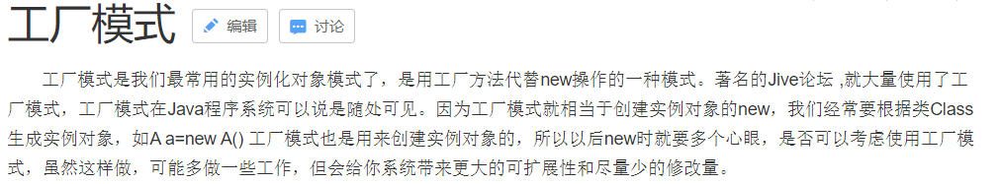
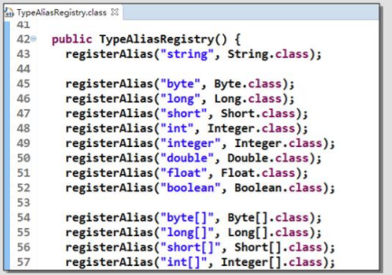
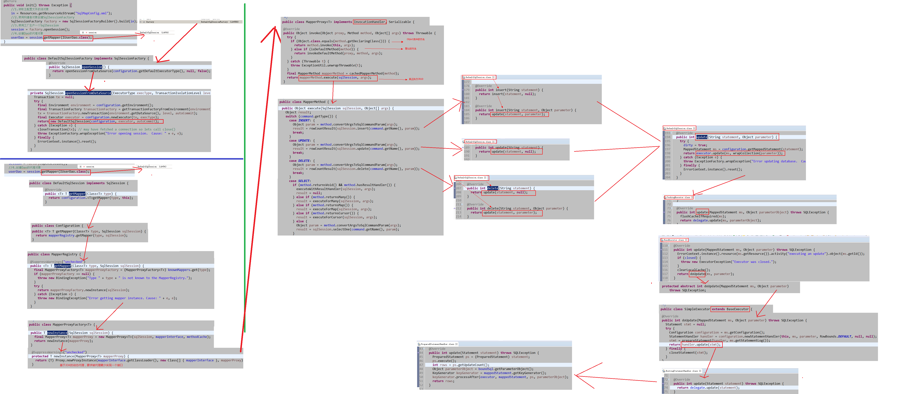

# 一、 MyBatis框架

- 1.1 [框架概述](#1.1-框架概述)
- 1.2 [Mybatis框架快速入门](#1.2-Mybatis框架快速入门)
- 1.3 [自定义MyBatis框架](#1.3-自定义MyBatis框架)
- 1.4 [基于代理Dao实现CRUD操作](#1.4-基于代理Dao实现CRUD操作)
- 1.5 [MyBatis的参数深入](#1.5-MyBatis的参数深入)
- 1.6 [Mybatis的输出结果封装](#1.6-Mybatis的输出结果封装)
- 1.7 [Mybatis传统DAO层开发[了解]](#1.7-Mybatis传统DAO层开发[了解])
- 1.8 [SqlMapConfig.xml配置文件](#1.8-SqlMapConfig.xml配置文件)

## 1.1 框架概述

框架（Framework）是整个或部分系统的可重用设计，表现为一组抽象构件及构件实例间交互的方法;另一种定义认为，框架是可被应用开发者定制的应用骨架。前者是从应用方面而后者是从目的方面给出的定义。

简而言之，框架其实就是某种应用的半成品，就是一组组件，供你选用完成你自己的系统。简单说就是使用别人搭好的舞台，你来做表演。而且，框架一般是成熟的，不断升级的软件。

### 1.1.1 框架要解决的问题

框架要解决的最重要的一个问题是技术整合的问题，在J2EE的框架中，有着各种各样的技术，不同的软件企业需要从J2EE中选择不同的技术，这就使得软件企业最终的应用依赖于这些技术，技术自身的复杂性和技术的风险性将会直接对应用造成冲击。而应用是软件企业的核心，是竞争力的关键所在，因此应该将应用自身的设计和具体的实现技术解耦。这样，软件企业的研发将集中在应用的设计上，而不是具体的技术实现，技术实现是应用的底层支撑，它不应该直接对应用产生影响。

**框架一般处在低层应用平台（如J2EE）和高层业务逻辑之间的中间层。**

### 1.1.2 软件开发的分层重要性

框架的重要性在于它实现了部分功能，并且能够很好的将低层应用平台和高层业务逻辑进行了缓和。为了实现软件工程中的“高内聚、低耦合”。把问题划分开来各个解决，易于控制，易于延展，易于分配资源。我们常见的MVC软件设计思想就是很好的分层思想。


### 1.1.3 分层开发下的常见框架


常见的JavaEE开发框架：

1. 解决数据的持久化问题的框架


作为持久层的框架，还有一个封装程度更高的框架就是Hibernate，但这个框架因为各种原因目前在国内的流行程度下降太多，现在公司开发也越来越少使用。目前使用SpringData来实现数据持久化也是一种趋势。

2. 解决WEB层问题的MVC框架


3. 解决技术整合问题的框架


### 1.1.4MyBatis框架概述

mybatis是一个优秀的基于java的持久层框架，它内部封装了jdbc，使开发者只需要关注sql语句本身，而不需要花费精力去处理加载驱动、创建连接、创建statement等繁杂的过程。

mybatis通过xml或注解的方式将要执行的各种statement配置起来，并通过java对象和statement中sql的动态参数进行映射生成最终执行的sql语句，最后由mybatis框架执行sql并将结果映射为java对象并返回。

采用ORM思想解决了实体和数据库映射的问题，对jdbc进行了封装，屏蔽了jdbcapi底层访问细节，使我们不用与jdbcapi打交道，就可以完成对数据库的持久化操作。

为了我们能够更好掌握框架运行的内部过程，并且有更好的体验，下面我们将从自定义Mybatis框架开始来学习框架。此时我们将会体验框架从无到有的过程体验，也能够很好的综合前面阶段所学的基础。

### 1.1.5JDBC编程的分析

**回顾**：

```java
public static void main(String[] args) {
        Connection connection = null;
        PreparedStatement preparedStatement = null;
        ResultSet resultSet = null;
        try {
          //加载数据库驱动
            Class.forName("com.mysql.jdbc.Driver");
            //通过驱动管理类获取数据库链接
            connection = DriverManager
                    .getConnection("jdbc:mysql://localhost:3306/mybatis?characterEncoding=utf-8", "ro
                            ot", " root");
            //定义 sql 语句 ?表示占位符
                            String sql = "select * from user where username = ?";
            //获取预处理 statement
            preparedStatement = connection.prepareStatement(sql);
            //设置参数，第一个参数为 sql 语句中参数的序号（从 1 开始），第二个参数为设置的参数值
            preparedStatement.setString(1, "王五");
            //向数据库发出 sql 执行查询，查询出结果集
            resultSet = preparedStatement.executeQuery();
            //遍历查询结果集
            while (resultSet.next()) {
                System.out.println(resultSet.getString("id") + " "+resultSet.getString(" username"));
            }
        } catch (Exception e) {
            e.printStackTrace();
        } finally {
            //释放资源
            if (resultSet != null) {
                try {
                    resultSet.close();
                } catch (SQLException e) {
                    e.printStackTrace();
                }
            }
            if (preparedStatement != null) {
                try {
                    preparedStatement.close();
                } catch (SQLException e) {
                    e.printStackTrace();
                }
            }
            if (connection != null) {
                try {
                    connection.close();
                } catch (SQLException e) {
                    // TODO Auto-generated catch block
                    e.printStackTrace();
                }
            }
        }
    }
```

上边使用 jdbc 的原始方法（未经封装）实现了查询数据库表记录的操作。

**分析**：

1. 数据库链接创建、释放频繁造成系统资源浪费从而影响系统性能，如果使用数据库链接池可解决此问题。

2. Sql语句在代码中硬编码，造成代码不易维护，实际应用sql变化的可能较大，sql变动需要改变java代码。

3. 使用preparedStatement向占有位符号传参数存在硬编码，因为sql语句的where条件不一定，可能多也可能少，修改sql还要修改代码，系统不易维护。

4. 对结果集解析存在硬编码（查询列名），sql变化导致解析代码变化，系统不易维护，如果能将数据库记录封装成pojo对象解析比较方便。

## 1.2 Mybatis框架快速入门

通过前面的学习，我们已经能够使用所学的基础知识构建自定义的Mybatis框架了。这个过程是基本功的考验，我们已经强大了不少，但现实是残酷的，我们所定义的Mybatis框架和真正的Mybatis框架相比，还是显得渺小。行业内所流行的Mybatis框架现在我们将开启学习。

### 1.2.1 搭建开发环境

1. 进入官网，下载相关jar包或复制maven开发的坐标。

2. 创建maven工程

3. 在pom.xml中添加MyBatis坐标。

   ```xml
   <dependencies>
       <dependency>
           <groupId>org.mybatis</groupId>
           <artifactId>mybatis</artifactId>
           <version>3.4.5</version>
       </dependency>
       <dependency>
           <groupId>junit</groupId>
           <artifactId>junit</artifactId>
           <version>4.10</version>
           <scope>test</scope>
       </dependency>
       <dependency>
           <groupId>mysql</groupId>
           <artifactId>mysql-connector-java</artifactId>
           <version>5.1.6</version>
           <scope>runtime</scope>
       </dependency>
       <dependency>
           <groupId>log4j</groupId>
           <artifactId>log4j</artifactId>
           <version>1.2.12</version>
       </dependency>
   </dependencies>
   ```

4. 编写User实体类

5. 编写持久层接口IUserDao

   IUserDao 接口就是我们的持久层接口（也可以写成 UserDao 或者 UserMapper）。

6. 编写持久层接口的映射文件 IUserDao.xml

   要求：

   - 创建位置：必须和持久层接口咋相同的包中。
   - 必须以持久层接口名称命名文件名，拓展名是.xml

   

   ```xml
   <?xml version="1.0" encoding="UTF-8"?>
   <!DOCTYPE mapper 
    PUBLIC "-//mybatis.org//DTD Mapper 3.0//EN"
    "http://mybatis.org/dtd/mybatis-3-mapper.dtd">
   <mapper namespace="com.xxx.dao.IUserDao">
       <!-- 配置查询所有操作 -->
       <select id="findAll" resultType="com.xxx.domain.User">
           select * from user
       </select>
   </mapper>
   ```

7. 编写 SqlMapConfig.xml 配置文件

   ```xml
   <?xml version="1.0" encoding="UTF-8"?>
   <!DOCTYPE configuration
    PUBLIC "-//mybatis.org//DTD Config 3.0//EN"
    "http://mybatis.org/dtd/mybatis-3-config.dtd">
   <configuration>
       <!-- 配置 mybatis 的环境 -->
       <environments default="mysql">
           <!-- 配置 mysql 的环境 -->
           <environment id="mysql">
               <!-- 配置事务的类型 -->
               <transactionManager type="JDBC"></transactionManager>
   <!-- 配置连接数据库的信息：用的是数据源(连接池) -->
               <dataSource type="POOLED">
                   <property name="driver" value="com.mysql.jdbc.Driver"/>
                   <property name="url" value="jdbc:mysql://localhost:3306/ee50"/>
                   <property name="username" value="root"/>
                   <property name="password" value="1234"/>
               </dataSource>
           </environment>
       </environments>
   
       <!-- 告知 mybatis 映射配置的位置 -->
       <mappers>
           <mapper resource="com/xxx/dao/IUserDao.xml"/>
       </mappers>
   </configuration>
   ```

8. 编写测试类

   ```java
   /**
    * <p>Title: MybatisTest</p>
    * <p>Description: 测试 mybatis 的环境</p>
    */
   public class MybatisTest {
       public static void main(String[] args) throws Exception {
           //1.读取配置文件
           InputStream in = Resources.getResourceAsStream("SqlMapConfig.xml");
           //2.创建 SqlSessionFactory 的构建者对象
           SqlSessionFactoryBuilder builder = new SqlSessionFactoryBuilder();
           //3.使用构建者创建工厂对象 SqlSessionFactory
           SqlSessionFactory factory = builder.build(in);
           //4.使用 SqlSessionFactory 生产 SqlSession 对象
           SqlSession session = factory.openSession();
           //5.使用 SqlSession 创建 dao 接口的代理对象
           IUserDao userDao = session.getMapper(IUserDao.class);
           //6.使用代理对象执行查询所有方法
           List<User> users = userDao.findAll();
           for (User user : users) {
               System.out.println(user);
           }
           //7.释放资源
           session.close();
           in.close();
       }
   }
   ```

### 1.2.2 小结

通过快速入门示例，我们发现使用mybatis是非常容易的一件事情，因为只需要编写Dao接口并且按照mybatis要求编写两个配置文件，就可以实现功能。远比我们之前的jdbc方便多了。（我们使用注解之后，将变得更为简单，只需要编写一个mybatis配置文件就够了。）

但是，这里面包含了许多细节，比如为什么会有工厂对象（SqlSessionFactory）,为什么有了工厂之后还要有构建者对象（SqlSessionFactoryBuilder），为什么IUserDao.xml在创建时有位置和文件名的要求等等。

这些问题我们在自定义mybatis框架的章节，通过层层剥离的方式，给大家讲解。

请注意：**我们讲解自定义Mybatis框架，不是让大家回去自己去写个mybatis，而是让我们能更好了了解mybatis内部是怎么执行的，在以后的开发中能更好的使用mybatis框架，同时对它的设计理念（设计模式）有一个认识。**

### 1.2.3 补充（基于注解的 mybatis 使用）

#### 在持久层接口中添加注解

```java
public interface IUserDao {
    /**
    * 查询所有用户
    * @return
    */
    @Select("select * from user")
    List<User> findAll();
}
```

修改 SqlMapConfig.xml

```xml
<!-- 告知 mybatis 映射配置的位置 -->
<mappers>
    <mapper class="com.xxx.dao.IUserDao"/>
</mappers>
```

#### 注意事项

在使用基于注解的 Mybatis 配置时，请移除 xml 的映射配置（IUserDao.xml）。

## 1.3 自定义MyBatis框架

本章我们将使用前面所学的基础知识来构建一个属于自己的持久层框架，将会涉及到的一些知识点：工厂模式（Factory 工厂模式）、构造者模式（Builder 模式）、代理模式，反射，自定义注解，注解的反射，xml 解析，数据库元数据，元数据的反射等。

#### 流程分析


### 1.3.1 前期准备

#### 创建Maven工程

创建 mybatis02 的工程，工程信息如下：

Groupid:com.xxx

ArtifactId:mybatis02

Packing:jar

#### 引入相关坐标

```xml
<dependencies>
    <!-- 日志坐标 -->
    <dependency>
        <groupId>log4j</groupId>
        <artifactId>log4j</artifactId>
        <version>1.2.12</version>
    </dependency>
    <!-- 解析 xml 的 dom4j -->
    <dependency>
        <groupId>dom4j</groupId>
        <artifactId>dom4j</artifactId>
        <version>1.6.1</version>
    </dependency>
    <!-- mysql 驱动 -->
    <dependency>
        <groupId>mysql</groupId>
        <artifactId>mysql-connector-java</artifactId>
        <version>5.1.6</version>
    </dependency>
    <!-- dom4j 的依赖包 jaxen -->
    <dependency>
        <groupId>jaxen</groupId>
        <artifactId>jaxen</artifactId>
        <version>1.1.6</version>
    </dependency>
    <dependency>
        <groupId>junit</groupId>
        <artifactId>junit</artifactId>
        <version>4.10</version>
    </dependency>
</dependencies>
```

#### 引入工具类到项目中

```java
/**
 *
 *
 * 用于解析配置文件
 */
public class XMLConfigBuilder {
    /**
     * 解析主配置文件，把里面的内容填充到 DefaultSqlSession 所需要的地方
     * 使用的技术：
     * dom4j+xpath
     *
     * @param session
     */
    public static void loadConfiguration(DefaultSqlSession session, InputStream
            config) {
        try {
            //定义封装连接信息的配置对象（mybatis 的配置对象）
            Configuration cfg = new Configuration();
            //1.获取 SAXReader 对象
            SAXReader reader = new SAXReader();
            //2.根据字节输入流获取 Document 对象
            Document document = reader.read(config);
            //3.获取根节点
            Element root = document.getRootElement();
            //4.使用 xpath 中选择指定节点的方式，获取所有 property 节点
            List<Element> propertyElements = root.selectNodes("//property");
            //5.遍历节点
            for (Element propertyElement : propertyElements) {
                //判断节点是连接数据库的哪部分信息
                //取出 name 属性的值
                String name = propertyElement.attributeValue("name");
                if ("driver".equals(name)) {
                    //表示驱动
                    //获取 property 标签 value 属性的值
                    String driver = propertyElement.attributeValue("value");
                    cfg.setDriver(driver);
                }
                if ("url".equals(name)) {
                    //表示连接字符串
                    //获取 property 标签 value 属性的值
                    String url = propertyElement.attributeValue("value");
                    cfg.setUrl(url);
                }
                if ("username".equals(name)) {
                    //表示用户名
                    //获取 property 标签 value 属性的值
                    String username = propertyElement.attributeValue("value");
                    cfg.setUsername(username);
                }
                if ("password".equals(name)) {
                    //表示密码
                    //获取 property 标签 value 属性的值
                    String password = propertyElement.attributeValue("value");
                    cfg.setPassword(password);
                }
            }
            //取出 mappers 中的所有 mapper 标签，判断他们使用了 resource 还是 class 属性
            List<Element> mapperElements = root.selectNodes("//mappers/mapper");
            //遍历集合
            for (Element mapperElement : mapperElements) {
                //判断 mapperElement 使用的是哪个属性
                Attribute attribute = mapperElement.attribute("resource");
                if (attribute != null) {
                    System.out.println("使用的是 XML");
                    //表示有 resource 属性，用的是 XML
                    //取出属性的值
                    String mapperPath = attribute.getValue();// 获 取 属 性 的 值
                    "com/xxx/dao/IUserDao.xml"
                    //把映射配置文件的内容获取出来，封装成一个 map
                    Map<String, Mapper> mappers = loadMapperConfiguration(mapperPath);
                    //给 configuration 中的 mappers 赋值
                    cfg.setMappers(mappers);
                } else {
                    System.out.println("使用的是注解");
                    //表示没有 resource 属性，用的是注解
                    //获取 class 属性的值
                    String daoClassPath = mapperElement.attributeValue("class");
                    //根据 daoClassPath 获取封装的必要信息
                    Map<String, Mapper> mappers = loadMapperAnnotation(daoClassPath);
                    //给 configuration 中的 mappers 赋值
                    cfg.setMappers(mappers);
                }
            }
            //把配置对象传递给 DefaultSqlSession
            session.setCfg(cfg);

        } catch (Exception e) {
            throw new RuntimeException(e);
        } finally {
            try {
                config.close();
            } catch (Exception e) {
                e.printStackTrace();
            }
        }
    }

    /**
     * 根据传入的参数，解析 XML，并且封装到 Map 中
     *
     * @param mapperPath 映射配置文件的位置
     * @return map 中包含了获取的唯一标识（key 是由 dao 的全限定类名和方法名组成）
     * 以及执行所需的必要信息（value 是一个 Mapper 对象，里面存放的是执行的 SQL 语句和
     * 要封装的实体类全限定类名）
     */
    private static Map<String, Mapper> loadMapperConfiguration(String
                                                                       mapperPath) throws IOException {
        InputStream in = null;
        try {
            //定义返回值对象
            Map<String, Mapper> mappers = new HashMap<String, Mapper>();
            //1.根据路径获取字节输入流
            in = Resources.getResourceAsStream(mapperPath);
            //2.根据字节输入流获取 Document 对象
            SAXReader reader = new SAXReader();
            Document document = reader.read(in);
            //3.获取根节点
            Element root = document.getRootElement();
            //4.获取根节点的 namespace 属性取值
            String namespace = root.attributeValue("namespace");//是组成 map 中 key 的
            部分
            //5.获取所有的 select 节点
            List<Element> selectElements = root.selectNodes("//select");
            //6.遍历 select 节点集合
            for (Element selectElement : selectElements) {
                //取出 id 属性的值 组成 map 中 key 的部分
                String id = selectElement.attributeValue("id");
                //取出 resultType 属性的值 组成 map 中 value 的部分
                String resultType = selectElement.attributeValue("resultType");
                //取出文本内容 组成 map 中 value 的部分
                String queryString = selectElement.getText();
                //创建 Key
                String key = namespace + "." + id;
                //创建 Value
                Mapper mapper = new Mapper();
                mapper.setQueryString(queryString);
                mapper.setResultType(resultType);
                //把 key 和 value 存入 mappers 中
                mappers.put(key, mapper);
            }
            return mappers;
        } catch (Exception e) {
            throw new RuntimeException(e);
        } finally {
            in.close();
        }
    }

    /**
     * 根据传入的参数，得到 dao 中所有被 select 注解标注的方法。
     * 根据方法名称和类名，以及方法上注解 value 属性的值，组成 Mapper 的必要信息
     *
     * @param daoClassPath
     * @return
     */
    private static Map<String, Mapper> loadMapperAnnotation(String
                                                                    daoClassPath) throws Exception {
        //定义返回值对象
        Map<String, Mapper> mappers = new HashMap<String, Mapper>();
        //1.得到 dao 接口的字节码对象
        Class daoClass = Class.forName(daoClassPath);
        //2.得到 dao 接口中的方法数组
        Method[] methods = daoClass.getMethods();
        //3.遍历 Method 数组
        for (Method method : methods) {
            //取出每一个方法，判断是否有 select 注解
            boolean isAnnotated = method.isAnnotationPresent(Select.class);
            if (isAnnotated) {
                //创建 Mapper 对象
                Mapper mapper = new Mapper();
                //取出注解的 value 属性值
                Select selectAnno = method.getAnnotation(Select.class);
                String queryString = selectAnno.value();
                mapper.setQueryString(queryString);
                //获取当前方法的返回值，还要求必须带有泛型信息
                Type type = method.getGenericReturnType();//List<User>
                //判断 type 是不是参数化的类型
                if (type instanceof ParameterizedType) {
                    //强转
                    ParameterizedType ptype = (ParameterizedType) type;
                    //得到参数化类型中的实际类型参数
                    Type[] types = ptype.getActualTypeArguments();
                    //取出第一个
                    Class domainClass = (Class) types[0];
                    //获取 domainClass 的类名
                    String resultType = domainClass.getName();
                    //给 Mapper 赋值
                    mapper.setResultType(resultType);
                }
                //组装 key 的信息
                //获取方法的名称
                String methodName = method.getName();
                String className = method.getDeclaringClass().getName();
                String key = className + "." + methodName;
                //给 map 赋值
                mappers.put(key, mapper);
            }
        }
        return mappers;
    }
}
```

```java
/**
 *
 *
 * 负责执行 SQL 语句，并且封装结果集
 */
public class Executor {
    public <E> List<E> selectList(Mapper mapper, Connection conn) {
        PreparedStatement pstm = null;
        ResultSet rs = null;
        try {
            //1.取出 mapper 中的数据
            String queryString = mapper.getQueryString();//select * from user
            String resultType = mapper.getResultType();//com.xxx.domain.User
            Class domainClass = Class.forName(resultType);//User.class
            //2.获取 PreparedStatement 对象
            pstm = conn.prepareStatement(queryString);
            //3.执行 SQL 语句，获取结果集
            rs = pstm.executeQuery();
            //4.封装结果集
            List<E> list = new ArrayList<E>();//定义返回值
            while(rs.next()) {
                //实例化要封装的实体类对象
                E obj = (E)domainClass.newInstance();//User 对象
                //取出结果集的元信息：ResultSetMetaData
                ResultSetMetaData rsmd = rs.getMetaData();
                //取出总列数
                int columnCount = rsmd.getColumnCount();
                //遍历总列数
                for (int i = 1; i <= columnCount; i++) {
                    //获取每列的名称，列名的序号是从 1 开始的
                    String columnName = rsmd.getColumnName(i);
                    //根据得到列名，获取每列的值
                    Object columnValue = rs.getObject(columnName);
                    //给 obj 赋值：使用 Java 内省机制（借助 PropertyDescriptor 实现属性的封装）
                    PropertyDescriptor pd = new
                            PropertyDescriptor(columnName,domainClass);//要求：实体类的属性和数据库表的列名保持一种
                    //获取它的写入方法
                    Method writeMethod = pd.getWriteMethod();//setUsername(String
                    username);
                    //把获取的列的值，给对象赋值
                    writeMethod.invoke(obj,columnValue);
                }
                //把赋好值的对象加入到集合中
                list.add(obj);
            }
            return list;
        } catch (Exception e) {
            throw new RuntimeException(e);
        } finally {
            release(pstm,rs);
        }
    }
    private void release(PreparedStatement pstm,ResultSet rs){
        if(rs != null){
            try {
                rs.close();
            }catch(Exception e){
                e.printStackTrace();
            }
        }
        if(pstm != null){
            try {
                pstm.close();
            }catch(Exception e){
                e.printStackTrace();
            }
        }
    }
}
```

```java
/**
 *
 * <p>Title: DataSourceUtil</p>
 * <p>Description: 数据源的工具类</p>
 * <p>Company: http://www.xxx.com/ </p>
 */
public class DataSourceUtil {
    /**
     * 获取连接
     * @param cfg
     * @return
     */
    public static Connection getConnection(Configuration cfg) {
        try {
            Class.forName(cfg.getDriver());
            Connection conn =
                    DriverManager.getConnection(cfg.getUrl(),cfg.getUsername() , cfg.getPassword());
            return conn;
        } catch (Exception e) {
            throw new RuntimeException(e);
        }
    }
}
```

#### 编写 SqlMapConfig.xml

```xml
<?xml version="1.0" encoding="UTF-8" ?>
<configuration>
    <environments default="development">
        <environment id="development">
            <transactionManager type="JDBC" />
            <dataSource type="POOLED">
                <property name="driver" value="com.mysql.jdbc.Driver" ></property>
                <property name="url" value="jdbc:mysql:///eesy" ></property>
                <property name="username" value="root"></property>
                <property name="password" value="1234"></property>
            </dataSource>
        </environment>
    </environments>
</configuration> 
```

> 注意：此处我们直接使用的是mybatis的配置文件，但是由于我们没有使用mybatis的jar包，所以要把配置文件的约束删掉否则会报错（如果电脑能接入互联网，不删也行）

#### 编写读取配置文件类

```java
/**
 *
 * <p>Title: Resources</p>
 * <p>Description: 用于读取配置文件的类</p>
 * <p>Company: http://www.xxx.com/ </p>
 */
public class Resources {
    /**
     * 用于加载 xml 文件，并且得到一个流对象
     * @param xmlPath
     * @return
     * 在实际开发中读取配置文件:
     * 第一：使用类加载器。但是有要求：a 文件不能过大。 b 文件必须在类路径下(classpath)
     * 第二：使用 ServletContext 的 getRealPath()
     */
    public static InputStream getResourceAsStream(String xmlPath) {
        return Resources.class.getClassLoader().getResourceAsStream(xmlPath);
    }
}
```

#### 编写Mapper类

```java
/**
 *
 * <p>Title: Mapper</p>
 * <p>Description: 用于封装查询时的必要信息：要执行的 SQL 语句和实体类的全限定类名</p>
 * <p>Company: http://www.xxx.com/ </p>
 */
public class Mapper {
    private String queryString;//sql
    private String resultType;//结果类型的全限定类名
    public String getQueryString() {
        return queryString;
    }
    public void setQueryString(String queryString) {
        this.queryString = queryString;
    }
    public String getResultType() {
        return resultType;
    }
    public void setResultType(String resultType) {
        this.resultType = resultType;
    }
}
```

#### 编写Configuration配置类

```java
/**
 * 核心配置类
 * 1.数据库信息
 * 2.sql 的 map 集合
 */
public class Configuration {
    private String username; //用户名
    private String password;//密码
    private String url;//地址
    private String driver;//驱动
    //map 集合 Map<唯一标识，Mapper> 用于保存映射文件中的 sql 标识及 sql 语句
    private Map<String,Mapper> mappers;
    public String getUsername() {
        return username;
    }
    public void setUsername(String username) {
        this.username = username;
    }
    public String getPassword() {
        return password;
    }
    public void setPassword(String password) {
        this.password = password;
    }
    public String getUrl() {
        return url;
    }
    public void setUrl(String url) {
        this.url = url;
    }
    public String getDriver() {
        return driver;
    }
    public void setDriver(String driver) {
        this.driver = driver;
    }
    public Map<String, Mapper> getMappers() {
        return mappers;
    }
    public void setMappers(Map<String, Mapper> mappers) {
        this.mappers = mappers;
    }
}
```

#### 配置User实体类

```java
public class User implements Serializable {
    private int id;
    private String username;// 用户姓名
    private String sex;// 性别
    private Date birthday;// 生日
    private String address;// 地址
    //省略 getter 与 setter
    @Override
    public String toString() {
        return "User [id=" + id + ", username=" + username + ", sex=" + sex
                + ", birthday=" + birthday + ", address=" + address + "]";
    }
}
```

### 1.3.2 基于XML的自定义mybatis框架

#### 编写持久层接口和IUserDao.xml

```java
/**
 *
 * <p>Title: IUserDao</p>
 * <p>Description: 用户的持久层操作</p>
 * <p>Company: http://www.xxx.com/ </p>
 */
public interface IUserDao {
    /**
     * 查询所有用户
     * @return
     */
    List<User> findAll();
}

```

```xml
<?xml version="1.0" encoding="UTF-8"?>
<mapper namespace="com.xxx.dao.IUserDao">
    <!-- 配置查询所有操作 -->
    <select id="findAll" resultType="com.xxx.domain.User">
        select * from user
    </select>
</mapper>
```

> **注意**：此处我们使用的也是mybatis的配置文件，所以也要把约束删除了

#### 编写构造者类

```java
/**
 *
 * <p>Title: SqlSessionFactoryBuilder</p>
 * <p>Description: 用于构建 SqlSessionFactory 的</p>
 * <p>Company: http://www.xxx.com/ </p>
 */
public class SqlSessionFactoryBuilder {
    /**
     * 根据传入的流，实现对 SqlSessionFactory 的创建
     * @param in 它就是 SqlMapConfig.xml 的配置以及里面包含的 IUserDao.xml 的配置
     * @return
     */
    public SqlSessionFactory build(InputStream in) {
        DefaultSqlSessionFactory factory = new DefaultSqlSessionFactory();
//给 factory 中 config 赋值
        factory.setConfig(in);
        return factory;
    }
}
```

#### 编写SqlSessionFactory接口和实现类

```java
/**
 *
 * <p>Title: SqlSessionFactory</p>
 * <p>Description: SqlSessionFactory 的接口</p>
 * <p>Company: http://www.xxx.com/ </p>
 */
public interface SqlSessionFactory {
    /**
     * 创建一个新的 SqlSession 对象
     * @return
     */
    SqlSession openSession();
}
```

```java
/**
 *
 * <p>Title: DefaultSqlSessionFactory</p>
 * <p>Description:SqlSessionFactory 的默认实现 </p>
 * <p>Company: http://www.xxx.com/ </p>
 */
public class DefaultSqlSessionFactory implements SqlSessionFactory {
    private InputStream config = null;
    public void setConfig(InputStream config) {
        this.config = config;
    }
    @Override
    public SqlSession openSession() {
        DefaultSqlSession session = new DefaultSqlSession();
//调用工具类解析 xml 文件
        XMLConfigBuilder.loadConfiguration(session, config);
        return session;
    }
}
```

#### 编写SqlSession接口和实现类

```java
/**
 *
 * <p>Title: SqlSession</p>
 * <p>Description: 操作数据库的核心对象</p>
 * <p>Company: http://www.xxx.com/ </p>
 */
public interface SqlSession {
    /**
     * 创建 Dao 接口的代理对象
     * @param daoClass
     * @return
     */
    <T> T getMapper(Class<T> daoClass);
    /**
     * 释放资源
     */
    void close();
}
```

```java
/**
 *
 * <p>Title: DefaultSqlSession</p>
 * <p>Description: SqlSession 的具体实现</p>
 * <p>Company: http://www.xxx.com/ </p>
 */
public class DefaultSqlSession implements SqlSession {
    //核心配置对象
    private Configuration cfg;
    public void setCfg(Configuration cfg) {
        this.cfg = cfg;
    }
    //连接对象
    private Connection conn;
    //调用 DataSourceUtils 工具类获取连接
    public Connection getConn() {
        try {
            conn = DataSourceUtil.getDataSource(cfg).getConnection();
            return conn;
        } catch (Exception e) {
            throw new RuntimeException(e);
        }
    }
    /**
     * 动态代理：
     * 涉及的类：Proxy
     * 使用的方法：newProxyInstance
     * 方法的参数：
     * ClassLoader：和被代理对象使用相同的类加载器,通常都是固定的
     * Class[]：代理对象和被代理对象要求有相同的行为。（具有相同的方法）
     * InvocationHandler：如何代理。需要我们自己提供的增强部分的代码
     */
    @Override
    public <T> T getMapper(Class<T> daoClass) {
        conn = getConn();
        System.out.println(conn);
        T daoProxy = (T) Proxy.newProxyInstance(daoClass.getClassLoader(),new
                Class[] {daoClass}, new MapperProxyFactory(cfg.getMappers(),conn));
        return daoProxy;
    }
    //释放资源
    @Override
    public void close() {
        try {
            System.out.println(conn);
            conn.close();
        } catch (SQLException e) {
            e.printStackTrace();
        }
    }
    //查询所有方法
    public <E> List<E> selectList(String statement){
        Mapper mapper = cfg.getMappers().get(statement);
        return new Executor().selectList(mapper,conn);
    }
}
```

#### 编写用于创建Dao接口代理对象的类

```java
/**
 *
 * <p>Title: MapperProxyFactory</p>
 * <p>Description: 用于创建代理对象是增强方法</p>
 * <p>Company: http://www.xxx.com/ </p>
 */
public class MapperProxyFactory implements InvocationHandler {
    private Map<String,Mapper> mappers;
    private Connection conn;
    public MapperProxyFactory(Map<String, Mapper> mappers,Connection conn) {
        this.mappers = mappers;
        this.conn = conn;
    }
    /**
     * 对当前正在执行的方法进行增强
     * 取出当前执行的方法名称
     * 取出当前执行的方法所在类
     * 拼接成 key
     * 去 Map 中获取 Value（Mapper)
     * 使用工具类 Executor 的 selectList 方法
     */
    @Override
    public Object invoke(Object proxy, Method method, Object[] args) throws Throwable
    {
        //1.取出方法名
        String methodName = method.getName();
        //2.取出方法所在类名
        String className = method.getDeclaringClass().getName();
        //3.拼接成 Key
        String key = className+"."+methodName;
        //4.使用 key 取出 mapper
        Mapper mapper = mappers.get(key);
        if(mapper == null) {
            throw new IllegalArgumentException("传入的参数有误，无法获取执行的必要条件
                    ");
        }
        //5.创建 Executor 对象
        Executor executor = new Executor();
        return executor.selectList(mapper, conn);
    }
}

```

#### 运行测试类

```java
/**
 *
 * <p>Title: MybatisTest</p>
 * <p>Description: 测试 mybatis 的环境</p>
 * <p>Company: http://www.xxx.com/ </p>
 */
public class MybatisTest {
    public static void main(String[] args)throws Exception {
//1.读取配置文件
        InputStream in = Resources.getResourceAsStream("SqlMapConfig.xml");
//2.创建 SqlSessionFactory 的构建者对象
        SqlSessionFactoryBuilder builder = new SqlSessionFactoryBuilder();
//3.使用构建者创建工厂对象 SqlSessionFactory
        SqlSessionFactory factory = builder.build(in);
//4.使用 SqlSessionFactory 生产 SqlSession 对象
        SqlSession session = factory.openSession();
//5.使用 SqlSession 创建 dao 接口的代理对象
        IUserDao userDao = session.getMapper(IUserDao.class);
//6.使用代理对象执行查询所有方法
        List<User> users = userDao.findAll();
        for(User user : users) {
            System.out.println(user);
        }
//7.释放资源
        session.close();
        in.close();
    }
}
```

### 1.3.3 基于注解方式定义Mybatis框架

#### 自定义@Select注解

```java
/**
*
* <p>Title: Select</p>
* <p>Description: 自定义查询注解</p>
* <p>Company: http://www.xxx.com/ </p>
*/
@Retention(RetentionPolicy.RUNTIME)
@Target(ElementType.METHOD)
public @interface Select {
    String value();
}
```

#### 修改持久层接口

```java
/**
 *
 * <p>Title: IUserDao</p>
 * <p>Description: 用户的持久层操作</p>
 * <p>Company: http://www.xxx.com/ </p>
 */
public interface IUserDao {
    /**
     * 查询所有用户
     * @return
     */
    @Select("select * from user")
    List<User> findAll();
}
```

#### 修改SqlMapConfig.xml

```xml
<?xml version="1.0" encoding="UTF-8"?>
<configuration>
    <!-- 配置 mybatis 的环境 -->
    <environments default="mysql">
        <!-- 配置 mysql 的环境 -->
        <environment id="mysql">
            <!-- 配置事务的类型 -->
            <transactionManager type="JDBC"></transactionManager>
            <!-- 配置连接数据库的信息：用的是数据源(连接池) -->
            <dataSource type="POOLED">
                <property name="driver" value="com.mysql.jdbc.Driver"/>
                <property name="url" value="jdbc:mysql://localhost:3306/ee50"/>
                <property name="username" value="root"/>
                <property name="password" value="1234"/>
            </dataSource>
        </environment>
    </environments>
    <!-- 告知 mybatis 映射配置的位置 -->
    <mappers>
        <mapper class="com.xxx.dao.IUserDao"/>
    </mappers>
</configuration>
```

#### 1.3.4 自定义Mybatis的设计模式说明

#### 工厂模式（SqlSessionFactory）



工厂模式的原理如下图：


#### 代理模式(MapperProxyFactory)


**代理模式分为静态和动态代理。**静态代理，我们通常都很熟悉。有一个写好的代理类，实现与要代理的类的一个共同的接口，目的是为了约束也为了安全。具体不再多说。

这里主要想说的是关于动态代理。我们知道静态代理若想代理多个类，实现扩展功能，那么它必须具有多个代理类分别取代理不同的实现类。这样做的后果是造成太多的代码冗余。那么我们会思考如果做，才能既满足需求，又没有太多的冗余代码呢？——————动态代理。通过前面的课程我们已经学过了基于JDK的动态代理实现方式，今天我们就会使用JDK动态代理方式来编写MapperProxyFactory类。

动态代理模型图：


#### 构建者模式(SqlSessionFactoryBuilder)


具体设计模式的模型图如下：


从图中我们可以看出，创建者模式由四部分组成。

**抽象创建者角色**：给出一个抽象接口，以规范产品对象的各个组成成分的建造。一般而言，此接口独立于应用程序的商业逻辑。模式中直接创建产品对象的是具体创建者角色。具体创建者必须实现这个接口的两种方法：一是建造方法，比如图中的buildPart1和buildPart2方法；另一种是结果返回方法，即图中的getProduct方法。一般来说，产品所包含的零件数目与建造方法的数目相符。换言之，有多少零件，就有多少相应的建造方法。

**具体创建者角色**：他们在应用程序中负责创建产品的实例。这个角色要完成的任务包括：

1. 实现抽象创建者所声明的抽象方法，给出一步一步的完成产品创建实例的操作。

2. 在创建完成后，提供产品的实例。

**导演者角色**：这个类调用具体创建者角色以创建产品对象。但是导演者并没有产品类的具体知识，真正拥有产品类的具体知识的是具体创建者角色。

**产品角色**：产品便是建造中的复杂对象。一般说来，一个系统中会有多于一个的产品类，而且这些产品类并不一定有共同的接口，而完全可以使不相关联的。

### 1.3.4 总结


mybatis环境搭建步骤

- 第一步：创建 maven 工程
- 第二步：导入坐标
- 第三步：编写必要代码（实体类和持久层接口）
- 第四步：编写 SqlMapConfig.xml
- 第五步：编写映射配置文件
- 第六步：编写测试类

## 1.4 基于代理Dao实现CRUD操作

**使用要求**：

1. 持久层接口和持久层接口的映射配置必须在相同的包下

2. 持久层映射配置中 mapper 标签的 namespace 属性取值必须是持久层接口的全限定类名

3. SQL 语句的配置标签`<select>`,`<insert>`,`<delete>`,`<update>`的 id 属性必须和持久层接口的 方法名相同。

### 1.4.1 根据ID查询

#### 在持久层接口中添加findById方法

```java
/**
* 根据 id 查询
* @param userId
* @return
*/
User findById(Integer userId);
```

#### 在用户的映射配置文件中配置

```xml
<!-- 根据 id 查询 -->
<select id="findById" resultType="com.xxx.domain.User" parameterType="int">
    select * from user where id = #{uid}
</select>
```

**细节**：

- resultType 属性：

  用于指定结果集的类型。

- parameterType 属性：

  用于指定传入参数的类型。

- sql 语句中使用#{}字符：

  它代表占位符，相当于原来 jdbc 部分所学的`?`，都是用于执行语句时替换实际的数据。

  具体的数据是由#{}里面的内容决定的。

- #{}中内容的写法：

  由于数据类型是基本类型，所以此处可以随意写。

#### 在测试类添加测试

```java
/**
 *
 * <p>Title: MybastisCRUDTest</p>
 * <p>Description: 测试 mybatis 的 crud 操作</p>
 * 
 */
public class MybastisCRUDTest {
    private InputStream in ;
    private SqlSessionFactory factory;
    private SqlSession session;
    private IUserDao userDao;
    @Test
    public void testFindOne() {
//6.执行操作
        User user = userDao.findById(41);
        System.out.println(user);
    }
    @Before//在测试方法执行之前执行
    public void init()throws Exception {
//1.读取配置文件
        in = Resources.getResourceAsStream("SqlMapConfig.xml");
//2.创建构建者对象
        SqlSessionFactoryBuilder builder = new SqlSessionFactoryBuilder();
//3.创建 SqlSession 工厂对象
        factory = builder.build(in);
//4.创建 SqlSession 对象
        session = factory.openSession();
//5.创建 Dao 的代理对象
        userDao = session.getMapper(IUserDao.class);
    }
    @After//在测试方法执行完成之后执行
    public void destroy() throws Exception{
        session.commit();
//7.释放资源
        session.close();
        in.close();
    }
}
```

### 1.4.2 保存操作

#### 在持久层接口中添加新增方法

```java
/**
* 保存用户
* @param user
* @return 影响数据库记录的行数
*/
int saveUser(User user);
```

#### 在用户的映射配置文件中配置

```xml
<!-- 保存用户-->
<insert id="saveUser" parameterType="com.xxx.domain.User">
    insert into user(username,birthday,sex,address) 
                values(#{username},#{birthday},#{sex},#{address})
</insert>
```

**细节**：

- parameterType 属性：

  代表参数的类型，因为我们要传入的是一个类的对象，所以类型就写类的全名称。

- sql 语句中使用#{}字符：

  它代表占位符，相当于原来 jdbc 部分所学的?，都是用于执行语句时替换实际的数据。

  具体的数据是由#{}里面的内容决定的。

- #{}中内容的写法：

  由于我们保存方法的参数是 一个 User 对象，此处要写 User 对象中的属性名称。

  它用的是 ognl 表达式。

- ognl 表达式：

  它是 apache 提供的一种表达式语言，全称是：

  Object Graphic Navigation Language 对象图导航语言

  它是按照一定的语法格式来获取数据的。

  语法格式就是使用 #{对象.对象}的方式

  \#{user.username}它会先去找 user 对象，然后在 user 对象中找到 username 属性，并调用 getUsername()方法把值取出来。但是我们在 parameterType 属性上指定了实体类名称，所以可以省略 user. 而直接写 username。

#### 添加测试类中的测试方法

```java
@Test
public void testSave(){
        User user = new User();
        user.setUsername("modify User property");
        user.setAddress("北京市顺义区");
        user.setSex("男");
        user.setBirthday(new Date());
        System.out.println("保存操作之前："+user);
//5.执行保存方法
        userDao.saveUser(user);
        System.out.println("保存操作之后："+user);
}
```

打开 Mysql 数据库发现并没有添加任何记录，原因是什么？

这一点和 jdbc 是一样的，我们在实现增删改时一定要去控制事务的提交，那么在 mybatis 中如何控制事务提交呢？

可以使用:session.commit();来实现事务提交。加入事务提交后的代码如下：

```java
@After//在测试方法执行完成之后执行
public void destroy() throws Exception{
    session.commit();
    //7.释放资源
    session.close();
    in.close();
}
```

#### 问题扩展：新增用户 id 的返回值

新增用户后，同时还要返回当前新增用户的 id 值，因为 id 是由数据库的自动增长来实现的，所以就相当于我们要在新增后将自动增长 auto_increment 的值返回。

```xml
<insert id="saveUser" parameterType="USER">
    <!-- 配置保存时获取插入的 id -->
    <selectKey keyColumn="id" keyProperty="id" resultType="int">
        select last_insert_id();
    </selectKey>
    insert into user(username,birthday,sex,address)
    values(#{username},#{birthday},#{sex},#{address})
</insert>
```

### 1.4.3 用户更新

#### 在持久层接口中添加更新方法

```java
/**
* 更新用户
* @param user
* @return 影响数据库记录的行数
*/
int updateUser(User user);
```

#### 在用户的映射配置文件中配置

```xml
<!-- 更新用户 -->
<update id="updateUser" parameterType="com.xxx.domain.User">
    update user set username=#{username},birthday=#{birthday},sex=#{sex},
    address=#{address} where id=#{id}
</update>
```

#### 加入更新的测试方法

```java
@Test
public void testUpdateUser()throws Exception{
//1.根据 id 查询
    User user = userDao.findById(52);
//2.更新操作
    user.setAddress("北京市顺义区");
    int res = userDao.updateUser(user);
    System.out.println(res);
}

```

### 1.4.4 用户删除

#### 在持久层接口中添加删除方法

```java
/**
* 根据 id 删除用户
* @param userId
* @return
*/
int deleteUser(Integer userId);
```

#### 在用户的映射配置文件中配置

```java
<!-- 删除用户 -->
<delete id="deleteUser" parameterType="java.lang.Integer">
    delete from user where id = #{uid}
</delete>
```

#### 加入删除的测试方法

```java
@Test
public void testDeleteUser() throws Exception {
    //6.执行操作
    int res = userDao.deleteUser(52);
    System.out.println(res);
}
```

### 1.4.5 用户模糊查询

#### 在持久层接口中添加模糊查询方法

```java
/**
* 根据名称模糊查询
* @param username
* @return
*/
List<User> findByName(String username);
```

#### 在用户的映射配置文件中配置

```java
<!-- 根据名称模糊查询 -->
<select id="findByName" resultType="com.xxx.domain.User" parameterType="String">
    select * from user where username like #{username}
</select>
```

#### 加入模糊查询的测试方法

```java
@Test
public void testFindByName(){
    //5.执行查询一个方法
    List<User> users = userDao.findByName("%王%");
    for(User user : users){
        System.out.println(user);
    }
}
```

在控制台输出的执行 SQL 语句如下：


我们在配置文件中没有加入%来作为模糊查询的条件，所以在传入字符串实参时，就需要给定模糊查询的标识%。配置文件中的#{username}也只是一个占位符，所以 SQL 语句显示为“？”。

#### 模糊查询的另一种配置方式

第一步：修改 SQL 语句的配置，配置如下：

```xml
<!-- 根据名称模糊查询 -->
<select id="findByName" parameterType="string" resultType="com.xxx.domain.User">
    select * from user where username like '%${value}%'
</select>
```

我们在上面将原来的#{}占位符，改成了**`${value}`**。注意如果用模糊查询的这种写法，那么${value}的写法就是固定的，不能写成其它名字。

第二步：测试，如下：

```java
/**
* 测试模糊查询操作
 */
@Test
public void testFindByName(){
    //5.执行查询一个方法
    List<User> users = userDao.findByName("王");
    for(User user : users){
        System.out.println(user);
    }
}
```

在控制台输出的执行 SQL 语句如下：


可以发现，我们在程序代码中就不需要加入模糊查询的匹配符%了，这两种方式的实现效果是一样的，但执行的语句是不一样的。

#### \#{}与${}的区别

**\#{}表示一个占位符号**

通过#{}可以实现 preparedStatement 向占位符中设置值，自动进行 java 类型和 jdbc 类型转换，#{}可以有效防止 sql 注入。 #{}可以接收简单类型值或 pojo 属性值。 如果 parameterType 传输单个简单类型值，#{}括号中可以是 value 或其它名称。

**${}表示拼接 sql 串**

通过${}可以将 parameterType 传入的内容拼接在 sql 中且不进行 jdbc 类型转换， ${}可以接收简单类型值或 pojo 属性值，如果 parameterType 传输单个简单类型值，${}括号中只能是 value。

#### 模糊查询的${value}源码分析

我们一起来看 TextSqlNode 类的源码：


这就说明了源码中指定了读取的 key 的名字就是”value”，所以我们在绑定参数时就只能叫 value 的名字了。

### 1.4.6 查询使用聚合函数

####  在持久层接口中添加模糊查询方法

```java
/**
* 查询总记录条数
* @return
*/
int findTotal();
```

#### 在用户的映射配置文件中配置

```xml
<!-- 查询总记录条数 -->
<select id="findTotal" resultType="int">
    select count(*) from user;
</select>
```

#### 加入聚合查询的测试方法

```java
@Test
public void testFindTotal() throws Exception {
    //6.执行操作
    int res = userDao.findTotal();
    System.out.println(res);
}
```

### 1.4.7 Mybatis与JDBC编程的比较

1. 数据库链接创建、释放频繁造成系统资源浪费从而影响系统性能，如果使用数据库链接池可解决此问题。

   解决：

   在 SqlMapConfig.xml 中配置数据链接池，使用连接池管理数据库链接。

2. Sql 语句写在代码中造成代码不易维护，实际应用 sql 变化的可能较大，sql 变动需要改变 java 代码。

   解决：

   将 Sql 语句配置在 XXXXmapper.xml 文件中与 java 代码分离。

3. 向 sql 语句传参数麻烦，因为 sql 语句的 where 条件不一定，可能多也可能少，占位符需要和参数对应。

   解决：

   Mybatis 自动将 java 对象映射至 sql 语句，通过 statement 中的 parameterType 定义输入参数的类型。 

4. 对结果集解析麻烦，sql 变化导致解析代码变化，且解析前需要遍历，如果能将数据库记录封装成 pojo 对象解析比较方便。

   解决：

   Mybatis 自动将 sql 执行结果映射至 java 对象，通过 statement 中的 resultType 定义输出结果的类型。

## 1.5 MyBatis的参数深入

### 1.5.1 parameterType配置参数

我们在上一章节中已经介绍了 SQL 语句传参，使用标签的 parameterType 属性来设定。该属性的取值可以是基本类型，引用类型（例如:String 类型），还可以是实体类类型（POJO 类）。同时也可以使用实体类的包装类，本章节将介绍如何使用实体类的包装类作为参数传递。

#### 注意事项

基本类型和 String 我们可以直接写类型名称，也可以使用包名.类名的方式，例如： java.lang.String。

实体类类型，目前我们只能使用全限定类名。

究其原因，是 mybaits 在加载时已经把常用的数据类型注册了别名，从而我们在使用时可以不写包名，而我们的是实体类并没有注册别名，所以必须写全限定类名。在今天课程的最后一个章节中将讲解如何注册实体类的别名。

在 mybatis 的官方文档的说明(第19 页)

| Alias      | Mapped Type |
| ---------- | ----------- |
| _byte      | byte        |
| _long      | long        |
| _short     | short       |
| _int       | int         |
| _integer   | int         |
| _double    | double      |
| _float     | float       |
| _boolean   | boolean     |
| string     | String      |
| byte       | Byte        |
| long       | Long        |
| short      | Short       |
| int        | Integer     |
| integer    | Integer     |
| double     | Double      |
| float      | Float       |
| boolean    | Boolean     |
| date       | Date        |
| decimal    | BigDecimal  |
| bigdecimal | BigDecimal  |
| object     | Object      |
| map        | Map         |
| hashmap    | HashMap     |
| list       | List        |
| arraylist  | ArrayList   |
| collection | Collection  |

这些都是支持的默认别名。我们也可以从源码角度来看它们分别都是如何定义出来的。可以参考 TypeAliasRegistery.class 的源码。



### 1.5.2 传递pojo包装对象

开发中通过 pojo 传递查询条件 ，查询条件是综合的查询条件，不仅包括用户查询条件还包括其它的查询条件（比如将用户购买商品信息也作为查询条件），这时可以使用包装对象传递输入参数。

Pojo 类中包含 pojo。

需求：根据用户名查询用户信息，查询条件放到 QueryVo 的 user 属性中。

#### 编写QueryVo

```java
/**
 *
 * <p>Title: QueryVo</p>
 * <p>Description: 查询条件对象</p>
 */
public class QueryVo implements Serializable {
    private User user;
    public User getUser() {
        return user;
    }
    public void setUser(User user) {
        this.user = user;
    }
}
```

#### 编写持久层接口

```java
/**
 *
 * <p>Title: IUserDao</p>
 * <p>Description: 用户的业务层接口</p>
 */
public interface IUserDao {
    /**
     * 根据 QueryVo 中的条件查询用户
     * @param vo
     * @return
     */
    List<User> findByVo(QueryVo vo);
}
```

#### 持久层接口的映射文件

```xml
<!-- 根据用户名称模糊查询，参数变成一个 QueryVo 对象了 -->
<select id="findByVo" resultType="com.xxx.domain.User"
        parameterType="com.xxx.domain.QueryVo">
    select * from user where username like #{user.username};
</select>
```

#### 测试包装类作为参数

```java
@Test
public void testFindByQueryVo() {
        QueryVo vo = new QueryVo();
        User user = new User();
        user.setUserName("%王%");
        vo.setUser(user);
        List<User> users = userDao.findByVo(vo);
        for(User u : users) {
            System.out.println(u);
        }
}
```

## 1.6 Mybatis的输出结果封装

### 1.6.1 resultType配置结果类型

resultType 属性可以指定结果集的类型，它支持基本类型和实体类类型。

我们在前面的 CRUD 案例中已经对此属性进行过应用了。

需要注意的是，它和 parameterType 一样，如果注册过类型别名的，可以直接使用别名。没有注册过的必须使用全限定类名。例如：我们的实体类此时必须是全限定类名（今天最后一个章节会讲解如何配置实体类的别名）

同时，当是实体类名称是，还有一个要求，实体类中的属性名称必须和查询语句中的列名保持一致，否则无法实现封装。

#### 基本类型示例

Dao接口

```java
/**
* 查询总记录条数
* @return
*/
int findTotal();
```

映射配置

```xml
<!-- 查询总记录条数 -->
<select id="findTotal" resultType="int">
    select count(*) from user;
</select>
```

#### 实体类类型示例

Dao接口

```java
/**
* 查询所有用户
* @return
*/
List<User> findAll();
```

映射配置

```xml
<!-- 配置查询所有操作 -->
<select id="findAll" resultType="com.xxx.domain.User">
    select * from user
</select>
```

#### 特殊情况示例

修改实体类

实体类代码如下：(**此时的实体类属性和数据库表的列名已经不一致了**)

```java
/**
 *
 * <p>Title: User</p>
 * <p>Description: 用户的实体类</p>
 */
public class User implements Serializable {
    private Integer userId;
    private String userName;
    private Date userBirthday;
    private String userSex;
    private String userAddress;
    public Integer getUserId() {
        return userId;
    }
    public void setUserId(Integer userId) {
        this.userId = userId;
    }
    public String getUserName() {
        return userName;
    }
    public void setUserName(String userName) {
        this.userName = userName;
    }
    public Date getUserBirthday() {
        return userBirthday;
    }
    public void setUserBirthday(Date userBirthday) {
        this.userBirthday = userBirthday;
    }
    public String getUserSex() {
        return userSex;
    }
    public void setUserSex(String userSex) {
        this.userSex = userSex;
    }
    public String getUserAddress() {
        return userAddress;
    }
    public void setUserAddress(String userAddress) {
        this.userAddress = userAddress;
    }
    @Override
    public String toString() {
        return "User [userId=" + userId + ", userName=" + userName + ", userBirthday="
                + userBirthday + ", userSex="
                + userSex + ", userAddress=" + userAddress + "]";
    }
}
```

Dao接口

```java
/**
* 查询所有用户
* @return
*/
List<User> findAll();
```

映射配置

```xml
<!-- 配置查询所有操作 -->
<select id="findAll" resultType="com.xxx.domain.User">
    select * from user
</select>
```

测试查询结果

```java
@Test
public void testFindAll() {
    List<User> users = userDao.findAll();
    for(User user : users) {
        System.out.println(user);
    }
}
```


为什么名称会有值呢？ 因为：**mysql 在 windows 系统中不区分大小写！**

修改映射配置

```xml
使用别名查询
<!-- 配置查询所有操作 -->
<select id="findAll" resultType="com.xxx.domain.User">
    select id as userId,username as userName,birthday as userBirthday,
    sex as userSex,address as userAddress from user
</select>
```


### 1.6.2 resultMap结果类型

resultMap 标签可以建立查询的列名和实体类的属性名称不一致时建立对应关系。从而实现封装。

在 select 标签中使用 resultMap 属性指定引用即可。同时 resultMap 可以实现将查询结果映射为复杂类型的 pojo，比如在查询结果映射对象中包括 pojo 和 list 实现一对一查询和一对多查询。

#### 定义resultMap

```xml
<!-- 建立 User 实体和数据库表的对应关系
    type 属性：指定实体类的全限定类名
    id 属性：给定一个唯一标识，是给查询 select 标签引用用的。
-->
<resultMap type="com.xxx.domain.User" id="userMap">
    <id column="id" property="userId"/>
    <result column="username" property="userName"/>
    <result column="sex" property="userSex"/>
    <result column="address" property="userAddress"/>
    <result column="birthday" property="userBirthday"/>
</resultMap>
```

- id 标签：用于指定主键字段
- result 标签：用于指定非主键字段
- column 属性：用于指定数据库列名
- property 属性：用于指定实体类属性名称

#### 映射配置

```xml
<!-- 配置查询所有操作 -->
<select id="findAll" resultMap="userMap">
    select * from user
</select>
```

#### 测试结果

```java
@Test
public void testFindAll() {
    List<User> users = userDao.findAll();
    for(User user : users) {
        System.out.println(user);
    }
}
```


## 1.7  Mybatis传统DAO层开发[了解]

使用 Mybatis 开发 Dao，通常有两个方法，即原始 Dao 开发方式和 Mapper 接口代理开发方式。而现在主流的开发方式是接口代理开发方式，这种方式总体上更加简便。我们的课程讲解也主要以接口代理开发方式为主。在1.4已经给大家介绍了基于代理方式的 dao 开发，现在给大家介绍一下基于传统编写 Dao 实现类的开发方式。

### 1.7.1 Mybatis实现DAO的传统开发方式

#### 持久层Dao接口

```java
/**
 *
 * <p>Title: IUserDao</p>
 * <p>Description: 用户的业务层接口</p>
 */
public interface IUserDao {
    /**
     * 查询所有用户
     * @return
     */
    List<User> findAll();
    /**
     * 根据 id 查询
     * @param userId
     * @return
     */
    User findById(Integer userId);
    /**
     * 保存用户
     * @param user
     * @return 影响数据库记录的行数
     */
    int saveUser(User user);
/**
 * 更新用户
 * @param user
 * @return 影响数据库记录的行数
 */
int updateUser(User user);
    /**
     * 根据 id 删除用户
     * @param userId
     * @return
     */
    int deleteUser(Integer userId);
    /**
     * 查询总记录条数
     * @return
     */
    int findTotal();
}
```

#### 持久层Dao实现类

```java
/**
 *
 * <p>Title: UserDaoImpl</p>
 * <p>Description: dao 的实现类</p>
 */
public class UserDaoImpl implements IUserDao {
    private SqlSessionFactory factory;
    public UserDaoImpl(SqlSessionFactory factory) {
        this.factory = factory;
    }
    @Override
    public List<User> findAll() {
        SqlSession session = factory.openSession();
        List<User> users = session.selectList("com.xxx.dao.IUserDao.findAll");
        session.close();
        return users;
    }
    @Override
    public User findById(Integer userId) {
        SqlSession session = factory.openSession();
        User user = session.selectOne("com.xxx.dao.IUserDao.findById",userId);
        session.close();
        return user;
    }
    @Override
    public int saveUser(User user) {
        SqlSession session = factory.openSession();
        int res = session.insert("com.xxx.dao.IUserDao.saveUser",user);
        session.commit();
        session.close();
        return res;
    }
    @Override
    public int updateUser(User user) {
        SqlSession session = factory.openSession();
        int res = session.update("com.xxx.dao.IUserDao.updateUser",user);
        session.commit();
        session.close();
        return res;
    }
    @Override
    public int deleteUser(Integer userId) {
        SqlSession session = factory.openSession();
        int res = session.delete("com.xxx.dao.IUserDao.deleteUser",userId);
        session.commit();
        session.close();
        return res;
    }
    @Override
    public int findTotal() {
        SqlSession session = factory.openSession();
        int res = session.selectOne("com.xxx.dao.IUserDao.findTotal");
        session.close();
        return res;
    }
}
```

#### 持久层映射配置

```xml
<?xml version="1.0" encoding="UTF-8"?>
<!DOCTYPE mapper
        PUBLIC "-//mybatis.org//DTD Mapper 3.0//EN"
        "http://mybatis.org/dtd/mybatis-3-mapper.dtd">
<mapper namespace="com.xxx.dao.IUserDao">
    <!-- 配置查询所有操作 -->
    <select id="findAll" resultType="com.xxx.domain.User">
select * from user
</select>
    <!-- 根据 id 查询 -->
    <select id="findById" resultType="com.xxx.domain.User"
            parameterType="int">
select * from user where id = #{uid}
</select>
    <!-- 保存用户
    ognl 表达式：它是 apache 提供的一种表达式语言，在 struts2 中也有应用。
    Object Graphic Navigation Language 对象图导航语言
    它是按照一定的语法格式来获取数据的。
    语法格式就是使用 #{对象.对象}的方式
    #{user.username}它会先去找 user 对象，然后在 user 对象中找到 username 属性，并把值取
    出来
    -->
    <insert id="saveUser" parameterType="com.xxx.domain.User">
        <!-- 配置保存时获取插入的 id -->
        <selectKey keyColumn="id" keyProperty="id" resultType="int">
            select last_insert_id();
        </selectKey>
        insert into user(username,birthday,sex,address)
        values(#{username},#{birthday},#{sex},#{address})
    </insert>
    <!-- 更新用户 -->
    <update id="updateUser" parameterType="com.xxx.domain.User">
update user set
username=#{username},birthday=#{birthday},sex=#{sex},address=#{address} where
id=#{id}
</update>
    <!-- 删除用户 -->
    <delete id="deleteUser" parameterType="java.lang.Integer">
delete from user where id = #{uid}
</delete>
    <!-- 查询总记录条数 -->
    <select id="findTotal" resultType="int">
select count(*) from user;
</select>
</mapper>
```

#### 测试类

```java
/**
 *
 * <p>Title: MybastisCRUDTest</p>
 * <p>Description: 测试 mybatis 的 crud 操作</p>
 */
public class MybastisCRUDTest {
    private InputStream in ;
    private SqlSessionFactory factory;
    private IUserDao userDao;
    @Test
    public void testFindAll() {
        List<User> users = userDao.findAll();
        for(User user : users) {
            System.out.println(user);
        }
    }
    @Test
    public void testFindOne() {
//6.执行操作
        User user = userDao.findById(56);
        System.out.println(user);
    }
    @Test
    public void testSaveUser() throws Exception {
        User user = new User();
        user.setUsername("mybatis dao user");
//6.执行操作
        int res = userDao.saveUser(user);
        System.out.println(res);
        System.out.println(user.getId());
    }
    @Test
    public void testUpdateUser()throws Exception{
//1.根据 id 查询
        User user = userDao.findById(41);
//2.更新操作
        user.setAddress("北京市顺义区");
        int res = userDao.updateUser(user);
        System.out.println(res);
    }
    @Test
    public void testDeleteUser() throws Exception {
//6.执行操作
        int res = userDao.deleteUser(56);
        System.out.println(res);
    }
    @Test
    public void testFindTotal() throws Exception {
//6.执行操作
        int res = userDao.findTotal();
        System.out.println(res);
    }
    @Before//在测试方法执行之前执行
    public void init()throws Exception {
//1.读取配置文件
        in = Resources.getResourceAsStream("SqlMapConfig.xml");
//2.创建构建者对象
        SqlSessionFactoryBuilder builder = new SqlSessionFactoryBuilder();
//3.创建 SqlSession 工厂对象
        factory = builder.build(in);
//4.创建 Dao 接口的实现类
        userDao = new UserDaoImpl(factory);
    }
    @After//在测试方法执行完成之后执行
    public void destroy() throws Exception{
//7.释放资源
        in.close();
    }
}
```

### 1.7.2 分析

分析基于代理dao实现CRUD操作的执行过程



分析编写dao实现类Mybatis的执行过程


分析代理dao的执行过程


## 1.8  SqlMapConfig.xml配置文件

### 1.8.1 配置内容

#### SqlMapConfig.xml 中配置的内容和顺序

- properties（属性）
  - property
- settings（全局配置参数）
  - setting
- typeAliases（类型别名）
  - typeAliase
  - package
- typeHandlers（类型处理器）
- objectFactory（对象工厂）
- plugins（插件）
- environments（环境集合属性对象）
  - environment（环境子属性对象）
    - transactionManager（事务管理）
    - dataSource（数据源）
- mappers（映射器）
  - mapper
  - package

### 1.8.2 properties（属性）

在使用 properties 标签配置时，我们可以采用两种方式指定属性配置。

- 第一种

  ```xml
  <properties>
      <property name="jdbc.driver" value="com.mysql.jdbc.Driver"/>
      <property name="jdbc.url" value="jdbc:mysql://localhost:3306/eesy"/>
      <property name="jdbc.username" value="root"/>
      <property name="jdbc.password" value="1234"/>
  </properties>
  ```

- 第二种

  - 在 classpath 下定义 db.properties 文件

    ```
    jdbc.driver=com.mysql.jdbc.Driver
    jdbc.url=jdbc:mysql://localhost:3306/eesy
    jdbc.username=root
    jdbc.password=1234
    ```

  - properties 标签配置

    ```xml
    <!-- 配置连接数据库的信息
    resource 属性：用于指定 properties 配置文件的位置，要求配置文件必须在类路径下
    resource="jdbcConfig.properties"
    url 属性：
    URL： Uniform Resource Locator 统一资源定位符
    http://localhost:8080/mystroe/CategoryServlet URL
    协议 主机 端口 URI
    URI：Uniform Resource Identifier 统一资源标识符
    /mystroe/CategoryServlet
    它是可以在 web 应用中唯一定位一个资源的路径
    -->
    <properties url=
                file:///D:/...../src/main/resources/jdbcConfig.prop
            erties">
            </properties>
    ```

  - 此时我们的 dataSource 标签就变成了引用上面的配置

    ```xml
    <dataSource type="POOLED">
        <property name="driver" value="${jdbc.driver}"/>
        <property name="url" value="${jdbc.url}"/>
        <property name="username" value="${jdbc.username}"/>
        <property name="password" value="${jdbc.password}"/>
    </dataSource>
    ```

### 1.8.3 typeAliases（类型别名）

在前面我们讲的 Mybatis 支持的默认别名，我们也可以采用自定义别名方式来开发。

在SqlMapConfig.xml中配置：

```xml
<typeAliases>
    <!-- 单个别名定义 -->
    <typeAlias alias="user" type="com.xxx.domain.User"/>
    <!-- 批量别名定义，扫描整个包下的类，别名为类名（首字母大写或小写都可以） -->
    <package name="com.xxx.domain"/>
    <package name="其它包"/>
</typeAliases>
```

### 1.8.4 mappers（映射器）

1. `<mapper resource=" " />`

   使用相对于类路径的资源

   如：`<mapper resource="com/xxx/dao/IUserDao.xml" />`

2. `<mapper class=" " />`

   使用 mapper 接口类路径

   如：`<mapper class="com.xxx.dao.UserDao"/>`

   注意：**此种方法要求 mapper 接口名称和 mapper 映射文件名称相同，且放在同一个目录中。** 

3. `<package name=""/>`

   注册指定包下的所有 mapper 接口

   如：`<package name="com.xxx.mybatis.mapper"/>`

   注意：**此种方法要求 mapper 接口名称和 mapper 映射文件名称相同，且放在同一个目录中。** 

   