# 一、 MyBatis框架

- 1.9 [Mybatis连接池与事务深入](#1.9-Mybatis连接池与事务深入)
- 1.10 [Mybatis的动态SQL语句](#1.10-Mybatis的动态SQL语句)
- 1.11 [Mybatis多表查询之一对多](#1.11-Mybatis多表查询之一对多)
- 1.12 [Mybatis多表查询之多对多](#1.12-Mybatis多表查询之多对多)
- 1.13 [Mybatis延迟加载策略](#1.13-Mybatis延迟加载策略)
- 1.14 [Mybatis缓存](#1.14-Mybatis缓存)
- 1.15 [Mybatis注解开发](#1.15-Mybatis注解开发)

## 1.9  Mybatis连接池与事务深入

### 1.9.1 Mybatis的连接池技术

我们在前面的 WEB 课程中也学习过类似的连接池技术，而在 Mybatis 中也有连接池技术，但是它采用的是自己的连接池技术。在 Mybatis 的 SqlMapConfig.xml 配置文件中，通过来实现 Mybatis 中连接池的配置。

#### Mybatis连接池的分类

在 Mybatis 中我们将它的数据源 dataSource 分为以下几类：

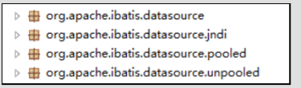

可以看出 Mybatis 将它自己的数据源分为三类：

UNPOOLED                              不使用连接池的数据源

POOLED                                   使用连接池的数据源

JNDI                                          使用 JNDI 实现的数据源

具体结构如下：

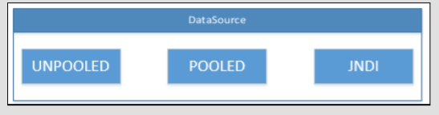

相应地，MyBatis 内部分别定义了实现了 java.sql.DataSource 接口的 UnpooledDataSource，PooledDataSource 类来表示 UNPOOLED、POOLED 类型的数据源。

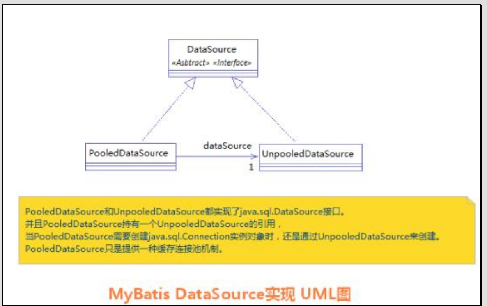

在这三种数据源中，我们一般采用的是 POOLED 数据源（很多时候我们所说的数据源就是为了更好的管理数据库连接，也就是我们所说的连接池技术）。

#### Mybatis中数据源的配置

我们的数据源配置就是在 SqlMapConfig.xml 文件中，具体配置如下：

```xml
<!-- 配置数据源（连接池）信息 -->
<dataSource type="POOLED">
    <property name="driver" value="${jdbc.driver}"/>
    <property name="url" value="${jdbc.url}"/>
    <property name="username" value="${jdbc.username}"/>
    <property name="password" value="${jdbc.password}"/>
</dataSource>

```

MyBatis 在初始化时，根据的 type 属性来创建相应类型的的数据源 DataSource，即：

type=”POOLED”：MyBatis 会创建 PooledDataSource 实例

type=”UNPOOLED” ： MyBatis 会创建 UnpooledDataSource 实例

type=”JNDI”：MyBatis 会从 JNDI 服务上查找 DataSource 实例，然后返回使用

#### Mybatis中DataSource的存取

MyBatis是通过工厂模式来创建数据源DataSource对象的，MyBatis定义了抽象的工厂接口:org.apache.ibatis.datasource.DataSourceFactory,通过其getDataSource()方法返回数据源DataSource。

下面是DataSourceFactory源码，具体如下：

```java
package org.apache.ibatis.datasource;
import java.util.Properties;
import javax.sql.DataSource;
/**
* @author Clinton Begin
*/
public interface DataSourceFactory {
    void setProperties(Properties props);
    DataSource getDataSource();
}

```

MyBatis 创建了 DataSource 实例后，会将其放到 Configuration 对象内的 Environment 对象中， 供以后使用。

具体分析过程如下：

1.先进入 XMLConfigBuilder 类中，可以找到如下代码：

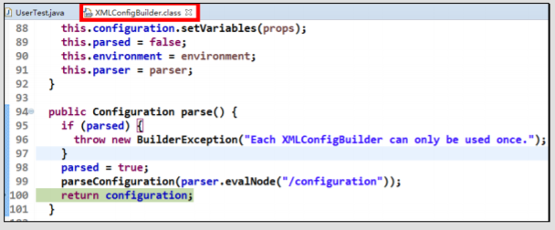

2.分析 configuration 对象的 environment 属性，结果如下：

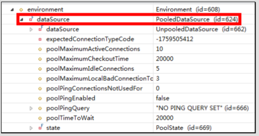

#### Mybatis中连接的获取过程分析

当我们需要创建SqlSession对象并需要执行SQL语句时，这时候MyBatis才会去调用dataSource对象来创建java.sql.Connection对象。也就是说，java.sql.Connection对象的创建一直延迟到执行SQL语句的时候。

```java
@Test
public void testSql() throws Exception {
    InputStream in = Resources.getResourceAsStream("SqlMapConfig.xml");
    SqlSessionFactory factory = new SqlSessionFactoryBuilder().build(in);
    SqlSession sqlSession = factory.openSession();
    List<User> list = sqlSession.selectList("findUserById",41);
    System.out.println(list.size());
}
```

只有当第4句sqlSession.selectList("findUserById")，才会触发MyBatis在底层执行下面这个方法来创建java.sql.Connection对象。

如何证明它的加载过程呢？

我们可以通过断点调试，在PooledDataSource中找到如下popConnection()方法，如下所示：

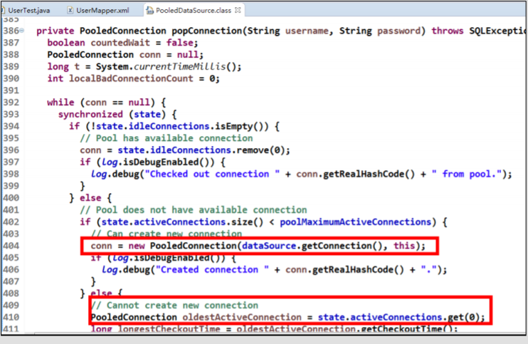

分析源代码，得出 PooledDataSource 工作原理如下：

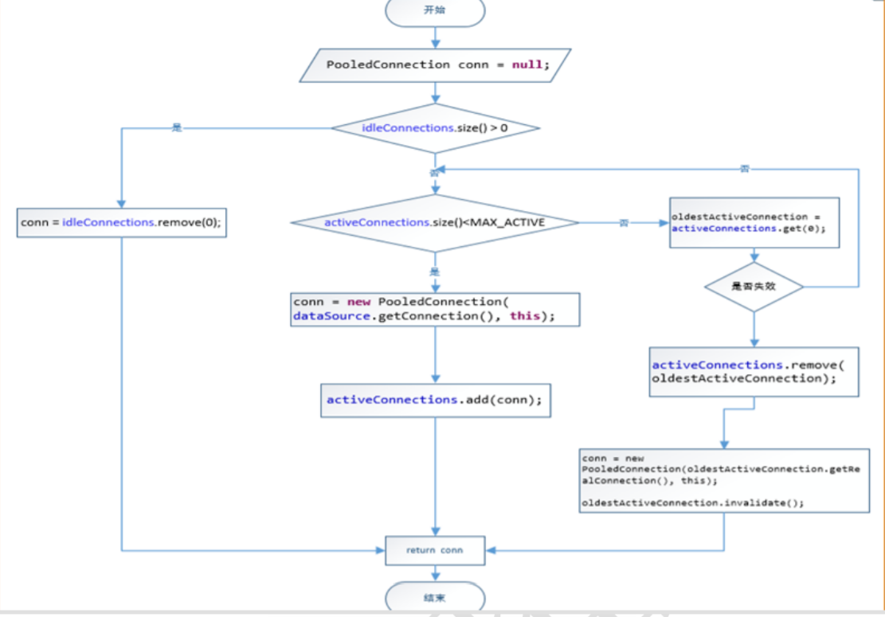

下面是连接获取的源代码：

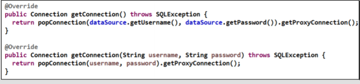

最后我们可以发现，真正连接打开的时间点，只是在我们执行SQL语句时，才会进行。其实这样做我们也可以进一步发现，数据库连接是我们最为宝贵的资源，只有在要用到的时候，才去获取并打开连接，当我们用完了就再立即将数据库连接归还到连接池中。

### 1.9.2 Mybatis的事务控制

#### JDBC中事务的回顾

在 JDBC 中我们可以通过手动方式将事务的提交改为手动方式，通过 setAutoCommit()方法就可以调整。

通过 JDK 文档，我们找到该方法如下：

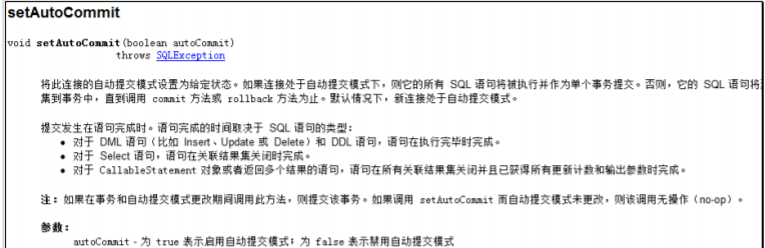

那么我们的 Mybatis 框架因为是对 JDBC 的封装，所以 Mybatis 框架的事务控制方式，本身也是用 JDBC 的 setAutoCommit()方法来设置事务提交方式的。

#### Mybatis中事务提交方式

Mybatis 中事务的提交方式，本质上就是调用 JDBC 的 setAutoCommit()来实现事务控制。

我们运行之前所写的代码：

```java
@Test
public void testSaveUser() throws Exception {
        User user = new User();
        user.setUsername("mybatis user09");
//6.执行操作
        int res = userDao.saveUser(user);
        System.out.println(res);
        System.out.println(user.getId());
}
@Before//在测试方法执行之前执行
public void init()throws Exception {
//1.读取配置文件
        in = Resources.getResourceAsStream("SqlMapConfig.xml");
//2.创建构建者对象
        SqlSessionFactoryBuilder builder = new SqlSessionFactoryBuilder();
//3.创建 SqlSession 工厂对象
        factory = builder.build(in);
//4.创建 SqlSession 对象
        session = factory.openSession();
//5.创建 Dao 的代理对象
        userDao = session.getMapper(IUserDao.class);
}
@After//在测试方法执行完成之后执行
public void destroy() throws Exception{
//7.提交事务
        session.commit();
//8.释放资源
        session.close();
        in.close();
}
```

观察在它在控制台输出的结果：

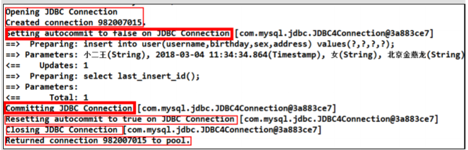

这是我们的 Connection 的整个变化过程，通过分析我们能够发现之前的 CUD 操作过程中，我们都要手动进行事务的提交，原因是 setAutoCommit()方法，在执行时它的值被设置为 false 了，所以我们在 CUD 操作中，必须通过 sqlSession.commit()方法来执行提交操作。

#### Mybatis自动提交事务的设置

通过上面的研究和分析，现在我们一起思考，为什么 CUD 过程中必须使用 sqlSession.commit()提交事务？主要原因就是在连接池中取出的连接，都会将调用 connection.setAutoCommit(false)方法，这样我们就必须使用 sqlSession.commit()方法，相当于使用了 JDBC 中的 connection.commit()方法实现事务提交。

明白这一点后，我们现在一起尝试不进行手动提交，一样实现 CUD 操作。

```java
@Before//在测试方法执行之前执行
public void init()throws Exception {
//1.读取配置文件
        in = Resources.getResourceAsStream("SqlMapConfig.xml");
//2.创建构建者对象
        SqlSessionFactoryBuilder builder = new SqlSessionFactoryBuilder();
//3.创建 SqlSession 工厂对象
        factory = builder.build(in);
//4.创建 SqlSession 对象
        session = factory.openSession(true);
//5.创建 Dao 的代理对象
        userDao = session.getMapper(IUserDao.class);
}
@After//在测试方法执行完成之后执行
public void destroy() throws Exception{
//7.释放资源
        session.close();
        in.close();
}
```

所对应的 DefaultSqlSessionFactory 类的源代码：

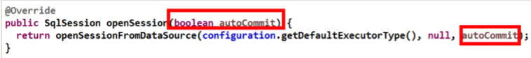

运行结果如下：

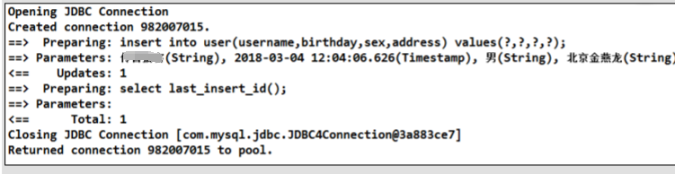

我们发现，此时事务就设置为自动提交了，同样可以实现CUD操作时记录的保存。虽然这也是一种方式，但就编程而言，设置为自动提交方式为 false 再根据情况决定是否进行提交，这种方式更常用。因为我们可以根据业务情况来决定提交是否进行提交。

## 1.10 Mybatis的动态SQL语句

Mybatis 的映射文件中，前面我们的 SQL 都是比较简单的，有些时候业务逻辑复杂时，我们的 SQL 是动态变化的，此时在前面的学习中我们的 SQL 就不能满足要求了。

参考的官方文档，描述如下：

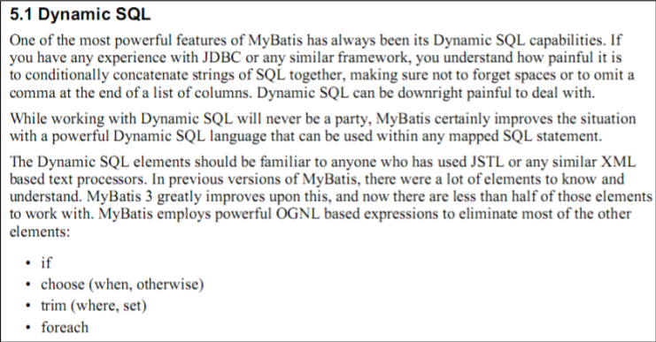

### 1.10.1 动态SQL之`<if>`标签

我们根据实体类的不同取值，使用不同的 SQL 语句来进行查询。比如在 id 如果不为空时可以根据 id 查询，如果 username 不同空时还要加入用户名作为条件。这种情况在我们的多条件组合查询中经常会碰到。

#### 持久层Dao接口

```java
/**
* 根据用户信息，查询用户列表
* @param user
* @return
*/
List<User> findByUser(User user);
```

#### 持久层Dao映射配置

```xml
<select id="findByUser" resultType="user" parameterType="user">
    select * from user where 1=1
    <if test="username!=null and username != '' ">
        and username like #{username}
    </if>
    <if test="address != null">
        and address like #{address}
    </if>
</select>
```

注意：`<if>`标签的 test 属性中写的是对象的属性名，如果是包装类的对象要使用 OGNL 表达式的写法。另外要注意 where 1=1 的作用~！

#### 测试

```java
@Test
public void testFindByUser() {
    User u = new User();
    u.setUsername("%王%");
    u.setAddress("%顺义%");
    //6.执行操作
    List<User> users = userDao.findByUser(u);
    for(User user : users) {
        System.out.println(user);
    }
}
```

### 1.10.2 动态SQL之`<where>`标签

为了简化上面 where 1=1 的条件拼装，我们可以采用`<where>`标签来简化开发

#### 持久层Dao映射配置

```xml
<!-- 根据用户信息查询 -->
<select id="findByUser" resultType="user" parameterType="user">
    <include refid="defaultSql"></include>
    <where>
        <if test="username!=null and username != '' ">
            and username like #{username}
        </if>
        <if test="address != null">
            and address like #{address}
        </if>
    </where>
</select>
```

### 1.10.3 动态标签之`<foreach>`标签

#### 需求

传入多个 id 查询用户信息，用下边两个 sql 实现：

SELECT * FROM USERS WHERE username LIKE '%张%' AND (id =10 OR id =89 OR id=16)

SELECT * FROM USERS WHERE username LIKE '%张%' AND id IN (10,89,16)

这样我们在进行范围查询时，就要将一个集合中的值，作为参数动态添加进来。

这样我们将如何进行参数的传递？

**在QueryVo中加入一个List集合用于封装参数**

```java
/**
 *
 * <p>Title: QueryVo</p>
 * <p>Description: 查询的条件</p>
 */
public class QueryVo implements Serializable {
    private List<Integer> ids;

    public List<Integer> getIds() {
        return ids;
    }

    public void setIds(List<Integer> ids) {
        this.ids = ids;
    }
}
```

#### 持久层Dao接口

```java
/**
* 根据 id 集合查询用户
* @param vo
* @return
*/
List<User> findInIds(QueryVo vo);
```

#### 持久层Dao映射配置

```xml
<!-- 查询所有用户在 id 的集合之中 -->
<select id="findInIds" resultType="user" parameterType="queryvo">
    <!-- select * from user where id in (1,2,3,4,5); -->
    <include refid="defaultSql"></include>
    <where>
        <if test="ids != null and ids.size() > 0">
            <foreach collection="ids" open="id in ( " close=")" item="uid"
                     separator=",">
                #{uid}
            </foreach>
        </if>
    </where>
</select>
```

SQL 语句：

**select 字段 from user where id in (?)**

`<foreach>`标签用于遍历集合，它的属性：

- collection:代表要遍历的集合元素，注意编写时不要写#{}
- open:代表语句的开始部分
- close:代表结束部分
- item:代表遍历集合的每个元素，生成的变量名
- sperator:代表分隔符

编写测试方法

```java
@Test
public void testFindInIds() {
    QueryVo vo = new QueryVo();
    List<Integer> ids = new ArrayList<Integer>();
    ids.add(41);
    ids.add(42);
    ids.add(43);
    ids.add(46);
    ids.add(57);
    vo.setIds(ids);
    //6.执行操作
    List<User> users = userDao.findInIds(vo);
    for(User user : users) {
        System.out.println(user);
    }
}
```

### 1.11 Mybatis中简化编写的SQL片段

Sql 中可将重复的 sql 提取出来，使用时用 include 引用即可，最终达到 sql 重用的目的。

#### 定义代码片段

```xml
<!-- 抽取重复的语句代码片段 -->
<sql id="defaultSql">
    select * from user
</sql>
```

#### 引用代码片段

```xml
<!-- 配置查询所有操作 -->
<select id="findAll" resultType="user">
    <include refid="defaultSql"></include>
</select>
        <!-- 根据 id 查询 -->
<select id="findById" resultType="UsEr" parameterType="int">
    <include refid="defaultSql"></include>
    where id = #{uid}
</select>
```

## 1.11 Mybatis多表查询之一对多

本次案例主要以最为简单的用户和账户的模型来分析 Mybatis 多表关系。用户为 User 表，账户为Account表。一个用户（User）可以有多个账户（Account）。具体关系如下：

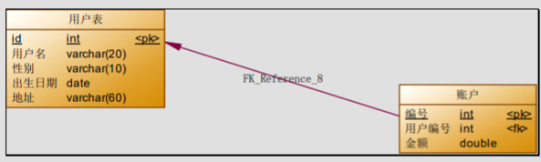

### 1.11.1 一对一查询（多对一）

需求

查询所有账户信息，关联查询下单用户信息。

注意：

因为一个账户信息只能供某个用户使用，所以从查询账户信息出发关联查询用户信息为一对一查询。如果从用户信息出发查询用户下的账户信息则为一对多查询，因为一个用户可以有多个账户。

#### 方式一

**定义账户信息的实体类**

```java
/**
 *
 * <p>Title: Account</p>
 * <p>Description: 账户的实体类</p>
 */
public class Account implements Serializable {
    private Integer id;
    private Integer uid;
    private Double money;
    public Integer getId() {
        return id;
    }
    public void setId(Integer id) {
        this.id = id;
    }
    public Integer getUid() {
        return uid;
    }
    public void setUid(Integer uid) {
        this.uid = uid;
    }
    public Double getMoney() {
        return money;
    }
    public void setMoney(Double money) {
        this.money = money;
    }
    @Override
    public String toString() {
        return "Account [id=" + id + ", uid=" + uid + ", money=" + money + "]";
    }
}
```

**编写 Sql 语句**

实现查询账户信息时，也要查询账户所对应的用户信息。

```
SELECT
    account.*,
    user.username,
    user.address
FROM
    account,
    user
WHERE account.uid = user.id
```

**定义AccountUser类**

为了能够封装上面 SQL 语句的查询结果，定义 AccountCustomer 类中要包含账户信息同时还要包含用户信息，所以我们要在定义 AccountUser 类时可以继承 User 类。

```java
/**
 *
 * <p>Title: AccountUser</p>
 * <p>Description: 它是 account 的子类</p>
 */
public class AccountUser extends Account implements Serializable {
    private String username;
    private String address;
    public String getUsername() {
        return username;
    }
    public void setUsername(String username) {
        this.username = username;
    }
    public String getAddress() {
        return address;
    }
    public void setAddress(String address) {
        this.address = address;
    }
    @Override
    public String toString() {
        return super.toString() + " AccountUser [username=" + username + ",
        address=" + address + "]";
    }
}
```

**定义账户的持久层 Dao 接口**

```java
/**
*
* <p>Title: IAccountDao</p>
* <p>Description: 账户的持久层接口</p>
*/
public interface IAccountDao {
    /**
    * 查询所有账户，同时获取账户的所属用户名称以及它的地址信息
    * @return
    */
    List<AccountUser> findAll();
}
```

**定义 AccountDao.xml 文件中的查询配置信息**

```xml
<?xml version="1.0" encoding="UTF-8"?>
<!DOCTYPE mapper
        PUBLIC "-//mybatis.org//DTD Mapper 3.0//EN"
        "http://mybatis.org/dtd/mybatis-3-mapper.dtd">
<mapper namespace="com.xxx.dao.IAccountDao">
    <!-- 配置查询所有操作-->
    <select id="findAll" resultType="accountuser">
select a.*,u.username,u.address from account a,user u where a.uid =u.id;
</select>
</mapper>
```

注意：因为上面查询的结果中包含了账户信息同时还包含了用户信息，所以我们的返回值类型 returnType 的值设置为 AccountUser 类型，这样就可以接收账户信息和用户信息了。

**创建AccountTest测试类**

```java
/**
 *
 * <p>Title: MybastisCRUDTest</p>
 * <p>Description: 一对多账户的操作</p>
 */
public class AccountTest {
    private InputStream in ;
    private SqlSessionFactory factory;
    private SqlSession session;
    private IAccountDao accountDao;
    @Test
    public void testFindAll() {
//6.执行操作
        List<AccountUser> accountusers = accountDao.findAll();
        for(AccountUser au : accountusers) {
            System.out.println(au);
        }
    }
    @Before//在测试方法执行之前执行
    public void init()throws Exception {
//1.读取配置文件
        in = Resources.getResourceAsStream("SqlMapConfig.xml");
//2.创建构建者对象
        SqlSessionFactoryBuilder builder = new SqlSessionFactoryBuilder();
//3.创建 SqlSession 工厂对象
        factory = builder.build(in);
//4.创建 SqlSession 对象
        session = factory.openSession();
//5.创建 Dao 的代理对象
        accountDao = session.getMapper(IAccountDao.class);
    }
    @After//在测试方法执行完成之后执行
    public void destroy() throws Exception{
        session.commit();
//7.释放资源
        session.close();
        in.close();
    }
}
```

**小结**

定义专门的 po 类作为输出类型，其中定义了 sql 查询结果集所有的字段。此方法较为简单，企业中使用普遍。

#### 方法二

使用 resultMap，定义专门的 resultMap 用于映射一对一查询结果。

通过面向对象的(has a)关系可以得知，我们可以在 Account 类中加入一个 User 类的对象来代表这个账户是哪个用户的。

**修改 Account 类**

在 Account 类中加入 User 类的对象作为 Account 类的一个属性。

```java
/**
 *
 * <p>Title: Account</p>
 * <p>Description: 账户的实体类</p>
 */
public class Account implements Serializable {
    private Integer id;
    private Integer uid;
    private Double money;
    private User user;
    public User getUser() {
        return user;
    }
    public void setUser(User user) {
        this.user = user;
    }
    //省略其余
}
```

**修改AccountDao接口中的方法**

```java
/**
 *
 * <p>Title: IAccountDao</p>
 * <p>Description: 账户的持久层接口</p>
 */
public interface IAccountDao {
    /**
     * 查询所有账户，同时获取账户的所属用户名称以及它的地址信息
     * @return
     */
    List<Account> findAll();
}
```

注意：第二种方式，将返回值改为了 Account 类型。

因为 Account 类中包含了一个 User 类的对象，它可以封装账户所对应的用户信息。

 **重新定义 AccountDao.xml 文件**

```xml
<?xml version="1.0" encoding="UTF-8"?>
<!DOCTYPE mapper
        PUBLIC "-//mybatis.org//DTD Mapper 3.0//EN"
        "http://mybatis.org/dtd/mybatis-3-mapper.dtd">
<mapper namespace="com.xxx.dao.IAccountDao">
    <!-- 建立对应关系 -->
    <resultMap type="account" id="accountMap">
        <id column="aid" property="id"/>
        <result column="uid" property="uid"/>
        <result column="money" property="money"/>
        <!-- 它是用于指定从表方的引用实体属性的 -->
        <association property="user" javaType="user">
            <id column="id" property="id"/>
            <result column="username" property="username"/>
            <result column="sex" property="sex"/>
            <result column="birthday" property="birthday"/>
            <result column="address" property="address"/>
        </association>
    </resultMap>
    <select id="findAll" resultMap="accountMap">
select u.*,a.id as aid,a.uid,a.money from account a,user u where a.uid =u.id;
</select>
</mapper>
```

**在 AccountTest 类中加入测试方法**

```java
@Test
public void testFindAll() {
        List<Account> accounts = accountDao.findAll();
        for(Account au : accounts) {
            System.out.println(au);
            System.out.println(au.getUser());
        }
}
```

### 1.11.2 一对多查询

需求：

查询所有用户信息及用户关联的账户信息。

分析：

用户信息和他的账户信息为一对多关系，并且查询过程中如果用户没有账户信息，此时也要将用户信息查询出来，我们想到了左外连接查询比较合适。

#### 编写SQL语句

```
SELECT
    u.*, acc.id id,
    acc.uid,
    acc.money
FROM
    user u
LEFT JOIN account acc ON u.id = acc.uid
```

**User 类加入`List<Account>`**

```java
/**
 *
 * <p>Title: User</p>
 * <p>Description: 用户的实体类</p>
 */
public class User implements Serializable {
    private Integer id;
    private String username;
    private Date birthday;
    private String sex;
    private String address;
    private List<Account> accounts;
    public List<Account> getAccounts() {
        return accounts;
    }
    public void setAccounts(List<Account> accounts) {
        this.accounts = accounts;
    }
    public Integer getId() {
        return id;
    }
    public void setId(Integer id) {
        this.id = id;
    }
    public String getUsername() {
        return username;
    }
    public void setUsername(String username) {
        this.username = username;
    }
    public Date getBirthday() {
        return birthday;
    }
    public void setBirthday(Date birthday) {
        this.birthday = birthday;
    }
    public String getSex() {
        return sex;
    }
    public void setSex(String sex) {
        this.sex = sex;
    }
    public String getAddress() {
        return address;
    }
    public void setAddress(String address) {
        this.address = address;
    }
    @Override
    public String toString() {
        return "User [id=" + id + ", username=" + username + ", birthday=" + birthday
                + ", sex=" + sex + ", address="
                + address + "]";
    }
}
```

#### 用户持久层 Dao 接口中加入查询方法

```java
/**
* 查询所有用户，同时获取出每个用户下的所有账户信息
* @return
*/
List<User> findAll();
```

#### 用户持久层 Dao 映射文件配置

```xml
<?xml version="1.0" encoding="UTF-8"?>
<!DOCTYPE mapper
        PUBLIC "-//mybatis.org//DTD Mapper 3.0//EN"
        "http://mybatis.org/dtd/mybatis-3-mapper.dtd">
<mapper namespace="com.xxx.dao.IUserDao">
    <resultMap type="user" id="userMap">
        <id column="id" property="id"></id>
        <result column="username" property="username"/>
        <result column="address" property="address"/>
        <result column="sex" property="sex"/>
        <result column="birthday" property="birthday"/>
        <!-- collection 是用于建立一对多中集合属性的对应关系
        ofType 用于指定集合元素的数据类型
        -->
        <collection property="accounts" ofType="account">
            <id column="aid" property="id"/>
            <result column="uid" property="uid"/>
            <result column="money" property="money"/>
        </collection>
    </resultMap>
    <!-- 配置查询所有操作 -->
    <select id="findAll" resultMap="userMap">
select u.*,a.id as aid ,a.uid,a.money from user u left outer join account
a on u.id =a.uid
</select>
</mapper>
```

collection

部分定义了用户关联的账户信息。表示关联查询结果集

property="accList"：

关联查询的结果集存储在 User 对象的上哪个属性。

ofType="account"：

指定关联查询的结果集中的对象类型即List中的对象类型。此处可以使用别名，也可以使用全限定名。

#### 测试方法

```java
/**
 *
 * <p>Title: MybastisCRUDTest</p>
 * <p>Description: 一对多的操作</p>
 */
public class UserTest {
    private InputStream in ;
    private SqlSessionFactory factory;
    private SqlSession session;
    private IUserDao userDao;
    @Test
    public void testFindAll() {
//6.执行操作
        List<User> users = userDao.findAll();
        for(User user : users) {
            System.out.println("-------每个用户的内容---------");
            System.out.println(user);
            System.out.println(user.getAccounts());
        }
    }
    @Before//在测试方法执行之前执行
    public void init()throws Exception {
//1.读取配置文件
        in = Resources.getResourceAsStream("SqlMapConfig.xml");
//2.创建构建者对象
        SqlSessionFactoryBuilder builder = new SqlSessionFactoryBuilder();
//3.创建 SqlSession 工厂对象
        factory = builder.build(in);
//4.创建 SqlSession 对象
        session = factory.openSession();
//5.创建 Dao 的代理对象
        userDao = session.getMapper(IUserDao.class);
    }
    @After//在测试方法执行完成之后执行
    public void destroy() throws Exception{
        session.commit();
//7.释放资源
        session.close();
        in.close();
    }
}
```

## 1.12 Mybatis多表查询之多对多

### 1.12.1 实现Role到User多对多

通过前面的学习，我们使用 Mybatis 实现一对多关系的维护。多对多关系其实我们看成是双向的一对多关系。

#### 用户与角色的关系模型

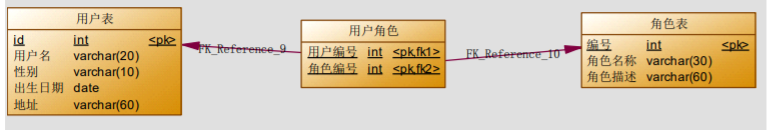

#### 业务要求及实现 SQL

需求：

实现查询所有对象并且加载它所分配的用户信息。

分析：

查询角色我们需要用到Role表，但角色分配的用户的信息我们并不能直接找到用户信息，而是要通过中间表(USER_ROLE 表)才能关联到用户信息。

下面是实现的 SQL 语句：

```
SELECT
    r.*,u.id uid,
    u.username username,
    u.birthday birthday,
    u.sex sex,
    u.address address
FROM
    ROLE r
INNER JOIN
    USER_ROLE ur
ON ( r.id = ur.rid)
INNER JOIN
    USER u
ON (ur.uid = u.id);
```

#### 编写角色实体类

```java
public class Role implements Serializable {
    private Integer roleId;
    private String roleName;
    private String roleDesc;
    //多对多的关系映射：一个角色可以赋予多个用户
    private List<User> users;

    public List<User> getUsers() {
        return users;
    }

    public void setUsers(List<User> users) {
        this.users = users;
    }

    public Integer getRoleId() {
        return roleId;
    }

    public void setRoleId(Integer roleId) {
        this.roleId = roleId;
    }

    public String getRoleName() {
        return roleName;
    }

    public void setRoleName(String roleName) {
        this.roleName = roleName;
    }

    public String getRoleDesc() {
        return roleDesc;
    }

    public void setRoleDesc(String roleDesc) {
        this.roleDesc = roleDesc;
    }

    @Override
    public String toString() {
        return "Role{" +
                "roleId=" + roleId +
                ", roleName='" + roleName + '\'' +
                ", roleDesc='" + roleDesc + '\'' +
                '}';
    }
}
```

#### 编写Role持久层接口

```java
public interface IRoleDao {
    /**
     * 查询所有角色
     * @return
     */
    List<Role> findAll();
}
```

#### 编写映射文件

```xml
<?xml version="1.0" encoding="UTF-8"?>
<!DOCTYPE mapper
        PUBLIC "-//mybatis.org//DTD Mapper 3.0//EN"
        "http://mybatis.org/dtd/mybatis-3-mapper.dtd">
<mapper namespace="com.xxx.dao.IRoleDao">
    <!--定义 role 表的 ResultMap-->
    <resultMap id="roleMap" type="role">
        <id property="roleId" column="rid"></id>
        <result property="roleName" column="role_name"></result>
        <result property="roleDesc" column="role_desc"></result>
        <collection property="users" ofType="user">
            <id column="id" property="id"></id>
            <result column="username" property="username"></result>
            <result column="address" property="address"></result>
            <result column="sex" property="sex"></result>
            <result column="birthday" property="birthday"></result>
        </collection>
    </resultMap>
    <!--查询所有-->
    <select id="findAll" resultMap="roleMap">
 select u.*,r.id as rid,r.role_name,r.role_desc from role r
 left outer join user_role ur on r.id = ur.rid
 left outer join user u on u.id = ur.uid
    </select>
</mapper>
```

#### 编写测试类

```java
public class RoleTest {
    private InputStream in;
    private SqlSession sqlSession;
    private IRoleDao roleDao;
    @Before//用于在测试方法执行之前执行
    public void init()throws Exception{
        //1.读取配置文件，生成字节输入流
        in = Resources.getResourceAsStream("SqlMapConfig.xml");
        //2.获取 SqlSessionFactory
        SqlSessionFactory factory = new SqlSessionFactoryBuilder().build(in);
        //3.获取 SqlSession 对象
        sqlSession = factory.openSession(true);
        //4.获取 dao 的代理对象
        roleDao = sqlSession.getMapper(IRoleDao.class);
    }
    @After//用于在测试方法执行之后执行
    public void destroy()throws Exception{
        //提交事务
        // sqlSession.commit();
        //6.释放资源
        sqlSession.close();
        in.close();
    }
    /**
     * 测试查询所有
     */
    @Test
    public void testFindAll(){
        List<Role> roles = roleDao.findAll();
        for(Role role : roles){
            System.out.println("---每个角色的信息----");
            System.out.println(role);
            System.out.println(role.getUsers());
        }
    }
}
```

### 1.12.2 实现User到Role的多对多

同上

[补充：JNDI](../references/JNDI数据源.docx)

## 1.13 Mybatis延迟加载策略

通过前面的学习，我们已经掌握了 Mybatis 中一对一，一对多，多对多关系的配置及实现，可以实现对象的关联查询。实际开发过程中很多时候我们并不需要总是在加载用户信息时就一定要加载他的账户信息。此时就是我们所说的延迟加载。

### 1.13.1 何为延迟加载？

延迟加载：

就是在需要用到数据时才进行加载，不需要用到数据时就不加载数据。延迟加载也称懒加载.

好处：先从单表查询，需要时再从关联表去关联查询，大大提高数据库性能，因为查询单表要比关联查询多张表速度要快。

坏处：

因为只有当需要用到数据时，才会进行数据库查询，这样在大批量数据查询时，因为查询工作也要消耗时间，所以可能造成用户等待时间变长，造成用户体验下降。

### 1.13.2 实现需求

需求：

查询账户(Account)信息并且关联查询用户(User)信息。如果先查询账户(Account)信息即可满足要求，当我们需要查询用户(User)信息时再查询用户(User)信息。把对用户(User)信息的按需去查询就是延迟加载。

mybatis第三天实现多表操作时，我们使用了resultMap来实现一对一，一对多，多对多关系的操作。主要是通过 association、collection 实现一对一及一对多映射。association、collection 具备延迟加载功能。

### 1.13.3 使用assocation实现延迟加载

需求：查询账户信息同时查询用户信息。

#### 账户的持久层 DAO 接口

```java
/**
 * <p>Title: IAccountDao</p>
 * <p>Description: 账户的持久层接口</p>
 */
public interface IAccountDao {
    /**
     * 查询所有账户，同时获取账户的所属用户名称以及它的地址信息
     *
     * @return
     */
    List<Account> findAll();
}

```

#### 账户的持久层映射文件

```xml
<?xml version="1.0" encoding="UTF-8"?>
<!DOCTYPE mapper
        PUBLIC "-//mybatis.org//DTD Mapper 3.0//EN"
        "http://mybatis.org/dtd/mybatis-3-mapper.dtd">
<mapper namespace="com.xxx.dao.IAccountDao">
    <!-- 建立对应关系 -->
    <resultMap type="account" id="accountMap">
        <id column="aid" property="id"/>
        <result column="uid" property="uid"/>
        <result column="money" property="money"/>
        <!-- 它是用于指定从表方的引用实体属性的 -->
        <association property="user" javaType="user"
                     select="com.xxx.dao.IUserDao.findById"
                     column="uid">
        </association>
    </resultMap>
    <select id="findAll" resultMap="accountMap">
select * from account
</select>
</mapper>
```

select： 填写我们要调用的 select 映射的 id

column ： 填写我们要传递给 select 映射的参数

#### 用户的持久层接口和映射文件

```java
/**
 * <p>Title: IUserDao</p>
 * <p>Description: 用户的业务层接口</p>

 */
public interface IUserDao {
    /**
     * 根据 id 查询
     *
     * @param userId
     * @return
     */
    User findById(Integer userId);
}
```

```xml
<? xml version = "1.0" encoding="UTF-8"?>
        <!DOCTYPE mapper
                PUBLIC"-//mybatis.org//DTD Mapper 3.0//EN"
                "http://mybatis.org/dtd/mybatis-3-mapper.dtd">
<mapper namespace="com.xxx.dao.IUserDao">
    <!--根据 id 查询-->
    <select id="findById" resultType="user" parameterType="int">
        select*from user where id= #{uid}
    </select>
</mapper>
```

#### 开启Mybatis的延迟加载策略

进入 Mybaits 的官方文档，找到 settings 的说明信息：

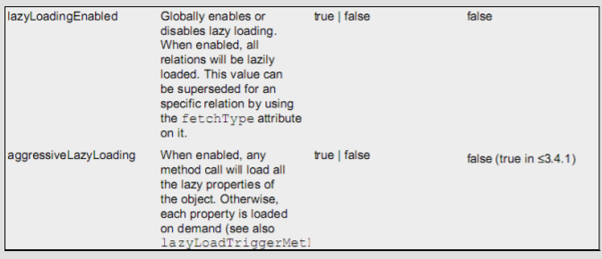

我们需要在 Mybatis 的配置文件 SqlMapConfig.xml 文件中添加延迟加载的配置。

```xml
<!-- 开启延迟加载的支持 -->
<settings>
    <setting name="lazyLoadingEnabled" value="true"/>
    <setting name="aggressiveLazyLoading" value="false"/>
</settings>
```

#### 编写测试只查账户信息不查用户信息

```java
/**
 *
 * <p>Title: MybastisCRUDTest</p>
 * <p>Description: 一对多账户的操作</p>
 */
public class AccountTest {
    private InputStream in ;
    private SqlSessionFactory factory;
    private SqlSession session;
    private IAccountDao accountDao;
    @Test
    public void testFindAll() {
//6.执行操作
        List<Account> accounts = accountDao.findAll();
    }
    @Before//在测试方法执行之前执行
    public void init()throws Exception {
//1.读取配置文件
        in = Resources.getResourceAsStream("SqlMapConfig.xml");
//2.创建构建者对象
        SqlSessionFactoryBuilder builder = new SqlSessionFactoryBuilder();
//3.创建 SqlSession 工厂对象
        factory = builder.build(in);
//4.创建 SqlSession 对象
        session = factory.openSession();
//5.创建 Dao 的代理对象
        accountDao = session.getMapper(IAccountDao.class);
    }
    @After//在测试方法执行完成之后执行
    public void destroy() throws Exception{
//7.释放资源
        session.close();
        in.close();
    }
}
```

测试结果如下：

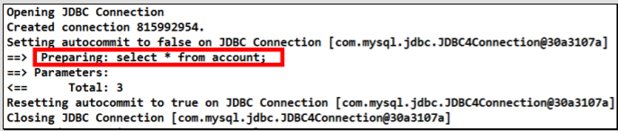

我们发现，因为本次只是将 Account对象查询出来放入 List 集合中，并没有涉及到 User对象，所以就没有发出 SQL 语句查询账户所关联的 User 对象的查询。

### 1.13.4 使用Collection实现延迟加载

同样我们也可以在一对多关系配置的结点中配置延迟加载策略。

`<collection>`结点中也有 select 属性，column 属性。

需求：

完成加载用户对象时，查询该用户所拥有的账户信息。

#### 在 User 实体类中加入`List<Account>`属性

```java
/**
 *
 * <p>Title: User</p>
 * <p>Description: 用户的实体类</p>
 */
public class User implements Serializable {
    private Integer id;
    private String username;
    private Date birthday;
    private String sex;
    private String address;
    private List<Account> accounts;
    public List<Account> getAccounts() {
        return accounts;
    }
    public void setAccounts(List<Account> accounts) {
        this.accounts = accounts;
    }
    public Integer getId() {
        return id;
    }
    public void setId(Integer id) {
        this.id = id;
    }
    public String getUsername() {
        return username;
    }
    public void setUsername(String username) {
        this.username = username;
    }
    public Date getBirthday() {
        return birthday;
    }
    public void setBirthday(Date birthday) {
        this.birthday = birthday;
    }
    public String getSex() {
        return sex;
    }
    public void setSex(String sex) {
        this.sex = sex;
    }
    public String getAddress() {
        return address;
    }
    public void setAddress(String address) {
        this.address = address;
    }
    @Override
    public String toString() {
        return "User [id=" + id + ", username=" + username + ", birthday=" + birthday
                + ", sex=" + sex + ", address="
                + address + "]";
    }
}
```

####  编写用户和账户持久层接口的方法

```java
/**
* 查询所有用户，同时获取出每个用户下的所有账户信息
* @return
*/
List<User> findAll();
/**
* 根据用户 id 查询账户信息
* @param uid
* @return
*/
List<Account> findByUid(Integer uid);
```

#### 编写用户持久层映射配置

```java
<resultMap type="user" id="userMap">
    <id column="id" property="id"></id>
    <result column="username" property="username"/>
    <result column="address" property="address"/>
    <result column="sex" property="sex"/>
    <result column="birthday" property="birthday"/>
    <!-- collection 是用于建立一对多中集合属性的对应关系
            ofType 用于指定集合元素的数据类型
            select 是用于指定查询账户的唯一标识（账户的 dao 全限定类名加上方法名称）
            column 是用于指定使用哪个字段的值作为条件查询
            -->
    <collection property="accounts" ofType="account"
                select="com.xxx.dao.IAccountDao.findByUid"
                column="id">
    </collection>
</resultMap>
        <!-- 配置查询所有操作 -->
<select id="findAll" resultMap="userMap">
select * from user
</select>
```

`<collection>`标签：

主要用于加载关联的集合对象

select 属性：

用于指定查询 account 列表的 sql 语句，所以填写的是该 sql 映射的 id

column 属性：

用于指定 select 属性的 sql 语句的参数来源，上面的参数来自于 user 的 id 列，所以就写成 id 这一个字段名了

#### 编写账户持久层映射配置

```xml
<!-- 根据用户 id 查询账户信息 -->
<select id="findByUid" resultType="account" parameterType="int">
    select * from account where uid = #{uid}
</select>
```

#### 测试只加载用户信息

```java
/**
 *
 * <p>Title: MybastisCRUDTest</p>
 * <p>Description: 一对多的操作</p>
 */
public class UserTest {
    private InputStream in ;
    private SqlSessionFactory factory;
    private SqlSession session;
    private IUserDao userDao;
    @Test
    public void testFindAll() {
//6.执行操作
        List<User> users = userDao.findAll();
    }
    @Before//在测试方法执行之前执行
    public void init()throws Exception {
//1.读取配置文件
        in = Resources.getResourceAsStream("SqlMapConfig.xml");
//2.创建构建者对象
        SqlSessionFactoryBuilder builder = new SqlSessionFactoryBuilder();
//3.创建 SqlSession 工厂对象
        factory = builder.build(in);
//4.创建 SqlSession 对象
        session = factory.openSession();
//5.创建 Dao 的代理对象
        userDao = session.getMapper(IUserDao.class);
    }
    @After//在测试方法执行完成之后执行
    public void destroy() throws Exception{
        session.commit();
//7.释放资源
        session.close();
        in.close();
    }
}
```

测试结果如下：

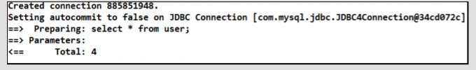

我们发现并没有加载 Account 账户信息。

## 1.14 Mybatis缓存

像大多数的持久化框架一样，Mybatis 也提供了缓存策略，通过缓存策略来减少数据库的查询次数，从而提高性能。

Mybatis 中缓存分为一级缓存，二级缓存。

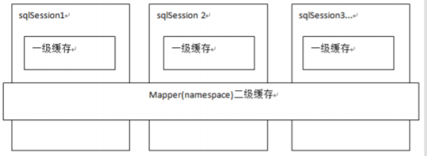

### 1.14.1 Mybatis一级缓存

#### 证明一级缓存的存在

一级缓存是 SqlSession 级别的缓存，只要 SqlSession 没有 flush 或 close，它就存在。

编写用户持久层Dao接口

```java
/**
*
* <p>Title: IUserDao</p>
* <p>Description: 用户的业务层接口</p>
*/
public interface IUserDao {
    /**
    * 根据 id 查询
    * @param userId
    * @return
    */
    User findById(Integer userId);
}
```

编写用户持久层映射文件

```xml
<?xml version="1.0" encoding="UTF-8"?>
<!DOCTYPE mapper
        PUBLIC "-//mybatis.org//DTD Mapper 3.0//EN"
        "http://mybatis.org/dtd/mybatis-3-mapper.dtd">
<mapper namespace="com.xxx.dao.IUserDao">
    <!-- 根据 id 查询 -->
    <select id="findById" resultType="UsEr" parameterType="int" useCache="true">
        select * from user where id = #{uid}
    </select>
</mapper>
```

编写测试方法

```java
/**
 *
 * <p>Title: MybastisCRUDTest</p>
 * <p>Description: 一对多的操作</p>
 * <p>Company: http://www.xxx.com/ </p>
 */
public class UserTest {
    private InputStream in ;
    private SqlSessionFactory factory;
    private SqlSession session;
    private IUserDao userDao;
    @Test
    public void testFindById() {
//6.执行操作
        User user = userDao.findById(41);
        System.out.println("第一次查询的用户："+user);
        User user2 = userDao.findById(41);
        System.out.println("第二次查询用户："+user2);
        System.out.println(user == user2);
    }
    @Before//在测试方法执行之前执行
    public void init()throws Exception {
//1.读取配置文件
        in = Resources.getResourceAsStream("SqlMapConfig.xml");
//2.创建构建者对象
        SqlSessionFactoryBuilder builder = new SqlSessionFactoryBuilder();
//3.创建 SqlSession 工厂对象
        factory = builder.build(in);
//4.创建 SqlSession 对象
        session = factory.openSession();
//5.创建 Dao 的代理对象
        userDao = session.getMapper(IUserDao.class);
    }
    @After//在测试方法执行完成之后执行
    public void destroy() throws Exception{
//7.释放资源
        session.close();
        in.close();
    }
}
```

测试结果如下：

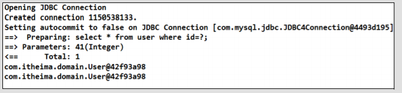

我们可以发现，虽然在上面的代码中我们查询了两次，但最后只执行了一次数据库操作，这就是 Mybatis 提供给我们的一级缓存在起作用了。因为一级缓存的存在，导致第二次查询 id 为 41 的记录时，并没有发出 sql 语句从数据库中查询数据，而是从一级缓存中查询。

#### 一级缓存的分析

一级缓存是 SqlSession 范围的缓存，当调用 SqlSession 的修改，添加，删除，commit()，close()等方法时，就会清空一级缓存。

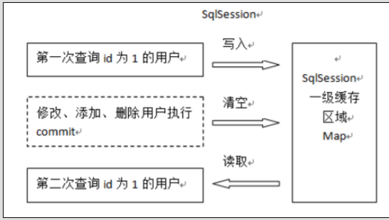

第一次发起查询用户 id 为 1 的用户信息，先去找缓存中是否有 id 为 1 的用户信息，如果没有，从数据库查询用户信息。

得到用户信息，将用户信息存储到一级缓存中。

如果 sqlSession 去执行 commit 操作（执行插入、更新、删除），清空 SqlSession 中的一级缓存，这样做的目的为了让缓存中存储的是最新的信息，避免脏读。

第二次发起查询用户 id 为 1 的用户信息，先去找缓存中是否有 id 为 1 的用户信息，缓存中有，直接从缓存中获取用户信息。

#### 测试一级缓存的清空

```java
/**
 * 测试一级缓存
 */
@Test
public void testFirstLevelCache(){
    User user1 = userDao.findById(41);
    System.out.println(user1);
// sqlSession.close();
// 再次获取 SqlSession 对象
// sqlSession = factory.openSession();
    sqlSession.clearCache();//此方法也可以清空缓存
    userDao = sqlSession.getMapper(IUserDao.class);
    User user2 = userDao.findById(41);
    System.out.println(user2);
    System.out.println(user1 == user2);
}
/**
 * 测试缓存的同步
 */
@Test
public void testClearlCache(){
    //1.根据 id 查询用户
    User user1 = userDao.findById(41);
    System.out.println(user1);
    //2.更新用户信息
    user1.setUsername("update user clear cache");
    user1.setAddress("北京市海淀区");
    userDao.updateUser(user1);
    //3.再次查询 id 为 41 的用户
    User user2 = userDao.findById(41);
    System.out.println(user2);
    System.out.println(user1 == user2);
}
```

当执行sqlSession.close()后，再次获取sqlSession并查询id=41的User对象时，又重新执行了sql 语句，从数据库进行了查询操作。

### 1.14.2 Mybatis二级缓存

二级缓存是 mapper 映射级别的缓存，多个 SqlSession 去操作同一个 Mapper 映射的 sql 语句，多个 SqlSession 可以共用二级缓存，二级缓存是跨 SqlSession 的。

#### 二级缓存结构图

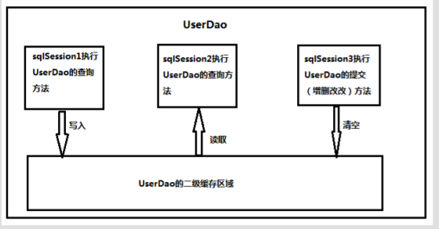

首先开启 mybatis 的二级缓存。

sqlSession1 去查询用户信息，查询到用户信息会将查询数据存储到二级缓存中。

如果 SqlSession3 去执行相同 mapper 映射下 sql，执行 commit 提交，将会清空该 mapper 映射下的二级缓存区域的数据。

sqlSession2 去查询与 sqlSession1 相同的用户信息，首先会去缓存中找是否存在数据，如果存在直接从缓存中取出数据。

#### 二级缓存的开启与关闭

- 第一步：在 SqlMapConfig.xml 文件开启二级缓存

```xml
<settings>
<!-- 开启二级缓存的支持 -->
<setting name="cacheEnabled" value="true"/>
</settings>
```

因为 cacheEnabled 的取值默认就为 true，所以这一步可以省略不配置。为 true 代表开启二级缓存；为 false 代表不开启二级缓存。

- 第二步：配置相关的 Mapper 映射文件

`<cache>`标签表示当前这个 mapper 映射将使用二级缓存，区分的标准就看 mapper 的 namespace 值。

```xml
<?xml version="1.0" encoding="UTF-8"?>
<!DOCTYPE mapper
 PUBLIC "-//mybatis.org//DTD Mapper 3.0//EN"
 "http://mybatis.org/dtd/mybatis-3-mapper.dtd">
<mapper namespace="com.xxx.dao.IUserDao">
<!-- 开启二级缓存的支持 -->
<cache></cache>
</mapper>
```

- 第三步：配置 statement 上面的 useCache 属性

```xml
<!-- 根据 id 查询 -->
<select id="findById" resultType="user" parameterType="int" useCache="true">
    select * from user where id = #{uid}
</select>
```

将 UserDao.xml 映射文件中的标签中设置 useCache=”true”代表当前这个 statement 要使用二级缓存，如果不使用二级缓存可以设置为 false。

注意：**针对每次查询都需要最新的数据 sql，要设置成 useCache=false，禁用二级缓存。**

#### 二级缓存测试

```java
public class SecondLevelCacheTest {
    private InputStream in;
    private SqlSessionFactory factory;
    @Before//用于在测试方法执行之前执行
    public void init()throws Exception{
        //1.读取配置文件，生成字节输入流
        in = Resources.getResourceAsStream("SqlMapConfig.xml");
        //2.获取 SqlSessionFactory
        factory = new SqlSessionFactoryBuilder().build(in);
    }
    @After//用于在测试方法执行之后执行
    public void destroy()throws Exception{
        in.close();
    }
    /**
     * 测试一级缓存
     */
    @Test
    public void testFirstLevelCache(){
        SqlSession sqlSession1 = factory.openSession();
        IUserDao dao1 = sqlSession1.getMapper(IUserDao.class);
        User user1 = dao1.findById(41);
        System.out.println(user1);
        sqlSession1.close();//一级缓存消失
        SqlSession sqlSession2 = factory.openSession();
        IUserDao dao2 = sqlSession2.getMapper(IUserDao.class);
        User user2 = dao2.findById(41);
        System.out.println(user2);
        sqlSession2.close();
        System.out.println(user1 == user2);
    }
}
```

经过上面的测试，我们发现执行了两次查询，并且在执行第一次查询后，我们关闭了一级缓存，再去执行第二次查询时，我们发现并没有对数据库发出 sql 语句，所以此时的数据就只能是来自于我们所说的二级缓存。

#### 二级缓存注意事项

当我们在使用二级缓存时，所缓存的类一定要实现 java.io.Serializable 接口，这种就可以使用序列化方式来保存对象。

```java
/**
*
* <p>Title: User</p>
* <p>Description: 用户的实体类</p>
*/
public class User implements Serializable {
    private Integer id;
    private String username;
    private Date birthday;
    private String sex;
    private String address;
}
```

## 1.15  Mybatis注解开发 

这几年来注解开发越来越流行，Mybatis 也可以使用注解开发方式，这样我们就可以减少编写 Mapper 映射文件了。本次我们先围绕一些基本的 CRUD 来学习，再学习复杂映射关系及延迟加载。

### 1.15.1 mybatis的常用注解说明

@Insert:实现新增

@Update:实现更新

@Delete:实现删除

@Select:实现查询

@Result:实现结果集封装

@Results:可以与@Result 一起使用，封装多个结果集

@ResultMap:实现引用@Results 定义的封装

@One:实现一对一结果集封装

@Many:实现一对多结果集封装

@SelectProvider: 实现动态 SQL 映射

@CacheNamespace:实现注解二级缓存的使用

### 1.15.2 使用Mybatis注解实现基本CRUD

单表的 CRUD 操作是最基本的操作，前面我们的学习都是基于 Mybaits 的映射文件来实现的。

#### 编写实体类

```java
/**
 *
 * <p>Title: User</p>
 * <p>Description: 用户的实体类</p>
 */
public class User implements Serializable {
    private Integer userId;
    private String userName;
    private Date userBirthday;
    private String userSex;
    private String userAddress;
    public Integer getUserId() {
        return userId;
    }
    public void setUserId(Integer userId) {
        this.userId = userId;
    }
    public String getUserName() {
        return userName;
    }
    public void setUserName(String userName) {
        this.userName = userName;
    }
    public Date getUserBirthday() {
        return userBirthday;
    }
    public void setUserBirthday(Date userBirthday) {
        this.userBirthday = userBirthday;
    }
    public String getUserSex() {
        return userSex;
    }
    public void setUserSex(String userSex) {
        this.userSex = userSex;
    }
    public String getUserAddress() {
        return userAddress;
    }
    public void setUserAddress(String userAddress) {
        this.userAddress = userAddress;
    }
    @Override
    public String toString() {
        return "User [userId=" + userId + ", userName=" + userName + ", userBirthday="
                + userBirthday + ", userSex="
                + userSex + ", userAddress=" + userAddress + "]";
    }
}
```

注意： 此处我们故意和数据库表的列名不一致。

#### 使用注解方式开发持久层接口

```java
/**
 *
 * <p>Title: IUserDao</p>
 * <p>Description: 用户的持久层接口</p>
 */
public interface IUserDao {
    /**
     * 查询所有用户
     * @return
     */
    @Select("select * from user")
    @Results(id="userMap",
            value= {
                    @Result(id=true,column="id",property="userId"),
                    @Result(column="username",property="userName"),
                    @Result(column="sex",property="userSex"),
                    @Result(column="address",property="userAddress"),
                    @Result(column="birthday",property="userBirthday")
            })
    List<User> findAll();
/**
 * 根据 id 查询一个用户
 * @param userId
 * @return
 */
@Select("select * from user where id = #{uid} ")
@ResultMap("userMap")
User findById(Integer userId);
    /**
     * 保存操作
     * @param user
     * @return
     */
    @Insert("insert into
            user(username,sex,birthday,address)values(#{username},#{sex},#{birthday},#{address}
)")
    @SelectKey(keyColumn="id",keyProperty="id",resultType=Integer.class,before =
            false, statement = { "select last_insert_id()" })
    int saveUser(User user);
/**
 * 更新操作
 * @param user
 * @return
 */
    @Update("update user set
            username=#{username},address=#{address},sex=#{sex},birthday=#{birthday} where id
            =#{id} ")
            int updateUser(User user);
    /**
     * 删除用户
     * @param userId
     * @return
     */
    @Delete("delete from user where id = #{uid} ")
    int deleteUser(Integer userId);
    /**
     * 查询使用聚合函数
     * @return
     */
    @Select("select count(*) from user ")
    int findTotal();
    /**
     * 模糊查询
     * @param name
     * @return
     */
    @Select("select * from user where username like #{username} ")
    List<User> findByName(String name);
}
```

通过注解方式，我们就不需要再去编写 UserDao.xml 映射文件了。

#### 编写SqlMapConfig配置文件

```xml
<?xml version="1.0" encoding="UTF-8"?>
<!DOCTYPE configuration
        PUBLIC "-//mybatis.org//DTD Config 3.0//EN"
        "http://mybatis.org/dtd/mybatis-3-config.dtd">
<configuration>
    <!-- 配置 properties 文件的位置 -->
    <properties resource="jdbcConfig.properties"></properties>
    <!-- 配置别名的注册 -->
    <typeAliases>
        <package name="com.xxx.domain"/>
    </typeAliases>
    <!-- 配置环境 -->
    <environments default="mysql">
        <!-- 配置 mysql 的环境 -->
        <environment id="mysql">
            <!-- 配置事务的类型是 JDBC -->
            <transactionManager type="JDBC"></transactionManager>
            <!-- 配置数据源 -->
            <dataSource type="POOLED">
                <property name="driver" value="${jdbc.driver}"/>
                <property name="url" value="${jdbc.url}"/>
                <property name="username" value="${jdbc.username}"/>
                <property name="password" value="${jdbc.password}"/>
            </dataSource>
        </environment>
    </environments>
    <!-- 配置映射信息 -->
    <mappers>
        <!-- 配置 dao 接口的位置，它有两种方式
第一种：使用 mapper 标签配置 class 属性
第二种：使用 package 标签，直接指定 dao 接口所在的包
-->
        <package name="com.xxx.dao"/>
    </mappers>
</configuration>
```

#### 编写测试方法

```java
/**
 *
 * <p>Title: MybatisAnnotationCRUDTest</p>
 * <p>Description: mybatis 的注解 crud 测试</p>
 */
public class MybatisAnnotationCRUDTest {
    /**
     * 测试查询所有
     */
    @Test
    public void testFindAll() {
        List<User> users = userDao.findAll();
        for(User user : users) {
            System.out.println(user);
        }
    }
    /**
     * 测试查询一个
     */
    @Test
    public void testFindById() {
        User user = userDao.findById(41);
        System.out.println(user);
    }
/**
 * 测试保存
 */
    @Test
    public void testSave() {
        User user = new User();
        user.setUserName("mybatis annotation");
        user.setUserSex("男");
        user.setUserAddress("北京市顺义区");
        user.setUserBirthday(new Date());
        int res = userDao.saveUser(user);
        System.out.println("影响数据库记录的行数："+res);
        System.out.println("插入的主键值："+user.getUserId());
    }
    /**
     * 测试更新
     */
    @Test
    public void testUpdate() {
        User user = userDao.findById(63);
        user.setUserBirthday(new Date());
        user.setUserSex("女");
        int res = userDao.updateUser(user);
        System.out.println(res);
    }
    /**
     * 测试删除
     */
    @Test
    public void testDelete() {
        int res = userDao.deleteUser(63);
        System.out.println(res);
    }
    /**
     * 测试查询使用聚合函数
     */
    @Test
    public void testFindTotal() {
        int res = userDao.findTotal();
        System.out.println(res);
    }
    /**
     * 测试模糊查询
     */
    @Test
    public void testFindByName() {
        List<User> users = userDao.findByName("%m%");
        for(User user : users) {
            System.out.println(user);
        }
    }
    private InputStream in;
    private SqlSessionFactory factory;
    private SqlSession session;
    private IUserDao userDao;
    @Before//junit 的注解
    public void init()throws Exception{
//1.读取配置文件
        in = Resources.getResourceAsStream("SqlMapConfig.xml");
//2.创建工厂
        SqlSessionFactoryBuilder builder = new SqlSessionFactoryBuilder();
        factory = builder.build(in);
//3.创建 session
        session = factory.openSession();
//4.创建代理对象
        userDao = session.getMapper(IUserDao.class);
    }
    @After//junit 的注解
    public void destroy()throws Exception {
//提交事务
        session.commit();
//释放资源
        session.close();
//关闭流
        in.close();
    }
}
```

### 1.15.3 使用注解实现复杂关系映射开发

实现复杂关系映射之前我们可以在映射文件中通过配置`<resultMap>`来实现，在使用注解开发时我们需要借助@Results 注解，@Result 注解，@One 注解，@Many 注解。

####  复杂关系映射的注解说明

- @Results 注解

  代替的是`<resultMap>`标签

  该注解中可以使用单个@Result 注解，也可以使用@Result 集合

  @Results（{@Result（），@Result（）}）或@Results（@Result（））

- @Resutl 注解

  代替了`<id>`标签和`<result>`标签

- @Result 中 属性介绍：

  - id 是否是主键字段
  - column 数据库的列名
  - property 需要装配的属性名
  - one 需要使用的@One 注解（@Result（one=@One）（）））
  - many 需要使用的@Many 注解（@Result（many=@many）（）））

- @One 注解（一对一）

  代替了`<assocation>`标签，是多表查询的关键，在注解中用来指定子查询返回单一对象。

- @One 注解属性介绍：

  - select 指定用来多表查询的 sqlmapper
  - fetchType 会覆盖全局的配置参数 lazyLoadingEnabled。

  使用格式：

  - @Result(column=" ",property="",one=@One(select=""))

- @Many 注解（多对一）

  代替了`<Collection>`标签,是是多表查询的关键，在注解中用来指定子查询返回对象集合。

  - 注意：聚集元素用来处理“一对多”的关系。需要指定映射的 Java 实体类的属性，属性的 javaType（一般为 ArrayList）但是注解中可以不定义；

  使用格式：

  - @Result(property="",column="",many=@Many(select=""))

#### 使用注解实现一对一复杂关系映射及延迟加载

需求： 加载账户信息时并且加载该账户的用户信息，根据情况可实现延迟加载。（注解方式实现）

添加 User 实体类及 Account 实体类

```java
/**
 *
 * <p>Title: User</p>
 * <p>Description: 用户的实体类</p>
 */
public class User implements Serializable {
    private Integer userId;
    private String userName;
    private Date userBirthday;
    private String userSex;
    private String userAddress;
    
    //省略getter、setter
}
/**
 *
 * <p>Title: Account</p>
 * <p>Description: 账户的实体类</p>
 */
public class Account implements Serializable {
    private Integer id;
    private Integer uid;
    private Double money;
    //多对一关系映射：从表方应该包含一个主表方的对象引用
    private User user;
    
}
```

添加账户的持久层接口并使用注解配置

```java
/**
 *
 * <p>Title: IAccountDao</p>
 * <p>Description: 账户的持久层接口</p>
 */
public interface IAccountDao {
    /**
     * 查询所有账户，采用延迟加载的方式查询账户的所属用户
     *
     * @return
     */
    @Select("select * from account")
    @Results(id = "accountMap",
            value = {
                    @Result(id = true, column = "id", property = "id"),
                    @Result(column = "uid", property = "uid"),
                    @Result(column = "money", property = "money"),
                    @Result(column = "uid",
                            property = "user",
                            one = @One(select = "com.xxx.dao.IUserDao.findById",
                                    fetchType = FetchType.LAZY)
                    )
            })
    List<Account> findAll();
}
```

添加用户的持久层接口并使用注解配置

```java
/**
 *
 * <p>Title: IUserDao</p>
 * <p>Description: 用户的持久层接口</p>
 */
public interface IUserDao {
    /**
     * 查询所有用户
     * @return
     */
    @Select("select * from user")
    @Results(id="userMap",
            value= {
                    @Result(id=true,column="id",property="userId"),
                    @Result(column="username",property="userName"),
                    @Result(column="sex",property="userSex"),
                    @Result(column="address",property="userAddress"),
                    @Result(column="birthday",property="userBirthday")
            })
    List<User> findAll();
    /**
     * 根据 id 查询一个用户
     * @param userId
     * @return
     */
    @Select("select * from user where id = #{uid} ")
    @ResultMap("userMap")
    User findById(Integer userId);
}
```

测试一对一关联及延迟加载

```java
/**
 *
 * <p>Title: AccountTest</p>
 * <p>Description: 账户的测试类</p>
 */
public class AccountTest {
    @Test
    public void testFindAll() {
        List<Account> accounts = accountDao.findAll();
// for(Account account : accounts) {
// System.out.println(account);
// System.out.println(account.getUser());
// }
    }
}
```

#### 使用注解实现一对多复杂关系映射

需求：

查询用户信息时，也要查询他的账户列表。使用注解方式实现。

分析：一个用户具有多个账户信息，所以形成了用户(User)与账户(Account)之间的一对多关系。

User 实体类加入 `List<Account>`

```java
/**
 *
 * <p>Title: User</p>
 * <p>Description: 用户的实体类</p>
 */
public class User implements Serializable {
    private Integer userId;
    private String userName;
    private Date userBirthday;
    private String userSex;
    private String userAddress;
    //一对多关系映射：主表方法应该包含一个从表方的集合引用
    private List<Account> accounts;

}
```

编写用户的持久层接口并使用注解配置

```java
/**
 * <p>Title: IUserDao</p>
 * <p>Description: 用户的持久层接口</p>
 */
public interface IUserDao {
    /**
     * 查询所有用户
     * @return
     */
    @Select("select * from user")
    @Results(id="userMap",
            value= {
                    @Result(id=true,column="id",property="userId"),
                    @Result(column="username",property="userName"),
                    @Result(column="sex",property="userSex"),
                    @Result(column="address",property="userAddress"),
                    @Result(column="birthday",property="userBirthday"),
                    @Result(column="id",property="accounts",
                            many=@Many(
                                    select="com.xxx.dao.IAccountDao.findByUid",
                                    fetchType=FetchType.LAZY
                            )
                    )
            })
    List<User> findAll();
}
```

> @Many: 
>
> 相当于的`<collection>`配置
>
> select 属性：代表将要执行的 sql 语句
>
> fetchType 属性：代表加载方式，一般如果要延迟加载都设置为 LAZY 的值

编写账户的持久层接口并使用注解配置

```java
/**
 * <p>Title: IAccountDao</p>
 * <p>Description: 账户的持久层接口</p>
 */
public interface IAccountDao {
    /**
     * 根据用户 id 查询用户下的所有账户
     *
     * @param userId
     * @return
     */
    @Select("select * from account where uid = #{uid} ")
    List<Account> findByUid(Integer userId);
}
```

添加测试方法

```java
/**
 *
 * <p>Title: MybatisAnnotationCRUDTest</p>
 * <p>Description: mybatis 的注解 crud 测试</p>
 */
public class UserTest {
    /**
     * 测试查询所有
     */
    @Test
    public void testFindAll() {
        List<User> users = userDao.findAll();
// for(User user : users) {
// System.out.println("-----每个用户的内容-----");
// System.out.println(user);
// System.out.println(user.getAccounts());
// }
    }
    private InputStream in;
    private SqlSessionFactory factory;
    private SqlSession session;
    private IUserDao userDao;
    @Before//junit 的注解
    public void init()throws Exception{
//1.读取配置文件
        in = Resources.getResourceAsStream("SqlMapConfig.xml");
//2.创建工厂
        SqlSessionFactoryBuilder builder = new SqlSessionFactoryBuilder();
        factory = builder.build(in);
//3.创建 session
        session = factory.openSession();
        //4.创建代理对象
        userDao = session.getMapper(IUserDao.class);
    }
    @After//junit 的注解
    public void destroy()throws Exception {
//提交事务
        session.commit();
//释放资源
        session.close();
//关闭流
        in.close();
    }
}
```

### 1.15.4 mybatis基于注解的二级缓存

#### 在 SqlMapConfig 中开启二级缓存支持

```xml
<!-- 配置二级缓存 -->
<settings>
    <!-- 开启二级缓存的支持 -->
    <setting name="cacheEnabled" value="true"/>
</settings>
```

#### 在持久层接口中使用注解配置二级缓

```java
/**
*
* <p>Title: IUserDao</p>
* <p>Description: 用户的持久层接口</p>
*/
@CacheNamespace(blocking=true)//mybatis 基于注解方式实现配置二级缓存
public interface IUserDao {}
```

