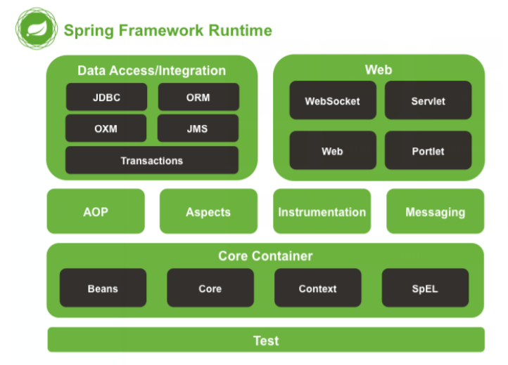
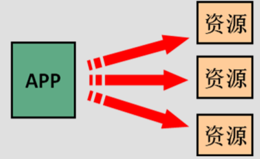
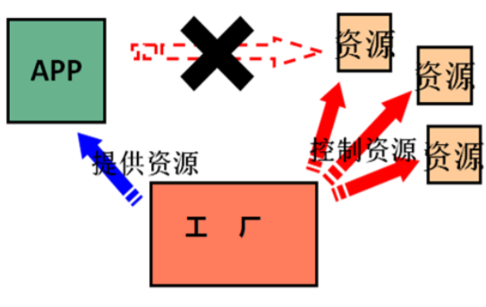
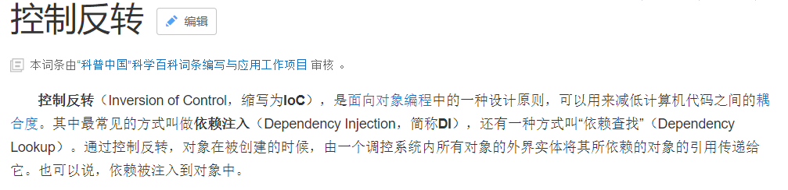
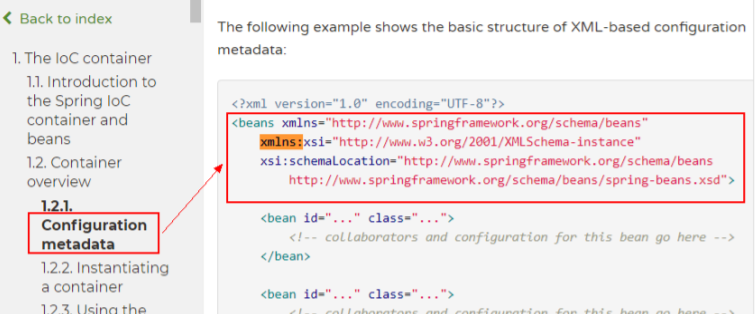
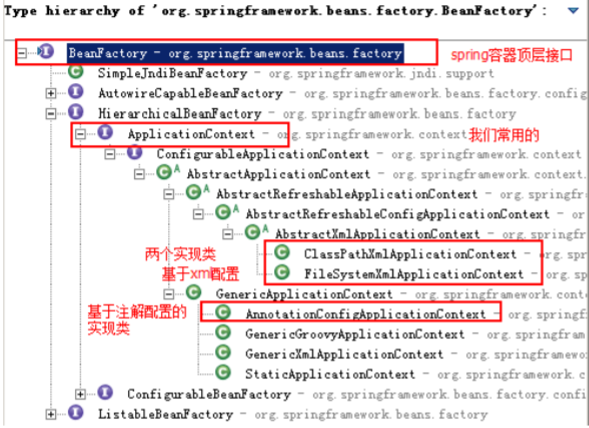
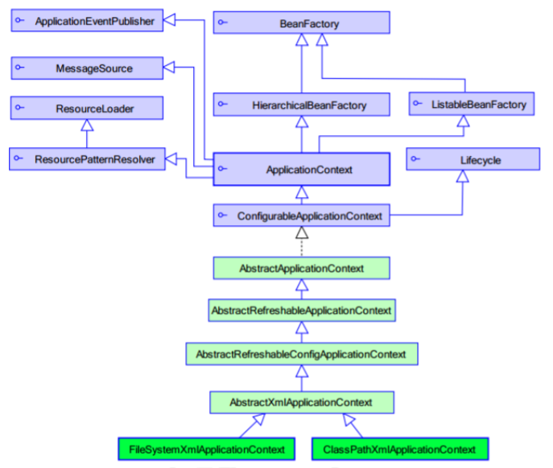

# 二、Spring框架(part I)

- 2.1 [概述](#2.1-概述)
- 2.2 [IoC的概念和作用](#2.2-IoC的概念和作用)
- 2.3 [使用spring的IOC解决耦合](#2.3-使用spring的IOC解决耦合)
- 2.4 [案例：使用spring的IoC的实现账户的CRUD](#2.4-案例：使用spring的IoC的实现账户的CRUD)
- 2.5 [基于注解的IOC配置](#2.5-基于注解的IOC配置)
- 2.6 [Spring整合Junit](#2.6-Spring整合Junit)

## 2.1 概述

Spring 是分层的 Java SE/EE 应用 full-stack 轻量级开源框架，以 **IoC（Inverse Of Control：反转控制）和 AOP（Aspect Oriented Programming：面向切面编程）为内核**，提供了展现层 Spring MVC 和持久层 Spring JDBC 以及业务层事务管理等众多的企业级应用技术，还能整合开源世界众多著名的第三方框架和类库，逐渐成为使用最多的 Java EE 企业应用开源框架。

#### spring的发展历程

- 1997 年 IBM 提出了 EJB 的思想
- 1998 年，SUN 制定开发标准规范 EJB1.0
- 1999 年，EJB1.1 发布
- 2001 年，EJB2.0 发布
- 2003 年，EJB2.1 发布
- 2006 年，EJB3.0 发布

Rod Johnson（spring 之父）

- Expert One-to-One J2EE Design and Development(2002)

  阐述了 J2EE 使用 EJB 开发设计的优点及解决方案

- Expert One-to-One J2EE Development without EJB(2004)

  阐述了 J2EE 开发不使用 EJB 的解决方式（Spring 雏形）

2017 年 9 月份发布了 spring 的最新版本 spring 5.0 通用版（GA），目前迭代更新到了5.3。

### 2.1.1 spring的优势

方便解耦，简化开发

通过 Spring 提供的 IoC 容器，可以将对象间的依赖关系交由 Spring 进行控制，避免硬编码所造成的过度程序耦合。用户也不必再为单例模式类、属性文件解析等这些很底层的需求编写代码，可以更专注于上层的应用。

AOP 编程的支持

通过 Spring 的 AOP 功能，方便进行面向切面的编程，许多不容易用传统 OOP 实现的功能可以通过 AOP 轻松应付。

声明式事务的支持

可以将我们从单调烦闷的事务管理代码中解脱出来，通过声明式方式灵活的进行事务的管理，提高开发效率和质量。

方便程序的测试

可以用非容器依赖的编程方式进行几乎所有的测试工作，测试不再是昂贵的操作，而是随手可做的事情。

方便集成各种优秀框架

Spring 可以降低各种框架的使用难度，提供了对各种优秀框架（Struts、Hibernate、Hessian、Quartz等）的直接支持。

降低 JavaEE API 的使用难度 Spring 对 JavaEE API（如 JDBC、JavaMail、远程调用等）进行了薄薄的封装层，使这些 API 的使用难度大为降低。

Java 源码是经典学习范例

Spring 的源代码设计精妙、结构清晰、匠心独用，处处体现着大师对 Java 设计模式灵活运用以及对 Java 技术的高深造诣。它的源代码无意是 Java 技术的最佳实践的范例。

### 2.1.2 spring的体系结构



## 2.2 IoC的概念和作用

### 2.2.1 程序的耦合和解耦

耦合性(Coupling)，也叫耦合度，是对模块间关联程度的度量。耦合的强弱取决于模块间接口的复杂性、调用模块的方式以及通过界面传送数据的多少。模块间的耦合度是指模块之间的依赖关系，包括控制关系、调用关系、数据传递关系。模块间联系越多，其耦合性越强，同时表明其独立性越差(降低耦合性，可以提高其独立性)。耦合性存在于各个领域，而非软件设计中独有的，但是我们只讨论软件工程中的耦合。

在软件工程中，耦合指的就是就是对象之间的依赖性。对象之间的耦合越高，维护成本越高。因此对象的设计应使类和构件之间的耦合最小。软件设计中通常用耦合度和内聚度作为衡量模块独立程度的标准。**划分模块的一个准则就是高内聚低耦合。**

它有如下分类：

1. 内容耦合。当一个模块直接修改或操作另一个模块的数据时，或一个模块不通过正常入口而转入另一个模块时，这样的耦合被称为内容耦合。内容耦合是最高程度的耦合，应该避免使用之。
2. 公共耦合。两个或两个以上的模块共同引用一个全局数据项，这种耦合被称为公共耦合。在具有大量公共耦合的结构中，确定究竟是哪个模块给全局变量赋了一个特定的值是十分困难的。
3. 外部耦合。一组模块都访问同一全局简单变量而不是同一全局数据结构，而且不是通过参数表传递该全局变量的信息，则称之为外部耦合。
4. 控制耦合。一个模块通过接口向另一个模块传递一个控制信号，接受信号的模块根据信号值而进行适当的动作，这种耦合被称为控制耦合。
5. 标记耦合。若一个模块A通过接口向两个模块B和C传递一个公共参数，那么称模块B和C之间存在一个标记耦合。
6. 数据耦合。模块之间通过参数来传递数据，那么被称为数据耦合。数据耦合是最低的一种耦合形式，系统中一般都存在这种类型的耦合，因为为了完成一些有意义的功能，往往需要将某些模块的输出数据作为另一些模块的输入数据。
7. 非直接耦合。两个模块之间没有直接关系，它们之间的联系完全是通过主模块的控制和调用来实现的。

总结：

耦合是影响软件复杂程度和设计质量的一个重要因素，在设计上我们应采用以下原则：如果模块间必须存在耦合，就尽量使用数据耦合，少用控制耦合，限制公共耦合的范围，尽量避免使用内容耦合。

**内聚与耦合**

内聚标志一个模块内各个元素彼此结合的紧密程度，它是信息隐蔽和局部化概念的自然扩展。内聚是从功能角度来度量模块内的联系，一个好的内聚模块应当恰好做一件事。它描述的是模块内的功能联系。耦合是软件结构中各模块之间相互连接的一种度量，耦合强弱取决于模块间接口的复杂程度、进入或访问一个模块的点以及通过接口的数据。程序讲究的是低耦合，高内聚。就是同一个模块内的各个元素之间要高度紧密，但是各个模块之间的相互依存度却要不那么紧密。

内聚和耦合是密切相关的，同其他模块存在高耦合的模块意味着低内聚，而高内聚的模块意味着该模块同其他模块之间是低耦合。在进行软件设计时，应力争做到高内聚，低耦合。

我们在开发中，有些依赖关系是必须的，有些依赖关系可以通过优化代码来解除的。

请看下面的示例代码：

```java
/**
* 账户的业务层实现类
*/
public class AccountServiceImpl implements IAccountService {
    private IAccountDao accountDao = new AccountDaoImpl();
}
```

上面的代码表示：

业务层调用持久层，并且此时业务层在依赖持久层的接口和实现类。如果此时没有持久层实现类，编译将不能通过。这种编译期依赖关系，应该在我们开发中杜绝。我们需要优化代码解决。

**再比如**：

早期我们的 JDBC 操作，注册驱动时，我们为什么不使用 DriverManager 的 register 方法，而是采用 Class.forName 的方式？

```java
public class JdbcDemo1 {
/**
* @param args
* @throws Exception
*/
    public static void main(String[] args) throws Exception {
        //1.注册驱动
        //DriverManager.registerDriver(new com.mysql.jdbc.Driver());
        Class.forName("com.mysql.jdbc.Driver");
        //2.获取连接
        //3.获取预处理 sql 语句对象
        //4.获取结果集
        //5.遍历结果集
    }
}
```

**原因就是**：

我们的类依赖了数据库的具体驱动类（MySQL），如果这时候更换了数据库品牌（比如 Oracle），需要修改源码来重新数据库驱动。这显然不是我们想要的。

### 2.2.2 解决程序耦合的思路

当是我们讲解 jdbc 时，是通过反射来注册驱动的，代码如下：

```java
Class.forName("com.mysql.jdbc.Driver");//此处只是一个字符串
```

此时的好处是，我们的类中不再依赖具体的驱动类，此时就算删除 mysql 的驱动 jar 包，依然可以编译（运行就不要想了，没有驱动不可能运行成功的）。

同时，也产生了一个新的问题，mysql 驱动的全限定类名字符串是在 java 类中写死的，一旦要改还是要修改源码。

解决这个问题也很简单，使用配置文件配置。

#### 工厂模式解耦

在实际开发中我们可以把三层的对象都使用配置文件配置起来，当启动服务器应用加载的时候，让一个类中的方法通过读取配置文件，把这些对象创建出来并存起来。在接下来的使用的时候，直接拿过来用就好了。

那么，这个读取配置文件，创建和获取三层对象的类就是工厂。

### 2.2.3 控制反转-Inversion Of Control

上一小节解耦的思路有 2 个问题：

1. 存哪去？

   分析：由于我们是很多对象，肯定要找个集合来存。这时候有 Map 和 List 供选择。

   ​		到底选 Map 还是 List 就看我们有没有查找需求。有查找需求，选 Map。

   所以我们的答案就是

   ​		在应用加载时，创建一个 Map，用于存放三层对象。

   ​		我们把这个 map 称之为**容器**。

2. 还是没解释什么是工厂？

   工厂就是负责给我们从容器中获取指定对象的类。这时候我们获取对象的方式发生了改变。

   原来：

   ​		我们在获取对象时，都是采用 new 的方式。**是主动的。**

   

   现在：

   ​		我们获取对象时，同时跟工厂要，有工厂为我们查找或者创建对象。**是被动的。**

   

   这种被动接收的方式获取对象的思想就是控制反转，它是 spring 框架的核心之一。

   

**明确 ioc 的作用：**

削减计算机程序的耦合(解除我们代码中的依赖关系)。

## 2.3 使用spring的IOC解决耦合

### 2.3.1 前期准备

本章我们使用的案例是，账户的业务层和持久层的依赖关系解决。在开始 spring 的配置之前，我们要先准备一下环境。由于我们是使用 spring 解决依赖关系，并不是真正的要做增删改查操作，所以此时我们没必要写实体类。并且我们在此处使用的是 java 工程，不是 java web 工程。

准备 spring 的开发包

官网：http://spring.io/

下载地址：http://repo.springsource.org/libs-release-local/org/springframework/spring 

解压:(Spring 目录结构:)

- docs       ：API 和开发规范
- libs         ：jar包和源码
- schema ：约束

特别说明：spring5 版本是用 jdk8 编写的，所以要求我们的 jdk 版本是 8 及以上。同时 tomcat 的版本要求 8.5 及以上。

#### 创建业务层接口和实现类

```java
/**
 * 账户的业务层接口
 */
public interface IAccountService {
    /**
     * 保存账户（此处只是模拟，并不是真的要保存）
     */
    void saveAccount();
}
/**
 * 账户的业务层实现类
 */
public class AccountServiceImpl implements IAccountService {
    private IAccountDao accountDao = new AccountDaoImpl();//此处的依赖关系有待解决
    @Override
    public void saveAccount() {
        accountDao.saveAccount();
    }
}
```

####  创建持久层接口和实现类

```java
/**
 * 账户的持久层接口
 */
public interface IAccountDao {
    /**
     * 保存账户
     */
    void saveAccount();
}
/**
 * 账户的持久层实现类
 */
public class AccountDaoImpl implements IAccountDao {
    @Override
    public void saveAccount() {
        System.out.println("保存了账户");
    }
}
```

### 2.3.2 基于XML的配置

#### 第一步：拷贝必备的 jar 包到工程的 lib 目录中

#### 第二步：在类的根路径下创建一个任意名称的 xml 文件（不能是中 文）

给配置文件导入约束：

`/spring-framework-5.0.2.RELEASE/docs/spring-framework-reference/html5/core.html`



```xml
<?xml version="1.0" encoding="UTF-8"?>
<beans xmlns="http://www.springframework.org/schema/beans"
       xmlns:xsi="http://www.w3.org/2001/XMLSchema-instance"
       xsi:schemaLocation="http://www.springframework.org/schema/beans
http://www.springframework.org/schema/beans/spring-beans.xsd">
</beans>
```

#### 第三步：让 spring 管理资源，在配置文件中配置 service 和 dao

```xml
<!-- bean 标签：用于配置让 spring 创建对象，并且存入 ioc 容器之中
 id 属性：对象的唯一标识。
 class 属性：指定要创建对象的全限定类名
-->
<!-- 配置 service -->
<bean id="accountService" class="myspringlearning.service.impl.AccountServiceImpl">
</bean>
        <!-- 配置 dao -->
<bean id="accountDao" class="myspringlearning.dao.impl.AccountDaoImpl"></bean>
```

测试配置是否成功

```java
/**
 * 模拟一个表现层
 */
public class Client {
    /**
     * 使用 main 方法获取容器测试执行
     */
    public static void main(String[] args) {
//1.使用 ApplicationContext 接口，就是在获取 spring 容器
        ApplicationContext ac = new ClassPathXmlApplicationContext("bean.xml");
//2.根据 bean 的 id 获取对象
        IAccountService aService = (IAccountService) ac.getBean("accountService");
        System.out.println(aService);
        IAccountDao aDao = (IAccountDao) ac.getBean("accountDao");
        System.out.println(aDao);
    }
}
```

### 2.3.3 Spring基于XML的IOC细节

spring 中工厂的类结构图





**BeanFactory 和 ApplicationContext 的区别**

BeanFactory 才是 Spring 容器中的顶层接口。

ApplicationContext 是它的子接口。

BeanFactory 和 ApplicationContext 的区别：

- 创建对象的时间点不一样。
  - ApplicationContext：只要一读取配置文件，默认情况下就会创建对象。
  - BeanFactory：什么使用什么时候创建对象。

**ApplicationContext 接口的实现类**

ClassPathXmlApplicationContext：

它是从类的根路径下加载配置文件 推荐使用这种

FileSystemXmlApplicationContext：

它是从磁盘路径上加载配置文件，配置文件可以在磁盘的任意位置。

AnnotationConfigApplicationContext:

当我们使用注解配置容器对象时，需要使用此类来创建 spring 容器。它用来读取注解。

#### IOC 中 bean 标签和管理对象细节

1. bean标签

   作用：

   用于配置对象让 spring 来创建的。

   默认情况下它调用的是类中的无参构造函数。如果没有无参构造函数则不能创建成功。

   属性：

   - id：给对象在容器中提供一个唯一标识。用于获取对象。

   - class：指定类的全限定类名。用于反射创建对象。默认情况下调用无参构造函数。

   - scope：指定对象的作用范围。
     - **singleton         ：默认值，单例的.**
     - **prototype        ：多例的.**
     - request             ：WEB 项目中,Spring 创建一个 Bean 的对象,将对象存入到 request 域中.
     - session             ：WEB 项目中,Spring 创建一个 Bean 的对象,将对象存入到 session 域中.
     - global session ：WEB 项目中,应用在 Portlet 环境.如果没有 Portlet 环境那么 globalSession 相当于 session.

   - init-method：指定类中的初始化方法名称。

   - destroy-method：指定类中销毁方法名称。

2. bean的作用范围和生命周期

   **单例对象：scope="singleton"**

   一个应用只有一个对象的实例。它的作用范围就是整个引用。

   生命周期：

   - 对象出生：当应用加载，创建容器时，对象就被创建了。

   - 对象活着：只要容器在，对象一直活着。

   - 对象死亡：当应用卸载，销毁容器时，对象就被销毁了。

   **多例对象：scope="prototype"**

   每次访问对象时，都会重新创建对象实例。

   生命周期：

   - 对象出生：当使用对象时，创建新的对象实例。

   - 对象活着：只要对象在使用中，就一直活着。

   - 对象死亡：当对象长时间不用时，被 java 的垃圾回收器回收了。

3. 实例化Bean的三种方式

   第一种方式：使用默认无参构造函数

   ```xml
   <!--在默认情况下：
   它会根据默认无参构造函数来创建类对象。如果 bean 中没有默认无参构造函数，将会创建失败。
   -->
   ean id="accountService" class="myspringlearning.service.impl.AccountServiceImpl"/>
   ```

   第二种方式：spring 管理静态工厂-使用静态工厂的方法创建对象

   ```java
   /**
   * 模拟一个静态工厂，创建业务层实现类
   */
   public class StaticFactory {
       public static IAccountService createAccountService(){
           return new AccountServiceImpl();
       }
   }
   ```

   ```xml
   <!-- 此种方式是:
   使用 StaticFactory 类中的静态方法 createAccountService 创建对象，并存入 spring 容器
   id 属性：指定 bean 的 id，用于从容器中获取
   class 属性：指定静态工厂的全限定类名
   factory-method 属性：指定生产对象的静态方法
   -->
   <bean id="accountService"
    class="myspringlearning.factory.StaticFactory"
    factory-method="createAccountService"></bean>
   ```

   第三种方式：spring 管理实例工厂-使用实例工厂的方法创建对象

   ```java
   /**
   * 模拟一个实例工厂，创建业务层实现类
   * 此工厂创建对象，必须现有工厂实例对象，再调用方法
   */
   public class InstanceFactory {
       public IAccountService createAccountService(){
           return new AccountServiceImpl();
       }
   }
   ```

   ```xml
   <!-- 此种方式是：
   先把工厂的创建交给 spring 来管理。
   然后在使用工厂的 bean 来调用里面的方法
   factory-bean 属性：用于指定实例工厂 bean 的 id。
   factory-method 属性：用于指定实例工厂中创建对象的方法。
   -->
   <bean id="instancFactory" class="myspringlearning.factory.InstanceFactory"></bean>
   <bean id="accountService"
    factory-bean="instancFactory"
    factory-method="createAccountService"></bean>
   ```

#### spring的依赖注入

1. 依赖注入的概念

   依赖注入：**Dependency Injection**。它是 spring 框架核心 ioc 的具体实现。

   我们的程序在编写时，通过控制反转，把对象的创建交给了 spring，但是代码中不可能出现没有依赖的情况。 ioc 解耦只是降低他们的依赖关系，但不会消除。例如：我们的业务层仍会调用持久层的方法。

   那这种业务层和持久层的依赖关系，在使用 spring 之后，就让 spring 来维护了。

   简单的说，就是坐等框架把持久层对象传入业务层，而不用我们自己去获取。

2. 构造函数注入

   顾名思义，就是使用类中的构造函数，给成员变量赋值。注意，赋值的操作不是我们自己做的，而是通过配置的方式，让 spring 框架来为我们注入。具体代码如下：

   ```java
   public class AccountServiceImpl implements IAccountService {
       private String name;
       private Integer age;
       private Date birthday;
       public AccountServiceImpl(String name, Integer age, Date birthday) {
           this.name = name;
           this.age = age;
           this.birthday = birthday;
   }
       @Override
       public void saveAccount() {
           System.out.println(name+","+age+","+birthday);
       }
   }
   ```

   ```xml
   <!-- 使用构造函数的方式，给 service 中的属性传值
       要求：
           类中需要提供一个对应参数列表的构造函数。
       涉及的标签：
           constructor-arg
               属性：
                   index:指定参数在构造函数参数列表的索引位置
                   type:指定参数在构造函数中的数据类型
                   name:指定参数在构造函数中的名称 用这个找给谁赋值
                   =======上面三个都是找给谁赋值，下面两个指的是赋什么值的==============
                   value:它能赋的值是基本数据类型和 String 类型
                   ref:它能赋的值是其他 bean 类型，也就是说，必须得是在配置文件中配置过的 bean
   -->
   <bean id="accountService" class="myspringlearning.service.impl.AccountServiceImpl">
       <constructor-arg name="name" value="张三"></constructor-arg>
       <constructor-arg name="age" value="18"></constructor-arg>
       <constructor-arg name="birthday" ref="now"></constructor-arg>
   </bean>
   
   <bean id="now" class="java.util.Date"></bean>
   ```

3. set方法注入

   顾名思义，就是在类中提供需要注入成员的 set 方法。具体代码如下：

   ```java
   public class AccountServiceImpl implements IAccountService {
       private String name;
       private Integer age;
       private Date birthday;
       public void setName(String name) {
           this.name = name;
       }
       public void setAge(Integer age) {
           this.age = age;
       }
       public void setBirthday(Date birthday) {
           this.birthday = birthday;
       }
       @Override
       public void saveAccount() {
           System.out.println(name+","+age+","+birthday);
       }
   }
   ```

   ```xml
   <!-- 通过配置文件给 bean 中的属性传值：使用 set 方法的方式
       涉及的标签：
           property
           属性：
               name：找的是类中 set 方法后面的部分
               ref：给属性赋值是其他 bean 类型的
               value：给属性赋值是基本数据类型和 string 类型的
       实际开发中，此种方式用的较多。
   -->
   <bean id="accountService" class="myspringlearning.service.impl.AccountServiceImpl">
       <property name="name" value="test"></property>
       <property name="age" value="21"></property>
       <property name="birthday" ref="now"></property>
   </bean>
   <bean id="now" class="java.util.Date"></bean>
   ```

4. 使用p名称空间注入数据（本质还是调用set方法）

   此种方式是通过在 xml 中导入 p 名称空间，使用 p:propertyName 来注入数据，它的本质仍然是调用类中的 set 方法实现注入功能。

   ```java
   /**
    * 使用 p 名称空间注入，本质还是调用类中的 set 方法
    */
   public class AccountServiceImpl4 implements IAccountService {
       private String name;
       private Integer age;
       private Date birthday;
       public void setName(String name) {
           this.name = name;
       }
       public void setAge(Integer age) {
           this.age = age;
       }
       public void setBirthday(Date birthday) {
           this.birthday = birthday;
       }
       @Override
       public void saveAccount() {
           System.out.println(name+","+age+","+birthday);
       }
   }
   ```

   ```xml
   <beans xmlns="http://www.springframework.org/schema/beans"
          xmlns:p="http://www.springframework.org/schema/p"
          xmlns:xsi="http://www.w3.org/2001/XMLSchema-instance"
          xsi:schemaLocation=" http://www.springframework.org/schema/beans
   http://www.springframework.org/schema/beans/spring-beans.xsd">
   
       <bean id="accountService"
             class="myspringlearning.service.impl.AccountServiceImpl4"
             p:name="test" p:age="21" p:birthday-ref="now"/>
   </beans>
   ```

5. 注入集合属性

   顾名思义，就是给类中的集合成员传值，它用的也是set方法注入的方式，只不过变量的数据类型都是集合。我们这里介绍注入数组，List,Set,Map,Properties。具体代码如下：

   ```java
   public class AccountServiceImpl implements IAccountService {
       private String[] myStrs;
       private List<String> myList;
       private Set<String> mySet;
       private Map<String,String> myMap;
       private Properties myProps;
       public void setMyStrs(String[] myStrs) {
           this.myStrs = myStrs;
       }
       public void setMyList(List<String> myList) {
           this.myList = myList;
       }
       public void setMySet(Set<String> mySet) {
           this.mySet = mySet;
       }
       public void setMyMap(Map<String, String> myMap) {
           this.myMap = myMap;
       }
       public void setMyProps(Properties myProps) {
           this.myProps = myProps;
       }
       @Override
       public void saveAccount() {
           System.out.println(Arrays.toString(myStrs));
           System.out.println(myList);
           System.out.println(mySet);
           System.out.println(myMap);
           System.out.println(myProps);
       }
   }
   ```

   ```xml
   <!-- 注入集合数据
       List 结构的：
           array,list,set
       Map 结构的:
           map,entry,props,prop
   -->
   <bean id="accountService" class="myspringlearning.service.impl.AccountServiceImpl">
       <!-- 在注入集合数据时，只要结构相同，标签可以互换 -->
       <!-- 给数组注入数据 -->
       <property name="myStrs">
           <set>
               <value>AAA</value>
               <value>BBB</value>
               <value>CCC</value>
           </set>
       </property>
       <!-- 注入 list 集合数据 -->
       <property name="myList">
           <array>
               <value>AAA</value>
               <value>BBB</value>
               <value>CCC</value>
           </array>
       </property>
       <!-- 注入 set 集合数据 -->
       <property name="mySet">
           <list>
               <value>AAA</value>
               <value>BBB</value>
               <value>CCC</value>
           </list>
       </property>
       <!-- 注入 Map 数据 -->
       <property name="myMap">
           <props>
               <prop key="testA">aaa</prop>
               <prop key="testB">bbb</prop>
           </props>
       </property>
       <!-- 注入 properties 数据 -->
       <property name="myProps">
           <map>
               <entry key="testA" value="aaa"></entry>
               <entry key="testB">
                   <value>bbb</value>
               </entry>
           </map>
       </property>
   </bean>
   ```

## 2.4 案例：使用spring的IoC的实现账户的CRUD

需求：实现账户的 CRUD 操作

技术要求：

使用 spring 的 IoC 实现对象的管理

使用 DBAssit 作为持久层解决方案

使用 c3p0 数据源

### 2.4.1 环境搭建

拷贝jar包

#### 创建数据库和编写实体类

```
create table account(
    id int primary key auto_increment,
    name varchar(40),
    money float
)character set utf8 collate utf8_general_ci;

insert into account(name,money) values('aaa',1000);
insert into account(name,money) values('bbb',1000);
insert into account(name,money) values('ccc',1000);

```

```java
/**
 * 账户的实体类
 */
public class Account implements Serializable {
    private Integer id;
    private String name;
    private Float money;
    public Integer getId() {
        return id;
    }
    public void setId(Integer id) {
        this.id = id;
    }
    public String getName() {
        return name;
    }
    public void setName(String name) {
        this.name = name;
    }
    public Float getMoney() {
        return money;
    }
    public void setMoney(Float money) {
        this.money = money;
    }
}
```

#### 编写持久层代码

```java
/**
 * 账户的持久层接口
 */
public interface IAccountDao {
    /**
     * 保存
     * @param account
     */
    void save(Account account);
    /**
     * 更新
     * @param account
     */
    void update(Account account);
    /**
     * 删除
     * @param accountId
     */
    void delete(Integer accountId);
    /**
     * 根据 id 查询
     * @param accountId
     * @return
     */
    Account findById(Integer accountId);
    /**
     * 查询所有
     * @return
     */
    List<Account> findAll();
}

```

```java
/**
 * 账户的持久层实现类
 */
public class AccountDaoImpl implements IAccountDao {
    private DBAssit dbAssit;
    public void setDbAssit(DBAssit dbAssit) {
        this.dbAssit = dbAssit;
    }
    @Override
    public void save(Account account) {
        dbAssit.update("insert into
                account(name,money)values(?,?)",account.getName(),account.getMoney());
    }
    @Override
    public void update(Account account) {
        dbAssit.update("update account set name=?,money=? where
                id=?",account.getName(),account.getMoney(),account.getId());
    }
    @Override
    public void delete(Integer accountId) {
        dbAssit.update("delete from account where id=?",accountId);
    }
    @Override
    public Account findById(Integer accountId) {
        return dbAssit.query("select * from account where id=?",new
                BeanHandler<Account>(Account.class),accountId);
    }
    @Override
    public List<Account> findAll() {
        return dbAssit.query("select * from account where id=?",new
                BeanListHandler<Account>(Account.class));
    }
}
```

#### 编写业务层代码

```java
/**
 * 账户的业务层接口
 */
public interface IAccountService {
    /**
     * 保存账户
     * @param account
     */
    void saveAccount(Account account);
    /**
     * 更新账户
     * @param account
     */
    void updateAccount(Account account);
    /**
     * 删除账户
     * @param account
     */
    void deleteAccount(Integer accountId);
    /**
     * 根据 id 查询账户
     * @param accountId
     * @return
     */
    Account findAccountById(Integer accountId);
    /**
     * 查询所有账户
     * @return
     */
    List<Account> findAllAccount();
}
```

```java
/**
 * 账户的业务层实现类
 */
public class AccountServiceImpl implements IAccountService {
    private IAccountDao accountDao;
    public void setAccountDao(IAccountDao accountDao) {
        this.accountDao = accountDao;
    }
    @Override
    public void saveAccount(Account account) {
        accountDao.save(account);
    }
    @Override
    public void updateAccount(Account account) {
        accountDao.update(account);
    }
    @Override
    public void deleteAccount(Integer accountId) {
        accountDao.delete(accountId);
    }
    @Override
    public Account findAccountById(Integer accountId) {
        return accountDao.findById(accountId);
    }
    @Override
    public List<Account> findAllAccount() {
        return accountDao.findAll();
    }
}
```

```xml
<?xml version="1.0" encoding="UTF-8"?>
<beans xmlns="http://www.springframework.org/schema/beans"
       xmlns:xsi="http://www.w3.org/2001/XMLSchema-instance"
       xsi:schemaLocation="http://www.springframework.org/schema/beans
 http://www.springframework.org/schema/beans/spring-beans.xsd">
</beans>
```

### 2.4.2 配置步骤

```xml
<?xml version="1.0" encoding="UTF-8"?>
<beans xmlns="http://www.springframework.org/schema/beans"
       xmlns:xsi="http://www.w3.org/2001/XMLSchema-instance"
       xsi:schemaLocation="http://www.springframework.org/schema/beans
 http://www.springframework.org/schema/beans/spring-beans.xsd">

    <!-- 配置 service -->
    <bean id="accountService"
          class="myspringlearning.service.impl.AccountServiceImpl">
        <property name="accountDao" ref="accountDao"></property>
    </bean>
    <!-- 配置 dao -->
    <bean id="accountDao" class="myspringlearning.dao.impl.AccountDaoImpl">
        <property name="dbAssit" ref="dbAssit"></property>
    </bean>
    <!-- 配置 dbAssit 此处我们只注入了数据源，表明每条语句独立事务-->
    <bean id="dbAssit" class="myspringlearning.dbassit.DBAssit">
        <property name="dataSource" ref="dataSource"></property>
    </bean>
    <!-- 配置数据源 -->
    <bean id="dataSource" class="com.mchange.v2.c3p0.ComboPooledDataSource">
        <property name="driverClass" value="com.mysql.jdbc.Driver"></property>
        <property name="jdbcUrl" value="jdbc:mysql:///spring_day02"></property>
        <property name="user" value="root"></property>
        <property name="password" value="1234"></property>
    </bean>
</beans>
```

### 2.4.3 测试案例

#### 测试类代码

```java
/**
 * 测试类
 */
public class AccountServiceTest {
    /**
     * 测试保存
     */
    @Test
    public void testSaveAccount() {
        Account account = new Account();
        account.setName("沙雕程序员");
        account.setMoney(100000f);
        ApplicationContext ac = new ClassPathXmlApplicationContext("bean.xml");
        IAccountService as = ac.getBean("accountService",IAccountService.class);
        as.saveAccount(account);
    }
    /**
     * 测试查询一个
     */
    @Test
    public void testFindAccountById() {
        ApplicationContext ac = new ClassPathXmlApplicationContext("bean.xml");
        IAccountService as = ac.getBean("accountService",IAccountService.class);
        Account account = as.findAccountById(1);
        System.out.println(account);
    }
    /**
     * 测试更新
     */
    @Test
    public void testUpdateAccount() {
        ApplicationContext ac = new ClassPathXmlApplicationContext("bean.xml");
        IAccountService as = ac.getBean("accountService",IAccountService.class);
        Account account = as.findAccountById(1);
        account.setMoney(20301050f);
        as.updateAccount(account);
    }
    /**
     * 测试删除
     */
    @Test
    public void testDeleteAccount() {
        ApplicationContext ac = new ClassPathXmlApplicationContext("bean.xml");
        IAccountService as = ac.getBean("accountService",IAccountService.class);
        as.deleteAccount(1);
    }
    /**
     * 测试查询所有
     */
    @Test
    public void testFindAllAccount() {
        ApplicationContext ac = new ClassPathXmlApplicationContext("bean.xml");
        IAccountService as = ac.getBean("accountService",IAccountService.class);
        List<Account> list = as.findAllAccount();
        for(Account account : list) {
            System.out.println(account);
        }
    }
}
```

#### 分析测试中的问题

通过上面的测试类，我们可以看出，每个测试方法都重新获取了一次 spring 的核心容器，造成了不必要的重复代码，增加了我们开发的工作量。这种情况，在开发中应该避免发生。

我们可以把容器的获取定义到类中去。例如：

```java
/**
* 测试类
*/
public class AccountServiceTest {
    private ApplicationContext ac = new ClassPathXmlApplicationContext("bean.xml");
    private IAccountService as = ac.getBean("accountService",IAccountService.class);
}
```

这种方式虽然能解决问题，但是任需要我们自己写代码来获取容器。

能不能测试时直接就编写测试方法，而不需要手动编码来获取容器呢？ 

## 2.5 基于注解的IOC配置

学习基于注解的 IoC 配置，大首先得有一个认知，即注解配置和 xml 配置要实现的功能都是一样的，都是要降低程序间的耦合。只是配置的形式不一样。

关于实际的开发中到底使用xml还是注解，每家公司有着不同的使用习惯。所以这两种配置方式我们都需要掌握。

我们在讲解注解配置时，采用上一章节的案例，把 spring 的 xml 配置内容改为使用注解逐步实现。

### 2.5.1 环境搭建

#### 第一步：准备jar包

#### 第二步：使用@Component 注解配置管理的资源

```java
/**
 * 账户的业务层实现类
 */
@Component("accountService")
public class AccountServiceImpl implements IAccountService {
    private IAccountDao accountDao;
    public void setAccountDao(IAccountDao accountDao) {
        this.accountDao = accountDao;
    }
}
```

```java
/**
* 账户的持久层实现类
*/
@Component("accountDao")
public class AccountDaoImpl implements IAccountDao {
    private DBAssit dbAssit;
}
```

**注意：当我们使用注解注入时，set 方法不用写**

#### 第三步：创建 spring 的 xml 配置文件并开启对注解的支持

注意：

基于注解整合时，导入约束时需要多导入一个 context 名称空间下的约束。

由于我们使用了注解配置，此时不能在继承 JdbcDaoSupport，需要自己配置一个 JdbcTemplate

```xml
<?xml version="1.0" encoding="UTF-8"?>
<beans xmlns="http://www.springframework.org/schema/beans"
       xmlns:context="http://www.springframework.org/schema/context"
       xmlns:xsi="http://www.w3.org/2001/XMLSchema-instance"
       xsi:schemaLocation="http://www.springframework.org/schema/beans
 http://www.springframework.org/schema/beans/spring-beans.xsd
 http://www.springframework.org/schema/context
 http://www.springframework.org/schema/context/spring-context.xsd">

    <!-- 告知 spring 创建容器时要扫描的包 -->
    <context:component-scan base-package="myspringlearning"></context:component-scan>
    <!-- 配置 dbAssit -->
    <bean id="dbAssit" class="myspringlearning.dbassit.DBAssit">
        <property name="dataSource" ref="dataSource"></property>
    </bean>
    <!-- 配置数据源 -->
    <bean id="dataSource" class="com.mchange.v2.c3p0.ComboPooledDataSource">
        <property name="driverClass" value="com.mysql.jdbc.Driver"></property>
        <property name="jdbcUrl" value="jdbc:mysql:///spring_day02"></property>
        <property name="user" value="root"></property>
        <property name="password" value="1234"></property>
    </bean>
</beans>
```

### 2.5.2 常用注解

#### 用于创建对象的

相当于：`<bean id="" class="">`

1. `@Component`

   作用：

   把资源让 spring 来管理。相当于在 xml 中配置一个 bean。

   属性：

   value：指定 bean 的 id。如果不指定 value 属性，默认 bean 的 id 是当前类的类名。首字母小写。

2. `@Controller @Service @Repository`

   他们三个注解都是针对一个的衍生注解，他们的作用及属性都是一模一样的。

   他们只不过是提供了更加明确的语义化。

   - @Controller：一般用于表现层的注解。

   - @Service：一般用于业务层的注解。

   - @Repository：一般用于持久层的注解。

   细节：如果注解中有且只有一个属性要赋值时，且名称是 value，value 在赋值是可以不写。

#### 用于注入数据的

相当于：`<property name="" ref="">`, `<property name="" value="">`

1. `@Autowired`

   作用：

   自动按照类型注入。当使用注解注入属性时，set 方法可以省略。它只能注入其他 bean 类型。当有多个类型匹配时，使用要注入的对象变量名称作为 bean 的 id，在 spring 容器查找，找到了也可以注入成功。找不到就报错。

2. `@Qualifier`

   作用：

   在自动按照类型注入的基础之上，再按照 Bean 的 id 注入。它在给字段注入时不能独立使用，必须和`@Autowire`一起使用；但是给方法参数注入时，可以独立使用。

   属性：

   value：指定 bean 的 id。

3. `@Resource`

   作用：

   直接按照 Bean 的 id 注入。它也只能注入其他 bean 类型。

   属性：

   name：指定 bean 的 id。

4. `@Value`

   作用：

   注入基本数据类型和 String 类型数据的

   属性：

   value：用于指定值

#### 用于改变作用范围的：

相当于：`<bean id="" class="" scope="">`

1. `@Scope`

   作用：

   指定 bean 的作用范围。

   属性：

   value：指定范围的值。

   取值：**singleton prototype** request session globalsession

#### 和生命周期相关的：(了解)

相当于：`<bean id="" class="" init-method="" destroy-method=""/>`

1. `@PostConstruct`

   作用：用于指定初始化方法。

2. `@PreDestroy`

   作用：用于指定销毁方法。

#### 关于 Spring 注解和 XML 的选择问题

注解的优势：

配置简单，维护方便（我们找到类，就相当于找到了对应的配置）。

XML 的优势： 修改时，不用改源码。不涉及重新编译和部署。

Spring 管理 Bean 方式的比较：

|                        | 基于XML配置                                    | 基于注解配置                                                 |
| ---------------------- | ---------------------------------------------- | ------------------------------------------------------------ |
| Bean定义               | `<bean id="" class=""/>`                       | @Component衍生类@Repository @Service @Controller             |
| Bean名称               | 指定id或name指定                               | @Component("person")                                         |
| Bean注入               | `<property>`或者通过p命名空间                  | @Autowired 按类型注入<br>@Qualifier 按名称注入               |
| 生命过程、Bean作用范围 | init-method<br>destroy-method<br>范围scope属性 | @PostConstruct 初始化<br>@PreDestroy 销毁<br>@Scope 设置作用范围 |
| 适用场景               | Bean来自第三方，适用其它                       | Bean的实现类有用户自己开发                                   |

基于注解的 spring IoC 配置中，bean 对象的特点和基于 XML 配置是一模一样的。

### 2.5.3 spring 的纯注解配置

写到此处，基于注解的 IoC 配置已经完成，但是又有一个问题：我们依然离不开 spring 的 xml 配置文件，那么能不能不写这个 bean.xml，所有配置都用注解来实现呢？

需要注意一下，我们选择哪种配置的原则是简化开发和配置方便，而非追求某种技术。

#### 待改造的问题

我们发现，之所以我们现在离不开 xml 配置文件，是因为我们有一句很关键的配置：

`<!-- 告知spring框架在，读取配置文件，创建容器时，扫描注解，依据注解创建对象，并存入容器中 -->`
`<context:component-scan base-package="myspringlearning"></context:component-scan>`

如果他要也能用注解配置，那么我们就离脱离 xml 文件又进了一步。另外，数据源和 JdbcTemplate 的配置也需要靠注解来实现。

```xml
<!-- 配置 dbAssit -->
<bean id="dbAssit" class="myspringlearning.dbassit.DBAssit">
    <property name="dataSource" ref="dataSource"></property>
</bean>
        <!-- 配置数据源 -->
<bean id="dataSource" class="com.mchange.v2.c3p0.ComboPooledDataSource">
    <property name="driverClass" value="com.mysql.jdbc.Driver"></property>
    <property name="jdbcUrl" value="jdbc:mysql:///spring_test02"></property>
    <property name="user" value="root"></property>
    <property name="password" value="1234"></property>
</bean>
```

#### 新注解说明

1. `@Configuration`

   作用：

   用于指定当前类是一个 spring 配置类，当创建容器时会从该类上加载注解。获取容器时需要使用AnnotationApplicationContext(有@Configuration 注解的类.class)。

   属性：

   value:用于指定配置类的字节码

   ```java
   /**
   * spring 的配置类，相当于 bean.xml 文件
   */
   @Configuration
   public class SpringConfiguration {
   }
   ```

2. `@ComponentScan`

   作用：

   用于指定 spring 在初始化容器时要扫描的包。作用和在 spring 的 xml 配置文件中的：`<context:component-scan base-package="myspringlearning"/>`是一样的。

   属性：

   basePackages：用于指定要扫描的包。和该注解中的 value 属性作用一样。

   ```java
   /**
   * spring 的配置类，相当于 bean.xml 文件
   */
   @Configuration
   @ComponentScan("myspringlearning")
   public class SpringConfiguration {
   }
   ```

3. `@Bean`

   作用：

   该注解只能写在方法上，表明使用此方法创建一个对象，并且放入 spring 容器。

   属性：

   name：给当前@Bean 注解方法创建的对象指定一个名称(即 bean 的 id）。

   ```java
   /**
    * 连接数据库的配置类
    */
   public class JdbcConfig {
       /**
        * 创建一个数据源，并存入 spring 容器中
        * @return
        */
       @Bean(name="dataSource")
       public DataSource createDataSource() {
           try {
               ComboPooledDataSource ds = new ComboPooledDataSource();
               ds.setUser("root");
               ds.setPassword("1234");
               ds.setDriverClass("com.mysql.jdbc.Driver");
               ds.setJdbcUrl("jdbc:mysql:///spring_test02");
               return ds;
           } catch (Exception e) {
               throw new RuntimeException(e);
           }
       }
       /**
        * 创建一个 DBAssit，并且也存入 spring 容器中
        * @param dataSource
        * @return
        */
       @Bean(name="dbAssit")
       public DBAssit createDBAssit(DataSource dataSource) {
           return new DBAssit(dataSource);
       }
   }
   ```

   > 注意:
   >
   > 我们已经把数据源和 DBAssit 从配置文件中移除了，此时可以删除 bean.xml 了。
   >
   > 但是由于没有了配置文件，创建数据源的配置又都写死在类中了。如何把它们配置出来呢？

4. `@PropertySource`

   作用：

   用于加载.properties 文件中的配置。例如我们配置数据源时，可以把连接数据库的信息写到 properties 配置文件中，就可以使用此注解指定 properties 配置文件的位置。

   属性：

   value[]：用于指定 properties 文件位置。如果是在类路径下，需要写上 classpath:

   ```java
   /**
    * 连接数据库的配置类
    */
   public class JdbcConfig {
       @Value("${jdbc.driver}")
       private String driver;
       @Value("${jdbc.url}")
       private String url;
       @Value("${jdbc.username}")
       private String username;
       @Value("${jdbc.password}")
       private String password;
       /**
        * 创建一个数据源，并存入 spring 容器中
        * @return
        */
       @Bean(name="dataSource")
       public DataSource createDataSource() {
           try {
               ComboPooledDataSource ds = new ComboPooledDataSource();
               ds.setDriverClass(driver);
               ds.setJdbcUrl(url);
               ds.setUser(username);
               ds.setPassword(password);
               return ds;
           } catch (Exception e) {
               throw new RuntimeException(e);
           }
       }
   }
   ```

5. `@Import`

   作用：

   用于导入其他配置类，在引入其他配置类时，可以不用再写@Configuration 注解。当然，写上也没问题。

   属性：

   value[]：用于指定其他配置类的字节码。

   ```java
   @Configuration
   @ComponentScan(basePackages = "myspringlearning.spring")
   @Import({ JdbcConfig.class})
   public class SpringConfiguration {
   }
   @Configuration
   @PropertySource("classpath:jdbc.properties")
   public class JdbcConfig{
   }
   ```

6.  通过注解获取容器

   `ApplicationContext ac = new AnnotationConfigApplicationContext(SpringConfiguration.class);`

> 注意：
>
> 配置类和配置文件可以写在类路径下的任意位置

## 2.6 Spring整合Junit

### 2.6.1测试类中的问题和解决思路

#### 问题

在测试类中，每个测试方法都有以下两行代码：

`ApplicationContext ac = new ClassPathXmlApplicationContext("bean.xml");`

`IAccountService as = ac.getBean("accountService",IAccountService.class);`

这两行代码的作用是获取容器，如果不写的话，直接会提示空指针异常。所以又不能轻易删掉。

#### 解决思路分析

针对上述问题，我们需要的是程序能自动帮我们创建容器。一旦程序能自动为我们创建 spring 容器，我们就无须手动创建了，问题也就解决了。

我们都知道，junit 单元测试的原理（在 web 阶段课程中讲过），但显然，junit 是无法实现的，因为它自己都无法知晓我们是否使用了 spring 框架，更不用说帮我们创建 spring 容器了。不过好在，junit 给我们暴露了一个注解，可以让我们替换掉它的运行器。

这时，我们需要依靠 spring 框架，因为它提供了一个运行器，可以读取配置文件（或注解）来创建容器。我们只需要告诉它配置文件在哪就行了。

### 2.6.2 配置步骤

#### 第一步：拷贝整合 junit 的必备 jar 包到 lib 目录

#### 第二步：使用@RunWith 注解替换原有运行器

```java
/**
* 测试类
*/
@RunWith(SpringJUnit4ClassRunner.class)
public class AccountServiceTest {
}
```

#### 第三步：使用@ContextConfiguration 指定 spring 配置文件的位置

```java
/**
* 测试类
*/
@RunWith(SpringJUnit4ClassRunner.class)
@ContextConfiguration(locations= {"classpath:bean.xml"})
public class AccountServiceTest {
}
```

@ContextConfiguration 注解：

- locations 属性：用于指定配置文件的位置。如果是类路径下，需要用 classpath:表明
- classes 属性：用于指定注解的类。当不使用 xml 配置时，需要用此属性指定注解类的位置。

#### 第四步：使用@Autowired 给测试类中的变量注入数据

```java
/**
* 测试类
*/
@RunWith(SpringJUnit4ClassRunner.class)
@ContextConfiguration(locations= {"classpath:bean.xml"})
public class AccountServiceTest {
    @Autowired
    private IAccountService as ;
}
```

### 2.6.3 为什么不把测试类配到 xml 中

在解释这个问题之前，又有一个问题，配到 XML 中能不能用呢？

答案是肯定的，没问题，可以使用。

那么为什么不采用配置到 xml 中的方式呢？

这个原因是这样的：

- 第一：当我们在 xml 中配置了一个 bean，spring 加载配置文件创建容器时，就会创建对象。

- 第二：测试类只是我们在测试功能时使用，而在项目中它并不参与程序逻辑，也不会解决需求上的问题，所以创建完了，并没有使用。那么存在容器中就会造成资源的浪费。

所以，基于以上两点，我们不应该把测试配置到 xml 文件中。