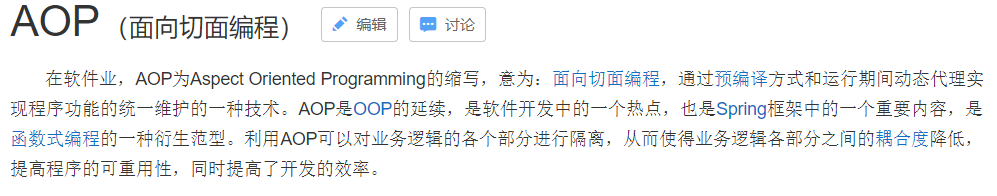

# 三、 Spring框架（part II）

- 3.1 [AOP的相关概念](#3.1-AOP的相关概念)
- 3.2 [Spring中的AOP](#3.2-Spring中的AOP)
- 3.3 [Spring中的JDBCTemplate](#3.3-Spring中的JDBCTemplate)
- 3.4 [Spring中的事务控制](#3.4-Spring中的事务控制)
- 3.5 [Spring5的新特性](#3.5-Spring5的新特性)

## 3.1 AOP的相关概念

AOP：全称是 Aspect Oriented Programming 即：面向切面编程。



简单的说它就是把我们程序重复的代码抽取出来，在需要执行的时候，使用动态代理的技术，在不修改源码的基础上，对我们的已有方法进行增强。

作用：

在程序运行期间，不修改源码对已有方法进行增强。

优势：

- 减少重复代码
- 提高开发效率
- 维护方便

### 3.1.1 AOP的具体应用

#### 案例中问题

这是第二章中做的增删改查例子。下面是客户的业务层实现类。我们能看出什么问题吗?

```java
客户的业务层实现类
/**
 * 账户的业务层实现类
 */
public class AccountServiceImpl implements IAccountService {
    private IAccountDao accountDao;
    public void setAccountDao(IAccountDao accountDao) {
        this.accountDao = accountDao;
    }
    @Override
    public void saveAccount(Account account) throws SQLException {
        accountDao.save(account);
    }
    @Override
    public void updateAccount(Account account) throws SQLException{
        accountDao.update(account);
    }
    @Override
    public void deleteAccount(Integer accountId) throws SQLException{
        accountDao.delete(accountId);
    }
    @Override
    public Account findAccountById(Integer accountId) throws SQLException {
        return accountDao.findById(accountId);
    }
    @Override
    public List<Account> findAllAccount() throws SQLException{
        return accountDao.findAll();
    }
}
```

问题就是：

事务被自动控制了。换言之，我们使用了 connection 对象的 setAutoCommit(true)

此方式控制事务，如果我们每次都执行一条 sql 语句，没有问题，但是如果业务方法一次要执行多条 sql 语句，这种方式就无法实现功能了。

请看下面的示例： 我们在业务层中多加入一个方法。

```java
//业务层接口
/**
 * 转账
 * @param sourceName
 * @param targetName
 * @param money
 */
void transfer(String sourceName,String targetName,Float money);

//业务层实现类：
@Override
public void transfer(String sourceName, String targetName, Float money) {
    //根据名称查询两个账户信息
    Account source = accountDao.findByName(sourceName);
    Account target = accountDao.findByName(targetName);
    //转出账户减钱，转入账户加钱
    source.setMoney(source.getMoney()-money);
    target.setMoney(target.getMoney()+money);
    //更新两个账户
    accountDao.update(source);
    int i=1/0; //模拟转账异常
    accountDao.update(target);
}
```

当我们执行时，由于执行有异常，转账失败。但是因为我们是每次执行持久层方法都是独立事务，导致无法实现事务控制（**不符合事务的一致性**）

#### 问题的解决

解决办法：

让业务层来控制事务的提交和回滚。（这个我们之前已经在 web 阶段讲过了）

改造后的业务层实现类： 注：此处没有使用 spring 的 IoC.

```java
/**
 * 账户的业务层实现类
 */
public class AccountServiceImpl implements IAccountService {
    private IAccountDao accountDao = new AccountDaoImpl();
    @Override
    public void saveAccount(Account account) {
        try {
            TransactionManager.beginTransaction();
            accountDao.save(account);
            TransactionManager.commit();
        } catch (Exception e) {
            TransactionManager.rollback();
            e.printStackTrace();
        }finally {
            TransactionManager.release();
        }
    }
    @Override
    public void updateAccount(Account account) {
        try {
            TransactionManager.beginTransaction();
            accountDao.update(account);
            TransactionManager.commit();
        } catch (Exception e) {
            TransactionManager.rollback();
            e.printStackTrace();
        }finally {
            TransactionManager.release();
        }
    }
    @Override
    public void deleteAccount(Integer accountId) {
        try {
            TransactionManager.beginTransaction();
            accountDao.delete(accountId);
            TransactionManager.commit();
        } catch (Exception e) {
            TransactionManager.rollback();
            e.printStackTrace();
        }finally {
            TransactionManager.release();
        }
    }
    @Override
    public Account findAccountById(Integer accountId) {
        Account account = null;
        try {
            TransactionManager.beginTransaction();
            account = accountDao.findById(accountId);
            TransactionManager.commit();
            return account;
        } catch (Exception e) {
            TransactionManager.rollback();
            e.printStackTrace();
        }finally {
            TransactionManager.release();
        }
        return null;
    }
    @Override
    public List<Account> findAllAccount() {
        List<Account> accounts = null;
        try {
            TransactionManager.beginTransaction();
            accounts = accountDao.findAll();
            TransactionManager.commit();
            return accounts;
        } catch (Exception e) {
            TransactionManager.rollback();
            e.printStackTrace();
        }finally {
            TransactionManager.release();
        }
        return null;
    }
    @Override
    public void transfer(String sourceName, String targetName, Float money) {
        try {
            TransactionManager.beginTransaction();
            Account source = accountDao.findByName(sourceName);
            Account target = accountDao.findByName(targetName);
            source.setMoney(source.getMoney()-money);
            target.setMoney(target.getMoney()+money);
            accountDao.update(source);
            int i=1/0;
            accountDao.update(target);
            TransactionManager.commit();
        } catch (Exception e) {
            TransactionManager.rollback();
            e.printStackTrace();
        }finally {
            TransactionManager.release();
        }
    }
}
```

TransactionManager 类的代码：

```java
/**
 * 事务控制类
 */
public class TransactionManager {
    //定义一个 DBAssit
    private static DBAssit dbAssit = new DBAssit(C3P0Utils.getDataSource(), true);

    //开启事务
    public static void beginTransaction() {
        try {
            dbAssit.getCurrentConnection().setAutoCommit(false);
        } catch (SQLException e) {
            e.printStackTrace();
        }
    }

    //提交事务
    public static void commit() {
        try {
            dbAssit.getCurrentConnection().commit();
        } catch (SQLException e) {
            e.printStackTrace();
        }
    }

    //回滚事务
    public static void rollback() {
        try {
            dbAssit.getCurrentConnection().rollback();
        } catch (SQLException e) {
            e.printStackTrace();
        }
    }

    //释放资源
    public static void release() {
        try {
            dbAssit.releaseConnection();
        } catch (Exception e) {
            e.printStackTrace();
        }
    }
}
```

#### 新的问题

上一小节的代码，通过对业务层改造，已经可以实现事务控制了，但是由于我们添加了事务控制，也产生了一个新的问题：

业务层方法变得臃肿了，里面充斥着很多重复代码。并且业务层方法和事务控制方法耦合了。

试想一下，如果我们此时提交，回滚，释放资源中任何一个方法名变更，都需要修改业务层的代码，况且这还只是一个业务层实现类，而实际的项目中这种业务层实现类可能有十几个甚至几十个。

思考：

这个问题能不能解决呢？

答案是肯定的，使用下一小节中提到的技术。

#### 动态代理回顾

- 特点

  - 字节码随用随创建，随用随加载。
  - 它与静态代理的区别也在于此。因为静态代理是字节码一上来就创建好，并完成加载。
  - 装饰者模式就是静态代理的一种体现。

- 动态代理常用的有两种方式

  - 基于接口的动态代理

    提供者：JDK 官方的 Proxy 类。

    要求：被代理类最少实现一个接口。

  - 基于子类的动态代理

    提供者：第三方的 CGLib，如果报 asmxxxx 异常，需要导入 asm.jar。

    要求：被代理类不能用 final 修饰的类（最终类）。

- 使用 JDK 官方的 Proxy 类创建代理对象

  此处我们使用的是一个演员的例子：

  在很久以前，演员和剧组都是直接见面联系的。没有中间人环节。

  而随着时间的推移，产生了一个新兴职业：经纪人（中间人），这个时候剧组再想找演员就需要通过经纪人来找了。下面我们就用代码演示出来。

  ```java
  /**
   * 一个经纪公司的要求:
   * 能做基本的表演和危险的表演
   */
  public interface IActor {
      /**
       * 基本演出
       * @param money
       */
      public void basicAct(float money);
      /**
       * 危险演出
       * @param money
       */
      public void dangerAct(float money);
  }
  /**
   * 一个演员
   */
  //实现了接口，就表示具有接口中的方法实现。即：符合经纪公司的要求
  public class Actor implements IActor{
      public void basicAct(float money){
          System.out.println("拿到钱，开始基本的表演："+money);
      }
      public void dangerAct(float money){
          System.out.println("拿到钱，开始危险的表演："+money);
      }
  }
  ```

  ```java
  public class Client {
      public static void main(String[] args) {
          //一个剧组找演员：
          final Actor actor = new Actor();//直接
          /**
           * 代理：
           *   间接。
           * 获取代理对象：
           *   要求：
           *     被代理类最少实现一个接口
           * 创建的方式
           *   Proxy.newProxyInstance(三个参数)
           * 参数含义：
           *   ClassLoader：和被代理对象使用相同的类加载器。
           *   Interfaces：和被代理对象具有相同的行为。实现相同的接口。
           *   InvocationHandler：如何代理。
           *     策略模式：使用场景是：
           *         数据有了，目的明确。
           *         如何达成目标，就是策略。
           *
           */
          IActor proxyActor = (IActor) Proxy.newProxyInstance(
                  actor.getClass().getClassLoader(),
                  actor.getClass().getInterfaces(),
                  new InvocationHandler() {
                      /**
                       * 执行被代理对象的任何方法，都会经过该方法。
                       * 此方法有拦截的功能。
                       *
                       * 参数：
                       * proxy：代理对象的引用。不一定每次都用得到
                       * method：当前执行的方法对象
                       * args：执行方法所需的参数
                       * 返回值：
                       * 当前执行方法的返回值
                       */
                      @Override
                      public Object invoke(Object proxy, Method method, Object[] args)
                              throws Throwable {
                          String name = method.getName();
                          Float money = (Float) args[0];
                          Object rtValue = null;
                          //每个经纪公司对不同演出收费不一样，此处开始判断
                          if ("basicAct".equals(name)) {
                              //基本演出，没有 2000 不演
                              if (money > 2000) {
                                  //看上去剧组是给了 8000，实际到演员手里只有 4000
                                  //这就是我们没有修改原来 basicAct 方法源码，对方法进行了增强
                                  rtValue = method.invoke(actor, money / 2);
                              }
                          }
                          if ("dangerAct".equals(name)) {
                              //危险演出,没有 5000 不演
                              if (money > 5000) {
                                  //看上去剧组是给了 50000，实际到演员手里只有 25000
                                  //这就是我们没有修改原来 dangerAct 方法源码，对方法进行了增强
                                  rtValue = method.invoke(actor, money / 2);
                              }
                          }
                          return rtValue;
                      }
                  });
          //没有经纪公司的时候，直接找演员。
          // actor.basicAct(1000f);
          // actor.dangerAct(5000f);
          //剧组无法直接联系演员，而是由经纪公司找的演员
          proxyActor.basicAct(8000f);
          proxyActor.dangerAct(50000f);
      }
  }
  ```

- 使用 CGLib 的 Enhancer 类创建代理对象

  还是那个演员的例子，只不过不让他实现接口。

  ```java
  /**
   * 一个演员
   */
  public class Actor {//没有实现任何接口
  
      public void basicAct(float money) {
          System.out.println("拿到钱，开始基本的表演：" + money);
      }
  
      public void dangerAct(float money) {
          System.out.println("拿到钱，开始危险的表演：" + money);
      }
  }
  
  public class Client {
      /**
       * 基于子类的动态代理
       *   要求：
       *     被代理对象不能是最终类
       *   用到的类：
       *     Enhancer
       *   用到的方法：
       *     create(Class, Callback)
       *   方法的参数：
       *     Class：被代理对象的字节码
       *     Callback：如何代理
       *
       * @param args
       */
      public static void main(String[] args) {
          final Actor actor = new Actor();
          Actor cglibActor = (Actor) Enhancer.create(actor.getClass(),
                  new MethodInterceptor() {
                      /**
                       * 执行被代理对象的任何方法，都会经过该方法。在此方法内部就可以对被代理对象的任何方法进行增强。
                       *
                       * 参数：
                       *   前三个和基于接口的动态代理是一样的。
                       *   MethodProxy：当前执行方法的代理对象。
                       * 返回值：
                       *   当前执行方法的返回值
                       */
                      @Override
                      public Object intercept(Object proxy, Method method, Object[] args,
                                              MethodProxy methodProxy) throws Throwable {
                          String name = method.getName();
                          Float money = (Float) args[0];
                          Object rtValue = null;
                          if ("basicAct".equals(name)) {
                              //基本演出
                              if (money > 2000) {
                                  rtValue = method.invoke(actor, money / 2);
                              }
                          }
                          if ("dangerAct".equals(name)) {
                              //危险演出
                              if (money > 5000) {
                                  rtValue = method.invoke(actor, money / 2);
                              }
                          }
                          return rtValue;
                      }
                  });
          cglibActor.basicAct(10000);
          cglibActor.dangerAct(100000);
      }
  }
  ```

  > 思考：
  >
  > 这个故事（示例）讲完之后，我们从中受到什么启发呢？它到底能应用在哪呢？

#### 解决案例中的问题

```java
/**
 * 用于创建客户业务层对象工厂（当然也可以创建其他业务层对象，只不过我们此处不做那么繁琐）
 */
public class BeanFactory {
    /**
     * 创建账户业务层实现类的代理对象
     *
     * @return
     */
    public static IAccountService getAccountService() {
        //1.定义被代理对象
        final IAccountService accountService = new AccountServiceImpl();
        //2.创建代理对象
        IAccountService proxyAccountService = (IAccountService)
                Proxy.newProxyInstance(accountService.getClass().getClassLoader(),
                        accountService.getClass().getInterfaces(), new
                                InvocationHandler() {
                                    /**
                                     * 执行被代理对象的任何方法，都会经过该方法。
                                     * 此处添加事务控制
                                     */
                                    @Override
                                    public Object invoke(Object proxy, Method method,
                                                         Object[] args) throws Throwable {
                                        Object rtValue = null;
                                        try {
                                            //开启事务
                                            TransactionManager.beginTransaction();
                                            //执行业务层方法
                                            rtValue = method.invoke(accountService, args);
                                            //提交事务
                                            TransactionManager.commit();
                                        } catch (Exception e) {
                                            //回滚事务
                                            TransactionManager.rollback();
                                            e.printStackTrace();
                                        } finally {
                                            //释放资源
                                            TransactionManager.release();
                                        }
                                        return rtValue;
                                    }
                                });
        return proxyAccountService;
    }
}
```

当我们改造完成之后，业务层用于控制事务的重复代码就都可以删掉了。

## 3.2 Spring中的AOP

我们学习 spring 的 aop，就是通过配置的方式，实现3.1的功能。

### 3.2.1 细节

1. AOP相关术语

   - Joinpoint(连接点):

     所谓连接点是指那些被拦截到的点。在 spring 中,这些点指的是方法,因为 spring 只支持方法类型的连接点。

   - Pointcut(切入点):

     所谓切入点是指我们要对哪些 Joinpoint 进行拦截的定义。

   - Advice(通知/增强):

     所谓通知是指拦截到 Joinpoint 之后所要做的事情就是通知。

     通知的类型：前置通知,后置通知,异常通知,最终通知,环绕通知。

   - Introduction(引介):

     引介是一种特殊的通知在不修改类代码的前提下, Introduction 可以在运行期为类动态地添加一些方法或 Field。

   - Target(目标对象):

     代理的目标对象。

   - Weaving(织入):

     是指把增强应用到目标对象来创建新的代理对象的过程。

     spring 采用动态代理织入，而 AspectJ 采用编译期织入和类装载期织入。

   - Proxy（代理）:

     一个类被 AOP 织入增强后，就产生一个结果代理类。

   - Aspect(切面):

     是切入点和通知（引介）的结合。

2. 学习 spring 中的 AOP 要明确的事

   1. 开发阶段（我们做的）

      编写核心业务代码（开发主线）：大部分程序员来做，要求熟悉业务需求。

      把公用代码抽取出来，制作成通知。（开发阶段最后再做）：AOP 编程人员来做。

      在配置文件中，声明切入点与通知间的关系，即切面。：AOP 编程人员来做。

   2. 运行阶段（Spring 框架完成的）

      Spring 框架监控切入点方法的执行。一旦监控到切入点方法被运行，使用代理机制，动态创建目标对象的代理对象，根据通知类别，在代理对象的对应位置，将通知对应的功能织入，完成完整的代码逻辑运行。

3. 关于代理的选择

   在 spring 中，框架会根据目标类是否实现了接口来决定采用哪种动态代理的方式。

### 3.2.2 基于 XML 的 AOP 配置

示例：

我们在学习 spring 的 aop 时，采用账户转账作为示例。

并且把 spring 的 ioc 也一起应用进来。

#### 环境搭建

**第一步：准备必要的代码**

此处包含了实体类，业务层和持久层代码。我们沿用上一章节3.1中的代码即可。

**第二步：拷贝必备的 jar 包到工程的 lib 目录**

**第三步：创建 spring 的配置文件并导入约束**

此处要导入 aop 的约束

```xml
<?xml version="1.0" encoding="UTF-8"?>
<beans xmlns="http://www.springframework.org/schema/beans"
       xmlns:xsi="http://www.w3.org/2001/XMLSchema-instance"
       xmlns:aop="http://www.springframework.org/schema/aop"
       xsi:schemaLocation="http://www.springframework.org/schema/beans
 http://www.springframework.org/schema/beans/spring-beans.xsd
 http://www.springframework.org/schema/aop
 http://www.springframework.org/schema/aop/spring-aop.xsd">
</beans>
```

**第四步：配置 spring 的 ioc**

```xml
<!-- 配置 service -->
<bean id="accountService" class="myspringlearning.service.impl.AccountServiceImpl">
    <property name="accountDao" ref="accountDao"></property>
</bean>
<!-- 配置 dao -->
<bean id="accountDao" class="myspringlearning.dao.impl.AccountDaoImpl">
    <property name="dbAssit" ref="dbAssit"></property>
</bean>
<!-- 配置数据库操作对象 -->
<bean id="dbAssit" class="myspringlearning.dbassit.DBAssit">
    <property name="dataSource" ref="dataSource"></property>
    <!-- 指定 connection 和线程绑定 -->
    <property name="useCurrentConnection" value="true"></property>
</bean>
<!-- 配置数据源 -->
<bean id="dataSource" class="com.mchange.v2.c3p0.ComboPooledDataSource">
    <property name="driverClass" value="com.mysql.jdbc.Driver"></property>
    <property name="jdbcUrl" value="jdbc:mysql:///spring_test02"></property>
    <property name="user" value="root"></property>
    <property name="password" value="1234"></property>
</bean>
```

**第五步：抽取公共代码制作成通知**

```java
/**
 * 事务控制类
 */
public class TransactionManager {
    //定义一个 DBAssit
    private DBAssit dbAssit ;
    public void setDbAssit(DBAssit dbAssit) {
        this.dbAssit = dbAssit;
    }
    //开启事务
    public void beginTransaction() {
        try {
            dbAssit.getCurrentConnection().setAutoCommit(false);
        } catch (SQLException e) {
            e.printStackTrace();
        }
    }
    //提交事务
    public void commit() {
        try {
            dbAssit.getCurrentConnection().commit();
        } catch (SQLException e) {
            e.printStackTrace();
        }
    }
    //回滚事务
    public void rollback() {
        try {
            dbAssit.getCurrentConnection().rollback();
        } catch (SQLException e) {
            e.printStackTrace();
        }
    }
    //释放资源
    public void release() {
        try {
            dbAssit.releaseConnection();
        } catch (Exception e) {
            e.printStackTrace();
        }
    }
}
```

#### 配置步骤

**第一步：把通知类用 bean 标签配置起来**

```xml
<!-- 配置通知 -->
<bean id="txManager" class="myspringlearning.utils.TransactionManager">
    <property name="dbAssit" ref="dbAssit"></property>
</bean> 
```

**第二步：使用 aop:config 声明 aop 配置**

**aop:config**:

- 作用：用于声明开始 aop 的配置

```xml
<aop:config>
    <!-- 配置的代码都写在此处 -->
</aop:config>
```

**第三步：使用 aop:aspect 配置切面**

**aop:aspect**:

- 作用：

  用于配置切面。

- 属性：

  id：给切面提供一个唯一标识。

  ref：引用配置好的通知类 bean 的 id。

```xml
<aop:aspect id="txAdvice" ref="txManager">
    <!--配置通知的类型要写在此处-->
</aop:aspect>
```

**第四步：使用 aop:pointcut 配置切入点表达式**

**aop:pointcut**：

- 作用：

  用于配置切入点表达式。就是指定对哪些类的哪些方法进行增强。

- 属性：

  expression：用于定义切入点表达式。

  id：用于给切入点表达式提供一个唯一标识

```xml
<aop:pointcut expression="execution(
                          public void myspringlearning.service.impl.AccountServiceImpl.transfer(
                          java.lang.String, java.lang.String, java.lang.Float)
)" id="pt1"/>
```

**第五步：使用 aop:xxx 配置对应的通知类型**

**aop:before**

- 作用：

  用于配置前置通知。指定增强的方法在切入点方法之前执行

- 属性：

  method:用于指定通知类中的增强方法名称

  ponitcut-ref：用于指定切入点的表达式的引用

  poinitcut：用于指定切入点表达式

- 执行时间点：

  切入点方法执行之前执行

```
<aop:before method="beginTransaction" pointcut-ref="pt1"/>
```

**aop:after-returning**

- 作用：

  用于配置后置通知

- 属性：

  method：指定通知中方法的名称。

  pointct：定义切入点表达式

  pointcut-ref：指定切入点表达式的引用

- 执行时间点：

  切入点方法正常执行之后。它和异常通知只能有一个执行

```
<aop:after-returning method="commit" pointcut-ref="pt1"/>
```

**aop:after-throwing**

- 作用：

  用于配置异常通知

- 属性：

  method：指定通知中方法的名称。

  pointct：定义切入点表达式

  pointcut-ref：指定切入点表达式的引用

- 执行时间点：

  切入点方法执行产生异常后执行。它和后置通知只能执行一个

```
<aop:after-throwing method="rollback" pointcut-ref="pt1"/>
```

**aop:after**

- 作用：

  用于配置最终通知

- 属性：

  method：指定通知中方法的名称。

  pointct：定义切入点表达式

  pointcut-ref：指定切入点表达式的引用

- 执行时间点：

  无论切入点方法执行时是否有异常，它都会在其后面执行。

```
<aop:after method="release" pointcut-ref="pt1"/>
```

#### 切入点表达式说明

**execution**:匹配方法的执行(常用)

execution(表达式)

表达式语法：`execution([修饰符] 返回值类型 包名.类名.方法名(参数))`

写法说明：

- 全匹配方式：

  `public void myspringlearning.service.impl.AccountServiceImpl.saveAccount(myspringlearning.domain.Account)`

- 访问修饰符可以省略

  `void myspringlearning.service.impl.AccountServiceImpl.saveAccount(myspringlearning.domain.Account)`

- 返回值可以使用`*`号，表示任意返回值

  `* myspringlearning.service.impl.AccountServiceImpl.saveAccount(myspringlearning.domain.Account)`

- 包名可以使用`*`号，表示任意包，但是有几级包，需要写几个`*`

  `* *.*.*.*.AccountServiceImpl.saveAccount(myspringlearning.domain.Account)`

- 使用`..`来表示当前包，及其子包

  `* com..AccountServiceImpl.saveAccount(myspringlearning.domain.Account)`

- 类名可以使用`*`号，表示任意类

  `* com..*.saveAccount(myspringlearning.domain.Account)`

- 方法名可以使用`*`号，表示任意方法

  `* com..*.*( myspringlearning.domain.Account)`

- 参数列表可以使用`*`，表示参数可以是任意数据类型，但是必须有参数

   `* com..*.*(*)`

- 参数列表可以使用`..`表示有无参数均可，有参数可以是任意类型

  `* com..*.*(..)`

- 全通配方式：

  `* *..*.*(..)`

注： 

通常情况下，我们都是对业务层的方法进行增强，所以切入点表达式都是切到业务层实现类。

`execution(* myspringlearning.service.impl.*.*(..))`

#### 环绕通知

配置方式：

```xml
<aop:config>
    <aop:pointcut expression="execution(* myspringlearning.service.impl.*.*(..))"
                  id="pt1"/>
    <aop:aspect id="txAdvice" ref="txManager">
        <!-- 配置环绕通知 -->
        <aop:around method="transactionAround" pointcut-ref="pt1"/>
    </aop:aspect>
</aop:config>
```

**aop:around**：

- 作用：

  用于配置环绕通知

- 属性：

  method：指定通知中方法的名称。

  pointct：定义切入点表达式

  pointcut-ref：指定切入点表达式的引用

- 说明：

  它是 spring 框架为我们提供的一种可以在代码中手动控制增强代码什么时候执行的方式。

- 注意：

  通常情况下，环绕通知都是独立使用的

```java
/**
 * 环绕通知
 *
 * @param pjp
 * spring 框架为我们提供了一个接口：ProceedingJoinPoint，它可以作为环绕通知的方法参数。
 * 在环绕通知执行时，spring 框架会为我们提供该接口的实现类对象，我们直接使用就行。
 * @return
 */
public Object transactionAround(ProceedingJoinPoint pjp){
        //定义返回值
        Object rtValue=null;
        try{
            //获取方法执行所需的参数
            Object[]args=pjp.getArgs();
            //前置通知：开启事务
            beginTransaction();
            //执行方法
            rtValue=pjp.proceed(args);
            //后置通知：提交事务
            commit();
        }catch(Throwable e){
            //异常通知：回滚事务
            rollback();
            e.printStackTrace();
        }finally{
            //最终通知：释放资源
            release();
        }
        return rtValue;
}
```

### 3.2.3 基于注解的 AOP 配置

#### 环境搭建

**第一步：准备必要的代码和 jar 包**

**第二步：在配置文件中导入 context 的名称空间**

```xml
<?xml version="1.0" encoding="UTF-8"?>
<beans xmlns="http://www.springframework.org/schema/beans"
       xmlns:aop="http://www.springframework.org/schema/aop"
       xmlns:context="http://www.springframework.org/schema/context"
       xmlns:xsi="http://www.w3.org/2001/XMLSchema-instance"
       xsi:schemaLocation="http://www.springframework.org/schema/beans
 http://www.springframework.org/schema/beans/spring-beans.xsd
 http://www.springframework.org/schema/aop
 http://www.springframework.org/schema/aop/spring-aop.xsd
 http://www.springframework.org/schema/context
 http://www.springframework.org/schema/context/spring-context.xsd">
    <!-- 配置数据库操作对象 -->
    <bean id="dbAssit" class="myspringlearning.dbassit.DBAssit">
        <property name="dataSource" ref="dataSource"></property>
        <!-- 指定 connection 和线程绑定 -->
        <property name="useCurrentConnection" value="true"></property>
    </bean>
    <!-- 配置数据源 -->
    <bean id="dataSource" class="com.mchange.v2.c3p0.ComboPooledDataSource">
        <property name="driverClass" value="com.mysql.jdbc.Driver"></property>
        <property name="jdbcUrl" value="jdbc:mysql:///spring_test02"></property>
        <property name="user" value="root"></property>
        <property name="password" value="1234"></property>
    </bean>
</beans>
```

**第三步：把资源使用注解配置**

```java
/**
 * 账户的业务层实现类
 */
@Service("accountService")
public class AccountServiceImpl implements IAccountService {
    @Autowired
    private IAccountDao accountDao;
}
/**
 * 账户的持久层实现类
 */
@Repository("accountDao")
public class AccountDaoImpl implements IAccountDao {
    @Autowired
    private DBAssit dbAssit ;
}
```

**第四步：在配置文件中指定 spring 要扫描的包**

```xml
<!-- 告知 spring，在创建容器时要扫描的包 -->
<context:component-scan base-package="myspringlearning"></context:component-scan>
```

#### 配置步骤

**第一步：把通知类也使用注解配置**

```java
/**
* 事务控制类
*/
@Component("txManager")
public class TransactionManager {
    //定义一个 DBAssit
    @Autowired
    private DBAssit dbAssit ;
}
```

**第二步：在通知类上使用@Aspect 注解声明为切面**

作用：把当前类声明为切面类。

```java
/**
* 事务控制类
*/
@Component("txManager")
@Aspect//表明当前类是一个切面类
public class TransactionManager {
    //定义一个 DBAssit
    @Autowired
    private DBAssit dbAssit ;
}
```

**第三步：在增强的方法上使用注解配置通知**

`@Before`

作用：

把当前方法看成是前置通知。

属性：

value：用于指定切入点表达式，还可以指定切入点表达式的引用。

```java
//开启事务
@Before("execution(* myspringlearning.service.impl.*.*(..))")
public void beginTransaction() {
    try {
        dbAssit.getCurrentConnection().setAutoCommit(false);
    } catch (SQLException e) {
        e.printStackTrace();
    }
}
```

`@AfterReturning`

作用：

把当前方法看成是后置通知。

属性：

value：用于指定切入点表达式，还可以指定切入点表达式的引用

```java
//提交事务
@AfterReturning("execution(* myspringlearning.service.impl.*.*(..))")
public void commit() {
    try {
        dbAssit.getCurrentConnection().commit();
    } catch (SQLException e) {
        e.printStackTrace();
    }
}
```

`@AfterThrowing`

作用：

把当前方法看成是异常通知。

属性：

value：用于指定切入点表达式，还可以指定切入点表达式的引用

```java
//回滚事务
@AfterThrowing("execution(* myspringlearning.service.impl.*.*(..))")
public void rollback() {
    try {
        dbAssit.getCurrentConnection().rollback();
    } catch (SQLException e) {
        e.printStackTrace();
    }
}
```

`@After`

作用：

把当前方法看成是最终通知。

属性：

value：用于指定切入点表达式，还可以指定切入点表达式的引用

```java
//释放资源
@After("execution(* myspringlearning.service.impl.*.*(..))")
public void release() {
    try {
        dbAssit.releaseConnection();
    } catch (Exception e) {
        e.printStackTrace();
    }
}
```

**第四步：在 spring 配置文件中开启 spring 对注解 AOP 的支持**

```xml
<!-- 开启 spring 对注解 AOP 的支持 -->
<aop:aspectj-autoproxy/>
```

#### 环绕通知注解配置

`@Around`

作用：

把当前方法看成是环绕通知。

属性：

value：用于指定切入点表达式，还可以指定切入点表达式的引用。

```java
/**
 * 环绕通知
 * @param pjp
 * @return
 */
@Around("execution(* myspringlearning.service.impl.*.*(..))")
public Object transactionAround(ProceedingJoinPoint pjp) {
    //定义返回值
    Object rtValue = null;
    try {
        //获取方法执行所需的参数
        Object[] args = pjp.getArgs();
        //前置通知：开启事务
        beginTransaction();
        //执行方法
        rtValue = pjp.proceed(args);
        //后置通知：提交事务
        commit();
    }catch(Throwable e) {
        //异常通知：回滚事务
        rollback();
        e.printStackTrace();
    }finally {
        //最终通知：释放资源
        release();
    }
    return rtValue;
}
```

#### 切入点表达式注解

`@Pointcut`

作用：

指定切入点表达式

属性：

value：指定表达式的内容

```java
@Pointcut("execution(* myspringlearning.service.impl.*.*(..))")
private void pt1() {}
```

引用方式：

```java
/**
* 环绕通知
* @param pjp
* @return
*/
@Around("pt1()")//注意：千万别忘了写括号
public Object transactionAround(ProceedingJoinPoint pjp) {
    //定义返回值
    Object rtValue = null;
    try {
        //获取方法执行所需的参数
        Object[] args = pjp.getArgs();
        //前置通知：开启事务
        beginTransaction();
        //执行方法
        rtValue = pjp.proceed(args);
        //后置通知：提交事务
        commit();
    }catch(Throwable e) {
        //异常通知：回滚事务
        rollback();
        e.printStackTrace();
    }finally {
        //最终通知：释放资源
        release();
    }
    return rtValue;
}
```

#### 不使用XML的配置方式

```java
@Configuration
@ComponentScan(basePackages="myspringlearning")
@EnableAspectJAutoProxy
public class SpringConfiguration {
}
```

## 3.3 Spring中的JDBCTemplate

它是 spring 框架中提供的一个对象，是对原始 Jdbc API 对象的简单封装。spring 框架为我们提供了很多的操作模板类。

- 操作关系型数据的：

  JdbcTemplate

  HibernateTemplate

- 操作 nosql 数据库的：

  RedisTemplate

- 操作消息队列的：

  JmsTemplate

本章内容在 spring-jdbc-5.0.2.RELEASE.jar 中，我们在导包的时候，除了要导入这个 jar 包外，还需要导入一个 spring-tx-5.0.2.RELEASE.jar（它是和事务相关的）。

### 3.3.1 JdbcTemplate 对象的创建

我们可以参考它的源码，来一探究竟：

```java
public JdbcTemplate() {
}

public JdbcTemplate(DataSource dataSource) {
    setDataSource(dataSource);
    afterPropertiesSet();
}

public JdbcTemplate(DataSource dataSource, boolean lazyInit) {
    setDataSource(dataSource);
    setLazyInit(lazyInit);
    afterPropertiesSet();
}
```

除了默认构造函数之外，都需要提供一个数据源。既然有set方法，依据我们之前学过的依赖注入，我们可以在配置文件中配置这些对象。

### 3.3.2 spring中配置数据源

#### 环境搭建

#### 编写spring的配置文件

```xml
<?xml version="1.0" encoding="UTF-8"?>
<beans xmlns="http://www.springframework.org/schema/beans"
       xmlns:xsi="http://www.w3.org/2001/XMLSchema-instance"
       xsi:schemaLocation="http://www.springframework.org/schema/beans
 http://www.springframework.org/schema/beans/spring-beans.xsd">
</beans>
```

#### 配置数据源

我们之前已经接触过了两个数据源，C3P0 和 DBCP。要想使用这两数据源都需要导入对应的 jar 包。

导入c3p0-0.9.2.1.jar到工程的 lib 目录。在 spring 的配置文件中配置：

```xml
<bean id="dataSource" class="com.mchange.v2.c3p0.ComboPooledDataSource">
    <property name="driverClass" value="com.mysql.jdbc.Driver"></property>
    <property name="jdbcUrl" value="jdbc:mysql:///spring_test02"></property>
    <property name="user" value="root"></property>
    <property name="password" value="1234"></property>
</bean>
```

导入commons-dbcp.jar、commons-pool.jar到工程的 lib 目录。在 spring 的配置文件中配置：

```xml
<!-- 配置数据源 -->
<bean id="dataSource" class="org.apache.commons.dbcp.BasicDataSource">
    <property name="driverClassName" value="com.mysql.jdbc.Driver"></property>
    <property name="url" value="jdbc:mysql:// /spring_test02"></property>
    <property name="username" value="root"></property>
    <property name="password" value="1234"></property>
</bean>
```

spring 框架也提供了一个内置数据源，我们也可以使用 spring 的内置数据源，它就在 spring-jdbc-5.0.2.REEASE.jar 包中：

```xml
<bean id="dataSource"
      class="org.springframework.jdbc.datasource.DriverManagerDataSource">
    <property name="driverClassName" value="com.mysql.jdbc.Driver"></property>
    <property name="url" value="jdbc:mysql:///spring_test02"></property>
    <property name="username" value="root"></property>
    <property name="password" value="1234"></property>
</bean>
```

#### 将数据库连接的信息配置到属性文件中:

【定义属性文件】

jdbc.driverClass=com.mysql.jdbc.Driver

jdbc.url=jdbc:mysql:///spring_test02

jdbc.username=root

jdbc.password=123

【引入外部的属性文件】

一种方式:

```xml
<!-- 引入外部属性文件： -->
<bean class="org.springframework.beans.factory.config.PropertyPlaceholderConfigurer">
    <property name="location" value="classpath:jdbc.properties"/>
</bean>
```

另一种方式:

```xml
<context:property-placeholder location="classpath:jdbc.properties"/>
```

### 3.3.3 JdbcTemplate 的增删改查操作

#### 前期准备

创建数据库：

```
create database spring_test02;
use spring_test02;
```

创建表：

```
create table account(
    id int primary key auto_increment,
    name varchar(40),
    money float
)character set utf8 collate utf8_general_ci;
```

#### 在 spring 配置文件中配置 JdbcTemplate

```xml
<?xml version="1.0" encoding="UTF-8"?>
<beans xmlns="http://www.springframework.org/schema/beans"
       xmlns:xsi="http://www.w3.org/2001/XMLSchema-instance"
       xsi:schemaLocation="http://www.springframework.org/schema/beans
 http://www.springframework.org/schema/beans/spring-beans.xsd">
    <!-- 配置一个数据库的操作模板：JdbcTemplate -->
    <bean id="jdbcTemplate" class="org.springframework.jdbc.core.JdbcTemplate">
        <property name="dataSource" ref="dataSource"></property>
    </bean>
    <!-- 配置数据源 -->
    <bean id="dataSource"
          class="org.springframework.jdbc.datasource.DriverManagerDataSource">
        <property name="driverClassName" value="com.mysql.jdbc.Driver"></property>
        <property name="url" value="jdbc:mysql:///spring_test02"></property>
        <property name="username" value="root"></property>
        <property name="password" value="1234"></property>
    </bean>
</beans>
```

#### 最基本使用

```java
public class JdbcTemplateDemo2 {
    public static void main(String[] args) {
//1.获取 Spring 容器
        ApplicationContext ac = new ClassPathXmlApplicationContext("bean.xml");
//2.根据 id 获取 bean 对象
        JdbcTemplate jt = (JdbcTemplate) ac.getBean("jdbcTemplate");
//3.执行操作
        jt.execute("insert into account(name,money)values('eee',500)");
    }
}
```

#### 保存操作

```java
public class JdbcTemplateDemo3 {
    public static void main(String[] args) {
//1.获取 Spring 容器
        ApplicationContext ac = new ClassPathXmlApplicationContext("bean.xml");
//2.根据 id 获取 bean 对象
        JdbcTemplate jt = (JdbcTemplate) ac.getBean("jdbcTemplate");
//3.执行操作
//保存
        jt.update("insert into account(name,money)values(?,?)","fff",5000);
    }
}

```

#### 更新操作

```java
public class JdbcTemplateDemo3 {
    public static void main(String[] args) {
//1.获取 Spring 容器
        ApplicationContext ac = new ClassPathXmlApplicationContext("bean.xml");
//2.根据 id 获取 bean 对象
        JdbcTemplate jt = (JdbcTemplate) ac.getBean("jdbcTemplate");
//3.执行操作
//修改
        jt.update("update account set money = money-? where id = ?",300,6);
    }
}
```

#### 删除操作

```java
public class JdbcTemplateDemo3 {
    public static void main(String[] args) {
//1.获取 Spring 容器
        ApplicationContext ac = new ClassPathXmlApplicationContext("bean.xml");
//2.根据 id 获取 bean 对象
        JdbcTemplate jt = (JdbcTemplate) ac.getBean("jdbcTemplate");
//3.执行操作
//删除
        jt.update("delete from account where id = ?", 6);
    }
}
```

#### 查询所有操作

```java
public class JdbcTemplateDemo3 {
    public static void main(String[] args) {
//1.获取 Spring 容器
        ApplicationContext ac = new ClassPathXmlApplicationContext("bean.xml");
//2.根据 id 获取 bean 对象
        JdbcTemplate jt = (JdbcTemplate) ac.getBean("jdbcTemplate");
//3.执行操作
//查询所有
        List<Account> accounts = jt.query("select * from account where money > ? ",
                new AccountRowMapper(), 500);
        for(Account o : accounts){
            System.out.println(o);
        }
    }
}
public class AccountRowMapper implements RowMapper<Account> {
    @Override
    public Account mapRow(ResultSet rs, int rowNum) throws SQLException {
        Account account = new Account();
        account.setId(rs.getInt("id"));
        account.setName(rs.getString("name"));
        account.setMoney(rs.getFloat("money"));
        return account;
    }
}
```

#### 查询一个操作

```java
//使用 RowMapper 的方式：常用的方式
public class JdbcTemplateDemo3 {
    public static void main(String[] args) {
//1.获取 Spring 容器
        ApplicationContext ac = new ClassPathXmlApplicationContext("bean.xml");
//2.根据 id 获取 bean 对象
        JdbcTemplate jt = (JdbcTemplate) ac.getBean("jdbcTemplate");
//3.执行操作
//查询一个
        List<Account> as = jt.query("select * from account where id = ? ",
                new AccountRowMapper(), 55);
        System.out.println(as.isEmpty()?"没有结果":as.get(0));
    }
}
//使用 ResultSetExtractor 的方式:不常用的方式
public class JdbcTemplateDemo3 {
    public static void main(String[] args) {
//1.获取 Spring 容器
        ApplicationContext ac = new ClassPathXmlApplicationContext("bean.xml");
//2.根据 id 获取 bean 对象
        JdbcTemplate jt = (JdbcTemplate) ac.getBean("jdbcTemplate");
//3.执行操作
//查询一个
        Account account = jt.query("select * from account where id = ?",
                new AccountResultSetExtractor(),3);
        System.out.println(account);
    }
}
```

#### 查询返回一行一列操作

```java
public class JdbcTemplateDemo3 {
    public static void main(String[] args) {
//1.获取 Spring 容器
        ApplicationContext ac = new ClassPathXmlApplicationContext("bean.xml");
//2.根据 id 获取 bean 对象
        JdbcTemplate jt = (JdbcTemplate) ac.getBean("jdbcTemplate");
//3.执行操作
//查询返回一行一列：使用聚合函数，在不使用 group by 字句时，都是返回一行一列。最长用的
        就是分页中获取总记录条数
        Integer total = jt.queryForObject("select count(*) from account where money > ?
                ",Integer.class,500);
                System.out.println(total);
    }
}
```

### 3.3.4 在 dao 中使用 JdbcTemplate

#### 准备实体类

```java
/**
 * 账户的实体
 */
public class Account implements Serializable {
    private Integer id;
    private String name;
    private Float money;
    public Integer getId() {
        return id;
    }
    public void setId(Integer id) {
        this.id = id;
    }
    public String getName() {
        return name;
    }
    public void setName(String name) {
        this.name = name;
    }
    public Float getMoney() {
        return money;
    }
    public void setMoney(Float money) {
        this.money = money;
    }
    @Override
    public String toString() {
        return "Account [id=" + id + ", name=" + name + ", money=" + money + "]";
    }
}
```

#### 第一种方式：在 dao 中定义 JdbcTemplate

```java
/**
 * 账户的接口
 */
public interface IAccountDao {
    /**
     * 根据 id 查询账户信息
     * @param id
     * @return
     */
    Account findAccountById(Integer id);
    /**
     * 根据名称查询账户信息
     * @return
     */
    Account findAccountByName(String name);
    /**
     * 更新账户信息
     * @param account
     */
    void updateAccount(Account account);
}
/**
 * 账户的持久层实现类
 * 此版本的 dao，需要给 dao 注入 JdbcTemplate
 */
public class AccountDaoImpl implements IAccountDao {
    private JdbcTemplate jdbcTemplate;
    public void setJdbcTemplate(JdbcTemplate jdbcTemplate) {
        this.jdbcTemplate = jdbcTemplate;
    }
    @Override
    public Account findAccountById(Integer id) {
        List<Account> list = jdbcTemplate.query("select * from account where id = ?
                ",new AccountRowMapper(),id);
        return list.isEmpty()?null:list.get(0);
    }
    @Override
    public Account findAccountByName(String name) {
        List<Account> list = jdbcTemplate.query("select * from account where name
                = ? ",new AccountRowMapper(),name);
        if(list.isEmpty()){
            return null;
        }
        if(list.size()>1){
            throw new RuntimeException("结果集不唯一，不是只有一个账户对象");
        }
        return list.get(0);
    }
    @Override
    public void updateAccount(Account account) {
        jdbcTemplate.update("update account set money = ? where id = ?
                ",account.getMoney(),account.getId());
    }
}
```

配置文件

```xml
<?xml version="1.0" encoding="UTF-8"?>
<beans xmlns="http://www.springframework.org/schema/beans"
       xmlns:xsi="http://www.w3.org/2001/XMLSchema-instance"
       xsi:schemaLocation="http://www.springframework.org/schema/beans
 http://www.springframework.org/schema/beans/spring-beans.xsd">
    <!-- 配置一个 dao -->
    <bean id="accountDao" class="myspringlearning.dao.impl.AccountDaoImpl">
        <!-- 注入 jdbcTemplate -->
        <property name="jdbcTemplate" ref="jdbcTemplate"></property>
    </bean>
    <!-- 配置一个数据库的操作模板：JdbcTemplate -->
    <bean id="jdbcTemplate" class="org.springframework.jdbc.core.JdbcTemplate">
        <property name="dataSource" ref="dataSource"></property>
    </bean>
    <!-- 配置数据源 -->
    <bean id="dataSource"
          class="org.springframework.jdbc.datasource.DriverManagerDataSource">
        <property name="driverClassName"
                  value="com.mysql.jdbc.Driver"></property>
        <property name="url" value="jdbc:mysql:///spring_test04"></property>
        <property name="username" value="root"></property>
        <property name="password" value="1234"></property>
    </bean>
</beans>
```

思考：

此种方式有什么问题吗?

答案：

有个小问题。就是我们的 dao 有很多时，每个 dao 都有一些重复性的代码。下面就是重复代码：

```java
private JdbcTemplate jdbcTemplate;

public void setJdbcTemplate(JdbcTemplate jdbcTemplate) {
    this.jdbcTemplate = jdbcTemplate;
}
```

#### 第二种方式：让 dao 继承 JdbcDaoSupport

JdbcDaoSupport 是 spring 框架为我们提供的一个类，该类中定义了一个 JdbcTemplate 对象，我们可以直接获取使用，但是要想创建该对象，需要为其提供一个数据源：具体源码如下：

```java
public abstract class JdbcDaoSupport extends DaoSupport {
    //定义对象
    private JdbcTemplate jdbcTemplate;

    //set 方法注入数据源，判断是否注入了，注入了就创建 JdbcTemplate
    public final void setDataSource(DataSource dataSource) {
        if (this.jdbcTemplate == null || dataSource != this.jdbcTemplate.getDataSource()) { //如果提供了数据源就创建 JdbcTemplate
            this.jdbcTemplate = createJdbcTemplate(dataSource);
            initTemplateConfig();
        }
    }

    //使用数据源创建 JdcbTemplate
    protected JdbcTemplate createJdbcTemplate(DataSource dataSource) {
        return new JdbcTemplate(dataSource);
    }

    //当然，我们也可以通过注入 JdbcTemplate 对象
    public final void setJdbcTemplate(JdbcTemplate jdbcTemplate) {
        this.jdbcTemplate = jdbcTemplate;
        initTemplateConfig();
    }

    //使用 getJdbcTmeplate 方法获取操作模板对象
    public final JdbcTemplate getJdbcTemplate() {
        return this.jdbcTemplate;
    }
}
```

```java
/**
 * 账户的接口
 */
public interface IAccountDao {
    /**
     * 根据 id 查询账户信息
     * @param id
     * @return
     */
    Account findAccountById(Integer id);
    /**
     * 根据名称查询账户信息
     * @return
     */
    Account findAccountByName(String name);
    /**
     * 更新账户信息
     * @param account
     */
    void updateAccount(Account account);
}
/**
 * 账户的持久层实现类
 * 此版本 dao，只需要给它的父类注入一个数据源
 */
public class AccountDaoImpl2 extends JdbcDaoSupport implements IAccountDao {
    @Override
    public Account findAccountById(Integer id) {
//getJdbcTemplate()方法是从父类上继承下来的。
        List<Account> list = getJdbcTemplate().query("select * from account where
                id = ? ",new AccountRowMapper(),id);
        return list.isEmpty()?null:list.get(0);
    }
    @Override
    public Account findAccountByName(String name) {
//getJdbcTemplate()方法是从父类上继承下来的。
        List<Account> list = getJdbcTemplate().query("select * from account where
                name = ? ",new AccountRowMapper(),name);
        if(list.isEmpty()){
            return null;
        }
        if(list.size()>1){
            throw new RuntimeException("结果集不唯一，不是只有一个账户对象");
        }
        return list.get(0);
    }
    @Override
    public void updateAccount(Account account) {
//getJdbcTemplate()方法是从父类上继承下来的。
        getJdbcTemplate().update("update account set money = ? where id = ?
                ",account.getMoney(),account.getId());
    }
}
```

配置文件：

```xml
<?xml version="1.0" encoding="UTF-8"?>
<beans xmlns="http://www.springframework.org/schema/beans"
       xmlns:xsi="http://www.w3.org/2001/XMLSchema-instance"
       xsi:schemaLocation="http://www.springframework.org/schema/beans
 http://www.springframework.org/schema/beans/spring-beans.xsd">
    <!-- 配置 dao2 -->
    <bean id="accountDao2" class="myspringlearning.dao.impl.AccountDaoImpl2">
        <!-- 注入 dataSource -->
        <property name="dataSource" ref="dataSource"></property>
    </bean>
    <!-- 配置数据源 -->
    <bean id="dataSource"
          class="org.springframework.jdbc.datasource.DriverManagerDataSource">
        <property name="driverClassName" value="com.mysql.jdbc.Driver"></property>
        <property name="url" value="jdbc:mysql:///spring_test04"></property>
        <property name="username" value="root"></property>
        <property name="password" value="1234"></property>
    </bean>
</beans>
```

思考：

两版 Dao 有什么区别呢？

答案：

第一种在 Dao 类中定义 JdbcTemplate 的方式，适用于所有配置方式（xml 和注解都可以）。

第二种让 Dao 继承 JdbcDaoSupport 的方式，只能用于基于 XML 的方式，注解用不了。

## 3.4 Spring 中的事务控制

### 3.4.1 Spring 事务控制我们要明确的

第一：JavaEE 体系进行分层开发，事务处理位于业务层，Spring 提供了分层设计业务层的事务处理解决方案。

第二：spring 框架为我们提供了一组事务控制的接口。具体在后面的第二小节介绍。这组接口是在 spring-tx-5.0.2.RELEASE.jar 中。

第三：spring 的事务控制都是基于 AOP 的，它既可以使用编程的方式实现，也可以使用配置的方式实现。我们学习的重点是使用配置的方式实现。

### 3.4.2 Spring 中事务控制的 API 介绍

#### PlatformTransactionManager

此接口是 spring 的事务管理器，它里面提供了我们常用的操作事务的方法，包含有3个具体的操作

- 获取事务状态信息
  - `TransactionStatus getTransaction(TransactionDefinition definition)`
- 提交事务
  - `void commit(TransactionStatus status)`
- 回滚事务
  - `void rollback(TransactionStatus status)`

我们在开发中都是使用它的实现类`org.springframework.jdbc.datasource.DataSourceTransactionManager` 使用 Spring JDBC 或 iBatis 进行持久化数据时使用

`org.springframework.orm.hibernate5.HibernateTransactionManager` 使用 Hibernate 版本进行持久化数据时使用

#### TransactionDefinition

它是事务的定义信息对象，里面有如下方法：

- 获取事务对象名称
  - `String getName()`
- 获取事务隔离级
  - `int getIsolationLevel()`
- 获取事务传播行为
  - `int getPropagationBehavior()`
- 获取事务超时时间
  - `int getTimeout()`
- 获取事务是否只读
  - `bollean isReadOnly()`
  - 读写型事务：增加、删除、修改开启事务
  - 只读型事务：执行查询时，也会开启事务


- 事务的隔离级别

  事务隔离级反映事务提交并发访问时的处理态度

  - ISOLATION_DEFAULT
    - 默认级别，归属下列某一类
  - ISOLATION_READ_UNCOMMITTED
    - 可以读取未提交数据
  - ISOLATION_READ_COMMITTED
    - 只能读取已提交数据，解决脏读问题（Oracle默认级别）
  - IOSLATION_REPEATABLE_READ
    - 是否读取其他事务提交修改后的数据，解决不可重复读问题（MySQL默认级别）
  - ISOLATION_SERIALIZABLE
    - 是否读取其他事务提交添加后的数据，解决幻影读问题

- 事务的传播行为

  - **REQUIRED:如果当前没有事务，就新建一个事务，如果已经存在一个事务中，加入到这个事务中。一般的选择（默认值）**
  - **SUPPORTS:支持当前事务，如果当前没有事务，就以非事务方式执行（没有事务）**
  - MANDATORY：使用当前的事务，如果当前没有事务，就抛出异常
  - REQUERS_NEW:新建事务，如果当前在事务中，把当前事务挂起。
  - NOT_SUPPORTED:以非事务方式执行操作，如果当前存在事务，就把当前事务挂起
  - NEVER:以非事务方式运行，如果当前存在事务，抛出异常
  - NESTED:如果当前存在事务，则在嵌套事务内执行。如果当前没有事务，则执行 REQUIRED 类似的操作。

- 超时时间

  默认值是-1，没有超时限制。如果有，以秒为单位进行设置。

- 是否是只读事务

  建议查询时设置为只读。

#### TransactionStatus

此接口描述了某个时间上事务对象的状态信息，包含有6具体的操作

- 刷新事务
  - `void flush()`
- 获取是否存在存储点
  - `boolean hasSavepoint()`
- 获取事务是否完成
  - `boolean isCompleted()`
- 获取事务是否为新的事务
  - `boolean isNewTransaction()`
- 获取事务是否回滚
  - `boolean isRollbackOnly()`
- 设置事务回滚
  - `void setRollbackOnly()`

### 3.4.3 基于 XML 的声明式事务控制（配置方式）重点

#### 环境搭建

**第一步：拷贝必要的 jar 包到工程的 lib 目录**

**第二步：创建 spring 的配置文件并导入约束**

此处需要导入 aop 和 tx 两个名称空间

```xml
<?xml version="1.0" encoding="UTF-8"?>
<beans xmlns="http://www.springframework.org/schema/beans"
       xmlns:xsi="http://www.w3.org/2001/XMLSchema-instance"
       xmlns:aop="http://www.springframework.org/schema/aop"
       xmlns:tx="http://www.springframework.org/schema/tx"
       xsi:schemaLocation="http://www.springframework.org/schema/beans
 http://www.springframework.org/schema/beans/spring-beans.xsd
 http://www.springframework.org/schema/tx
 http://www.springframework.org/schema/tx/spring-tx.xsd
 http://www.springframework.org/schema/aop
 http://www.springframework.org/schema/aop/spring-aop.xsd">
</beans>
```

**第三步：准备数据库表和实体类**

创建数据库：

create database spring_test04;

use spring_test04;

创建表：

```
create table account(
    id int primary key auto_increment,
    name varchar(40),
    money float
)character set utf8 collate utf8_general_ci;
```

```java
/**
 * 账户的实体
 */
public class Account implements Serializable {
    private Integer id;
    private String name;
    private Float money;
    public Integer getId() {
        return id;
    }
    public void setId(Integer id) {
        this.id = id;
    }
    public String getName() {
        return name;
    }
    public void setName(String name) {
        this.name = name;
    }
    public Float getMoney() {
        return money;
    }
    public void setMoney(Float money) {
        this.money = money;
    }
    @Override
    public String toString() {
        return "Account [id=" + id + ", name=" + name + ", money=" + money + "]";
    }
}
```

**第四步：编写业务层接口和实现类**

```java
/**
 * 账户的业务层接口
 */
public interface IAccountService {
    /**
     * 根据 id 查询账户信息
     * @param id
     * @return
     */
    Account findAccountById(Integer id);//查
    /**
     * 转账
     * @param sourceName 转出账户名称
     * @param targeName 转入账户名称
     * @param money 转账金额
     */
    void transfer(String sourceName,String targeName,Float money);//增删改
}
/**
 * 账户的业务层实现类
 */
public class AccountServiceImpl implements IAccountService {
    private IAccountDao accountDao;
    public void setAccountDao(IAccountDao accountDao) {
        this.accountDao = accountDao;
    }
    @Override
    public Account findAccountById(Integer id) {
        return accountDao.findAccountById(id);
    }
    @Override
    public void transfer(String sourceName, String targeName, Float money) {
//1.根据名称查询两个账户
        Account source = accountDao.findAccountByName(sourceName);
        Account target = accountDao.findAccountByName(targeName);
//2.修改两个账户的金额
        source.setMoney(source.getMoney()-money);//转出账户减钱
        target.setMoney(target.getMoney()+money);//转入账户加钱
//3.更新两个账户
        accountDao.updateAccount(source);
        int i=1/0;
        accountDao.updateAccount(target);
    }
}
```

**第五步：编写 Dao 接口和实现类**

```java
/**
 * 账户的持久层接口
 */
public interface IAccountDao {
    /**
     * 根据 id 查询账户信息
     * @param id
     * @return
     */
    Account findAccountById(Integer id);
/**
 * 根据名称查询账户信息
 * @return
 */
Account findAccountByName(String name);
    /**
     * 更新账户信息
     * @param account
     */
    void updateAccount(Account account);
}
/**
 * 账户的持久层实现类
 * 此版本 dao，只需要给它的父类注入一个数据源
 */
public class AccountDaoImpl extends JdbcDaoSupport implements IAccountDao {
    @Override
    public Account findAccountById(Integer id) {
        List<Account> list = getJdbcTemplate().query("select * from account where
                id = ? ",new AccountRowMapper(),id);
        return list.isEmpty()?null:list.get(0);
    }
    @Override
    public Account findAccountByName(String name) {
        List<Account> list = getJdbcTemplate().query("select * from account where
                name = ? ",new AccountRowMapper(),name);
        if(list.isEmpty()){
            return null;
        }
        if(list.size()>1){
            throw new RuntimeException("结果集不唯一，不是只有一个账户对象");
        }
        return list.get(0);
    }
    @Override
    public void updateAccount(Account account) {
        getJdbcTemplate().update("update account set money = ? where id = ?
                ",account.getMoney(),account.getId());
    }
}
/**
 * 账户的封装类 RowMapper 的实现类
 */
public class AccountRowMapper implements RowMapper<Account>{
    @Override
    public Account mapRow(ResultSet rs, int rowNum) throws SQLException {
        Account account = new Account();
        account.setId(rs.getInt("id"));
        account.setName(rs.getString("name"));
        account.setMoney(rs.getFloat("money"));
        return account;
    }
}
```

**第六步：在配置文件中配置业务层和持久层对**

```xml
<!-- 配置 service -->
<bean id="accountService" class="myspringlearning.service.impl.AccountServiceImpl">
    <property name="accountDao" ref="accountDao"></property>
</bean>
        <!-- 配置 dao -->
<bean id="accountDao" class="myspringlearning.dao.impl.AccountDaoImpl">
<!-- 注入 dataSource -->
<property name="dataSource" ref="dataSource"></property>
</bean>
        <!-- 配置数据源 -->
<bean id="dataSource"
      class="org.springframework.jdbc.datasource.DriverManagerDataSource">
<property name="driverClassName" value="com.mysql.jdbc.Driver"></property>
<property name="url" value="jdbc:mysql:///spring_test04"></property>
<property name="username" value="root"></property>
<property name="password" value="1234"></property>
</bean>
```

#### 配置步骤

**第一步：配置事务管理器**

```xml
<!-- 配置一个事务管理器 -->
<bean id="transactionManager"
      class="org.springframework.jdbc.datasource.DataSourceTransactionManager">
    <!-- 注入 DataSource -->
    <property name="dataSource" ref="dataSource"></property>
</bean>

```

**第二步：配置事务的通知引用事务管理器**

```xml
<!-- 事务的配置 -->
<tx:advice id="txAdvice" transaction-manager="transactionManager">
</tx:advice>
```

**第三步：配置事务的属性**

```xml
<!--在 tx:advice 标签内部 配置事务的属性 -->
<tx:attributes>
    <!-- 指定方法名称：是业务核心方法
        read-only：是否是只读事务。默认 false，不只读。
        isolation：指定事务的隔离级别。默认值是使用数据库的默认隔离级别。
        propagation：指定事务的传播行为。
        timeout：指定超时时间。默认值为：-1。永不超时。
        rollback-for：用于指定一个异常，当执行产生该异常时，事务回滚。产生其他异常，事务不回滚。没有默认值，任何异常都回滚。
        no-rollback-for：用于指定一个异常，当产生该异常时，事务不回滚，产生其他异常时，事务回滚。没有默认值，任何异常都回滚。
    -->
    <tx:method name="*" read-only="false" propagation="REQUIRED"/>
    <tx:method name="find*" read-only="true" propagation="SUPPORTS"/>
</tx:attributes>
```

**第四步：配置 AOP 切入点表达式**

```xml
<!-- 配置 aop -->
<aop:config>
    <!-- 配置切入点表达式 -->
    <aop:pointcut expression="execution(* myspringlearning.service.impl.*.*(..))"
                  id="pt1"/>
</aop:config>
```

**第五步：配置切入点表达式和事务通知的对应关系**

```xml
<!-- 在 aop:config 标签内部：建立事务的通知和切入点表达式的关系 -->
<aop:advisor advice-ref="txAdvice" pointcut-ref="pt1"/>
```

### 3.4.4 基于注解的配置方式

**第一步：拷贝必备的 jar 包到工程的 lib 目录**

**第二步：创建 spring 的配置文件导入约束并配置扫描的包**

```xml
<?xml version="1.0" encoding="UTF-8"?>
<beans xmlns="http://www.springframework.org/schema/beans"
       xmlns:aop="http://www.springframework.org/schema/aop"
       xmlns:tx="http://www.springframework.org/schema/tx"
       xmlns:context="http://www.springframework.org/schema/context"
       xmlns:xsi="http://www.w3.org/2001/XMLSchema-instance"
       xsi:schemaLocation="
http://www.springframework.org/schema/beans
http://www.springframework.org/schema/beans/spring-beans.xsd
 http://www.springframework.org/schema/aop
 http://www.springframework.org/schema/aop/spring-aop.xsd
 http://www.springframework.org/schema/tx
 http://www.springframework.org/schema/tx/spring-tx.xsd
 http://www.springframework.org/schema/context
 http://www.springframework.org/schema/context/spring-context.xsd">
    <!-- 配置 spring 创建容器时要扫描的包 -->
    <context:component-scan base-package="myspringlearning"></context:component-scan>
    <!-- 配置 JdbcTemplate-->
    <bean id="jdbcTemplate" class="org.springframework.jdbc.core.JdbcTemplate">
        <property name="dataSource" ref="dataSource"></property>
    </bean>
    <!-- 配置 spring 提供的内置数据源 -->
    <bean id="dataSource"
          class="org.springframework.jdbc.datasource.DriverManagerDataSource">
        <property name="driverClassName"
                  value="com.mysql.jdbc.Driver"></property>
        <property name="url"
                  value="jdbc:mysql://localhost:3306/spring_test02"></property>
        <property name="username" value="root"></property>
        <property name="password" value="1234"></property>
    </bean>
</beans>
```

**第三步：创建数据库表和实体类**

和基于 xml 的配置相同。略

**第四步：创建业务层接口和实现类并使用注解让 spring 管理**

```java
/**
 * 账户的业务层实现类
 */
@Service("accountService")
public class AccountServiceImpl implements IAccountService {
    @Autowired
    private IAccountDao accountDao;
//其余代码和基于 XML 的配置相同
}
```

**第五步：创建 Dao 接口和实现类并使用注解让 spring 管理**

```java
/**
 * 账户的持久层实现类
 */
@Repository("accountDao")
public class AccountDaoImpl implements IAccountDao {
    @Autowired
    private JdbcTemplate jdbcTemplate;
//其余代码和基于 XML 的配置相同
}
```

#### 配置步骤

**第一步：配置事务管理器并注入数据源**

```xml
<!-- 配置事务管理器 -->
<bean id="transactionManager"
class="org.springframework.jdbc.datasource.DataSourceTransactionManager">
<property name="dataSource" ref="dataSource"></property>
</bean>
```

**第二步：在业务层使用@Transactional 注解**

```java
@Service("accountService")
@Transactional(readOnly=true,propagation=Propagation.SUPPORTS)
public class AccountServiceImpl implements IAccountService {
    @Autowired
    private IAccountDao accountDao;

    @Override
    public Account findAccountById(Integer id) {
        return accountDao.findAccountById(id);
    }

    @Override
    @Transactional(readOnly = false, propagation = Propagation.REQUIRED)
    public void transfer(String sourceName, String targeName, Float money) {
//1.根据名称查询两个账户
        Account source = accountDao.findAccountByName(sourceName);
        Account target = accountDao.findAccountByName(targeName);
//2.修改两个账户的金额
        source.setMoney(source.getMoney() - money);//转出账户减钱
        target.setMoney(target.getMoney() + money);//转入账户加钱
//3.更新两个账户
        accountDao.updateAccount(source);
//int i=1/0;
        accountDao.updateAccount(target);
    }
}
```

该注解的属性和 xml 中的属性含义一致。该注解可以出现在接口上，类上和方法上。

出现接口上，表示该接口的所有实现类都有事务支持。

出现在类上，表示类中所有方法有事务支持

出现在方法上，表示方法有事务支持。

以上三个位置的优先级：方法>类>接口

**第三步：在配置文件中开启 spring 对注解事务的支持**

```xml
<!-- 开启 spring 对注解事务的支持 -->
<tx:annotation-driven transaction-manager="transactionManager"/>
```

#### 不使用 xml 的配置方式

```java
@Configuration
@EnableTransactionManagement
public class SpringTxConfiguration {
    //里面配置数据源，配置 JdbcTemplate,配置事务管理器。在之前的步骤已经写过了。
}
```

## 3.5 Spring5的新特性

### 3.5.1 与JDK相关的升级

spring5.0 在 2017 年 9 月发布了它的 GA（通用）版本。该版本是基于 jdk8 编写的，所以 jdk8 以下版本将无法使用。同时，可以兼容 jdk9 版本。

tomcat 版本要求 8.5 及以上。

> 注：
>
> 我们使用 jdk8 构建工程，可以降版编译。但是不能使用 jdk8 以下版本构建工程。
>
> 由于 jdk 和 tomcat 版本的更新，我们的 IDE 也需要同时更新。(目前使用的 eclipse 4.7.2)

利用 jdk8 版本更新的内容

1. 基于JDK8的反射增强

   ```java
   public class Test {
       //循环次数定义：10 亿次
       private static final int loopCnt = 1000 * 1000 * 1000;
       public static void main(String[] args) throws Exception {
   //输出 jdk 的版本
           System.out.println("java.version=" + System.getProperty("java.version"));
           t1();
           t2();
           t3();
       }
       // 每次重新生成对象
       public static void t1() {
           long s = System.currentTimeMillis();
           for (int i = 0; i < loopCnt; i++) {
               Person p = new Person();
               p.setAge(31);
           }
           long e = System.currentTimeMillis();
           System.out.println("循环 10 亿次创建对象的时间：" + (e - s));
       }
       // 同一个对象
       public static void t2() {
           long s = System.currentTimeMillis();
           Person p = new Person();
           for (int i = 0; i < loopCnt; i++) {
               p.setAge(32);
           }
           long e = System.currentTimeMillis();
           System.out.println("循环 10 亿次给同一对象赋值的时间： " + (e - s));
       }
       //使用反射创建对象
       public static void t3() throws Exception {
           long s = System.currentTimeMillis();
           Class<Person> c = Person.class;
           Person p = c.newInstance();
           Method m = c.getMethod("setAge", Integer.class);
           for (int i = 0; i < loopCnt; i++) {
               m.invoke(p, 33);
           }
           long e = System.currentTimeMillis();
           System.out.println("循环 10 亿次反射创建对象的时间：" + (e - s));
       }
       static class Person {
           private int age = 20;
           public int getAge() {
               return age;
           }
           public void setAge(Integer age) {
               this.age = age;
           }
       }
   }
   ```

   对比jdk7和jdk8的运行时间可以明显看出jdk8做了加强。

2. @NonNull 注解和@Nullable 注解的使用

   用 @Nullable 和 @NotNull 注解来显示表明可为空的参数和以及返回值。这样就够在编译的时候处理空值而不是在运行时抛出 NullPointerExceptions。

3. 日志记录方面

   Spring Framework 5.0 带来了 Commons Logging 桥接模块的封装, 它被叫做 spring-jcl 而不是标准的 Commons Logging。当然，无需任何额外的桥接，新版本也会对 Log4j 2.x, SLF4J, JUL( java.util.logging) 进行自动检测。

### 3.5.2 核心容器的更新

Spring Framework 5.0 现在支持候选组件索引作为类路径扫描的替代方案。该功能已经在类路径扫描器中添加，以简化添加候选组件标识的步骤。

应用程序构建任务可以定义当前项目自己的 META-INF/spring.components 文件。在编译时，源模型是自包含的，JPA 实体和 Spring 组件是已被标记的。

从索引读取实体而不是扫描类路径对于小于 200 个类的小型项目是没有明显差异。但对大型项目影响较大。加载组件索引开销更低。因此，随着类数的增加，索引读取的启动时间将保持不变。

加载组件索引的耗费是廉价的。因此当类的数量不断增长，加上构建索引的启动时间仍然可以维持一个常数，不过对于组件扫描而言，启动时间则会有明显的增长。

这个对于我们处于大型 Spring 项目的开发者所意味着的，是应用程序的启动时间将被大大缩减。虽然 20 或者 30 秒钟看似没什么，但如果每天要这样登上好几百次，加起来就够你受的了。使用了组件索引的话，就能帮助你每天过的更加高效。

你可以在 [Spring 的 Jira](https://jira.spring.io/browse/SPR-11890) 上了解更多关于组件索引的相关信息。

### 3.5.3 JetBrains Kotlin语言支持

Kolin概述：是一种支持函数式编程编程风格的面向对象语言。Kotlin 运行在 JVM 之上，但运行环境并不限于 JVM。

Kolin 的示例代码：

```kotlin
{
    ("/movie" and accept(TEXT_HTML)).nest {
        GET("/", movieHandler::findAllView)
        GET("/{card}", movieHandler::findOneView)
    }
    ("/api/movie" and accept(APPLICATION_JSON)).nest {
        GET("/", movieApiHandler::findAll)
        GET("/{id}", movieApiHandler::findOne)
    }
}
```

Kolin 注册 bean 对象到 spring 容器：

```kotlin
val context = GenericApplicationContext {
    registerBean()
    registerBean { Cinema(it.getBean()) }
}
```

### 3.5.4 响应式编程风格

此次 Spring 发行版本的一个激动人心的特性就是新的响应式堆栈 WEB 框架。这个堆栈完全的响应式且非阻塞，适合于事件循环风格的处理，可以进行少量线程的扩展。

Reactive Streams 是来自于 Netflix, Pivotal, Typesafe, Red Hat, Oracle, Twitter 以及 Spray.io 的工程师特地开发的一个 API。它为响应式编程实现的实现提供一个公共的 API，好实现 Hibernate 的 JPA。这里 JPA 就是这个 API, 而 Hibernate 就是实现。

Reactive Streams API 是 Java 9 的官方版本的一部分。在 Java 8 中, 你会需要专门引入依赖来使用 Reactive Streams API。

Spring Framework 5.0 对于流式处理的支持依赖于 Project Reactor 来构建, 其专门实现了 Reactive Streams API。

Spring Framework 5.0 拥有一个新的 spring-webflux 模块，支持响应式 HTTP 和 WebSocket 客户端。Spring Framework 5.0 还提供了对于运行于服务器之上，包含了 REST, HTML, 以及 WebSocket 风格交互的响应式网页应用程序的支持。

在 spring-webflux 中包含了两种独立的服务端编程模型：

基于注解：使用到了@Controller 以及 Spring MVC 的其它一些注解；

使用 Java 8 lambda 表达式的函数式风格的路由和处理。

有 了 Spring Webflux, 你现在可以创建出 WebClient, 它是响应式且非阻塞的，可以作为 RestTemplate 的一个替代方案。

这里有一个使用 Spring 5.0 的 REST 端点的 WebClient 实现：

```
WebClient webClient = WebClient.create();
        Mono person = webClient.get()
        .uri("http://localhost:8080/movie/42")
        .accept(MediaType.APPLICATION_JSON)
        .exchange()
        .then(response -> response.bodyToMono(Movie.class));
```

### 3.5.5 Junit5支持

完全支持 JUnit 5 Jupiter，所以可以使用 JUnit 5 来编写测试以及扩展。此外还提供了一个编程以及扩展模型，Jupiter 子项目提供了一个测试引擎来在 Spring 上运行基于 Jupiter 的测试。

另外，Spring Framework 5 还提供了在 Spring TestContext Framework 中进行并行测试的扩展。

针对响应式编程模型， spring-test 现在还引入了支持 Spring WebFlux 的 WebTestClient 集成测试的支持，类似于 MockMvc，并不需要一个运行着的服务端。使用一个模拟的请求或者响应， WebTestClient 就可以直接绑定到 WebFlux 服务端设施。

你可以在这里找到这个激动人心的 TestContext 框架所带来的增强功能的完整列表。

### 3.5.6 依赖库的更新

终止支持的库类

- Portlet.
- Velocity.
- JasperReports.
- XMLBeans.
- JDO.
- Guava.

支持的库类

- Jackson 2.6+
- EhCache 2.10+ / 3.0 GA
- Hibernate 5.0+
- JDBC 4.0+
- XmlUnit 2.x+
- OkHttp 3.x+
- Netty 4.1+