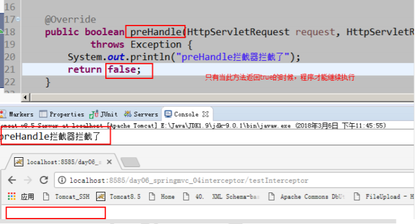

# 四、 SpringMVC框架

- 4.1 [基本概念](#4.1-基本概念)
- 4.2 [SpringMVC的入门](#4.2-SpringMVC的入门)
- 4.3 [请求参数的绑定](#4.3-请求参数的绑定)
- 4.4 [常用注解](#4.4-常用注解)
- 4.5 [响应数据和结果视图](#4.5-响应数据和结果视图)
- 4.6 [SpringMVC实现文件上传](#4.6-SpringMVC实现文件上传)
- 4.7 [SpringMVC中的异常处理](#4.7-SpringMVC中的异常处理)
- 4.8 [SPringMVC中的拦截器](#4.8-SPringMVC中的拦截器)
- 4.9 [SSM整合](#4.9-SSM整合)

## 4.1 基本概念

### 4.1.1 三层架构

我们的开发架构一般都是基于两种形式，一种是 C/S 架构，也就是客户端/服务器，另一种是 B/S 架构，也就是浏览器服务器。在 JavaEE 开发中，几乎全都是基于 B/S 架构的开发。那么在 B/S 架构中，系统标准的三层架构包括：表现层、业务层、持久层。三层架构在我们的实际开发中使用的非常多，所以我们课程中的案例也都是基于三层架构设计的。

三层架构中，每一层各司其职，接下来我们就说说每层都负责哪些方面：

**表现层**：

也就是我们常说的web层。它负责接收客户端请求，向客户端响应结果，通常客户端使用http协议请求 web 层，web 需要接收 http 请求，完成 http 响应。

表现层包括展示层和控制层：控制层负责接收请求，展示层负责结果的展示。

表现层依赖业务层，接收到客户端请求一般会调用业务层进行业务处理，并将处理结果响应给客户端。

表现层的设计一般都使用 MVC 模型。（MVC 是表现层的设计模型，和其他层没有关系）

**业务层**：

也就是我们常说的 service 层。它负责业务逻辑处理，和我们开发项目的需求息息相关。web 层依赖业务层，但是业务层不依赖 web 层。

业务层在业务处理时可能会依赖持久层，如果要对数据持久化需要保证事务一致性。（也就是我们说的，事务应该放到业务层来控制）

**持久层**：

也就是我们是常说的 dao 层。负责数据持久化，包括数据层即数据库和数据访问层，数据库是对数据进行持久化的载体，数据访问层是业务层和持久层交互的接口，业务层需要通过数据访问层将数据持久化到数据库中。通俗的讲，持久层就是和数据库交互，对数据库表进行曾删改查的。

### 4.1.2 MVC模型

MVC 全名是 Model View Controller，是模型(model)－视图(view)－控制器(controller)的缩写，是一种用于设计创建 Web 应用程序表现层的模式。MVC 中每个部分各司其职：

**Model（模型）**：

通常指的就是我们的数据模型。作用一般情况下用于封装数据。

**View（视图）**：

通常指的就是我们的 jsp 或者 html。作用一般就是展示数据的。

通常视图是依据模型数据创建的。

**Controller（控制器）**：

是应用程序中处理用户交互的部分。作用一般就是处理程序逻辑的。

它相对于前两个不是很好理解，这里举个例子：

例如：

我们要保存一个用户的信息，该用户信息中包含了姓名，性别，年龄等等。

这时候表单输入要求年龄必须是 1~100 之间的整数。姓名和性别不能为空。并且把数据填充到模型之中。

此时除了 js 的校验之外，服务器端也应该有数据准确性的校验，那么校验就是控制器的该做的。

当校验失败后，由控制器负责把错误页面展示给使用者。

如果校验成功，也是控制器负责把数据填充到模型，并且调用业务层实现完整的业务需求。

### 4.1.3 SpringMVC概述

SpringMVC 是一种基于 Java 的实现 MVC 设计模型的请求驱动类型的轻量级 Web 框架，属于 Spring FrameWork 的后续产品，已经融合在 Spring Web Flow 里面。Spring 框架提供了构建 Web 应用程序的全功能 MVC 模块。使用 Spring 可插入的 MVC 架构，从而在使用 Spring 进行 WEB 开发时，可以选择使用 Spring 的 Spring MVC 框架或集成其他 MVC 开发框架，如 Struts1(现在一般不用)，Struts2 等。

SpringMVC 已经成为目前最主流的 MVC 框架之一，并且随着 Spring3.0 的发布，全面超越 Struts2，成为最优秀的 MVC 框架。

它通过一套注解，让一个简单的 Java 类成为处理请求的控制器，而无须实现任何接口。同时它还支持 RESTful 编程风格的请求。


SpringMVC 的优势

1. 清晰的角色划分：
   - 前端控制器（DispatcherServlet）
   - 请求到处理器映射（HandlerMapping）
   - 处理器适配器（HandlerAdapter）
   - 视图解析器（ViewResolver）
   - 处理器或页面控制器（Controller）
   - 验证器（ Validator）
   - 命令对象（Command 请求参数绑定到的对象就叫命令对象）
   - 表单对象（Form Object 提供给表单展示和提交到的对象就叫表单对象）。
2. 分工明确，而且扩展点相当灵活，可以很容易扩展，虽然几乎不需要。
3. 由于命令对象就是一个 POJO，无需继承框架特定 API，可以使用命令对象直接作为业务对象。
4. 和 Spring 其他框架无缝集成，是其它 Web 框架所不具备的。
5. 可适配，通过 HandlerAdapter 可以支持任意的类作为处理器。
6. 可定制性，HandlerMapping、ViewResolver 等能够非常简单的定制。
7. 功能强大的数据验证、格式化、绑定机制。
8. 利用 Spring 提供的 Mock 对象能够非常简单的进行 Web 层单元测试。
9. 本地化、主题的解析的支持，使我们更容易进行国际化和主题的切换。
10. 强大的 JSP 标签库，使 JSP 编写更容易。

………………还有比如RESTful风格的支持、简单的文件上传、约定大于配置的契约式编程支持、基于注解的零配置支持等等。

SpringMVC 和 Struts2 的优略分析

- 共同点：

  - 它们都是表现层框架，都是基于 MVC 模型编写的。
  - 它们的底层都离不开原始 ServletAPI。
  - 它们处理请求的机制都是一个核心控制器。

- 区别：

  - Spring MVC 的入口是 Servlet, 而 Struts2 是 Filter

  - Spring MVC 是基于方法设计的，而 Struts2 是基于类，Struts2 每次执行都会创建一个动作类。所以 Spring MVC 会稍微比 Struts2 快些。

  - Spring MVC 使用更加简洁,同时还支持 JSR303, 处理 ajax 的请求更方便

    (JSR303 是一套 JavaBean 参数校验的标准，它定义了很多常用的校验注解，我们可以直接将这些注解加在我们 JavaBean 的属性上面，就可以在需要校验的时候进行校验了。)

  - Struts2 的 OGNL 表达式使页面的开发效率相比 Spring MVC 更高些，但执行效率并没有比 JSTL 提升，尤其是 struts2 的表单标签，远没有 html 执行效率高。

## 4.2 SpringMVC的入门

### 4.2.1 入门案例

#### 前期准备

下载开发包： https://spring.io/projects

其实 spring mvc 的 jar 包就在之前我们的 spring 框架开发包中。

创建一个 jsp 用于发送请求

```
<a href="${pageContext.request.contextPath}/hello">SpringMVC 入门案例</a>
<br/>
<a href="hello">SpringMVC 入门案例</a>
```

#### 拷贝jar包

#### 配置核心控制器-一个 Servlet

```xml
<?xml version="1.0" encoding="UTF-8"?>
<web-app xmlns:xsi="http://www.w3.org/2001/XMLSchema-instance"
         xmlns="http://java.sun.com/xml/ns/javaee"
         xsi:schemaLocation="http://java.sun.com/xml/ns/javaee
http://java.sun.com/xml/ns/javaee/web-app_2_5.xsd"
         id="WebApp_ID" version="2.5">
    <!-- 配置 spring mvc 的核心控制器 -->
    <servlet>
        <servlet-name>SpringMVCDispatcherServlet</servlet-name>
        <servlet-class>
            org.springframework.web.servlet.DispatcherServlet
        </servlet-class>
        <!-- 配置初始化参数，用于读取 SpringMVC 的配置文件 -->
        <init-param>
            <param-name>contextConfigLocation</param-name>
            <param-value>classpath:SpringMVC.xml</param-value>
        </init-param>
        <!-- 配置 servlet 的对象的创建时间点：应用加载时创建。
        取值只能是非 0 正整数，表示启动顺序 -->
        <load-on-startup>1</load-on-startup>
    </servlet>
    <servlet-mapping>
        <servlet-name>SpringMVCDispatcherServlet</servlet-name>
        <url-pattern>/</url-pattern>
    </servlet-mapping>
</web-app>
```

#### 创建 spring mvc 的配置文件

```
<?xml version="1.0" encoding="UTF-8"?>
<beans xmlns="http://www.springframework.org/schema/beans"
       xmlns:mvc="http://www.springframework.org/schema/mvc"
       xmlns:context="http://www.springframework.org/schema/context"
       xmlns:xsi="http://www.w3.org/2001/XMLSchema-instance"
       xsi:schemaLocation="http://www.springframework.org/schema/beans
http://www.springframework.org/schema/beans/spring-beans.xsd
 http://www.springframework.org/schema/mvc
 http://www.springframework.org/schema/mvc/spring-mvc.xsd
 http://www.springframework.org/schema/context
http://www.springframework.org/schema/context/spring-context.xsd">
    <!-- 配置创建 spring 容器要扫描的包 -->
    <context:component-scan base-package="myspringmvclearning"></context:component-scan>

    <!-- 配置视图解析器 -->
    <bean class="org.springframework.web.servlet.view.InternalResourceViewResolver">
        <property name="prefix" value="/WEB-INF/pages/"></property>
        <property name="suffix" value=".jsp"></property>
    </bean>
</beans>
```

#### 编写控制器并使用注解配置

```java
/**
* spring mvc 的入门案例
*/
@Controller("helloController")
public class HelloController {
    @RequestMapping("/hello")
    public String sayHello() {
        System.out.println("HelloController 的 sayHello 方法执行了。。。。");
        return "success";
    }
}
```

### 4.2.2 入门案例的执行过程及原理分析

#### 案例的执行过程


1. 服务器启动，应用被加载。读取到 web.xml 中的配置创建 spring 容器并且初始化容器中的对象。

   从入门案例中可以看到的是：HelloController 和 InternalResourceViewResolver，但是远不止这些。

2. 浏览器发送请求，被 DispatherServlet 捕获，该 Servlet 并不处理请求，而是把请求转发出去。转发的路径是根据请求 URL，匹配@RequestMapping 中的内容。

3. 匹配到了后，执行对应方法。该方法有一个返回值。

4. 根据方法的返回值，借助 InternalResourceViewResolver 找到对应的结果视图。

5. 渲染结果视图，响应浏览器。

####  SpringMVC 的请求响应流程


### 4.2.3 入门案例中涉及的组件

- DispatcherServlet：前端控制器

  用户请求到达前端控制器，它就相当于 mvc 模式中的 c，dispatcherServlet 是整个流程控制的中心，由它调用其它组件处理用户的请求，dispatcherServlet 的存在降低了组件之间的耦合性。

- HandlerMapping：处理器映射器

  HandlerMapping 负责根据用户请求找到 Handler 即处理器，SpringMVC 提供了不同的映射器实现不同的映射方式，例如：配置文件方式，实现接口方式，注解方式等。

- Handler：处理器

  它就是我们开发中要编写的具体业务控制器。由 DispatcherServlet 把用户请求转发到 Handler。由 Handler 对具体的用户请求进行处理。

-  HandlAdapter：处理器适配器

  通过 HandlerAdapter 对处理器进行执行，这是适配器模式的应用，通过扩展适配器可以对更多类型的处理器进行执行。

- View Resolver：视图解析器

  View Resolver 负责将处理结果生成 View 视图，View Resolver 首先根据逻辑视图名解析成物理视图名即具体的页面地址，再生成 View 视图对象，最后对 View 进行渲染将处理结果通过页面展示给用户。

- View：视图

  SpringMVC 框架提供了很多的 View 视图类型的支持，包括：jstlView、freemarkerView、pdfView 等。我们最常用的视图就是 jsp。

  一般情况下需要通过页面标签或页面模版技术将模型数据通过页面展示给用户，需要由程序员根据业务需求开发具体的页面。

- `<mvc:annotation-driven>`说明

  在 SpringMVC 的各个组件中，处理器映射器、处理器适配器、视图解析器称为 SpringMVC 的三大组件。

  使用`<mvc:annotation-driven>`自动加载RequestMappingHandlerMapping（处理映射器）和RequestMappingHandlerAdapter（处理适配器），可用在SpringMVC.xml配置文件中使用`<mvc:annotation-driven>`替代注解处理器和适配器的配置。

  它就相当于在 xml 中配置了：

  ```xml
  <!-- 上面的标签相当于 如下配置-->
  <!-- Begin -->
  <!-- HandlerMapping -->
  <bean class="org.springframework.web.servlet.mvc.method.annotation.RequestMappingHandlerMapping"></bean>
  <bean class="org.springframework.web.servlet.handler.BeanNameUrlHandlerMapping"></bean>
  <!-- HandlerAdapter -->
  <bean class="org.springframework.web.servlet.mvc.method.annotation.RequestMappingHandlerAdapter"></bean>
  <bean class="org.springframework.web.servlet.mvc.HttpRequestHandlerAdapter"></bean>
  <bean class="org.springframework.web.servlet.mvc.SimpleControllerHandlerAdapter"></bean>
  <!-- HadnlerExceptionResolvers -->
  <bean class="org.springframework.web.servlet.mvc.method.annotation.ExceptionHandlerExceptionResolver"></bean>
  <bean class="org.springframework.web.servlet.mvc.annotation.ResponseStatusExceptionResolver"></bean>
  <bean class="org.springframework.web.servlet.mvc.support.DefaultHandlerExceptionResolver"></bean>
  <!-- End -->
  ```

  > 注意：
  >
  > 一般开发中，我们都需要写上此标签（虽然从入门案例中看，我们不写也行，随着课程的深入，该标签还有具体的使用场景）。
  >
  > 明确：
  >
  > **我们只需要编写处理具体业务的控制器以及视图。**

### 4.2.4 RequestMapping 注解

#### 使用说明

```java
@Target({ElementType.METHOD, ElementType.TYPE})
@Retention(RetentionPolicy.RUNTIME)
@Documented
@Mapping
public @interface RequestMapping {
}
```

- 作用

  用于建立请求 URL 和处理请求方法之间的对应关系。

- 出现位置：

  - 类上：

    请求 URL 的第一级访问目录。此处不写的话，就相当于应用的根目录。写的话需要以`/`开头。

    它出现的目的是为了使我们的 URL 可以按照模块化管理:

    例如：

    ​    账户模块：

    ​        <u>/account</u>/add

    ​        <u>/account</u>/update

    ​        <u>/account</u>/delete

    ​        ...

    ​    订单模块：

    ​        <u>/order</u>/add

    ​        <u>/order</u>/update

    ​        <u>/order</u>/delete

  - 方法上：

    下划线的部分就是把 RequsetMappding 写在类上，使我们的 URL 更加精细。

- 属性：

  - value：用于指定请求的 URL。它和 path 属性的作用是一样的。

  - method：用于指定请求的方式。

  - params：用于指定限制请求参数的条件。它支持简单的表达式。要求请求参数的 key 和 value 必须和配置的一模一样。

    - 例如：

      params = {"accountName"}，表示请求参数必须有 accountName

      params = {"moeny!100"}，表示请求参数中 money 不能是 100。

  - headers：用于指定限制请求消息头的条件。

  注意：

  以上四个属性只要出现2个或以上时，他们的关系是与的关系。

#### 使用示例

**出现位置的示例：**

```java
/**
 * RequestMapping 注解出现的位置
 */
@Controller("accountController")
@RequestMapping("/account")
public class AccountController {
    @RequestMapping("/findAccount")
    public String findAccount() {
        System.out.println("查询了账户。。。。");
        return "success";
    }
}
```

```jsp
<%@ page language="java" contentType="text/html; charset=UTF-8"
        pageEncoding="UTF-8"%>
        <!DOCTYPE html PUBLIC "-//W3C//DTD HTML 4.01 Transitional//EN"
                "http://www.w3.org/TR/html4/loose.dtd">
<html>
<head>
    <meta http-equiv="Content-Type" content="text/html; charset=UTF-8">
    <title>requestmapping 的使用</title>
</head>
<body>
    <!-- 第一种访问方式 -->
    <a href="${pageContext.request.contextPath}/account/findAccount">
        查询账户
    </a>
    <br/>
    <!-- 第二种访问方式 -->
    <a href="account/findAccount">查询账户</a>
</body>
</html>
```

注意：当我们使用此种方式配置时，在 jsp 中第二种写法时，不要在访问 URL 前面加/，否则无法找到资源。

**method属性的示例**

```java
/**
 * 保存账户
 * @return
 */
@RequestMapping(value="/saveAccount",method=RequestMethod.POST)
public String saveAccount() {
        System.out.println("保存了账户");
        return "success";

```

```jsp
<!-- 请求方式的示例 -->
<a href="account/saveAccount">保存账户，get 请求</a>
<br/>
<form action="account/saveAccount" method="post">
    <input type="submit" value="保存账户，post 请求">
</form>
```

注意：当使用 get 请求时，提示错误信息是 405，信息是方法不支持 get 方式请求

**params 属性的示例**

```java
/**
* 删除账户
* @return
*/
@RequestMapping(value="/removeAccount",params= {"accountName","money>100"})
public String removeAccount() {
    System.out.println("删除了账户");
    return "success";
}
```

```
<!-- 请求参数的示例 -->
<a href="account/removeAccount?accountName=aaa&money>100">删除账户，金额 100</a>
<br/>
<a href="account/removeAccount?accountName=aaa&money>150">删除账户，金额 150</a>
```

注意：当我们点击第一个超链接时,可以访问成功。当我们点击第二个超链接时，无法访问。


## 4.3 请求参数的绑定

### 4.3.1 绑定说明

- 绑定的机制

  我们都知道，表单中请求参数都是基于 key=value 的。

  SpringMVC 绑定请求参数的过程是通过把表单提交请求参数，作为控制器中方法参数进行绑定的。

  例如：

  `<a href="account/findAccount?accountId=10">查询账户</a>`

  中请求参数是：

  accountId=10

  ```java
  /**
  * 查询账户
  * @return
  */
  @RequestMapping("/findAccount")
  public String findAccount(Integer accountId) {
      System.out.println("查询了账户。。。。"+accountId);
      return "success";
  }
  ```

- 支持的数据类型：

  - 基本类型参数：

    包括基本类型和 String 类型

  - POJO 类型参数：

    包括实体类，以及关联的实体类

  - 数组和集合类型参数：

    包括 List 结构和 Map 结构的集合（包括数组）

  SpringMVC 绑定请求参数是自动实现的，但是要想使用，必须遵循使用要求。

- 使用要求：

  - 如果是基本类型或者 String 类型：

    要求我们的参数名称必须和控制器中方法的形参名称保持一致。(严格区分大小写)

  - 如果是 POJO 类型，或者它的关联对象：

    要求表单中参数名称和 POJO 类的属性名称保持一致。并且控制器方法的参数类型是 POJO 类型。

  - 如果是集合类型,有两种方式：

    - 第一种：

      要求集合类型的请求参数必须在 POJO 中。在表单中请求参数名称要和 POJO 中集合属性名称相同。

      给 List 集合中的元素赋值，使用下标。

      给 Map 集合中的元素赋值，使用键值对。

    - 第二种：

      接收的请求参数是 json 格式数据。需要借助一个注解实现。

  - > 注意：
    >
    > 它还可以实现一些数据类型自动转换。内置转换器全都在：
    >
    > org.springframework.core.convert.support 包下。有：
    >
    > - java.lang.Boolean -> java.lang.String : ObjectToStringConverter
    >
    > - java.lang.Character -> java.lang.Number : CharacterToNumberFactory
    >
    > - java.lang.Character -> java.lang.String : ObjectToStringConverter
    >
    > - java.lang.Enum -> java.lang.String : EnumToStringConverter
    >
    > - java.lang.Number -> java.lang.Character : NumberToCharacterConverter
    >
    > - java.lang.Number -> java.lang.Number : NumberToNumberConverterFactory
    >
    > - java.lang.Number -> java.lang.String : ObjectToStringConverter
    >
    > - java.lang.String -> java.lang.Boolean : StringToBooleanConverter
    >
    > - java.lang.String -> java.lang.Character : StringToCharacterConverter
    >
    > - java.lang.String -> java.lang.Enum : StringToEnumConverterFactory
    >
    > - java.lang.String -> java.lang.Number : StringToNumberConverterFactory
    >
    > - java.lang.String -> java.util.Locale : StringToLocaleConverter
    >
    > - java.lang.String -> java.util.Properties : StringToPropertiesConverter
    >
    > - java.lang.String -> java.util.UUID : StringToUUIDConverter
    >
    > - java.util.Locale -> java.lang.String : ObjectToStringConverter
    >
    > - java.util.Properties -> java.lang.String : PropertiesToStringConverter
    >
    > - java.util.UUID -> java.lang.String : ObjectToStringConverter
    >
    >   ......
    >
    > 如遇特殊类型转换要求，需要我们自己编写自定义类型转换器。

#### 使用示例

**基本类型和 String 类型作为参数**

```
<!-- 基本类型示例 -->
<a href="account/findAccount?accountId=10&accountName=zhangsan">查询账户</a>
```

```
/**
* 查询账户
* @return
*/
@RequestMapping("/findAccount")
public String findAccount(Integer accountId,String accountName) {
    System.out.println("查询了账户。。。。"+accountId+","+accountName);
    return "success";
}
```

**POJO 类型作为参数**

```java
/**
 * 账户信息
 */
public class Account implements Serializable {
    private Integer id;
    private String name;
    private Float money;
    private Address address;
//getters and setters
}
/**
 * 地址的实体类
 */
public class Address implements Serializable {
    private String provinceName;
    private String cityName;
//getters and setters
}
```

```jsp
<!-- pojo 类型演示 -->
<form action="account/saveAccount" method="post">
    账户名称：<input type="text" name="name" ><br/>
    账户金额：<input type="text" name="money" ><br/>
    账户省份：<input type="text" name="address.provinceName" ><br/>
    账户城市：<input type="text" name="address.cityName" ><br/>
    <input type="submit" value="保存">
</form>
```

```java
/**
* 保存账户
* @param account
* @return
*/
@RequestMapping("/saveAccount")
public String saveAccount(Account account) {
    System.out.println("保存了账户。。。。"+account);
    return "success";
}
```

**POJO 类中包含集合类型参数**

```java
/**
 * 用户实体类
 */
public class User implements Serializable {
    private String username;
    private String password;
    private Integer age;
    private List<Account> accounts;
    private Map<String,Account> accountMap;
    //getters and setters
    @Override
    public String toString() {
        return "User [username=" + username + ", password=" + password + ", age="
                + age + ",\n accounts=" + accounts
                + ",\n accountMap=" + accountMap + "]";
    }
}
```

```jsp
<!-- POJO 类包含集合类型演示 -->
<form action="account/updateAccount" method="post">
    用户名称：<input type="text" name="username" ><br/>
    用户密码：<input type="password" name="password" ><br/>
    用户年龄：<input type="text" name="age" ><br/>
    账户 1 名称：<input type="text" name="accounts[0].name" ><br/>
    账户 1 金额：<input type="text" name="accounts[0].money" ><br/>
    账户 2 名称：<input type="text" name="accounts[1].name" ><br/>
    账户 2 金额：<input type="text" name="accounts[1].money" ><br/>
    账户 3 名称：<input type="text" name="accountMap['one'].name" ><br/>
    账户 3 金额：<input type="text" name="accountMap['one'].money" ><br/>
    账户 4 名称：<input type="text" name="accountMap['two'].name" ><br/>
    账户 4 金额：<input type="text" name="accountMap['two'].money" ><br/>
    <input type="submit" value="保存">
</form>
```

```java
/**
* 更新账户
* @return
*/
@RequestMapping("/updateAccount")
public String updateAccount(User user) {
    System.out.println("更新了账户。。。。"+user);
    return "success";
}
```

**请求参数乱码问题**

post 请求方式：在 web.xml 中配置一个过滤器

```xml
<filter>
    <filter-name>CharacterEncodingFilter</filter-name>
    <filter-class>
        org.springframework.web.filter.CharacterEncodingFilter
    </filter-class>
    <!-- 设置过滤器中的属性值 -->
    <init-param>
        <param-name>encoding</param-name>
        <param-value>UTF-8</param-value>
    </init-param>
    <!-- 启动过滤器 -->
    <init-param>
        <param-name>forceEncoding</param-name>
        <param-value>true</param-value>
    </init-param>
</filter>
        <!-- 过滤所有请求 -->
<filter-mapping>
<filter-name>CharacterEncodingFilter</filter-name>
<url-pattern>/*</url-pattern>
</filter-mapping>
```

在 springmvc 的配置文件中可以配置，静态资源不过滤

```
<!-- location 表示路径，mapping 表示文件，**表示该目录下的文件以及子目录的文件 -->
<mvc:resources location="/css/" mapping="/css/**"/>
<mvc:resources location="/images/" mapping="/images/**"/>
<mvc:resources location="/scripts/" mapping="/javascript/**"/>
```

get 请求方式：tomacat 对 GET 和 POST 请求处理方式是不同的，GET 请求的编码问题，要改 tomcat 的 server.xml 配置文件，如下：

```
<Connector connectionTimeout="20000" port="8080" protocol="HTTP/1.1" redirectPort="8443"/>
```

改为：

```
<Connector connectionTimeout="20000" port="8080" protocol="HTTP/1.1" redirectPort="8443" useBodyEncodingForURI="true"/>
```

如果遇到 ajax 请求仍然乱码，请把：

`useBodyEncodingForURI="true"`改为`URIEncoding="UTF-8"`即可

### 4.3.2 特殊情况

#### 自定义类型转换器

##### 使用场景

```
<!-- 特殊情况之：类型转换问题 -->
<a href="account/deleteAccount?date=2018-01-01">根据日期删除账户</a>
```

```
/**
* 删除账户
* @return
*/
@RequestMapping("/deleteAccount")
public String deleteAccount(String date) {
    System.out.println("删除了账户。。。。"+date);
    return "success";
}
```

**当我们把控制器中方法参数的类型改为 Date 时：**

```
/**
* 删除账户
* @return
*/
@RequestMapping("/deleteAccount")
public String deleteAccount(Date date) {
    System.out.println("删除了账户。。。。"+date);
    return "success";
}
```

运行会报错，异常提示：

```
Failed to bind request element:
org.springframework.web.method.annotation.MethodArgumentTypeMismatchExcept
ion:
Failed to convert value of type 'java.lang.String' to required type 'java.util.Date'; nested exception is
org.springframework.core.convert.ConversionFailedException:
Failed to convert from type [java.lang.String] to type [java.util.Date] for value '2018-01-01'; nested exception is java.lang.IllegalArgumentException
```

##### 使用步骤

**第一步：定义一个类，实现 Converter 接口，该接口有两个泛型**

```java
public interface Converter<S, T> {//S:表示接受的类型，T：表示目标类型
    /**
     * 实现类型转换的方法
     */
    @Nullable
    T convert(S source);
}
/**
 * 自定义类型转换器
 */
public class StringToDateConverter implements Converter<String, Date> {
    /**
     * 用于把 String 类型转成日期类型
     */
    @Override
    public Date convert(String source) {
        DateFormat format = null;
        try {
            if(StringUtils.isEmpty(source)) {
                throw new NullPointerException("请输入要转换的日期");
            }
            format = new SimpleDateFormat("yyyy-MM-dd");
            Date date = format.parse(source);
            return date;
        } catch (Exception e) {
            throw new RuntimeException("输入日期有误");
        }
    }
}
```

**第二步：在 spring 配置文件中配置类型转换器。**

spring 配置类型转换器的机制是，将自定义的转换器注册到类型转换服务中去。

```xml
<!-- 配置类型转换器工厂 -->
<bean id="converterService"
      class="org.springframework.context.support.ConversionServiceFactoryBean">
    <!-- 给工厂注入一个新的类型转换器 -->
    <property name="converters">
        <array>
            <!-- 配置自定义类型转换器 -->
            <bean class="myspringmvclearning.web.converter.StringToDateConverter"></bean>
        </array>
    </property>
</bean>
```

**第三步：在 annotation-driven 标签中引用配置的类型转换服务 **

```
<!-- 引用自定义类型转换器 -->
<mvc:annotation-driven
conversion-service="converterService"></mvc:annotation-driven>
```

#### 使用 ServletAPI 对象作为方法参数

SpringMVC 还支持使用原始 ServletAPI 对象作为控制器方法的参数。支持原始 ServletAPI 对象有：

- HttpServletRequest
- HttpServletResponse
- HttpSession
- java.security.Principal
- Locale
- InputStream
- OutputStream
- Reader
- Writer

**我们可以把上述对象，直接写在控制的方法参数中使用。**

```jsp
<!-- 原始 ServletAPI 作为控制器参数 -->
<a href="account/testServletAPI">测试访问 ServletAPI</a>
```

```java
/**
 * 测试访问 testServletAPI
 * @return
 */
@RequestMapping("/testServletAPI")
public String testServletAPI(HttpServletRequest request, HttpServletResponse response, HttpSession session) {
    System.out.println(request);
    System.out.println(response);
    System.out.println(session);
    return "success";
}
```

## 4.4 常用注解

### 4.4.1 RequestParam

- 作用：

  把请求中指定名称的参数给控制器中的形参赋值。

- 属性：

  value：请求参数中的名称。

  required：请求参数中是否必须提供此参数。默认值：true。表示必须提供，如果不提供将报错。

使用示例

```
<!-- requestParams 注解的使用 -->
<a href="springmvc/useRequestParam?name=test">requestParam 注解</a>
```

```java
/**
 * requestParams 注解的使用
 * @param username
 * @return
 */
@RequestMapping("/useRequestParam")
public String useRequestParam(@RequestParam("name")String username,
@RequestParam(value="age",required=false)Integer age){
    System.out.println(username+","+age);
    return "success";
}
```


### 4.4.2 RequestBody

- 作用：

  用于获取请求体内容。直接使用得到是 key=value&key=value...结构的数据。

  get 请求方式不适用。

- 属性：

  required：是否必须有请求体。默认值是:true。当取值为 true 时,get 请求方式会报错。如果取值为 false，get 请求得到是 null。

使用示例：

post请求jsp代码：

```jsp
<!-- request body 注解 -->
<form action="springmvc/useRequestBody" method="post">
    用户名称：<input type="text" name="username" ><br/>
    用户密码：<input type="password" name="password" ><br/>
    用户年龄：<input type="text" name="age" ><br/>
    <input type="submit" value="保存">
</form>
```

get请求jsp代码：

```
<a href="springmvc/useRequestBody?body=test">requestBody 注解 get 请求</a>
```

```
/**
* RequestBody 注解
* @param user
* @return
*/
@RequestMapping("/useRequestBody")
public String useRequestBody(@RequestBody(required=false) String body){
    System.out.println(body);
    return "success";
}
```


### 4.4.3 PathVariable

- 作用：

  用于绑定 url 中的占位符。例如：请求 url 中 /delete/{id}，这个{id}就是 url 占位符。

  url 支持占位符是 spring3.0 之后加入的。是 springmvc 支持 rest 风格 URL 的一个重要标志。

- 属性：

  value：用于指定 url 中占位符名称。

  required：是否必须提供占位符。

使用示例

```
<!-- PathVariable 注解 -->
<a href="springmvc/usePathVariable/100">pathVariable 注解</a>
```

```
/**
* PathVariable 注解
* @param user
* @return
*/
@RequestMapping("/usePathVariable/{id}")
public String usePathVariable(@PathVariable("id") Integer id){
    System.out.println(id);
    return "success";
}
```

#### REST 风格 URL

- 什么是 rest：

  REST（英文：Representational State Transfer，简称 REST）描述了一个架构样式的网络系统，比如 web 应用程序。它首次出现在 2000 年 Roy Fielding 的博士论文中，他是 HTTP 规范的主要编写者之一。在目前主流的三种 Web 服务交互方案中，REST 相比于 SOAP（Simple Object Access protocol，简单对象访问协议）以及 XML-RPC 更加简单明了，无论是对 URL 的处理还是对 Payload 的编码，REST 都倾向于用更加简单轻量的方法设计和实现。值得注意的是 REST 并没有一个明确的标准，而更像是一种设计的风格。

  它本身并没有什么实用性，其核心价值在于如何设计出符合 REST 风格的网络接口。

- restful 的优点

  它结构清晰、符合标准、易于理解、扩展方便，所以正得到越来越多网站的采用。

- restful 的特性：

  - **资源（Resources）**：网络上的一个实体，或者说是网络上的一个具体信息。

    它可以是一段文本、一张图片、一首歌曲、一种服务，总之就是一个具体的存在。可以用一个 URI（统一 资源定位符）指向它，每种资源对应一个特定的 URI 。要获取这个资源，访问它的 URI 就可以，因此 **URI 即为每一个资源的独一无二的识别符**。

  - **表现层（Representation）**：把资源具体呈现出来的形式，叫做它的表现层 （Representation）。

    比如，文本可以用 txt 格式表现，也可以用 HTML 格式、XML 格式、JSON 格式表现，甚至可以采用二进制格式。

  - **状态转化（State Transfer）**：每 发出一个请求，就代表了客户端和服务器的一次交互过程。

    HTTP 协议，是一个无状态协议，即所有的状态都保存在服务器端。因此，如果客户端想要操作服务器，必须通过某种手段，让服务器端发生“状态转化”（State Transfer）。而这种转化是建立在表现层之上的，所以就是 “表现层状态转化”。具体说，就是 **HTTP 协议里面，四个表示操作方式的动词：GET 、POST 、PUT、 DELETE。它们分别对应四种基本操作：GET 用来获取资源，POST 用来新建资源，PUT 用来更新资源，DELETE 用来删除资源**。

- restful 的示例：

  /account/1 HTTP GET ： 得到 id = 1 的 account /account/1 HTTP DELETE： 删除 id = 1 的 account /account/1 HTTP PUT： 更新 id = 1 的 account 

  /account HTTP POST： 新增 account

#### 基于 HiddentHttpMethodFilter 的示例

- 作用：

  由于浏览器 form 表单只支持 GET 与 POST 请求，而 DELETE、PUT 等 method 并不支持，Spring3.0 添加了一个过滤器，可以将浏览器请求改为指定的请求方式，发送给我们的控制器方法，使得支持 GET、POST、PUT 与 DELETE 请求。

- 使用方法：

  第一步：在 web.xml 中配置该过滤器。

  第二步：请求方式必须使用 post 请求。

  第三步：按照要求提供_method 请求参数，该参数的取值就是我们需要的请求方式

- 源码分析：

  

```jsp
<!-- 保存 -->
<form action="springmvc/testRestPOST" method="post">
    用户名称：<input type="text" name="username"><br/>
    <!-- <input type="hidden" name="_method" value="POST"> -->
    <input type="submit" value="保存">
</form>
<hr/>
<!-- 更新 -->
<form action="springmvc/testRestPUT/1" method="post">
    用户名称：<input type="text" name="username"><br/>
    <input type="hidden" name="_method" value="PUT">
    <input type="submit" value="更新">
</form>
<hr/>
<!-- 删除 -->
<form action="springmvc/testRestDELETE/1" method="post">
    <input type="hidden" name="_method" value="DELETE">
    <input type="submit" value="删除">
</form>
<hr/>
<!-- 查询一个 -->
<form action="springmvc/testRestGET/1" method="post">
    <input type="hidden" name="_method" value="GET">
    <input type="submit" value="查询">
</form> 
```

```java
/**
* post 请求：保存
* @param username
* @return
*/
@RequestMapping(value="/testRestPOST",method=RequestMethod.POST)
public String testRestfulURLPOST(User user){
    System.out.println("rest post"+user);
    return "success";
}
/**
* put 请求：更新
* @param username
* @return
*/
@RequestMapping(value="/testRestPUT/{id}",method=RequestMethod.PUT)
public String testRestfulURLPUT(@PathVariable("id")Integer id,User user){
    System.out.println("rest put "+id+","+user);
    return "success";
}
/**
* post 请求：删除
* @param username
* @return
*/
@RequestMapping(value="/testRestDELETE/{id}",method=RequestMethod.DELETE)
public String testRestfulURLDELETE(@PathVariable("id")Integer id){
    System.out.println("rest delete "+id);
    return "success";
}
/**
* post 请求：查询
* @param username
* @return
*/
@RequestMapping(value="/testRestGET/{id}",method=RequestMethod.GET)
public String testRestfulURLGET(@PathVariable("id")Integer id){
    System.out.println("rest get "+id);
    return "success";
} 
```


### 4.4.4 RequestHeader

- 作用：

  用于获取请求消息头。

- 属性：

  value：提供消息头名称

  required：是否必须有此消息头

- 注：

  在实际开发中一般不怎么用。

使用示例

```jsp
<!-- RequestHeader 注解 -->
<a href="springmvc/useRequestHeader">获取请求消息头</a>
```

```java
/**
* RequestHeader 注解
* @param user
* @return
*/
@RequestMapping("/useRequestHeader")
public String useRequestHeader(@RequestHeader(value="Accept-Language",
required=false)String requestHeader){
    System.out.println(requestHeader);
    return "success";
}
```

### 4.4.5 CookieValue

- 作用：

  用于把指定 cookie 名称的值传入控制器方法参数。

- 属性：

  value：指定 cookie 的名称。

  required：是否必须有此 cookie。

使用示例

```
<!-- CookieValue 注解 -->
<a href="springmvc/useCookieValue">绑定 cookie 的值</a>
```

```java
/**
* Cookie 注解注解
* @param user
* @return
*/
@RequestMapping("/useCookieValue")
public String useCookieValue(@CookieValue(value="JSESSIONID",required=false)
String cookieValue){
    System.out.println(cookieValue);
    return "success";
}
```

### 4.4.6 ModelAttribute

- 作用：

  该注解是 SpringMVC4.3 版本以后新加入的。它可以用于修饰方法和参数。

  出现在方法上，表示当前方法会在控制器的方法执行之前，先执行。它可以修饰没有返回值的方法，也可以修饰有具体返回值的方法。

  出现在参数上，获取指定的数据给参数赋值。

- 属性：

  value：用于获取数据的 key。key 可以是 POJO 的属性名称，也可以是 map 结构的 key。

- 应用场景：

  当表单提交数据不是完整的实体类数据时，保证没有提交数据的字段使用数据库对象原来的数据。

  例如：

  我们在编辑一个用户时，用户有一个创建信息字段，该字段的值是不允许被修改的。在提交表单数据是肯定没有此字段的内容，一旦更新会把该字段内容置为 null，此时就可以使用此注解解决问题。

#### 使用示例

**基于 POJO 属性的基本使用**

```jsp
<!-- ModelAttribute 注解的基本使用 -->
<a href="springmvc/testModelAttribute?username=test">测试 modelattribute</a>
```

```java
/**
* 被 ModelAttribute 修饰的方法
* @param user
*/
@ModelAttribute
public void showModel(User user) {
    System.out.println("执行了 showModel 方法"+user.getUsername());
}
/**
* 接收请求的方法
* @param user
* @return
*/
@RequestMapping("/testModelAttribute")
public String testModelAttribute(User user) {
    System.out.println("执行了控制器的方法"+user.getUsername());
    return "success";
}
```

**基于 Map 的应用场景示例 1：ModelAttribute 修饰方法带返回值**

需求：修改用户信息，要求用户的密码不能修改

```jsp
<!-- 修改用户信息 -->
<form action="springmvc/updateUser" method="post">
    用户名称：<input type="text" name="username" ><br/>
    用户年龄：<input type="text" name="age" ><br/>
    <input type="submit" value="保存">
</form>
```

```java
/**
 * 查询数据库中用户信息
 * @param user
 */
@ModelAttribute
public User showModel(String username) {
    //模拟去数据库查询
    User abc = findUserByName(username);
    System.out.println("执行了 showModel 方法"+abc);
    return abc;
}
/**
 * 模拟修改用户方法
 * @param user
 * @return
 */
@RequestMapping("/updateUser")
public String testModelAttribute(User user) {
    System.out.println("控制器中处理请求的方法：修改用户："+user);
    return "success";
}
/**
 * 模拟去数据库查询
 * @param username
 * @return
 */
private User findUserByName(String username) {
    User user = new User();
    user.setUsername(username);
    user.setAge(19);
    user.setPassword("123456");
    return user;
}
```

**基于 Map 的应用场景示例 1：ModelAttribute 修饰方法不带返回值**

需求：修改用户信息，要求用户的密码不能修改

```jsp
<!-- 修改用户信息 -->
<form action="springmvc/updateUser" method="post">
    用户名称：<input type="text" name="username" ><br/>
    用户年龄：<input type="text" name="age" ><br/>
    <input type="submit" value="保存">
</form>
```

```java
/**
* 查询数据库中用户信息
* @param user
*/
@ModelAttribute
public void showModel(String username,Map<String,User> map) {
    //模拟去数据库查询
    User user = findUserByName(username);
    System.out.println("执行了 showModel 方法"+user);
    map.put("abc",user);
}
/**
* 模拟修改用户方法
* @param user
* @return
*/
@RequestMapping("/updateUser")
public String testModelAttribute(@ModelAttribute("abc")User user) {
    System.out.println("控制器中处理请求的方法：修改用户："+user);
    return "success";
}
/**
* 模拟去数据库查询
* @param username
* @return
*/
private User findUserByName(String username) {
    User user = new User();
    user.setUsername(username);
    user.setAge(19);
    user.setPassword("123456");
    return user;
}
```

### 4.4.7 SessionAttribute

- 作用：

  用于多次执行控制器方法间的参数共享。

- 属性：

  value：用于指定存入的属性名称

  type：用于指定存入的数据类型。

使用示例

```jsp
<!-- SessionAttribute 注解的使用 -->
<a href="springmvc/testPut">存入 SessionAttribute</a>
<hr/>
<a href="springmvc/testGet">取出 SessionAttribute</a>
<hr/>
<a href="springmvc/testClean">清除 SessionAttribute</a>
```

```java
/**
 * SessionAttribute 注解的使用
 */
@Controller("sessionAttributeController")
@RequestMapping("/springmvc")
@SessionAttributes(value ={"username","password"},types={Integer.class})
public class SessionAttributeController {
    /**
     * 把数据存入 SessionAttribute
     * @param model
     * @return
     * Model 是 spring 提供的一个接口，该接口有一个实现类 ExtendedModelMap
     * 该类继承了 ModelMap，而 ModelMap 就是 LinkedHashMap 子类
     */
    @RequestMapping("/testPut")
    public String testPut(Model model){
        model.addAttribute("username", "泰斯特");
        model.addAttribute("password","123456");
        model.addAttribute("age", 31);
        //跳转之前将数据保存到 username、password 和 age 中，因为注解@SessionAttribute 中有
        这几个参数
        return "success";
    }

    @RequestMapping("/testGet")
    public String testGet(ModelMap model){

        System.out.println(model.get("username")+";"+model.get("password")+";"+model.get("a
                ge"));
        return "success";
    }

    @RequestMapping("/testClean")
    public String complete(SessionStatus sessionStatus){
        sessionStatus.setComplete();
        return "success";
    }
}
```

## 4.5 响应数据和结果视图

### 4.5.1 返回值分类

1. 字符串

   controller 方法返回字符串可以指定逻辑视图名，通过视图解析器解析为物理视图地址。

   ```java
   //指定逻辑视图名，经过视图解析器解析为 jsp 物理路径：/WEB-INF/pages/success.jsp
   @RequestMapping("/testReturnString")
   public String testReturnString() {
       System.out.println("AccountController 的 testReturnString 方法执行了。。。。");
       return "success";
   }
   ```

2. void

   在前几节中，我们知道 Servlet 原始 API 可以作为控制器中方法的参数：

   ```java
   @RequestMapping("/testReturnVoid")
   public void testReturnVoid(HttpServletRequest request,HttpServletResponse response)
   throws Exception {
   }
   ```

   在 controller 方法形参上可以定义 request 和 response，使用 request 或 response 指定响应结果：

   1. 使用 request 转向页面，如下：

      ```
      request.getRequestDispatcher("/WEB-INF/pages/success.jsp").forward(request,response);
      ```

   2. 也可以通过response页面重定向：

      ```
      response.sendRedirect("testRetrunString")
      ```

   3. 也可以通过response指定响应结果，列如响应json数据：

      ```
      response.setCharacterEncoding("utf-8");
      response.setContentType("application/json;charset=utf-8");
      response.getWriter().write("json 串");
      ```

3. ModelAndView

   ModelAndView 是 SpringMVC 为我们提供的一个对象，该对象也可以用作控制器方法的返回值。

   该对象中有两个方法：

   

   ```java
   /**
   * 返回 ModeAndView
   * @return
   */
   @RequestMapping("/testReturnModelAndView")
   public ModelAndView testReturnModelAndView() {
       ModelAndView mv = new ModelAndView();
       mv.addObject("username", "张三");
       mv.setViewName("success");
       return mv;
   }
   ```

   ```jsp
   <%@ page language="java" contentType="text/html; charset=UTF-8"
            pageEncoding="UTF-8"%>
   <!DOCTYPE html PUBLIC "-//W3C//DTD HTML 4.01 Transitional//EN"
   "http://www.w3.org/TR/html4/loose.dtd">
   <html>
   <head>
       <meta http-equiv="Content-Type" content="text/html; charset=UTF-8">
       <title>执行成功</title>
   </head>
   <body>
   执行成功！
   ${requestScope.username}
   </body>
   </html>
   ```

   注意：

   我们在页面上上获取使用的是 requestScope.username 取的，所以返回 ModelAndView 类型时，浏览器跳转只能是请求转发。

### 4.5.2 转发和重定向

#### forward 转发

controller 方法在提供了 String 类型的返回值之后，默认就是请求转发。我们也可以写成：

```java
/**
* 转发
* @return
*/
@RequestMapping("/testForward")
public String testForward() {
    System.out.println("AccountController 的 testForward 方法执行了。。。。");
    return "forward:/WEB-INF/pages/success.jsp";
}
```

需要注意的是，如果用了 formward：则路径必须写成实际视图 url，不能写逻辑视图。

它相当于“request.getRequestDispatcher("url").forward(request,response)”。使用请求转发，既可以转发到 jsp，也可以转发到其他的控制器方法。

#### Redirect 重定向

contrller 方法提供了一个 String 类型返回值之后，它需要在返回值里使用:redirect:

```java
/**
* 重定向
* @return
*/
@RequestMapping("/testRedirect")
public String testRedirect() {
    System.out.println("AccountController 的 testRedirect 方法执行了。。。。");
    return "redirect:testReturnModelAndView";
}
```

它相当于“response.sendRedirect(url)”。需要注意的是，如果是重定向到 jsp 页面，则 jsp 页面不能写在 WEB-INF 目录中，否则无法找到。

### 4.5.3 ResponseBody 响应 json 数据

作用：

该注解用于将 Controller 的方法返回的对象，通过 HttpMessageConverter 接口转换为指定格式的数据如：json,xml 等，通过 Response 响应给客户端

使用示例：

- 需求：

  使用@ResponseBody 注解实现将 controller 方法返回对象转换为 json 响应给客户端。

- 前置知识点：

  Springmvc 默认用 MappingJacksonHttpMessageConverter 对 json 数据进行转换，需要加入 jackson 的包。（注意：2.7.0 以下的版本用不了）

```jsp
<script type="text/javascript"
        src="${pageContext.request.contextPath}/js/jquery.min.js"></script>
<script type="text/javascript">
    $(function(){
        $("#testJson").click(function(){
            $.ajax({
                type:"post",
                url:"${pageContext.request.contextPath}/testResponseJson",
                contentType:"application/json;charset=utf-8",
                data:'{"id":1,"name":"test","money":999.0}',
                dataType:"json",
                success:function(data){
                    alert(data);
                }
            });
        });
    })
</script>
<!-- 测试异步请求 -->
<input type="button" value="测试 ajax 请求 json 和响应 json" id="testJson"/>
```

```java
/**
 * 响应 json 数据的控制器
 */
@Controller("jsonController")
public class JsonController {
    /**
     * 测试响应 json 数据
     */
    @RequestMapping("/testResponseJson")
    public @ResponseBody Account testResponseJson(@RequestBody Account account) {
        System.out.println("异步请求："+account);
        return account;
    }
}
```

## 4.6 SpringMVC实现文件上传

### 4.6.1 回顾

1. 文件上传的必要前提

   1.  form 表单的 enctype 取值必须是：multipart/form-data

      (默认值是:application/x-www-form-urlencoded)

      enctype:是表单请求正文的类型

   2.  method 属性取值必须是 Post

   3. 提供一个文件选择域`<input type="file" />`

2. 文件上传的原理分析

   当 form 表单的 enctype 取值不是默认值后，request.getParameter()将失效。

   enctype=”application/x-www-form-urlencoded”时，form表单的正文内容是： key=value&key=value&key=value

   当 form 表单的 enctype 取值为 Mutilpart/form-data 时，请求正文内容就变成：

   ```
   每一部分都是 MIME 类型描述的正文
   -----------------------------7de1a433602ac 分界符
   Content-Disposition: form-data; name="userName" 协议头
   aaa 协议的正文
   -----------------------------7de1a433602ac
   Content-Disposition: form-data; name="file"; filename="C:\Users\zhy\Desktop\fileupload_demofile\b.txt"
   Content-Type: text/plain 协议的类型（MIME 类型）
   bbbbbbbbbbbbbbbbbbbbbbbbbbbbbbbb
   -----------------------------7de1a433602ac--
   ```

3. 借助第三方组件实现文件上传

   使用 Commons-fileupload 组件实现文件上传，需要导入该组件相应的支撑 jar 包：Commons-fileupload 和 commons-io。commons-io 不属于文件上传组件的开发 jar 文件，但Commons-fileupload 组件从 1.1 版本开始，它工作时需要 commons-io 包的支持。

### 4.6.2 springmvc 传统方式的文件上传

传统方式的文件上传，指的是我们上传的文件和访问的应用存在于同一台服务器上。并且上传完成之后，浏览器可能跳转。

#### 第一步：拷贝文件上传的 jar 包到工程的 lib 目录

#### 第二步：编写 jsp 页面

```jsp
<form action="/fileUpload" method="post" enctype="multipart/form-data">
    名称：<input type="text" name="picname"/><br/>
    图片：<input type="file" name="uploadFile"/><br/>
    <input type="submit" value="上传"/>
</form>
```

#### 第三步：编写控制器

```java
/**
 * 文件上传的的控制器
 */
@Controller("fileUploadController")
public class FileUploadController {
    /**
     * 文件上传
     */
    @RequestMapping("/fileUpload")
    public String testResponseJson(String picname, MultipartFile
            uploadFile, HttpServletRequest request) throws Exception {
        //定义文件名
        String fileName = "";
        //1.获取原始文件名
        String uploadFileName = uploadFile.getOriginalFilename();
        //2.截取文件扩展名
        String extendName =
                uploadFileName.substring(uploadFileName.lastIndexOf(".") + 1,
                        uploadFileName.length());
        //3.把文件加上随机数，防止文件重复
        String uuid = UUID.randomUUID().toString().replace("-", "").toUpperCase();
        //4.判断是否输入了文件名
        if (!StringUtils.isEmpty(picname)) {
            fileName = uuid + "_" + picname + "." + extendName;
        } else {
            fileName = uuid + "_" + uploadFileName;
        }
        System.out.println(fileName);
        //2.获取文件路径
        ServletContext context = request.getServletContext();
        String basePath = context.getRealPath("/uploads");
        //3.解决同一文件夹中文件过多问题
        String datePath = new SimpleDateFormat("yyyy-MM-dd").format(new Date());
//4.判断路径是否存在
        File file = new File(basePath + "/" + datePath);
        if (!file.exists()) {
            file.mkdirs();
        }
        //5.使用 MulitpartFile 接口中方法，把上传的文件写到指定位置
        uploadFile.transferTo(new File(file, fileName));
        return "success";
    }
}
```

#### 第四步：配置文件解析器

```xml
<!-- 配置文件上传解析器 -->
<bean id="multipartResolver" <!-- id 的值是固定的-->
        class="org.springframework.web.multipart.commons.CommonsMultipartResolver">
   <!-- 设置上传文件的最大尺寸为 5MB -->
   <property name="maxUploadSize">
        <value>5242880</value>
    </property>
</bean>
```

注意：文件上传的解析器 id 是固定的，不能起别的名称，否则无法实现请求参数的绑定。（不光是文件，其他字段也将无法绑定）

### 4.6.3 springmvc 跨服务器方式的文件上传

在实际开发中，我们会有很多处理不同功能的服务器。例如：

- 应用服务器：负责部署我们的应用
- 数据库服务器：运行我们的数据库
- 缓存和消息服务器：负责处理大并发访问的缓存和消息
- 文件服务器：负责存储用户上传文件的服务器。

**(注意：此处说的不是服务器集群）**

**分服务器处理的目的是让服务器各司其职，从而提高我们项目的运行效率。**


#### 准备两个 tomcat 服务器，并创建一个用于存放图片的 web 工程

在文件服务器的 tomcat 配置中加入，允许读写操作。加入内容：


加入此行的含义是：接收文件的目标服务器可以支持写入操作。

#### 拷贝jar包

#### 编写控制器实现上传图片

```java
/**
 * 响应 json 数据的控制器
 */
@Controller("fileUploadController2")
public class FileUploadController2 {
    public static final String FILESERVERURL =
            "http://localhost:9090/day06_spring_image/uploads/";

    /**
     * 文件上传，保存文件到不同服务器
     */
    @RequestMapping("/fileUpload2")
    public String testResponseJson(String picname, MultipartFile uploadFile) throws Exception {
//定义文件名
        String fileName = "";
//1.获取原始文件名
        String uploadFileName = uploadFile.getOriginalFilename();
//2.截取文件扩展名
        String extendName =
                uploadFileName.substring(uploadFileName.lastIndexOf(".") + 1,
                        uploadFileName.length());
//3.把文件加上随机数，防止文件重复
        String uuid = UUID.randomUUID().toString().replace("-", "").toUpperCase();
//4.判断是否输入了文件名
        if (!StringUtils.isEmpty(picname)) {
            fileName = uuid + "_" + picname + "." + extendName;
        } else {
            fileName = uuid + "_" + uploadFileName;
        }
        System.out.println(fileName);
//5.创建 sun 公司提供的 jersey 包中的 Client 对象
        Client client = Client.create();
//6.指定上传文件的地址，该地址是 web 路径
        WebResource resource = client.resource(FILESERVERURL + fileName);
//7.实现上传
        String result = resource.put(String.class, uploadFile.getBytes());
        System.out.println(result);
        return "success";
    }
}
```

#### 编写 jsp 页面

```jsp
<form action="fileUpload2" method="post" enctype="multipart/form-data">
    名称：<input type="text" name="picname"/><br/>
    图片：<input type="file" name="uploadFile"/><br/>
    <input type="submit" value="上传"/>
</form>
```

####  配置解析器

```xml
<!-- 配置文件上传解析器 -->
<bean id="multipartResolver"
      class="org.springframework.web.multipart.commons.CommonsMultipartResolver">
    <!-- 设置上传文件的最大尺寸为 5MB -->
    <property name="maxUploadSize">
        <value>5242880</value>
    </property>
</bean>
```

## 4.7 SpringMVC中的异常处理

### 4.7.1 异常处理的思路

系统中异常包括两类：预期异常和运行时异常 RuntimeException，前者通过捕获异常从而获取异常信息，后者主要通过规范代码开发、测试通过手段减少运行时异常的发生。

系统的 dao、service、controller 出现都通过 throws Exception 向上抛出，最后由 springmvc 前端控制器交由异常处理器进行异常处理，如下图：


实现步骤如下：

#### 编写异常类和错误页面

```java
/**
 * 自定义异常
 * */
public class CustomException extends Exception {
    private String message;
    public CustomException(String message) {
        this.message = message;
    }
    public String getMessage() {
        return message;
    }
}
```

```jsp
<%@ page language="java" contentType="text/html; charset=UTF-8"
         pageEncoding="UTF-8"%>
<!DOCTYPE html PUBLIC "-//W3C//DTD HTML 4.01 Transitional//EN"
"http://www.w3.org/TR/html4/loose.dtd">
<html>
<head>
    <meta http-equiv="Content-Type" content="text/html; charset=UTF-8">
    <title>执行失败</title>
</head>
<body>
执行失败！
${message }
</body>
</html>
```

#### 自定义异常处理器

```java
/**
 * 自定义异常处理器
 */
public class CustomExceptionResolver implements HandlerExceptionResolver {
    @Override
    public ModelAndView resolveException(HttpServletRequest request,
                                         HttpServletResponse response, Object handler, Exception ex) {
        ex.printStackTrace();
        CustomException customException = null;
//如果抛出的是系统自定义异常则直接转换
        if(ex instanceof CustomException){
            customException = (CustomException)ex;
        }else{
//如果抛出的不是系统自定义异常则重新构造一个系统错误异常。
            customException = new CustomException("系统错误，请与系统管理 员联系！");
        }
        ModelAndView modelAndView = new ModelAndView();
        modelAndView.addObject("message", customException.getMessage());
        modelAndView.setViewName("error");
        return modelAndView;
    }
}
```

#### 配置异常处理器

```
<!-- 配置自定义异常处理器 -->
<bean id="handlerExceptionResolver" class="myspringmvclearning.exception.CustomExceptionResolver"/>
```

## 4.8  SpringMVC中的拦截器

Spring MVC 的处理器拦截器类似于 Servlet 开发中的过滤器 Filter，用于对处理器进行预处理和后处理。

用户可以自己定义一些拦截器来实现特定的功能。

谈到拦截器，还要向大家提一个词——拦截器链（Interceptor Chain）。拦截器链就是将拦截器按一定的顺序联结成一条链。在访问被拦截的方法或字段时，拦截器链中的拦截器就会按其之前定义的顺序被调用。

说到这里，可能大家脑海中有了一个疑问，这不是我们之前学的过滤器吗？是的它和过滤器是有几分相似，但是也有区别，接下来我们就来说说他们的区别：

- 过滤器是 servlet 规范中的一部分，任何 java web 工程都可以使用。
- 拦截器是 SpringMVC 框架自己的，只有使用了 SpringMVC 框架的工程才能用。
- 过滤器在 url-pattern 中配置了/*之后，可以对所有要访问的资源拦截。
- 拦截器它是只会拦截访问的控制器方法，如果访问的是 jsp，html,css,image 或者 js 是不会进行拦截的。

它也是 AOP 思想的具体应用。

我们要想自定义拦截器， 要求必须实现：**HandlerInterceptor 接口**。

### 4.8.1 自定义拦截器的步骤

**第一步：编写一个普通类实现 HandlerInterceptor 接口**

```java
/**
 * 自定义拦截器
 */
public class HandlerInterceptorDemo1 implements HandlerInterceptor {
    @Override
    public boolean preHandle(HttpServletRequest request, HttpServletResponse
            response, Object handler)
            throws Exception {
        System.out.println("preHandle 拦截器拦截了");
        return true;
    }
    @Override
    public void postHandle(HttpServletRequest request, HttpServletResponse response,
                           Object handler, ModelAndView modelAndView) throws Exception {
        System.out.println("postHandle 方法执行了");
    }
    @Override
    public void afterCompletion(HttpServletRequest request, HttpServletResponse
            response, Object handler, Exception ex)
            throws Exception {
        System.out.println("afterCompletion 方法执行了");
    }
}
```

**第二步：配置拦截器**

```xml
<!-- 配置拦截器 -->
<mvc:interceptors>
    <mvc:interceptor>
        <mvc:mapping path="/**"/>
        <bean id="handlerInterceptorDemo1"
              class="myspringmvclearning.web.interceptor.HandlerInterceptorDemo1"></bean>
    </mvc:interceptor>
</mvc:interceptors>
```

### 4.8.2 拦截器的细节

#### 拦截器的放行

放行的含义是指，如果有下一个拦截器就执行下一个，如果该拦截器处于拦截器链的最后一个，则执行控制器中的方法。



#### 拦截器中方法的说明

```java
public interface HandlerInterceptor {
    /**
     * 如何调用：
     *         按拦截器定义顺序调用
     * 何时调用：
     *         只要配置了都会调用
     * 有什么用：
     *         如果程序员决定该拦截器对请求进行拦截处理后还要调用其他的拦截器，或者是业务处理器去
     *         进行处理，则返回 true。
     *         如果程序员决定不需要再调用其他的组件去处理请求，则返回 false。
     */
    default boolean preHandle(HttpServletRequest request, HttpServletResponse
            response, Object handler)
            throws Exception {
        return true;
    }

    /**
     * 如何调用：
     *         按拦截器定义逆序调用
     * 何时调用：
     *         在拦截器链内所有拦截器返成功调用
     * 有什么用：
     *         在业务处理器处理完请求后，但是 DispatcherServlet 向客户端返回响应前被调用，
     *         在该方法中对用户请求 request 进行处理。
     */
    default void postHandle(HttpServletRequest request, HttpServletResponse
            response, Object handler,
                            @Nullable ModelAndView modelAndView) throws Exception {
    }

    /**
     * 如何调用：
     *         按拦截器定义逆序调用
     * 何时调用：
     *         只有 preHandle 返回 true 才调用
     * 有什么用：
     *         在 DispatcherServlet 完全处理完请求后被调用，
     *         可以在该方法中进行一些资源清理的操作。
     */
    default void afterCompletion(HttpServletRequest request, HttpServletResponse
            response, Object handler,
                                 @Nullable Exception ex) throws Exception {
    }
}
```

> 思考：
>
> 如果有多个拦截器，这时拦截器 1 的 preHandle 方法返回 true，但是拦截器 2 的 preHandle 方法返回 false，而此时拦截器 1 的 afterCompletion 方法是否执行？

#### 拦截器的作用路径

作用路径可以通过在配置文件中配置。

```xml
<!-- 配置拦截器的作用范围 -->
<mvc:interceptors>
    <mvc:interceptor>
        <mvc:mapping path="/**" /><!-- 用于指定对拦截的 url -->
        <mvc:exclude-mapping path=""/><!-- 用于指定排除的 url-->
        <bean id="handlerInterceptorDemo1"
              class="myspringmvclearning.web.interceptor.HandlerInterceptorDemo1"></bean>
    </mvc:interceptor>
</mvc:interceptors>
```

#### 多个拦截器的执行顺序

多个拦截器是按照配置的顺序决定的。


### 4.8.3 正常流程测试

配置文件

```xml
<!-- 配置拦截器的作用范围 -->
<mvc:interceptors>
    <mvc:interceptor>
        <mvc:mapping path="/**" /><!-- 用于指定对拦截的 url -->
        <bean id="handlerInterceptorDemo1"
              class="myspringmvclearning.web.interceptor.HandlerInterceptorDemo1"></bean>
    </mvc:interceptor>
    <mvc:interceptor>
        <mvc:mapping path="/**" />
        <bean id="handlerInterceptorDemo2"
              class="myspringmvclearning.web.interceptor.HandlerInterceptorDemo2"></bean>
    </mvc:interceptor>
</mvc:interceptors>
```

#### 拦截器 1 的代码：

```java
/**
 * 自定义拦截器
 */
public class HandlerInterceptorDemo1 implements HandlerInterceptor {
    @Override
    public boolean preHandle(HttpServletRequest request, HttpServletResponse
            response, Object handler)
            throws Exception {
        System.out.println("拦截器 1：preHandle 拦截器拦截了");
        return true;
    }
    @Override
    public void postHandle(HttpServletRequest request, HttpServletResponse response,
                           Object handler,
                           ModelAndView modelAndView) throws Exception {
        System.out.println("拦截器 1：postHandle 方法执行了");
    }
    @Override
    public void afterCompletion(HttpServletRequest request, HttpServletResponse
            response, Object handler, Exception ex)
            throws Exception {
        System.out.println("拦截器 1：afterCompletion 方法执行了");
    }
}
```

#### 拦截器 2 的代码：

```java
/**
 * 自定义拦截器
 */
public class HandlerInterceptorDemo2 implements HandlerInterceptor {
    @Override
    public boolean preHandle(HttpServletRequest request, HttpServletResponse
            response, Object handler)
            throws Exception {
        System.out.println("拦截器 2：preHandle 拦截器拦截了");
        return true;
    }
    @Override
    public void postHandle(HttpServletRequest request, HttpServletResponse response,
                           Object handler,
                           ModelAndView modelAndView) throws Exception {
        System.out.println("拦截器 2：postHandle 方法执行了");
    }
    @Override
    public void afterCompletion(HttpServletRequest request, HttpServletResponse
            response, Object handler, Exception ex)
            throws Exception {
        System.out.println("拦截器 2：afterCompletion 方法执行了");
    }
}
```

### 4.8.4 中断流程测试

配置文件

```xml
<!-- 配置拦截器的作用范围 -->
<mvc:interceptors>
    <mvc:interceptor>
        <mvc:mapping path="/**" /><!-- 用于指定对拦截的 url -->
        <bean id="handlerInterceptorDemo1"
              class="myspringmvclearning.web.interceptor.HandlerInterceptorDemo1"></bean>
    </mvc:interceptor>
    <mvc:interceptor>
        <mvc:mapping path="/**" />
        <bean id="handlerInterceptorDemo2"
              class="myspringmvclearning.web.interceptor.HandlerInterceptorDemo2"></bean>
    </mvc:interceptor>
</mvc:interceptors>
```

#### 拦截器 1 的代码：

```java
/**
 * 自定义拦截器
 */
public class HandlerInterceptorDemo1 implements HandlerInterceptor {
    @Override
    public boolean preHandle(HttpServletRequest request, HttpServletResponse
            response, Object handler)
            throws Exception {
        System.out.println("拦截器 1：preHandle 拦截器拦截了");
        return true;
    }
    @Override
    public void postHandle(HttpServletRequest request, HttpServletResponse response,
                           Object handler,
                           ModelAndView modelAndView) throws Exception {
        System.out.println("拦截器 1：postHandle 方法执行了");
    }
    @Override
    public void afterCompletion(HttpServletRequest request, HttpServletResponse
            response, Object handler, Exception ex)
            throws Exception {
        System.out.println("拦截器 1：afterCompletion 方法执行了");
    }
}
```

#### 拦截器 2 的代码：

```java
/**
 * 自定义拦截器
 */
public class HandlerInterceptorDemo2 implements HandlerInterceptor {
    @Override
    public boolean preHandle(HttpServletRequest request, HttpServletResponse
            response, Object handler)
            throws Exception {
        System.out.println("拦截器 2：preHandle 拦截器拦截了");
        return false;
    }
    @Override
    public void postHandle(HttpServletRequest request, HttpServletResponse response,
                           Object handler,
                           ModelAndView modelAndView) throws Exception {
        System.out.println("拦截器 2：postHandle 方法执行了");
    }
    @Override
    public void afterCompletion(HttpServletRequest request, HttpServletResponse
            response, Object handler, Exception ex)
            throws Exception {
        System.out.println("拦截器 2：afterCompletion 方法执行了");
    }
}
```

### 4.8.5 拦截器的简单案例（验证用户是否登录）

#### 实现思路

1. 有一个登录页面，需要写一个 controller 访问页面
2. 登录页面有一提交表单的动作。需要在 controller 中处理。
   1. 判断用户名密码是否正确
   2. 如果正确 向 session 中写入用户信息
   3. 返回登录成功。
3. 拦截用户请求，判断用户是否登录
   1. 如果用户已经登录。放行
   2. 如果用户未登录，跳转到登录页面

#### 控制器代码

```java
//登陆页面
@RequestMapping("/login")
public String login(Model model)throws Exception{
    return "login";
}
//登陆提交
//userid：用户账号，pwd：密码
@RequestMapping("/loginsubmit")
public String loginsubmit(HttpSession session,String userid,String pwd)throws
Exception{
    //向 session 记录用户身份信息
    session.setAttribute("activeUser", userid);
    return "redirect:/main.jsp";
}
//退出
@RequestMapping("/logout")
public String logout(HttpSession session)throws Exception{
    //session 过期
    session.invalidate();
    return "redirect:index.jsp";
}
```

#### 拦截器代码

```java
public class LoginInterceptor implements HandlerInterceptor{
    @Override
    Public boolean preHandle(HttpServletRequest request,
                             HttpServletResponse response, Object handler) throws Exception {
//如果是登录页面则放行
        if(request.getRequestURI().indexOf("login.action")>=0){
            return true;
        }
        HttpSession session = request.getSession();
//如果用户已登录也放行
        if(session.getAttribute("user")!=null){
            return true;
        }
//用户没有登录挑战到登录页面
        request.getRequestDispatcher("/WEB-INF/jsp/login.jsp").forward(request,
                response);
        return false;
    }
}
```

## 4.9 SSM整合

### 4.9.1 环境准备

1. 创建数据库和表结构

   ```
   create database ssm;
   create table account(
   id int primary key auto_increment,
   name varchar(100),
   money double(7,2)
   );
   ```

2. 创建Maven工程

   创建子模块：

   ssm_domain jar

   ssm_dao jar

   ssm_service jar

   ssm_web war

3. 导入坐标并建立依赖

   注意 MyBatis 和 Spring 的版本对应关系

   ```xml
   <project xmlns="http://maven.apache.org/POM/4.0.0"
            xmlns:xsi="http://www.w3.org/2001/XMLSchema-instance"
            xsi:schemaLocation="http://maven.apache.org/POM/4.0.0
   http://maven.apache.org/xsd/maven-4.0.0.xsd">
       <modelVersion>4.0.0</modelVersion>
       <groupId>myspringmvclearning</groupId>
       <artifactId>ssm</artifactId>
       <version>0.0.1-SNAPSHOT</version>
       <packaging>pom</packaging>
       <properties>
           <spring.version>5.0.2.RELEASE</spring.version>
           <slf4j.version>1.6.6</slf4j.version>
           <log4j.version>1.2.12</log4j.version>
           <shiro.version>1.2.3</shiro.version>
           <mysql.version>5.1.6</mysql.version>
           <mybatis.version>3.4.5</mybatis.version>
       </properties>
       <dependencies>
           <!-- spring -->
           <dependency>
               <groupId>org.aspectj</groupId>
               <artifactId>aspectjweaver</artifactId>
               <version>1.6.8</version>
           </dependency>
           <dependency>
               <groupId>org.springframework</groupId>
               <artifactId>spring-aop</artifactId>
               <version>${spring.version}</version>
           </dependency>
           <dependency>
               <groupId>org.springframework</groupId>
               <artifactId>spring-context</artifactId>
               <version>${spring.version}</version>
           </dependency>
           <dependency>
               <groupId>org.springframework</groupId>
               <artifactId>spring-context-support</artifactId>
               <version>${spring.version}</version>
           </dependency>
           <dependency>
               <groupId>org.springframework</groupId>
               <artifactId>spring-web</artifactId>
               <version>${spring.version}</version>
           </dependency>
           <dependency>
               <groupId>org.springframework</groupId>
               <artifactId>spring-orm</artifactId>
               <version>${spring.version}</version>
           </dependency>
           <dependency>
               <groupId>org.springframework</groupId>
               <artifactId>spring-beans</artifactId>
               <version>${spring.version}</version>
           </dependency>
           <dependency>
               <groupId>org.springframework</groupId>
               <artifactId>spring-core</artifactId>
               <version>${spring.version}</version>
           </dependency>
           <dependency>
               <groupId>org.springframework</groupId>
               <artifactId>spring-test</artifactId>
               <version>${spring.version}</version>
           </dependency>
           <dependency>
               <groupId>org.springframework</groupId>
               <artifactId>spring-webmvc</artifactId>
               <version>${spring.version}</version>
           </dependency>
           <dependency>
               <groupId>org.springframework</groupId>
               <artifactId>spring-tx</artifactId>
               <version>${spring.version}</version>
           </dependency>
           <dependency>
               <groupId>junit</groupId>
               <artifactId>junit</artifactId>
               <version>4.12</version>
               <scope>test</scope>
           </dependency>
           <dependency>
               <groupId>mysql</groupId>
               <artifactId>mysql-connector-java</artifactId>
               <version>${mysql.version}</version>
           </dependency>
           <dependency>
               <groupId>javax.servlet</groupId>
               <artifactId>servlet-api</artifactId>
               <version>2.5</version>
               <scope>provided</scope>
           </dependency>
           <dependency>
               <groupId>javax.servlet.jsp</groupId>
               <artifactId>jsp-api</artifactId>
               <version>2.0</version>
               <scope>provided</scope>
           </dependency>
           <dependency>
               <groupId>jstl</groupId>
               <artifactId>jstl</artifactId>
               <version>1.2</version>
           </dependency>
           <!-- log start -->
           <dependency>
               <groupId>log4j</groupId>
               <artifactId>log4j</artifactId>
               <version>${log4j.version}</version>
           </dependency>
           <dependency>
               <groupId>org.slf4j</groupId>
               <artifactId>slf4j-api</artifactId>
               <version>${slf4j.version}</version>
           </dependency>
           <dependency>
               <groupId>org.slf4j</groupId>
               <artifactId>slf4j-log4j12</artifactId>
               <version>${slf4j.version}</version>
           </dependency>
           <!-- log end -->
           <dependency>
               <groupId>org.mybatis</groupId>
               <artifactId>mybatis</artifactId>
               <version>${mybatis.version}</version>
           </dependency>
           <dependency>
               <groupId>org.mybatis</groupId>
               <artifactId>mybatis-spring</artifactId>
               <version>1.3.0</version>
           </dependency>
           <dependency>
               <groupId>c3p0</groupId>
               <artifactId>c3p0</artifactId>
               <version>0.9.1.2</version>
               <type>jar</type>
               <scope>compile</scope>
           </dependency>
       </dependencies>
   
       <build>
           <finalName>ssm</finalName>
           <pluginManagement>
               <plugins>
                   <plugin>
                       <groupId>org.apache.maven.plugins</groupId>
                       <artifactId>maven-compiler-plugin</artifactId>
                       <version>3.2</version>
                       <configuration>
                           <source>1.8</source>
                           <target>1.8</target>
                           <encoding>UTF-8</encoding>
                           <showWarnings>true</showWarnings>
                       </configuration>
                   </plugin>
               </plugins>
           </pluginManagement>
       </build>
       <modules>
           <module>ssm_domain</module>
           <module>ssm_dao</module>
           <module>ssm_service</module>
           <module>ssm_web</module>
       </modules>
   </project>
   ```

4. 编写实体类

   ```java
   /**
    * 账户的实体类
    */
   public class Account implements Serializable {
       private Integer id;
       private String name;
       private Float money;
       public Integer getId() {
           return id;
       }
       public void setId(Integer id) {
           this.id = id;
       }
       public String getName() {
           return name;
       }
       public void setName(String name) {
           this.name = name;
       }
       public Float getMoney() {
           return money;
       }
       public void setMoney(Float money) {
           this.money = money;
       }
       @Override
       public String toString() {
           return "Account [id=" + id + ", name=" + name + ", money=" + money + "]";
       }
   }
   ```

5. 编写业务层接口

   ```java
   /**
    * 账户的业务层接口
    */
   public interface IAccountService {
       /**
        * 保存账户
        * @param account
        */
       void saveAccount(Account account);
       /**
        * 查询所有账户
        * @return
        */
       List<Account> findAllAccount();
   }
   ```

6. 编写持久层接口

   ```java
   /**
    * 账户的持久层接口
    */
   public interface IAccountDao {
       /**
        * 保存
        * @param account
        */
       void save(Account account);
       /**
        * 查询所有
        * @return
        */
       List<Account> findAll();
   }
   ```

### 4.9.2 整合步骤

#### 保证 Spring 框架在 web 工程中独立运行

**第一步：编写 spring 配置文件并导入约束**

```xml
<?xml version="1.0" encoding="UTF-8"?>
<beans xmlns="http://www.springframework.org/schema/beans"
       xmlns:xsi="http://www.w3.org/2001/XMLSchema-instance"
       xmlns:aop="http://www.springframework.org/schema/aop"
       xmlns:tx="http://www.springframework.org/schema/tx"
       xmlns:context="http://www.springframework.org/schema/context"
       xsi:schemaLocation="http://www.springframework.org/schema/beans 
                http://www.springframework.org/schema/beans/spring-beans.xsd
                http://www.springframework.org/schema/tx
                http://www.springframework.org/schema/tx/spring-tx.xsd
                http://www.springframework.org/schema/aop
                http://www.springframework.org/schema/aop/spring-aop.xsd
                http://www.springframework.org/schema/context
                http://www.springframework.org/schema/context/spring-context.xsd">
    <!-- 配置 spring 创建容器时要扫描的包 -->
    <context:component-scan base-package="myspringmvclearning">
        <!--制定扫包规则，不扫描@Controller 注解的 JAVA 类，其他的还是要扫描 -->
        <context:exclude-filter type="annotation"
                                expression="org.springframework.stereotype.Controller"/>
    </context:component-scan>
</beans>
```

**第二步：使用注解配置业务层和持久层**

```java
/**
 * 账户的业务层实现类
 */
@Service("accountService")
public class AccountServiceImpl implements IAccountService {
    @Autowired
    private IAccountDao accountDao;
    @Override
    public List<Account> findAllAccount() {
        return accountDao.findAllAccount();
    }
    @Override
    public void saveAccount(Account account) {
        accountDao.saveAccount
    }
}
//持久层实现类代码：
//        此时不要做任何操作，就输出一句话。目的是测试 spring 框架搭建的结果。
/**
 * 账户的持久层实现类
 */
@Repository("accountDao")
public class AccountDaoImpl implements IAccountDao {
    @Override
    public List<Account> findAllAccount() {
        System.out.println("查询了所有账户");
        return null;
    }
    @Override
    public void saveAccount(Account account) {
        System.out.println("保存了账户");
    }
}
```

**第三步：测试 spring 能否独立运行**

```java
/**
 * 测试 spring 环境搭建是否成功
 */
public class Test01Spring {
    public static void main(String[] args) {
        ApplicationContext ac = new
                ClassPathXmlApplicationContext("applicationContext.xml");
        IAccountService as = ac.getBean("accountService",IAccountService.class);
        as.findAllAccount();
    }
}
```

#### 保证 SpringMVC 在 web 工程中独立运行

**第一步：在 web.xml 中配置核心控制器（DispatcherServlet）**

```xml
<?xml version="1.0" encoding="UTF-8"?>
<web-app xmlns:xsi="http://www.w3.org/2001/XMLSchema-instance"
         xmlns="http://java.sun.com/xml/ns/javaee"
         xsi:schemaLocation="http://java.sun.com/xml/ns/javaee
http://java.sun.com/xml/ns/javaee/web-app_2_5.xsd"
         version="2.5">
    <display-name>ssm_web</display-name>
    <!-- 配置 spring mvc 的核心控制器 -->
    <servlet>
        <servlet-name>springmvcDispatcherServlet</servlet-name>
        <servlet-class>org.springframework.web.servlet.DispatcherServlet</servlet-class>
        <!-- 配置初始化参数，用于读取 springmvc 的配置文件 -->
        <init-param>
            <param-name>contextConfigLocation</param-name>
            <param-value>classpath:springmvc.xml</param-value>
        </init-param>
        <!-- 配置 servlet 的对象的创建时间点：应用加载时创建。取值只能是非 0 正整数，表示启动顺
        序 -->
        <load-on-startup>1</load-on-startup>
    </servlet>
    <servlet-mapping>
        <servlet-name>springmvcDispatcherServlet</servlet-name>
        <url-pattern>/</url-pattern>
    </servlet-mapping>
    <!-- 配置 springMVC 编码过滤器 -->
    <filter>
        <filter-name>CharacterEncodingFilter</filter-name>
        <filter-class>org.springframework.web.filter.CharacterEncodingFilter</filter-cla
                ss>
        <!-- 设置过滤器中的属性值 -->
        <init-param>
            <param-name>encoding</param-name>
            <param-value>UTF-8</param-value>
        </init-param>
        <!-- 启动过滤器 -->
        <init-param>
            <param-name>forceEncoding</param-name>
            <param-value>true</param-value>
        </init-param>
    </filter>
    <!-- 过滤所有请求 -->
    <filter-mapping>
        <filter-name>CharacterEncodingFilter</filter-name>
        <url-pattern>/*</url-pattern>
    </filter-mapping>
    <welcome-file-list>
        <welcome-file>index.html</welcome-file>
        <welcome-file>index.htm</welcome-file>
        <welcome-file>index.jsp</welcome-file>
        <welcome-file>default.html</welcome-file>
        <welcome-file>default.htm</welcome-file>
        <welcome-file>default.jsp</welcome-file>
    </welcome-file-list>
</web-app>
```

**第二步：编写 SpringMVC 的配置文件**

```java
<?xml version="1.0" encoding="UTF-8"?>
<beans xmlns="http://www.springframework.org/schema/beans"
       xmlns:mvc="http://www.springframework.org/schema/mvc"
       xmlns:context="http://www.springframework.org/schema/context"
       xmlns:xsi="http://www.w3.org/2001/XMLSchema-instance"
       xsi:schemaLocation="http://www.springframework.org/schema/beans
 http://www.springframework.org/schema/beans/spring-beans.xsd
 http://www.springframework.org/schema/mvc
 http://www.springframework.org/schema/mvc/spring-mvc.xsd
 http://www.springframework.org/schema/context
 http://www.springframework.org/schema/context/spring-context.xsd">
    <!-- 配置创建 spring 容器要扫描的包 -->
    <context:component-scan base-package="myspringmvclearning">
        <!-- 制定扫包规则 ,只扫描使用@Controller 注解的 JAVA 类 -->
        <context:include-filter type="annotation"
                                expression="org.springframework.stereotype.Controller"/>
    </context:component-scan>

    <!-- 配置视图解析器 -->
    <bean class="org.springframework.web.servlet.view.InternalResourceViewResolver"></bean>
        <property name="prefix" value="/WEB-INF/pages/"></property>
        <property name="suffix" value=".jsp"></property>
    </bean>

    <mvc:annotation-driven></mvc:annotation-driven>
</beans>
```

**第三步：编写 Controller 和 jsp 页面**

```jsp
<%@ page language="java" contentType="text/html; charset=UTF-8"
         pageEncoding="UTF-8"%>
<!DOCTYPE html PUBLIC "-//W3C//DTD HTML 4.01 Transitional//EN"
"http://www.w3.org/TR/html4/loose.dtd">
<html>
<head>
    <meta http-equiv="Content-Type" content="text/html; charset=UTF-8">
    <title>主页</title>
</head>
<body>
<a href="account/findAllAccount">访问查询账户</a>
</body>
</html>
```

```java
/**
 * 账户的控制器
 */
@Controller("accountController")
@RequestMapping("/account")
public class AccountController {
    @RequestMapping("/findAllAccount")
    public String findAllAccount() {
        System.out.println("执行了查询账户");
        return "success";
    }
}
```

#### 整合 Spring 和 SpringMVC

**第一步：配置监听器实现启动服务创建容器**

```xml
<!-- 配置 spring 提供的监听器，用于启动服务时加载容器 。
该间监听器只能加载 WEB-INF 目录中名称为 applicationContext.xml 的配置文件 -->
<listener>
    <listener-class>
        org.springframework.web.context.ContextLoaderListener
    </listener-class>
</listener>
        <!-- 手动指定 spring 配置文件位置 -->
<context-param>
<param-name>contextConfigLocation</param-name>
<param-value>classpath:applicationContext.xml</param-value>
</context-param>
```

#### 保证 MyBatis 框架在 web 工程中独立运行

**第一步：编写 AccountDao 映射配置文件**

注意：我们使用代理 dao 的方式来操作持久层，所以此处 Dao 的实现类就是多余的了。

```xml
<?xml version="1.0" encoding="UTF-8"?>
<!DOCTYPE mapper
        PUBLIC "-//mybatis.org//DTD Mapper 3.0//EN"
        "http://mybatis.org/dtd/mybatis-3-mapper.dtd">
<mapper namespace="myspringmvclearning.dao.IAccountDao">
    <!-- 查询所有账户 -->
    <select id="findAll" resultType="myspringmvclearning.domain.Account">
select * from account
</select>
    <!-- 新增账户 -->
    <insert id="save" parameterType="myspringmvclearning.domain.Account">
insert into account(name,money) values(#{name},#{money});
</insert>
</mapper>
```

**第二步：编写 SqlMapConfig 配置文件**

```xml
<?xml version="1.0" encoding="UTF-8"?>
<!DOCTYPE configuration
        PUBLIC "-//mybatis.org//DTD Config 3.0//EN"
        "http://mybatis.org/dtd/mybatis-3-config.dtd">
<configuration>
    <properties resource="jdbcConfig.properties"></properties>
    <environments default="mysql">
        <environment id="mysql">
            <transactionManager type="JDBC"></transactionManager>
            <dataSource type="pooled">
                <property name="driver" value="${jdbc.driver}"/>
                <property name="url" value="${jdbc.url}"/>
                <property name="username" value="${jdbc.username}"/>
                <property name="password" value="${jdbc.password}"/>
            </dataSource>
        </environment>
    </environments>
    <mappers>
        <mapper resource="myspringmvclearning/dao/AccountDao.xml"/>
    </mappers>
</configuration>
```

**第三步：测试运行结果**

```java
/**
 * 测试 MyBatis 独立使用
 */
public class Test02MyBatis {
    /**
     * 测试保存
     *
     * @param args
     * @throws Exception
     */
    @Test
    public void testSave() throws Exception {
        Account account = new Account();
        account.setName("test");
        account.setMoney(5000f);
        InputStream in = Resources.getResourceAsStream("SqlMapConfig.xml");
        SqlSessionFactory factory = new SqlSessionFactoryBuilder().build(in);
        SqlSession session = factory.openSession();
        IAccountDao aDao = session.getMapper(IAccountDao.class);
        aDao.save(account);
        session.commit();
        session.close();
        in.close();
    }

    /**
     * 测试查询
     *
     * @param args
     * @throws Exception
     */
    @Test
    public void testFindAll() throws Exception {
        InputStream in = Resources.getResourceAsStream("SqlMapConfig.xml");
        SqlSessionFactory factory = new SqlSessionFactoryBuilder().build(in);
        SqlSession session = factory.openSession();
        IAccountDao aDao = session.getMapper(IAccountDao.class);
        List<Account> list = aDao.findAll();
        System.out.println(list);
        session.close();
        in.close();
    }
}
```

#### 整合 Spring 和 MyBatis

整合思路：

把 mybatis 配置文件（SqlMapConfig.xml）中内容配置到 spring 配置文件中

同时，把 mybatis 配置文件的内容清掉。

```
<?xml version="1.0" encoding="UTF-8"?>
<!DOCTYPE configuration
 PUBLIC "-//mybatis.org//DTD Config 3.0//EN"
 "http://mybatis.org/dtd/mybatis-3-config.dtd">
<configuration>
</configuration>
```

> 注意：
>
> 由于我们使用的是代理 Dao 的模式，Dao 具体实现类由 MyBatis 使用代理方式创建，所以此时 mybatis 配置文件不能删。
>
> 当我们整合 spring 和 mybatis 时，mybatis 创建的 Mapper.xml 文件名必须和 Dao 接口文件名一致

**第一步：Spring 接管 MyBatis 的 Session 工厂**

```xml
<!-- 加载配置文件 -->
<context:property-placeholder location="classpath:jdbcConfig.properties" />
        <!-- 配置 MyBatis 的 Session 工厂 -->
<bean id="sqlSessionFactory" class="org.mybatis.spring.SqlSessionFactoryBean">
<!-- 数据库连接池 -->
<property name="dataSource" ref="dataSource" />
<!-- 加载 mybatis 的全局配置文件 -->
<property name="configLocation" value="classpath:SqlMapConfig.xml" />
</bean>
        <!-- 配置数据源 -->
<bean id="dataSource" class="com.mchange.v2.c3p0.ComboPooledDataSource">
<property name="driverClass" value="${jdbc.driver}"></property>
<property name="jdbcUrl" value="${jdbc.url}"></property>
<property name="user" value="${jdbc.username}"></property>
<property name="password" value="${jdbc.password}"></property>
</bean>
```

**第二步：配置自动扫描所有 Mapper 接口和文件**

```xml
<!-- 配置 Mapper 扫描器 -->
<bean class="org.mybatis.spring.mapper.MapperScannerConfigurer">
<property name="basePackage" value="myspringmvclearning.dao"/>
</bean>
```

**第三步：配置 spring 的事务**

```xml
<!-- 配置事务管理器 -->
<bean id="transactionManager"
      class="org.springframework.jdbc.datasource.DataSourceTransactionManager">
    <property name="dataSource" ref="dataSource"></property>
</bean>
        <!-- 配置事务的通知 -->
<tx:advice id="txAdvice" transaction-manager="transactionManager">
<tx:attributes>
    <tx:method name="*" propagation="REQUIRED" read-only="false"/>
    <tx:method name="find*" propagation="SUPPORTS" read-only="true"/>
</tx:attributes>
</tx:advice>
        <!-- 配置 aop -->
<aop:config>
<!-- 配置切入点表达式 -->
<aop:pointcut expression="execution(* myspringmvclearning.service.impl.*.*(..))"
              id="pt1"/>
<!-- 建立通知和切入点表达式的关系 -->
<aop:advisor advice-ref="txAdvice" pointcut-ref="pt1"/>
</aop:config>
```

**第三步：测试整合结果**

```java
/**
 * 测试 spring 整合 mybatis
 */
@RunWith(SpringJUnit4ClassRunner.class)
@ContextConfiguration(locations= {"classpath:applicationContext.xml"})
public class Test03SpringMabatis {
    @Autowired
    private IAccountService accountService;
    @Test
    public void testFindAll() {
        List list = accountService.findAllAccount();
        System.out.println(list);
    }
    @Test
    public void testSave() {
        Account account = new Account();
        account.setName("测试账号");
        account.setMoney(1234f);
        accountService.saveAccount(account);
    }
}
```

#### 测试 SSM 整合结果

**编写测试jsp**

请求发起页面

```jsp
<%@ page language="java" contentType="text/html; charset=UTF-8"
         pageEncoding="UTF-8"%>
<!DOCTYPE html PUBLIC "-//W3C//DTD HTML 4.01 Transitional//EN"
"http://www.w3.org/TR/html4/loose.dtd">
<html>
<head>
    <meta http-equiv="Content-Type" content="text/html; charset=UTF-8">
    <title>主页</title>
</head>
<body>
<a href="account/findAllAccount">访问查询账户</a>
<hr/>
<form action="account/saveAccount" method="post">
    账户名称：<input type="text" name="name"/><br/>
    账户金额：<input type="text" name="money"><br/>
    <input type="submit" value="保存"/>
</form>
</body>
</html>
```

响应结果页面：

```jsp
<%@ page language="java" contentType="text/html; charset=UTF-8"
         pageEncoding="UTF-8"%>
<%@ taglib uri="http://java.sun.com/jsp/jstl/core" prefix="c" %>
<!DOCTYPE html PUBLIC "-//W3C//DTD HTML 4.01 Transitional//EN"
"http://www.w3.org/TR/html4/loose.dtd">
<html>
<head>
    <meta http-equiv="Content-Type" content="text/html; charset=UTF-8">
    <title>账户的列表页面</title>
</head>
<body>
<table border="1" width="300px">
    <tr>
        <th>编号</th>
        <th>账户名称</th>
        <th>账户金额</th>
    </tr>
    <c:forEach items="${accounts}" var="account" varStatus="vs">
        <tr>
            <td>${vs.count}</td>
            <td>${account.name }</td>
            <td>${account.money }</td>
        </tr>
    </c:forEach>
</table>
</body>
</html>
```

**修改控制器中的方法**

```java
/**
 * 账户的控制器
 */
@Controller("accountController")
@RequestMapping("/account")
public class AccountController {
    @Autowired
    private IAccountService accountService;

    /**
     * 查询所有账户
     * @return
     */
    @RequestMapping("/findAllAccount")
    public ModelAndView findAllAccount() {
        List<Account> accounts = accountService.findAllAccount();
        ModelAndView mv = new ModelAndView();
        mv.addObject("accounts", accounts);
        mv.setViewName("accountlist");
        return mv;
    }

    /**
     * 保存账户
     * @param account
     * @return
     */
    @RequestMapping("/saveAccount")
    public String saveAccount(Account account) {
        accountService.saveAccount(account);
        return "redirect:findAllAccount";
    }
}
```

