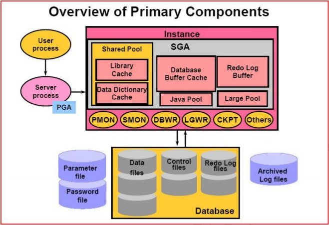
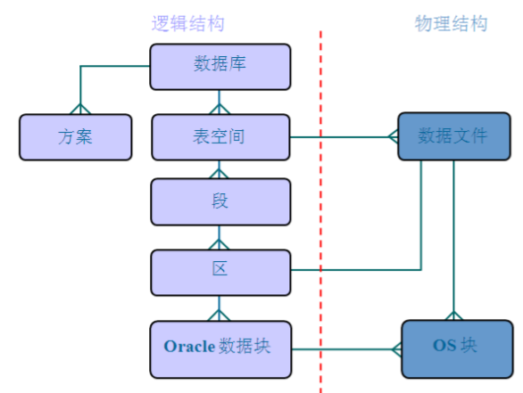
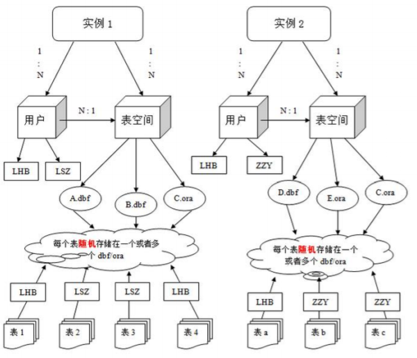

# 五、 Oracle数据库

- 5.1 [介绍](#5.1-介绍)
- 5.2 [Oracle体系结构](#5.2-Oracle体系结构)
- 5.3 [基本操作](#5.3-基本操作)
- 5.4 [PL/SQL 基本语法](#5.4-PL/SQL 基本语法)
- 5.5 [存储过程](#5.5-存储过程)
- 5.6 [存储函数](#5.6-存储函数)
- 5.7 [触发器](#5.7-触发器)
- 5.8 [Java程序调用存储过程](#5.8-Java程序调用存储过程)

## 5.1 介绍

ORACLE数据库系统是美国ORACLE公司（甲骨文）提供的以分布式数据库为核心的一组软件产品，是目前最流行的客户/服务器(CLIENT/SERVER)或B/S体系结构的数据库之一。比如SilverStream就是基于数据库的一种中间件。ORACLE数据库是目前世界上使用最为广泛的数据库管理系统，作为一个通用的数据库系统，它具有完整的数据管理功能；作为一个关系数据库，它是一个完备关系的产品；作为分布式数据库它实现了分布式处理功能。但它的所有知识，只要在一种机型上学习了ORACLE知识，便能在各种类型的机器上使用它。

## 5.2 Oracle体系结构



### 5.2.1 数据库

Oracle数据库是数据的物理存储。这就包括（数据文件ORA或者DBF、控制文件、联机日志、参数文件）。其实Oracle数据库的概念和其它数据库不一样，这里的数据库是一个操作系统只有一个库。可以看作是Oracle就只有一个大数据库。

### 5.2.2 实例

一个Oracle实例（Oracle Instance）有一系列的后台进程（Backguound Processes)和内存结构（Memory Structures)组成。一个数据库可以有n个实例。

### 5.2.3 用户

用户是在实例下建立的。不同实例可以建相同名字的用户。

### 5.2.4 表空间

表空间是Oracle对物理数据库上相关数据文件（ORA或者DBF文件）的逻辑映射。一个数据库在逻辑上被划分成一到若干个表空间，每个表空间包含了在逻辑上相关联的一组结构。每个数据库至少有一个表空间(称之为system表空间)。

每个表空间由同一磁盘上的一个或多个文件组成，这些文件叫数据文件(datafile)。一个数据文件只能属于一个表空间。


### 5.2.5 数据文件（dbf、ora）

数据文件是数据库的物理存储单位。数据库的数据是存储在表空间中的，真正是在某一个或者多个数据文件中。而一个表空间可以由一个或多个数据文件组成，一个数据文件只能属于一个表空间。一旦数据文件被加入到某个表空间后，就不能删除这个文件，如果要删除某个数据文件，只能删除其所属于的表空间才行。

注：表的数据，是有用户放入某一个表空间的，而这个表空间会随机把这些表数据放到一个或者多个数据文件中。

由于oracle的数据库不是普通的概念，oracle是有用户和表空间对数据进行管理和存放的。但是表不是有表空间去查询的，而是由用户去查的。因为不同用户可以在同一个表空间建立同一个名字的表！这里区分就是用户了！





## 5.3 基本操作

### 5.3.1 创建表空间

表空间？ORACLE数据库的逻辑单元。数据库---表空间一个表空间可以与多个数据文件（物理结构）关联

一个数据库下可以建立多个表空间，一个表空间可以建立多个用户、一个用户下可以建立多个表。

```
create tablespace test
datafile 'c:\test.dbf'
size 100m
autoextend on
next 10m
```

- test为表空间名称
- datafile指定表空间对应的数据文件
- size后定义的是表空间的初始大小a
- utoextend on自动增长，当表空间存储都占满时，自动增长
- next后指定的是一次自动增长的大小。

### 5.3.2 用户

#### 创建用户

```
create user testuser
identified by test
default tablespace test
```

- identified by后边是用户的密码
- default tablespace后边是表空间名称

oracle数据库与其它数据库产品的区别在于，表和其它的数据库对象都是存储在用户下的。

#### 用户赋权限

新创建的用户没有任何权限，登陆后会提示

Oracle中已存在三个重要的角色：connect角色，resource角色，dba角色。

- CONNECT角色：--是授予最终用户的典型权利，最基本的
  - ALTER SESSION--修改会话
  - CREATE CLUSTER--建立聚簇
  - CREATE DATABASE LINK--建立数据库链接
  - CREATE SEQUENCE--建立序列
  - CREATE SESSION--建立会话
  - CREATE SYNONYM--建立同义词
  - CREATE VIEW--建立视图
- RESOURCE角色：--是授予开发人员的
  - CREATE CLUSTER--建立聚簇
  - CREATE PROCEDURE--建立过程
  - CREATE SEQUENCE--建立序列
  - CREATE TABLE--建表
  - CREATE TRIGGER--建立触发器
  - CREATE TYPE--建立类型
- DBA角色：拥有全部特权，是系统最高权限，只有DBA才可以创建数据库结构，并且系统权限也需要DBA授出，且DBA用户可以操作全体用户的任意基表，包括删除

```
grant dba to testuser
```

进入system用户下给用户赋予dba权限，否则无法正常登陆

### 5.3.3 Oracle数据类型[应用]

| No   | 数据类型          | 描述                                                         |
| ---- | ----------------- | ------------------------------------------------------------ |
| 1    | Varchar, varchar2 | 表示一个字符串                                               |
| 2    | NUMBER            | NUMBER(n)：表示一个整数，长度是n<br>NUMBER(m,n)：表示一个小数，总长度是m，小数是n，整数是m-n |
| 3    | DATA              | 表示日期类型                                                 |
| 4    | CLOB              | 大对象，表示大文本数据类型，可存4G                           |
| 5    | BLOB              | 大对象，表示二进制类型，可存4G                               |

### 5.3.4 表的管理

#### 序列

在很多数据库中都存在一个自动增长的列,如果现在要想在oracle中完成自动增长的功能,则只能依靠序列完成,所有的自动增长操作,需要用户手工完成处理。

语法：CREATE SEQUENCE 序列名

[INCREMENT BY n]

[START WITH n]

[{MAXVALUE/ MINVALUE n|NOMAXVALUE}]

[{CYCLE|NOCYCLE}]

[{CACHE n|NOCACHE}];

范例:创建一个seqpersonid的序列,验证自动增长的操作

CREATE SEQUENCE seqpersonid;

序列创建完成之后,所有的自动增长应该由用户自己处理,所以在序列中提供了以下的两种操作：

nextval:取得序列的下一个内容

currval:取得序列的当前内容

select seqpersonid.nextval from dual;

select seqpersonid.currval from dual;

在插入数据时需要自增的主键中可以这样使用

insert into person values(seqpersonid.nextval,'张三');

在实际项目中每一张表会配一个序列，但是表和序列是没有必然的联系的，一个序列被哪一张表使用都可以，但是我们一般都是一张表用一个序列。

序列的管理一般使用工具来管理。

### 5.3.5 视图

### 5.3.6 索引

## 5.4 PL/SQL 基本语法

什么是PL/SQL?

PL/SQL（Procedure Language/SQL）

PLSQL是Oracle对sql语言的过程化扩展，指在SQL命令语言中增加了过程处理语句（如分支、循环等），使SQL语言具有过程处理能力。把SQL语言的数据操纵能力与过程语言的数据处理能力结合起来，使得PLSQL面向过程但比过程语言简单、高效、灵活和实用。

范例1：为职工涨工资，每人涨10％的工资。

update emp set sal=sal*1.1

范例2：例2:按职工的职称长工资,总裁涨1000元,经理涨800元，其他人员涨400元。

这样的需求我们就无法使用一条SQL来实现，需要借助其他程序来帮助完成，也可以使用pl/sql。

### 5.4.1 程序语法

#### 程序语法：

```
declare
	说明部分 （变量说明，游标申明，例外说明〕
begin
	语句序列 （DML 语句〕…
exception
	例外处理语句
End;
```

#### 常量和变量的定义

在程序的声明阶段可以来定义常量和变量。

- 变量的基本类型就是oracle中的建表时字段的变量如char,varchar2,date,number,boolean,long

  - 定义语法：varl char(15); 
  - Psal number(9,2);
  - 说明变量名、数据类型和长度后用分号结束说明语句。
  - 常量定义：married constant boolean:=true

- 引用变量

  - Myname emp.ename%type;

  - 引用型变量，即my_name的类型与emp表中ename列的类型一样

  - 在sql中使用into来赋值

  - ```
    declare
    	emprec emp.ename%type;
    begin
    	select t.ename into emprec from emp t where t.empno = 7369;
    	dbms_output.put_line(emprec);
    end;
    ```

- 记录型变量

  - Emprec emp%rowtype

  - 记录变量分量的引用

  - emp_rec.ename:='ADAMS';

  - ```
    declare
    	p emp%rowtype;
    begin
    	select * into p from emp t where t.empno = 7369;
    	dbms_output.put_line(p.ename || ' ' || p.sal);
    end;
    ```

#### if 分支

#### LOOP 循环语句

#### 游标 Cursor

## 5.5 存储过程

存储过程（Stored Procedure）是在大型数据库系统中，一组为了完成特定功能的SQL语句集，经编译后存储在数据库中，用户通过指定存储过程的名字并给出参数（如果该存储过程带有参数）来执行它。存储过程是数据库中的一个重要对象，任何一个设计良好的数据库应用程序都应该用到存储过程。

## 5.6 存储函数

存储过程和存储函数的区别

一般来讲，过程和函数的区别在于函数可以有一个返回值；而过程没有返回值。

但过程和函数都可以通过out指定一个或多个输出参数。我们可以利用out参数，在过程和函数中实现返回多个值。

## 5.7 触发器

数据库触发器是一个与表相关联的、存储的PL/SQL程序。每当一个特定的数据操作语句(Insert,update,delete)在指定的表上发出时，Oracle自动地执行触发器中定义的语句序列。

触发器可用于

- 数据确认
- 实施复杂的安全性检查
- 做审计，跟踪表上所做的数据操作等
- 数据的备份和同步

触发器的类型

语句级触发器：在指定的操作语句操作之前或之后执行一次，不管这条语句影响了多少行。

行级触发器（FOR EACH ROW）：触发语句作用的每一条记录都被触发。在行级触发器中使用old和new伪记录变量,识别值的状态。

## 5.8 Java程序调用存储过程

测试代码

```java
 @Test
    public void testJdbc(){
        String driver="oracle.jdbc.OracleDriver";
        String url="jdbc:oracle:thin:@192.168.56.10:1521:orcl";
        String username="scoott";
        String password="tiger";
        
        try {
            Class.forName(driver);
            Connection con = DriverManager.getConnection(url, username, password);
            
            Statement st = con.createStatement();

            ResultSet rs = st.executeQuery("select * from emp ");
            while (rs.next()){
                System.out.println(rs.getObject(1)+","+rs.getObject(2));
            }
        }catch (Exception e){
            e.printStackTrace();
        }
    }
```

### 5.8.1 实现过程的调用

过程定义

```
--统计年薪的过程
create or replace procedure proc_countyearsal(eno in number,esal
out number)
as
begin
	select sal*12+nvl(comm,0) into esal from emp where empno=eno;
end;

--调用
declare
	esal number;
begin
	proc_countyearsal(7839,esal);
	dbms_output.put_line(esal);
end
```


```java
@Test
public void testProcedure01(){
    String driver="oracle.jdbc.OracleDriver";
    String url="jdbc:oracle:thin:@192.168.56.10:1521:orcl";
    String username="scott";
    String password="tiger";
    try {
        Class.forName(driver);
        Connection con = DriverManager.getConnection(url, username, password);
        CallableStatement callSt = con.prepareCall("{call proc_countyearsal(?,?)}");
        callSt.setInt(1, 7839);
        callSt.registerOutParameter(2,       OracleTypes.NUMBER);
        callSt.execute();
        System.out.println(callSt.getObject(2));
    } catch (Exception e) {
        e.printStackTrace();
    }
}
```

