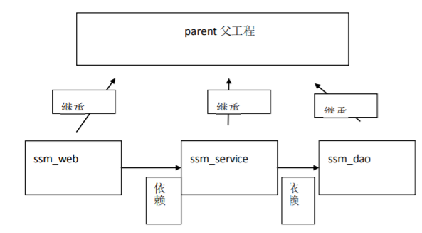
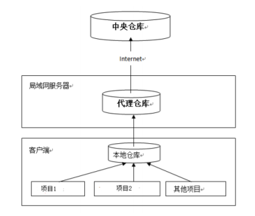

# 六、 Maven高级

- 6.1 [回顾](#6.1-回顾)
- 6.2 [依赖冲突](#6.2-依赖冲突)
- 6.3 [构建ssm](#6.3-构建ssm)
- 6.4 [分模块构建工程](#6.4-分模块构建工程)
- 6.5 [maven私服](#6.5-maven私服)

## 6.1 回顾

1. Maven 的好处
   - 节省磁盘空间
   - 可以一键构建
   - 可以跨平台
   - 应用在大型项目时可以提高开发效率
2. 安装配置 maven
   - 注意：3.3+版本需要 jdkj.7+以上的支持
3. 三种仓库
   - 本地仓库
   - 远程仓库（私服）
   - 中央仓库
4. 常见的命令
   - Compile
   - Test
   - Package
   - Install
   - Deploy
   - Clean
5. 坐标的书写规范
   - groupId 公司或组织域名的倒序
   - artifactId 项目名或模块名
   - version 版本号
6. 如何添加坐标
   1. 在本地仓库中搜索
   2. 互联网上搜，推荐网址 http://www.mvnrepository.com/
7. 依赖范围
   - Compile
   - Test
   - Runtime
   - Provided

## 6.2 依赖冲突

### 6.2.1 依赖调解原则

maven自动按照下边的原则调解：

1. 第一声明者优先原则

   在pom文件定义依赖，先声明的依赖为准。

2. 路径近者优先原则

   pom文件中和传递依赖同时存在，pom文件中的依赖为准。

### 6.2.2 排除依赖

在配置中添加排除依赖

```xml
<dependencies>
	<dependency>
    	<groupId></groupId>
        <artifactId></artifactId>
        <version></version>
        <exclusions>
        	<exclusion>
            	<groupId></groupId>
                <artifactId></artifactId>
            </exclusion>
        </exclusions>
    </dependency>
</dependencies>
```

### 6.2.3 版本锁定

面对众多的依赖，有一种方法不用考虑依赖路径、声明优化等因素可以采用直接锁定版本的方法确定依赖构件的版本，版本锁定后则不考虑依赖的声明顺序或依赖的路径，以锁定的版本的为准添加到工程中，此方法在企业开发中常用。

```xml
<dependencyManagement>
    <dependencies>
	    <dependency>
        	<groupId></groupId>
            <artifactId></artifactId>
            <version>5.0.2.RELEASE</version>
        </dependency>
    	<dependency>
        	<groupId></groupId>
            <artifactId></artifactId>
            <version>5.0.2.RELEASE</version>
        </dependency>
    </dependencies>
</dependencyManagement>
```

还可以把版本号提取出来，使用标签设置成变量。

```xml
<properties>
	<demo.version>5.0.2.RELEASE</demo.version>
</properties>
<dependencyManagement>
    <dependencies>
	    <dependency>
        	<groupId></groupId>
            <artifactId></artifactId>
            <version>${demo.version}</version>
        </dependency>
    	<dependency>
        	<groupId></groupId>
            <artifactId></artifactId>
            <version>${demo.version}</version>
        </dependency>
    </dependencies>
</dependencyManagement>
```

注意：在工程中锁定依赖的版本并不代表在工程中添加了依赖，如果工程需要添加锁定版本`<dependencies>`的依赖则需要单独添加标签

```xml
<dependencies>
	<dependency>
    	<groupId></groupId>
        <artifactId></artifactId>
    </dependency>
</dependencies>
```

上边添加的依赖并没有指定版本，原因是已在`<dependencyManagement>`中锁定了版本， 所以在`<dependency>`下不需要再指定版本。

## 6.3 构建ssm

### 6.3.1 定义pom.xml

maven 工程首先要识别依赖，web 工程实现 SSM 整合，需要依赖 spring-webmvc5.0.2、 spring5.0.2、mybatis3.4.5 等，在 pom.xml 添加工程依赖：

（在实际企业开发中会有架构师专门来编写 pom.xml）

分两步：锁定依赖版本，添加依赖

### 6.3.2 持久层

定义dao接口

### 6.3.3 业务层

定义service

### 6.3.4 表现层

定义controller

### 6.3.5 前端

## 6.4 分模块构建工程

继承：创建一个 parent 工程将所需的依赖都配置在 pom 中

聚合：聚合多个模块运行。

### 6.4.1 需求

将 SSM 工程拆分为多个模块开发：

ssm_dao

ssm_service

ssm_web



#### 理解继承和聚合

通常继承和聚合同时使用。

- 何为继承？ 

  继承是为了消除重复，如果将 dao、service、web 分开创建独立的工程则每个工程的 pom.xml 文件中的内容存在重复，比如：设置编译版本、锁定 spring 的版本的等，可以将这些重复的配置提取出来在父工程的 pom.xml 中定义。

- 何为聚合？

  项目开发通常是分组分模块开发，每个模块开发完成要运行整个工程需要将每个模块聚合在一起运行，比如：dao、service、web 三个工程最终会打一个独立的 war 运行

### 6.4.2 父工程

1. 选择`maven-archetype-site`骨架创建父工程

2. 设置项目打包方式`pom`

3. 定义pom.xml

   在父工程的 pom.xml 中抽取一些重复的配置的，比如：锁定 jar 包的版本、设置编译版本等。

4. 将父工程发布至仓库

   
   
   父工程创建完成执行 install 将父工程发布到仓库方便子工程继承

### 6.4.3 ssm_dao

1. 创建子工程（跳过骨架，注意创建子工程在父工程目录下）

2. 设置打包方式`jar`

3. 定义pom.xml

   只添加到层的 pom，mybatis 和 spring 的整合相关依赖

4. 编写代码

5. 把 dao 模块 install 到本地仓库

### 6.4.4 ssm_service

ssm_service 模块的 pom.xml 文件中需要继承父模块，ssm_service 依赖 ssm_dao 模块

#### 依赖范围对传递依赖的影响

是因为依赖会有依赖范围，依赖范围对传递依赖也有影响，例如有 A、B、C，A 依赖 B、B 依赖 C，C 可能是 A 的传递依赖，如下图：


最左边一列为直接依赖，理解为 A 依赖 B 的范围，最顶层一行为传递依赖，理解为 B 依赖 C 的范围，行与列的交叉即为 A 传递依赖 C 的范围。

举例：比如 A 对 B 有 compile 依赖，B 对 C 有 runtime 依赖，那么根据表格所示 A 对 C 有 runtime 依赖。

### 6.4.5 ssm_web

选择web骨架

### 6.4.6 分模块构建工程-依赖整合

每个模块都需要 spring 或者 junit 的 jar，况且最终 package 打完包最后生成的项目中的 jar 就是各个模块依赖的整合，所以我们可以把项目中所需的依赖都可以放到父工程中,模块中只留模块和模块之间的依赖。

## 6.5 maven私服

### 6.5.1 需求

正式开发，不同的项目组开发不同的工程。

ssm_dao 工程开发完毕，发布到私服。

ssm_service 从私服下载 dao

### 6.5.2 分析

公司在自己的局域网内搭建自己的远程仓库服务器，称为私服，私服服务器即是公司内部的 maven 远程仓库，每个员工的电脑上安装 maven 软件并且连接私服服务器，员工将自己开发的项目打成 jar 并发布到私服服务器，其它项目组从私服服务器下载所依赖的构件（jar）。

私服还充当一个代理服务器，当私服上没有 jar 包会从互联网中央仓库自动下载，如下图：



### 6.5.3 私服搭建

### 6.5.4 将项目发布到私服

#### 配置

第一步：需要在客户端即部署 ssm_dao 工程的电脑上配置 maven环境，并**修改 settings.xml** 文件，配置连接私服的用户和密码 。

此用户名和密码用于私服校验，因为私服需要知道上传的账号和密码是否和私服中的账号和密码一致。

```xml
<server>
    <id>releases</id>
    <username>admin</username>
    <password>admin123</password>
</server>
<server>
    <id>snapshots</id>
    <username>admin</username>
    <password>admin123</password>
</server>
```

releases 连接发布版本项目仓库

snapshots 连接测试版本项目仓库

第二步： 配置项目 pom.xml

配置私服仓库的地址，本公司的自己的 jar 包会上传到私服的宿主仓库，根据工程的版本号决定上传到哪个宿主仓库，如果版本为 release 则上传到私服的 release 仓库，如果版本为 snapshot 则上传到私服的 snapshot 仓库

```xml
<distributionManagement>
	<repository>
    	<id>releases</id>
        <url></url>
    </repository>
    <snapshotRepository>
    	<id>snapshots</id>
        <url></url>
    </snapshotRepository>
</distributionManagement>
```

注意：pom.xml 这里`<id>`和 settings.xml 配置`<id>`对应！

#### 测试

对 ssm_dao 工程执行 deploy 命令

#### 从私服下载 jar 包

没有配置 nexus 之前，如果本地仓库没有，去中央仓库下载，通常在企业中会在局域网内部署一台私服服务器，有了私服本地项目首先去本地仓库找 jar，如果没有找到则连接私服从私服下载 jar 包，如果私服没有 jar 包私服同时作为代理服务器从中央仓库下载 jar 包，这样做的好处是一方面由私服对公司项目的依赖 jar 包统一管理，一方面提高下载速度，项目连接私服下载 jar 包的速度要比项目连接中央仓库的速度快的多。

#### 管理仓库组

nexus中包括很多仓库，hosted中存放的是企业自己发布的jar包及第三方公司的jar包，proxy 中存放的是中央仓库的 jar，为了方便从私服下载 jar 包可以将多个仓库组成一个仓库组，每个工程需要连接私服的仓库组下载 jar 包。

在客户端的 setting.xml 中配置私服的仓库，由于 setting.xml 中没有 repositories 的配置标签需要使用 profile 定义仓库。