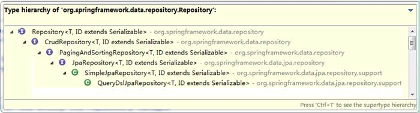
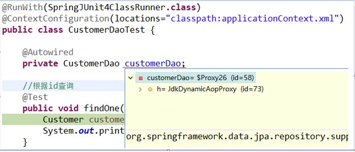
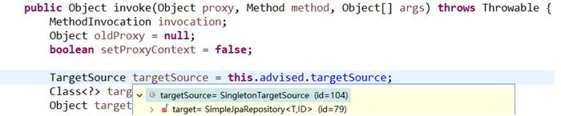
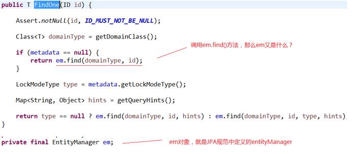
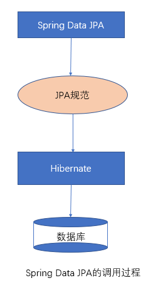
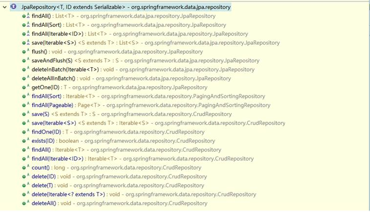
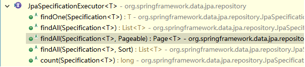
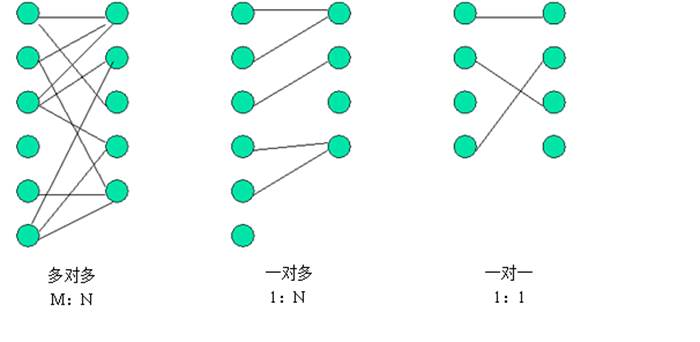
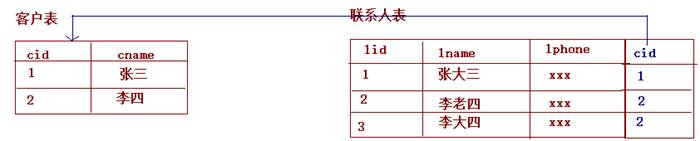
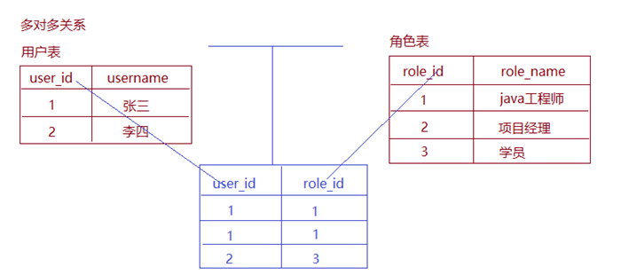

# 三、SpringDataJPA

- 3.1[SpringDataJPA的内部原理剖析](#3.1-SpringDataJPA的内部原理剖析)
- 3.2[SpringDataJPA的查询方式](#3.2-SpringDataJPA的查询方式)

- 3.3[Specifications动态查询](#3.3-Specifications动态查询)

- 3.4[多表设计](#3.4-多表设计)

- 3.5[JPA中的一对多](#3.5-JPA中的一对多)

- 3.6[JPA中的多对多](#3.6-JPA中的多对多)
- 3.7[SpringDataJPA的多表查询](#3.7-SpringDataJPA的多表查询)

## 3.1 SpringDataJPA的内部原理剖析

### 3.1.1 常用接口分析

在客户的案例中，我们发现在自定义的CustomerDao中，并没有提供任何方法就可以使用其中的很多方法，那么这些方法究竟是怎么来的呢？答案很简单，对于我们自定义的Dao接口，由于继承了JpaRepository和JpaSpecificationExecutor，所以我们可以使用这两个接口的所有方法。



在使用Spring Data JPA时，一般实现JpaRepository和JpaSpecificationExecutor接口，这样就可以使用这些接口中定义的方法，但是这些方法都只是一些声明，没有具体的实现方式，那么在 Spring Data JPA中它又是怎么实现的呢？

### 3.1.2 实现过程

通过对客户案例，以debug断点调试的方式，通过分析Spring Data JPA的原来来分析程序的执行过程

我们以findOne方法为例进行分析

- 代理子类的实现过程

  

  断点执行到方法上时，我们可以发现注入的customerDao对象，本质上是通过JdkDynamicAopProxy生成的一个代理对象

- 代理对象中方法调用的分析

  当程序执行的时候，会通过JdkDynamicAopProxy的invoke方法，对customerDao对象生成动态代理对象。根据对Spring Data JPA介绍而知，要想进行findOne查询方法，最终还是会出现JPA规范的API完成操作，那么这些底层代码存在于何处呢？答案很简单，都隐藏在通过JdkDynamicAopProxy生成的动态代理对象当中，而这个动态代理对象就是SimpleJpaRepository

  

  通过SimpleJpaRepository的源码分析，定位到了findOne方法，在此方法中，返回em.find()的返回结果，那么em又是什么呢？ 

  

  带着问题继续查找em对象，我们发现em就是EntityManager对象，而他是JPA原生的实现方式，所以我们得到结论Spring Data JPA只是对标准JPA操作进行了进一步封装，简化了Dao层代码的开发

### 3.1.3 完整的调用过程分析



## 3.2 SpringDataJPA的查询方式

### 3.2.1 使用SpringDataJPA中接口定义的方法进行查询

在继承JpaRepository，和JpaRepository接口后,我们就可以使用接口中定义的方法进行查询

- 继承JpaRepository后的方法列表

  

- 继承JpaSpecificationExecutor的方法列表

  

### 3.2.2 使用JPQL的方式查询

使用Spring Data JPA提供的查询方法已经可以解决大部分的应用场景，但是对于某些业务来说，我们还需要灵活的构造查询条件，这时就可以使用@Query注解，结合JPQL的语句方式完成查询

@Query 注解的使用非常简单，只需在方法上面标注该注解，同时提供一个JPQL查询语句即可

```java
public interface CustomerDao extends JpaRepository<Customer, Long>,JpaSpecificationExecutor<Customer> {    
    //@Query 使用jpql的方式查询。
    @Query(value="from Customer")
    public List<Customer> findAllCustomer();
    
    //@Query 使用jpql的方式查询。?1代表参数的占位符，其中1对应方法中的参数索引
    @Query(value="from Customer where custName = ?1")
    public Customer findCustomer(String custName);
}
```

此外，也可以通过使用 @Query 来执行一个更新操作，为此，我们需要在使用 @Query 的同时，用 @Modifying 来将该操作标识为修改查询，这样框架最终会生成一个更新的操作，而非查询

```java
    @Query(value="update Customer set custName = ?1 where custId = ?2")
    @Modifying
    public void updateCustomer(String custName,Long custId);
```

### 3.2.3 使用SQL语句查询

Spring Data JPA同样也支持sql语句的查询，如下：

```java
    /**
     * nativeQuery : 使用本地sql的方式查询
     */
    @Query(value="select * from cst_customer",nativeQuery=true)
    public void findSql();
```

### 3.2.4 方法命名规则查询

顾名思义，方法命名规则查询就是根据方法的名字，就能创建查询。只需要按照Spring Data JPA提供的方法命名规则定义方法的名称，就可以完成查询工作。Spring Data JPA在程序执行的时候会根据方法名称进行解析，并自动生成查询语句进行查询

按照Spring Data JPA 定义的规则，查询方法以findBy开头，涉及条件查询时，条件的属性用条件关键字连接，要注意的是：条件属性首字母需大写。框架在进行方法名解析时，会先把方法名多余的前缀截取掉，然后对剩下部分进行解析。

```java
    //方法命名方式查询（根据客户名称查询客户）
    public Customer findByCustName(String custName);
```

具体的关键字，使用方法和生产成SQL如下表所示

|                   |                                           |                                                              |      |      |
| ----------------- | ----------------------------------------- | ------------------------------------------------------------ | ---- | ---- |
| **Keyword**       | **Sample**                                | **JPQL**                                                     |      |      |
| And               | findByLastnameAndFirstname                | …  where x.lastname = ?1 and x.firstname = ?2                |      |      |
| Or                | findByLastnameOrFirstname                 | …  where x.lastname = ?1 or x.firstname = ?2                 |      |      |
| Is,Equals         | findByFirstnameIs,  findByFirstnameEquals | …  where x.firstname = ?1                                    |      |      |
| Between           | findByStartDateBetween                    | …  where x.startDate between ?1 and ?2                       |      |      |
| LessThan          | findByAgeLessThan                         | …  where x.age < ?1                                          |      |      |
| LessThanEqual     | findByAgeLessThanEqual                    | …  where x.age ⇐ ?1                                          |      |      |
| GreaterThan       | findByAgeGreaterThan                      | …  where x.age > ?1                                          |      |      |
| GreaterThanEqual  | findByAgeGreaterThanEqual                 | …  where x.age >= ?1                                         |      |      |
| After             | findByStartDateAfter                      | …  where x.startDate > ?1                                    |      |      |
| Before            | findByStartDateBefore                     | …  where x.startDate < ?1                                    |      |      |
| IsNull            | findByAgeIsNull                           | …  where x.age is null                                       |      |      |
| IsNotNull,NotNull | findByAge(Is)NotNull                      | …  where x.age not null                                      |      |      |
| Like              | findByFirstnameLike                       | …  where x.firstname like ?1                                 |      |      |
| NotLike           | findByFirstnameNotLike                    | … where  x.firstname not like ?1                             |      |      |
| StartingWith      | findByFirstnameStartingWith               | …  where x.firstname like ?1 (parameter bound with appended %) |      |      |
| EndingWith        | findByFirstnameEndingWith                 | …  where x.firstname like ?1 (parameter bound with prepended %) |      |      |
| Containing        | findByFirstnameContaining                 | …  where x.firstname like ?1 (parameter bound wrapped in %)  |      |      |
| OrderBy           | findByAgeOrderByLastnameDesc              | …  where x.age = ?1 order by x.lastname desc                 |      |      |
| Not               | findByLastnameNot                         | …  where x.lastname <> ?1                                    |      |      |
| In                | findByAgeIn(Collection ages)              | …  where x.age in ?1                                         |      |      |
| NotIn             | findByAgeNotIn(Collection age)            | …  where x.age not in ?1                                     |      |      |
| TRUE              | findByActiveTrue()                        | …  where x.active = true                                     |      |      |
| FALSE             | findByActiveFalse()                       | …  where x.active = false                                    |      |      |
| IgnoreCase        | findByFirstnameIgnoreCase                 | …  where UPPER(x.firstame) = UPPER(?1)                       |      |      |

## 3.3 Specifications动态查询

有时我们在查询某个实体的时候，给定的条件是不固定的，这时就需要动态构建相应的查询语句，在Spring Data JPA中可以通过JpaSpecificationExecutor接口查询。相比JPQL,其优势是类型安全,更加的面向对象。

```java
/**
 *	JpaSpecificationExecutor中定义的方法
 **/
 public interface JpaSpecificationExecutor<T> {
   	//根据条件查询一个对象
 	T findOne(Specification<T> spec);	
   	//根据条件查询集合
 	List<T> findAll(Specification<T> spec);
   	//根据条件分页查询
 	Page<T> findAll(Specification<T> spec, Pageable pageable);
   	//排序查询查询
 	List<T> findAll(Specification<T> spec, Sort sort);
   	//统计查询
 	long count(Specification<T> spec);
}
```

对于JpaSpecificationExecutor，这个接口基本是围绕着Specification接口来定义的。我们可以简单的理解为，Specification构造的就是查询条件。

Specification接口中只定义了如下一个方法

```java
    //构造查询条件
    /**
    *	root	：Root接口，代表查询的根对象，可以通过root获取实体中的属性
    *	query	：代表一个顶层查询对象，用来自定义查询
    *	cb		：用来构建查询，此对象里有很多条件方法
    **/
    public Predicate toPredicate(Root<T> root, CriteriaQuery<?> query, CriteriaBuilder cb);
```

### 3.3.1 使用Specifications完成条件查询

```java
	//依赖注入customerDao
	@Autowired
	private CustomerDao customerDao;	
	@Test
	public void testSpecifications() {
      	//使用匿名内部类的方式，创建一个Specification的实现类，并实现toPredicate方法
		Specification <Customer> spec = new Specification<Customer>() {
			public Predicate toPredicate(Root<Customer> root, CriteriaQuery<?> query, CriteriaBuilder cb) {
				//cb:构建查询，添加查询方式   like：模糊匹配
				//root：从实体Customer对象中按照custName属性进行查询
				return cb.like(root.get("custName").as(String.class), "嘿嘿嘿%");
			}
		};
		Customer customer = customerDao.findOne(spec);
		System.out.println(customer);
	}
```

### 3.3.2 基于Specifications的分页查询

```java
    @Test
	public void testPage() {
		//构造查询条件
		Specification<Customer> spec = new Specification<Customer>() {
			public Predicate toPredicate(Root<Customer> root, CriteriaQuery<?> query, CriteriaBuilder cb) {
				return cb.like(root.get("custName").as(String.class), "哈哈%");
			}
		};
		
		/**
		 * 构造分页参数
		 * 		Pageable : 接口
		 * 			PageRequest实现了Pageable接口，调用构造方法的形式构造
		 * 				第一个参数：页码（从0开始）
		 * 				第二个参数：每页查询条数
		 */
		Pageable pageable = new PageRequest(0, 5);
		
		/**
		 * 分页查询，封装为Spring Data Jpa 内部的page bean
		 * 		此重载的findAll方法为分页方法需要两个参数
		 * 			第一个参数：查询条件Specification
		 * 			第二个参数：分页参数
		 */
		Page<Customer> page = customerDao.findAll(spec,pageable);
		
	}
```

对于Spring Data JPA中的分页查询，是其内部自动实现的封装过程，返回的是一个Spring Data JPA提供的pageBean对象。其中的方法说明如下：

```java
	 //获取总页数
	int getTotalPages();
	 //获取总记录数	
long getTotalElements();
//获取列表数据
List<T> getContent();
```

### 3.3.3 方法对应关系

| 方法名称                    | Sql对应关系           |
| --------------------------- | --------------------- |
| equle                       | filed =  value        |
| gt（greaterThan ）          | filed  > value        |
| lt（lessThan ）             | filed  < value        |
| ge（greaterThanOrEqualTo ） | filed  >= value       |
| le（ lessThanOrEqualTo）    | filed  <= value       |
| notEqule                    | filed  != value       |
| like                        | filed  like value     |
| notLike                     | filed  not like value |

## 3.4 多表设计

### 3.4.1 表之间关系的划分

数据库中多表之间存在着三种关系，如图所示。



从图可以看出，系统设计的三种实体关系分别为：多对多、一对多和一对一关系。注意：一对多关系可以看为两种： 即一对多，多对一。所以说四种更精确。

明确：只涉及实际开发中常用的关联关系，一对多和多对多。而一对一的情况，在实际开发中几乎不用。

### 3.4.2 在JPA框架中表关系的分析步骤

在实际开发中，我们数据库的表难免会有相互的关联关系，在操作表的时候就有可能会涉及到多张表的操作。而在这种实现了ORM思想的框架中（如JPA），可以让我们通过操作实体类就实现对数据库表的操作。所以今天我们的学习重点是：掌握配置实体之间的关联关系。

**第一步：首先确定两张表之间的关系。**

如果关系确定错了，后面做的所有操作就都不可能正确。

**第二步：在数据库中实现两张表的关系**

**第三步：在实体类中描述出两个实体的关系**

**第四步：配置出实体类和数据库表的关系映射（重点）**

## 3.5 JPA中的一对多

我们采用的示例为客户和联系人。

客户：指的是一家公司，我们记为A。

联系人：指的是A公司中的员工。

在不考虑兼职的情况下，公司和员工的关系即为一对多。

### 3.5.1 表关系的建立

在一对多关系中，我们习惯把一的一方称之为主表，把多的一方称之为从表。在数据库中建立一对多的关系，需要使用数据库的外键约束。

什么是外键？

指的是从表中有一列，取值参照主表的主键，这一列就是外键。

一对多数据库关系的建立，如下图所示



### 3.5.2 实体类关系建立以及映射配置

在实体类中，由于客户是少的一方，它应该包含多个联系人，所以实体类要体现出客户中有多个联系人的信息，代码如下：

```java
/**
 * 客户的实体类
 * 明确使用的注解都是JPA规范的
 * 所以导包都要导入javax.persistence包下的
 */
@Entity//表示当前类是一个实体类
@Table(name="cst_customer")//建立当前实体类和表之间的对应关系
public class Customer implements Serializable {
	
	@Id//表明当前私有属性是主键
	@GeneratedValue(strategy=GenerationType.IDENTITY)//指定主键的生成策略
	@Column(name="cust_id")//指定和数据库表中的cust_id列对应
	private Long custId;
	@Column(name="cust_name")//指定和数据库表中的cust_name列对应
	private String custName;
	@Column(name="cust_source")//指定和数据库表中的cust_source列对应
	private String custSource;
	@Column(name="cust_industry")//指定和数据库表中的cust_industry列对应
	private String custIndustry;
	@Column(name="cust_level")//指定和数据库表中的cust_level列对应
	private String custLevel;
	@Column(name="cust_address")//指定和数据库表中的cust_address列对应
	private String custAddress;
	@Column(name="cust_phone")//指定和数据库表中的cust_phone列对应
	private String custPhone;
	
    //配置客户和联系人的一对多关系
  	@OneToMany(targetEntity=LinkMan.class)
	@JoinColumn(name="lkm_cust_id",referencedColumnName="cust_id")
	private Set<LinkMan> linkmans = new HashSet<LinkMan>(0);
	
	//getter and setter
}
```

由于联系人是多的一方，在实体类中要体现出，每个联系人只能对应一个客户，代码如下：

```java
/**
 * 联系人的实体类（数据模型）
 */
@Entity
@Table(name="cst_linkman")
public class LinkMan implements Serializable {
	@Id
	@GeneratedValue(strategy=GenerationType.IDENTITY)
	@Column(name="lkm_id")
	private Long lkmId;
	@Column(name="lkm_name")
	private String lkmName;
	@Column(name="lkm_gender")
	private String lkmGender;
	@Column(name="lkm_phone")
	private String lkmPhone;
	@Column(name="lkm_mobile")
	private String lkmMobile;
	@Column(name="lkm_email")
	private String lkmEmail;
	@Column(name="lkm_position")
	private String lkmPosition;
	@Column(name="lkm_memo")
	private String lkmMemo;

	//多对一关系映射：多个联系人对应客户
	@ManyToOne(targetEntity=Customer.class)
	@JoinColumn(name="lkm_cust_id",referencedColumnName="cust_id")
	private Customer customer;//用它的主键，对应联系人表中的外键
	
	//getter and setter
}
```

### 3.5.3 映射的注解说明

- **@OneToMany:**
  - 作用：建立一对多的关系映射
  - 属性：
    - targetEntityClass：指定多的多方的类的字节码
    - mappedBy：指定从表实体类中引用主表对象的名称。
    - cascade：指定要使用的级联操作
    - fetch：指定是否采用延迟加载
    - orphanRemoval：是否使用孤儿删除
- **@ManyToOne**
  - 作用：建立多对一的关系
  - 属性：
    - targetEntityClass：指定一的一方实体类字节码
    - cascade：指定要使用的级联操作
    - fetch：指定是否采用延迟加载
    - optional：关联是否可选。如果设置为false，则必须始终存在非空关系。
- **@JoinColumn**
  - 作用：用于定义主键字段和外键字段的对应关系。
  - 属性：
    - name：指定外键字段的名称
    - referencedColumnName：指定引用主表的主键字段名称
    - unique：是否唯一。默认值不唯一
    - nullable：是否允许为空。默认值允许。
    - insertable：是否允许插入。默认值允许。
    - updatable：是否允许更新。默认值允许。
    - columnDefinition：列的定义信息。

### 3.5.4 一对多的操作

#### 添加

```java
@RunWith(SpringJUnit4ClassRunner.class)
@ContextConfiguration(locations="classpath:applicationContext.xml")
public class OneToManyTest {

	@Autowired
	private CustomerDao customerDao;
	
	@Autowired
	private LinkManDao linkManDao;
	
	
	/**
	 * 保存操作
	 * 需求:
	 * 	保存一个客户和一个联系人
	 * 要求：
	 * 	创建一个客户对象和一个联系人对象
	 *  建立客户和联系人之间关联关系（双向一对多的关联关系）
	 *  先保存客户，再保存联系人
	 * 问题：
	 *		当我们建立了双向的关联关系之后，先保存主表，再保存从表时：
	 *		会产生2条insert和1条update.
	 * 		而实际开发中我们只需要2条insert。
	 *  
	 */
	@Test
	@Transactional  //开启事务
	@Rollback(false)//设置为不回滚
	public void testAdd() {
		Customer c = new Customer();
		c.setCustName("某个中心");
		c.setCustLevel("VIP客户");
		c.setCustSource("网络");
		c.setCustIndustry("商业办公");
		c.setCustAddress("某个地方");
		c.setCustPhone("43242420");
		
		LinkMan l = new LinkMan();
		l.setLkmName("联系人");
		l.setLkmGender("male");
		l.setLkmMobile("13811111111");
		l.setLkmPhone("3423423");
		l.setLkmEmail("43643534@qq.com");
		l.setLkmPosition("实习生");
		l.setLkmMemo("还行吧");

		c.getLinkMans().add(l);
		l.setCustomer(c);
		customerDao.save(c);
		linkManDao.save(l);
	}
}
```

通过保存的案例，我们可以发现在设置了双向关系之后，会发送两条insert语句，一条多余的update语句，那我们的解决是思路很简单，就是一的一方放弃维护权

```java
	/**
	 *放弃外键维护权的配置将如下配置改为
	 */
    //@OneToMany(targetEntity=LinkMan.class)
//@JoinColumn(name="lkm_cust_id",referencedColumnName="cust_id")	
//设置为
	@OneToMany(mappedBy="customer")
```

#### 删除

```java
	@Autowired
	private CustomerDao customerDao;
	
	@Test
	@Transactional
	@Rollback(false)//设置为不回滚
	public void testDelete() {
		customerDao.delete(1l);
	}
```

删除操作的说明如下：

**删除从表数据：可以随时任意删除。**

**删除主表数据：**

- 有从表数据
  1. 在默认情况下，它会把外键字段置为null，然后删除主表数据。如果在数据库的表结构上，外键字段有非空约束，默认情况就会报错了。
  2. 如果配置了放弃维护关联关系的权利，则不能删除（与外键字段是否允许为null，没有关系）因为在删除时，它根本不会去更新从表的外键字段了。
  3. 如果还想删除，使用级联删除引用

- 没有从表数据引用：随便删

在实际开发中，级联删除请慎用！(在一对多的情况下)

####  级联操作

级联操作：指操作一个对象同时操作它的关联对象

使用方法：只需要在操作主体的注解上配置cascade

```java
	/**
	 * cascade:配置级联操作
	 * 		CascadeType.MERGE	级联更新
	 * 		CascadeType.PERSIST	级联保存：
	 * 		CascadeType.REFRESH 级联刷新：
	 * 		CascadeType.REMOVE	级联删除：
	 * 		CascadeType.ALL		包含所有
	 */
	@OneToMany(mappedBy="customer",cascade=CascadeType.ALL)
```

## 3.6 JPA中的多对多

采用的示例为用户和角色。

用户：指的是咱们班的每一个同学。 

角色：指的是咱们班同学的身份信息。

比如A同学，它是我的学生，其中有个身份就是学生，还是家里的孩子，那么他还有个身份是子女。

同时B同学，它也具有学生和子女的身份。

那么任何一个同学都可能具有多个身份。同时学生这个身份可以被多个同学所具有。

所以我们说，用户和角色之间的关系是多对多。

### 3.6.1 表关系建立

多对多的表关系建立靠的是中间表，其中用户表和中间表的关系是一对多，角色表和中间表的关系也是一对多，如下图所示：



### 3.6.2 实体类关系建立以及映射配置

一个用户可以具有多个角色，所以在用户实体类中应该包含多个角色的信息，代码如下：

```java
/**
 * 用户的数据模型
 */
@Entity
@Table(name="sys_user")
public class SysUser implements Serializable {
	
	@Id
	@GeneratedValue(strategy=GenerationType.IDENTITY)
	@Column(name="user_id")
	private Long userId;
	@Column(name="user_code")
	private String userCode;
	@Column(name="user_name")
	private String userName;
	@Column(name="user_password")
	private String userPassword;
	@Column(name="user_state")
	private String userState;
	
	//多对多关系映射
	@ManyToMany(mappedBy="users")
	private Set<SysRole> roles = new HashSet<SysRole>(0);
	
	//getter and setter
}
```

一个角色可以赋予多个用户，所以在角色实体类中应该包含多个用户的信息，代码如下：

```java
/**
 * 角色的数据模型
 */
@Entity
@Table(name="sys_role")
public class SysRole implements Serializable {
	
	@Id
	@GeneratedValue(strategy=GenerationType.IDENTITY)
	@Column(name="role_id")
	private Long roleId;
	@Column(name="role_name")
	private String roleName;
	@Column(name="role_memo")
	private String roleMemo;
	
	//多对多关系映射
	@ManyToMany
	@JoinTable(name="user_role_rel",//中间表的名称
			  //中间表user_role_rel字段关联sys_role表的主键字段role_id
			  joinColumns={@JoinColumn(name="role_id",referencedColumnName="role_id")},
			  //中间表user_role_rel的字段关联sys_user表的主键user_id
			  inverseJoinColumns={@JoinColumn(name="user_id",referencedColumnName="user_id")}
	)
	private Set<SysUser> users = new HashSet<SysUser>(0);
	
	
	//getter and setter
}
```

### 3.6.3 映射的注解说明

- **@ManyToMany**
  - 作用：用于映射多对多关系
  - 属性：
    - cascade：配置级联操作。
    - fetch：配置是否采用延迟加载。
    - targetEntity：配置目标的实体类。映射多对多的时候不用写。
- **@JoinTable**
  - 作用：针对中间表的配置
  - 属性：
    - nam：配置中间表的名称
    - joinColumns：中间表的外键字段关联当前实体类所对应表的主键字段
    - inverseJoinColumn：中间表的外键字段关联对方表的主键字段
- **@JoinColumn**
  - 作用：用于定义主键字段和外键字段的对应关系。
  - 属性：
    - name：指定外键字段的名称
    - referencedColumnName：指定引用主表的主键字段名称
    - unique：是否唯一。默认值不唯一
    - nullable：是否允许为空。默认值允许。
    - insertable：是否允许插入。默认值允许。
    - updatable：是否允许更新。默认值允许。
    - columnDefinition：列的定义信息。

### 3.6.4 多对多的操作

#### 保存

```java
    @Autowired
	private UserDao userDao;
	
	@Autowired
	private RoleDao roleDao;
	/**
	 * 需求：
	 * 	保存用户和角色
	 * 要求：
	 * 	创建2个用户和3个角色
	 * 	让1号用户具有1号和2号角色(双向的)
	 * 	让2号用户具有2号和3号角色(双向的)
	 *  保存用户和角色
	 * 问题：
	 *  在保存时，会出现主键重复的错误，因为都是要往中间表中保存数据造成的。
	 * 解决办法：
	 * 	让任意一方放弃维护关联关系的权利
	 */
	@Test
	@Transactional  //开启事务
	@Rollback(false)//设置为不回滚
	public void test1(){
		//创建对象
		SysUser u1 = new SysUser();
		u1.setUserName("用户1");
		SysRole r1 = new SysRole();
		r1.setRoleName("角色1");
		//建立关联关系
		u1.getRoles().add(r1);
		r1.getUsers().add(u1);
		//保存
		roleDao.save(r1);
		userDao.save(u1);
	}
```

在多对多（保存）中，如果双向都设置关系，意味着双方都维护中间表，都会往中间表插入数据，中间表的2个字段又作为联合主键，所以报错，主键重复，解决保存失败的问题：只需要在任意一方放弃对中间表的维护权即可，推荐在被动的一方放弃，配置如下：

```java
	//放弃对中间表的维护权，解决保存中主键冲突的问题
	@ManyToMany(mappedBy="roles")
	private Set<SysUser> users = new HashSet<SysUser>(0);
```

#### 删除

```java
	@Autowired
	private UserDao userDao;
	/**
	 * 删除操作
	 * 	在多对多的删除时，双向级联删除根本不能配置
	 * 禁用
	 *	如果配了的话，如果数据之间有相互引用关系，可能会清空所有数据
	 */
	@Test
	@Transactional
	@Rollback(false)//设置为不回滚
	public void testDelete() {
		userDao.delete(1l);
	}
```

## 3.7 SpringDataJPA的多表查询

### 3.7.1 对象导航查询

对象图导航检索方式是根据已经加载的对象，导航到他的关联对象。它利用类与类之间的关系来检索对象。例如：我们通过ID查询方式查出一个客户，可以调用Customer类中的getLinkMans()方法来获取该客户的所有联系人。对象导航查询的使用要求是：两个对象之间必须存在关联关系。

查询一个客户，获取该客户下的所有联系人

```java
	@Autowired
	private CustomerDao customerDao;
	
	@Test
	//由于是在java代码中测试，为了解决no session问题，将操作配置到同一个事务中
	@Transactional 
	public void testFind() {
		Customer customer = customerDao.findOne(5l);
		Set<LinkMan> linkMans = customer.getLinkMans();//对象导航查询
		for(LinkMan linkMan : linkMans) {
  			System.out.println(linkMan);
		}
	}
```

查询一个联系人，获取该联系人的所有客户

```java
	@Autowired
	private LinkManDao linkManDao;
	
	
	@Test
	public void testFind() {
		LinkMan linkMan = linkManDao.findOne(4l);
		Customer customer = linkMan.getCustomer(); //对象导航查询
		System.out.println(customer);
	}
```

对象导航查询的问题分析

**问题1：我们查询客户时，要不要把联系人查询出来？**

分析：如果我们不查的话，在用的时候还要自己写代码，调用方法去查询。如果我们查出来的，不使用时又会白白的浪费了服务器内存。

解决：采用延迟加载的思想。通过配置的方式来设定当我们在需要使用时，发起真正的查询。

配置方式：

```java
	/**
	 * 在客户对象的@OneToMany注解中添加fetch属性
	 * 		FetchType.EAGER	：立即加载
	 * 		FetchType.LAZY	：延迟加载
	 */
	@OneToMany(mappedBy="customer",fetch=FetchType.EAGER)
	private Set<LinkMan> linkMans = new HashSet<>(0);
```

**问题2：我们查询联系人时，要不要把客户查询出来？**

分析：例如：查询联系人详情时，肯定会看看该联系人的所属客户。如果我们不查的话，在用的时候还要自己写代码，调用方法去查询。如果我们查出来的话，一个对象不会消耗太多的内存。而且多数情况下我们都是要使用的。 

解决： 采用立即加载的思想。通过配置的方式来设定，只要查询从表实体，就把主表实体对象同时查出来

配置方式

```java
	/**
	 * 在联系人对象的@ManyToOne注解中添加fetch属性
	 * 		FetchType.EAGER	：立即加载
	 * 		FetchType.LAZY	：延迟加载
	 */
	@ManyToOne(targetEntity=Customer.class,fetch=FetchType.EAGER)
	@JoinColumn(name="cst_lkm_id",referencedColumnName="cust_id")
	private Customer customer;
```

### 3.7.2 使用Specification查询

```java
	/**
	 * Specification的多表查询
	 */
	@Test
	public void testFind() {
		Specification<LinkMan> spec = new Specification<LinkMan>() {
			public Predicate toPredicate(Root<LinkMan> root, CriteriaQuery<?> query, CriteriaBuilder cb) {
				//Join代表链接查询，通过root对象获取
				//创建的过程中，第一个参数为关联对象的属性名称，第二个参数为连接查询的方式（left，inner，right）
				//JoinType.LEFT : 左外连接,JoinType.INNER：内连接,JoinType.RIGHT：右外连接
				Join<LinkMan, Customer> join = root.join("customer",JoinType.INNER);
				return cb.like(join.get("custName").as(String.class),"嘿嘿嘿1");
			}
		};
		List<LinkMan> list = linkManDao.findAll(spec);
		for (LinkMan linkMan : list) {
			System.out.println(linkMan);
		}
	}
```

