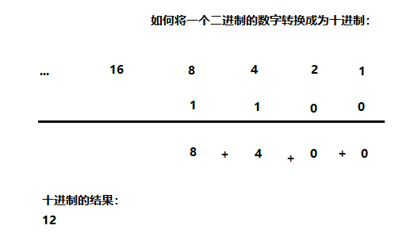

# 一、 计算机基础知识

**二进制**

计算机中的数据不同于人们生活中的数据，人们生活采用十进制数，而计算机中全部采用二进制数表示，它只包含 0、1两个数，逢二进一，1+1=10。每一个0或者每一个1，叫做一个bit（比特）。

下面了解一下十进制和二进制数据之间的转换计算。 

**十进制数据转成二进制数据**：使用除以2获取余数的方式

​	**二进制数据转成十进制数据**：使用8421编码的方式

> 小贴士：
>
> 二进制数系统中，每个0或1就是一个位，叫做bit（比特）。

**字节**

字节是我们常见的计算机中最小存储单元。计算机存储任何的数据，都是以字节的形式存储，右键点击文件属性， 我们可以查看文件的字节大小。

位（bit）：一个数字0或者一个数字1，代表一位。

字节（Byte）：每逢8位是一个字节，这是数据存储的最小单位。

- 1 Byte = 8 bit
- 1 KB = 1024 Byte
- 1 MB = 1024 KB
- 1 GB = 1024 MB
- 1 TB = 1024 GB
- 1 PB = 1024 TB
- 1 EB = 1024 PB
- 1 ZB = 1024 EB

**常用DOS命令**

Java语言的初学者，学习一些DOS命令，会非常有帮助。DOS是一个早期的操作系统，现在已经被Windows系统取代，对于我们开发人员，目前需要在DOS中完成一些事情，因此就需要掌握一些必要的命令。 

- 进入DOS操作窗口

  - 按下Windows+R键盘，打开运行窗口，输入cmd回车，进入到DOS的操作窗口。
  - 打开DOS命令行后，看到一个路径 c:\user 就表示我们现在操作的磁盘是c盘。

- 常用命令

  | 命令               | 操作符号                     |
  | :----------------- | ---------------------------- |
  | 盘符切换           | `盘符号:`                    |
  | 查看当前文件夹内容 | `dir`                        |
  | 进入文件夹         | `cd 文件夹名`                |
  | 进入多级文件夹     | `cd 文件夹1\文件夹2\文件夹3` |
  | 退出文件夹         | `cd ..`                      |
  | 退出到磁盘根目录   | `cd\`                        |
  | 清屏               | `cls`                        |
  | 退出               | `exit`                       |

