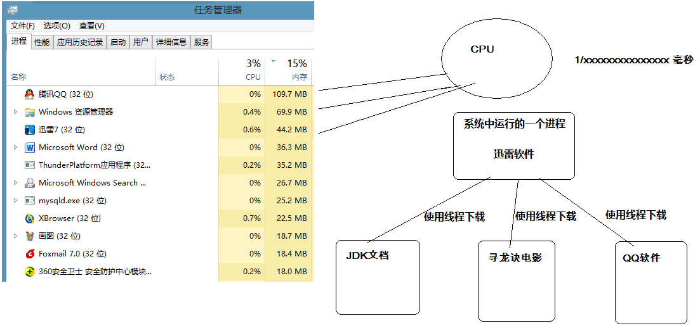
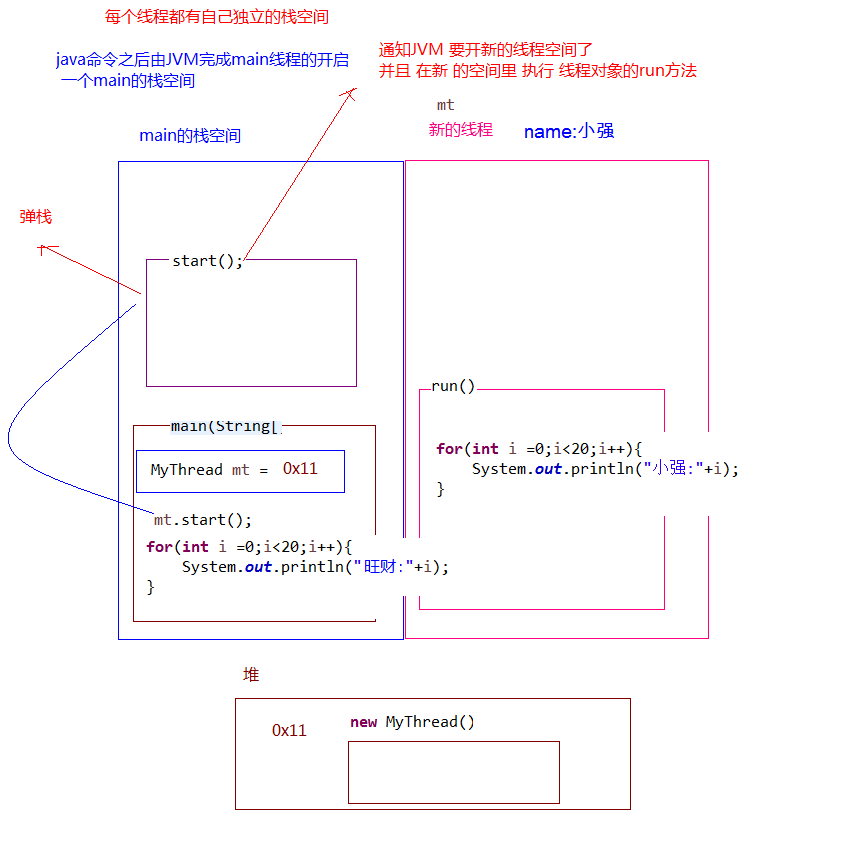
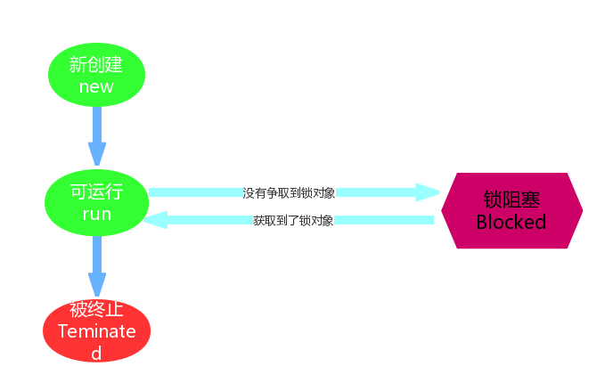
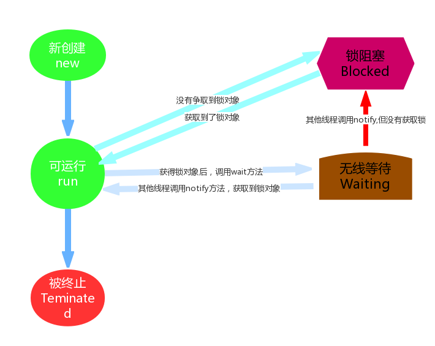

# 二、 异常与多线程

- 2.1 [异常](#2.1-异常)
- 2.2 [异常的处理](#2.2-异常的处理)
- 2.3 [自定义异常](#2.3-自定义异常)
- 2.4 [浅谈多线程](#2.4-浅谈多线程)
- 2.5 [线程](#2.5-线程)
- 2.6 [线程安全](#2.6-线程安全)
- 2.7 [线程状态](#2.7-线程状态)
- 2.8 [等待唤醒机制](#2.8-等待唤醒机制)
- 2.9 [线程池](#2.9-线程池)
- 2.10 [Lambda表达式](#2.10-Lambda表达式)

## 2.1 异常

异常，就是不正常的意思。在生活中:医生说,你的身体某个部位有异常,该部位和正常相比有点不同,该部位的功能将受影响.在程序中的意思就是：

* **异常** ：指的是程序在执行过程中，出现的非正常的情况，最终会导致JVM的非正常停止。

在Java等面向对象的编程语言中，异常本身是一个类，产生异常就是创建异常对象并抛出了一个异常对象。Java处理异常的方式是中断处理。

> 异常指的并不是语法错误,语法错了,编译不通过,不会产生字节码文件,根本不能运行.

### 2.1.1 异常体系

异常机制其实是帮助我们**找到**程序中的问题，异常的根类是`java.lang.Throwable`，其下有两个子类：`java.lang.Error`与`java.lang.Exception`，平常所说的异常指`java.lang.Exception`。


**Throwable体系：**

* **Error**:严重错误Error，无法通过处理的错误，只能事先避免，好比绝症。
* **Exception**:表示异常，异常产生后程序员可以通过代码的方式纠正，使程序继续运行，是必须要处理的。好比感冒、阑尾炎。

**Throwable中的常用方法：**

* `public void printStackTrace()`:打印异常的详细信息。

  *包含了异常的类型,异常的原因,还包括异常出现的位置,在开发和调试阶段,都得使用printStackTrace。*

* `public String getMessage()`:获取发生异常的原因。

  *提示给用户的时候,就提示错误原因。*

* `public String toString()`:获取异常的类型和异常描述信息(不用)。

***出现异常,不要紧张,把异常的简单类名,拷贝到API中去查。***


### 2.1.2 异常分类

我们平常说的异常就是指Exception，因为这类异常一旦出现，我们就要对代码进行更正，修复程序。

**异常(Exception)的分类**:根据在编译时期还是运行时期去检查异常?

* **编译时期异常**:checked异常。在编译时期,就会检查,如果没有处理异常,则编译失败。(如日期格式化异常)
* **运行时期异常**:runtime异常。在运行时期,检查异常.在编译时期,运行异常不会编译器检测(不报错)。(如数学异常)

​    

### 2.1.3 异常的产生过程解析

先运行下面的程序，程序会产生一个数组索引越界异常ArrayIndexOfBoundsException。我们通过图解来解析下异常产生的过程。

 工具类

~~~java
public class ArrayTools {
    // 对给定的数组通过给定的角标获取元素。
    public static int getElement(int[] arr, int index) {
        int element = arr[index];
        return element;
    }
}
~~~

 测试类

~~~java
public class ExceptionDemo {
    public static void main(String[] args) {
        int[] arr = { 34, 12, 67 };
        intnum = ArrayTools.getElement(arr, 4)
        System.out.println("num=" + num);
        System.out.println("over");
    }
}
~~~

上述程序执行过程图解：

 

## 2.2 异常的处理

Java异常处理的五个关键字：**try、catch、finally、throw、throws**

### 2.2.1 抛出异常throw

在编写程序时，我们必须要考虑程序出现问题的情况。比如，在定义方法时，方法需要接受参数。那么，当调用方法使用接受到的参数时，首先需要先对参数数据进行合法的判断，数据若不合法，就应该告诉调用者，传递合法的数据进来。这时需要使用抛出异常的方式来告诉调用者。

在java中，提供了一个**throw**关键字，它用来抛出一个指定的异常对象。那么，抛出一个异常具体如何操作呢？

1. 创建一个异常对象。封装一些提示信息(信息可以自己编写)。

2. 需要将这个异常对象告知给调用者。怎么告知呢？怎么将这个异常对象传递到调用者处呢？通过关键字throw就可以完成。throw 异常对象。

   throw**用在方法内**，用来抛出一个异常对象，将这个异常对象传递到调用者处，并结束当前方法的执行。

**使用格式：**

~~~
throw new 异常类名(参数);
~~~

 例如：

~~~java
throw new NullPointerException("要访问的arr数组不存在");

throw new ArrayIndexOutOfBoundsException("该索引在数组中不存在，已超出范围");
~~~

学习完抛出异常的格式后，我们通过下面程序演示下throw的使用。

~~~java
public class ThrowDemo {
    public static void main(String[] args) {
        //创建一个数组 
        int[] arr = {2,4,52,2};
        //根据索引找对应的元素 
        int index = 4;
        int element = getElement(arr, index);

        System.out.println(element);
        System.out.println("over");
    }
    /*
     * 根据 索引找到数组中对应的元素
     */
    public static int getElement(int[] arr,int index){ 
       	//判断  索引是否越界
        if(index<0 || index>arr.length-1){
             /*
             判断条件如果满足，当执行完throw抛出异常对象后，方法已经无法继续运算。
             这时就会结束当前方法的执行，并将异常告知给调用者。这时就需要通过异常来解决。 
              */
             throw new ArrayIndexOutOfBoundsException("哥们，角标越界了~~~");
        }
        int element = arr[index];
        return element;
    }
}
~~~

> 注意：如果产生了问题，我们就会throw将问题描述类即异常进行抛出，也就是将问题返回给该方法的调用者。
>
> 那么对于调用者来说，该怎么处理呢？一种是进行捕获处理，另一种就是继续讲问题声明出去，使用throws声明处理。

### 2.2.2 Objects非空判断

还记得我们学习过一个类Objects吗，曾经提到过它由一些静态的实用方法组成，这些方法是null-save（空指针安全的）或null-tolerant（容忍空指针的），那么在它的源码中，对对象为null的值进行了抛出异常操作。

* `public static <T> T requireNonNull(T obj)`:查看指定引用对象不是null。

查看源码发现这里对为null的进行了抛出异常操作：

~~~java
public static <T> T requireNonNull(T obj) {
    if (obj == null)
      	throw new NullPointerException();
    return obj;
}
~~~

### 2.2.3 声明异常throws

**声明异常**：将问题标识出来，报告给调用者。如果方法内通过throw抛出了编译时异常，而没有捕获处理（稍后讲解该方式），那么必须通过throws进行声明，让调用者去处理。

关键字**throws**运用于方法声明之上,用于表示当前方法不处理异常,而是提醒该方法的调用者来处理异常(抛出异常).

**声明异常格式：**

~~~
修饰符 返回值类型 方法名(参数) throws 异常类名1,异常类名2…{   }	
~~~

声明异常的代码演示：

~~~java
public class ThrowsDemo {
    public static void main(String[] args) throws FileNotFoundException {
        read("a.txt");
    }

    // 如果定义功能时有问题发生需要报告给调用者。可以通过在方法上使用throws关键字进行声明
    public static void read(String path) throws FileNotFoundException {
        if (!path.equals("a.txt")) {//如果不是 a.txt这个文件 
            // 我假设  如果不是 a.txt 认为 该文件不存在 是一个错误 也就是异常  throw
            throw new FileNotFoundException("文件不存在");
        }
    }
}
~~~

throws用于进行异常类的声明，若该方法可能有多种异常情况产生，那么在throws后面可以写多个异常类，用逗号隔开。

~~~java
public class ThrowsDemo2 {
    public static void main(String[] args) throws IOException {
        read("a.txt");
    }

    public static void read(String path)throws FileNotFoundException, IOException {
        if (!path.equals("a.txt")) {//如果不是 a.txt这个文件 
            // 我假设  如果不是 a.txt 认为 该文件不存在 是一个错误 也就是异常  throw
            throw new FileNotFoundException("文件不存在");
        }
        if (!path.equals("b.txt")) {
            throw new IOException();
        }
    }
}
~~~

### 2.2.4 捕获异常try…catch

如果异常出现的话,会立刻终止程序,所以我们得处理异常:

1. 该方法不处理,而是声明抛出,由该方法的调用者来处理(throws)。
2. 在方法中使用try-catch的语句块来处理异常。

**try-catch**的方式就是捕获异常。

* **捕获异常**：Java中对异常有针对性的语句进行捕获，可以对出现的异常进行指定方式的处理。

捕获异常语法如下：

~~~java
try{
     编写可能会出现异常的代码
}catch(异常类型  e){
     处理异常的代码
     //记录日志/打印异常信息/继续抛出异常
}
~~~

**try：**该代码块中编写可能产生异常的代码。

**catch：**用来进行某种异常的捕获，实现对捕获到的异常进行处理。

> 注意:try和catch都不能单独使用,必须连用。

演示如下：

~~~java
public class TryCatchDemo {
    public static void main(String[] args) {
        try {// 当产生异常时，必须有处理方式。要么捕获，要么声明。
            read("b.txt");
        } catch (FileNotFoundException e) {// 括号中需要定义什么呢？
          	//try中抛出的是什么异常，在括号中就定义什么异常类型
            System.out.println(e);
        }
        System.out.println("over");
    }
    /*
     *
     * 我们 当前的这个方法中 有异常  有编译期异常
     */
    public static void read(String path) throws FileNotFoundException {
        if (!path.equals("a.txt")) {//如果不是 a.txt这个文件 
            // 我假设  如果不是 a.txt 认为 该文件不存在 是一个错误 也就是异常  throw
            throw new FileNotFoundException("文件不存在");
        }
    }
}
~~~

如何获取异常信息：

Throwable类中定义了一些查看方法:

* `public String getMessage()`:获取异常的描述信息,原因(提示给用户的时候,就提示错误原因。


* `public String toString()`:获取异常的类型和异常描述信息(不用)。
* `public void printStackTrace()`:打印异常的跟踪栈信息并输出到控制台。

​            *包含了异常的类型,异常的原因,还包括异常出现的位置,在开发和调试阶段,都得使用printStackTrace。*

### 2.2.5 finally 代码块

**finally**：有一些特定的代码无论异常是否发生，都需要执行。另外，因为异常会引发程序跳转，导致有些语句执行不到。而finally就是解决这个问题的，在finally代码块中存放的代码都是一定会被执行的。

什么时候的代码必须最终执行？

当我们在try语句块中打开了一些物理资源(磁盘文件/网络连接/数据库连接等),我们都得在使用完之后,最终关闭打开的资源。

finally的语法:

 try...catch....finally:自身需要处理异常,最终还得关闭资源。

> 注意:finally不能单独使用。

比如在我们之后学习的IO流中，当打开了一个关联文件的资源，最后程序不管结果如何，都需要把这个资源关闭掉。

finally代码参考如下：

~~~java
public class TryCatchDemo4 {
    public static void main(String[] args) {
        try {
            read("a.txt");
        } catch (FileNotFoundException e) {
            //抓取到的是编译期异常  抛出去的是运行期 
            throw new RuntimeException(e);
        } finally {
            System.out.println("不管程序怎样，这里都将会被执行。");
        }
        System.out.println("over");
    }
    /*
     *
     * 我们 当前的这个方法中 有异常  有编译期异常
     */
    public static void read(String path) throws FileNotFoundException {
        if (!path.equals("a.txt")) {//如果不是 a.txt这个文件 
            // 我假设  如果不是 a.txt 认为 该文件不存在 是一个错误 也就是异常  throw
            throw new FileNotFoundException("文件不存在");
        }
    }
}
~~~

> 当只有在try或者catch中调用退出JVM的相关方法,此时finally才不会执行,否则finally永远会执行。


### 2.2.6 异常注意事项

* 多个异常使用捕获又该如何处理呢？

  1. 多个异常分别处理。
  2. 多个异常一次捕获，多次处理。
  3. 多个异常一次捕获一次处理。

  一般我们是使用一次捕获多次处理方式，格式如下：

  ```java
  try{
       编写可能会出现异常的代码
  }catch(异常类型A  e){  当try中出现A类型异常,就用该catch来捕获.
       处理异常的代码
       //记录日志/打印异常信息/继续抛出异常
  }catch(异常类型B  e){  当try中出现B类型异常,就用该catch来捕获.
       处理异常的代码
       //记录日志/打印异常信息/继续抛出异常
  }
  ```

  > 注意:这种异常处理方式，要求多个catch中的异常不能相同，并且若catch中的多个异常之间有子父类异常的关系，那么子类异常要求在上面的catch处理，父类异常在下面的catch处理。

* 运行时异常被抛出可以不处理。即不捕获也不声明抛出。

* 如果finally有return语句,永远返回finally中的结果,避免该情况. 

* 如果父类抛出了多个异常,子类重写父类方法时,抛出和父类相同的异常或者是父类异常的子类或者不抛出异常。

* 父类方法没有抛出异常，子类重写父类该方法时也不可抛出异常。此时子类产生该异常，只能捕获处理，不能声明抛出

## 2.3 自定义异常

**为什么需要自定义异常类:**

我们说了Java中不同的异常类,分别表示着某一种具体的异常情况,那么在开发中总是有些异常情况是SUN没有定义好的,此时我们根据自己业务的异常情况来定义异常类。例如年龄负数问题,考试成绩负数问题等等。

在上述代码中，发现这些异常都是JDK内部定义好的，但是实际开发中也会出现很多异常,这些异常很可能在JDK中没有定义过,例如年龄负数问题,考试成绩负数问题.那么能不能自己定义异常呢？

**什么是自定义异常类:**

在开发中根据自己业务的异常情况来定义异常类.

自定义一个业务逻辑异常: **RegisterException**。一个注册异常类。

**异常类如何定义:**

1. 自定义一个编译期异常: 自定义类 并继承于`java.lang.Exception`。
2. 自定义一个运行时期的异常类:自定义类 并继承于`java.lang.RuntimeException`。

### 2.3.1 自定义异常的练习

要求：我们模拟注册操作，如果用户名已存在，则抛出异常并提示：亲，该用户名已经被注册。

首先定义一个登陆异常类RegisterException：

~~~java
// 业务逻辑异常
public class RegisterException extends Exception {
    /**
     * 空参构造
     */
    public RegisterException() {
    }

    /**
     *
     * @param message 表示异常提示
     */
    public RegisterException(String message) {
        super(message);
    }
}
~~~

模拟登陆操作，使用数组模拟数据库中存储的数据，并提供当前注册账号是否存在方法用于判断。

~~~java
public class Demo {
    // 模拟数据库中已存在账号
    private static String[] names = {"bill","hill","jill"};
   
    public static void main(String[] args) {     
        //调用方法
        try{
              // 可能出现异常的代码
            checkUsername("nill");
            System.out.println("注册成功");//如果没有异常就是注册成功
        }catch(RegisterException e){
            //处理异常
            e.printStackTrace();
        }
    }

    //判断当前注册账号是否存在
    //因为是编译期异常，又想调用者去处理 所以声明该异常
    public static boolean checkUsername(String uname) throws LoginException{
        for (String name : names) {
            if(name.equals(uname)){//如果名字在这里面 就抛出登陆异常
                throw new RegisterException("亲"+name+"已经被注册了！");
            }
        }
        return true;
    }
}
~~~

##  2.4 浅谈多线程

我们在之前，学习的程序在没有跳转语句的前提下，都是由上至下依次执行，那现在想要设计一个程序，边打游戏边听歌，怎么设计？

要解决上述问题,咱们得使用多进程或者多线程来解决.

### 2.4.1 并发与并行

* **并发**：指两个或多个事件在**同一个时间段内**发生。
* **并行**：指两个或多个事件在**同一时刻**发生（同时发生）。


在操作系统中，安装了多个程序，并发指的是在一段时间内宏观上有多个程序同时运行，这在单 CPU 系统中，每一时刻只能有一道程序执行，即微观上这些程序是分时的交替运行，只不过是给人的感觉是同时运行，那是因为分时交替运行的时间是非常短的。

而在多个 CPU 系统中，则这些可以并发执行的程序便可以分配到多个处理器上（CPU），实现多任务并行执行，即利用每个处理器来处理一个可以并发执行的程序，这样多个程序便可以同时执行。目前电脑市场上说的多核 CPU，便是多核处理器，核 越多，并行处理的程序越多，能大大的提高电脑运行的效率。

> 注意：单核处理器的计算机肯定是不能并行的处理多个任务的，只能是多个任务在单个CPU上并发运行。同理,线程也是一样的，从宏观角度上理解线程是并行运行的，但是从微观角度上分析却是串行运行的，即一个线程一个线程的去运行，当系统只有一个CPU时，线程会以某种顺序执行多个线程，我们把这种情况称之为线程调度。

### 2.4.2 线程与进程

* **进程**：是指一个内存中运行的应用程序，每个进程都有一个独立的内存空间，一个应用程序可以同时运行多个进程；进程也是程序的一次执行过程，是系统运行程序的基本单位；系统运行一个程序即是一个进程从创建、运行到消亡的过程。

* **线程**：线程是进程中的一个执行单元，负责当前进程中程序的执行，一个进程中至少有一个线程。一个进程中是可以有多个线程的，这个应用程序也可以称之为多线程程序。 

  简而言之：一个程序运行后至少有一个进程，一个进程中可以包含多个线程 

我们可以再电脑底部任务栏，右键----->打开任务管理器,可以查看当前任务的进程：

**进程**


**线程**


**线程调度:**

- 分时调度

  所有线程轮流使用 CPU 的使用权，平均分配每个线程占用 CPU 的时间。

- 抢占式调度

  优先让优先级高的线程使用 CPU，如果线程的优先级相同，那么会随机选择一个(线程随机性)，Java使用的为抢占式调度。

  - 设置线程的优先级

  

  - 抢占式调度详解

    大部分操作系统都支持多进程并发运行，现在的操作系统几乎都支持同时运行多个程序。比如：现在我们上课一边使用编辑器，一边使用录屏软件，同时还开着画图板，dos窗口等软件。此时，这些程序是在同时运行，”感觉这些软件好像在同一时刻运行着“。

    实际上，CPU(中央处理器)使用抢占式调度模式在多个线程间进行着高速的切换。对于CPU的一个核而言，某个时刻，只能执行一个线程，而 CPU的在多个线程间切换速度相对我们的感觉要快，看上去就是在同一时刻运行。
    其实，多线程程序并不能提高程序的运行速度，但能够提高程序运行效率，让CPU的使用率更高。

    

### 2.4.3 创建线程类

Java使用`java.lang.Thread`类代表**线程**，所有的线程对象都必须是Thread类或其子类的实例。每个线程的作用是完成一定的任务，实际上就是执行一段程序流即一段顺序执行的代码。Java使用线程执行体来代表这段程序流。Java中通过继承Thread类来**创建**并**启动多线程**的步骤如下：

1. 定义Thread类的子类，并重写该类的run()方法，该run()方法的方法体就代表了线程需要完成的任务,因此把run()方法称为线程执行体。
2. 创建Thread子类的实例，即创建了线程对象
3. 调用线程对象的start()方法来启动该线程

代码如下：

测试类：

~~~java
public class Demo01 {
	public static void main(String[] args) {
		//创建自定义线程对象
		MyThread mt = new MyThread("新的线程！");
		//开启新线程
		mt.start();
		//在主方法中执行for循环
		for (int i = 0; i < 10; i++) {
			System.out.println("main线程！"+i);
		}
	}
}
~~~

自定义线程类：

~~~java
public class MyThread extends Thread {
	//定义指定线程名称的构造方法
	public MyThread(String name) {
		//调用父类的String参数的构造方法，指定线程的名称
		super(name);
	}
	/**
	 * 重写run方法，完成该线程执行的逻辑
	 */
	@Override
	public void run() {
		for (int i = 0; i < 10; i++) {
			System.out.println(getName()+"：正在执行！"+i);
		}
	}
}
~~~

## 2.5 线程

### 2.5.1 多线程原理

上一章我们已经写过一版多线程的代码，很多同学对原理不是很清楚，那么本节先画个多线程执行时序图来体现一下多线程程序的执行流程。

代码如下：

自定义线程类：

```java
public class MyThread extends Thread{
    /*
    * 利用继承中的特点
    * 将线程名称传递 进行设置
    */
    public MyThread(String name){
        super(name);
    }
    /*
    * 重写run方法
    * 定义线程要执行的代码
    */
    public void run(){
        for (int i = 0; i < 20; i++) {
            //getName()方法 来自父亲
            System.out.println(getName()+i);
        }
    }
}
```

测试类：

```java
public class Demo {
    public static void main(String[] args) {
        System.out.println("这里是main线程");
        MyThread mt = new MyThread("小强");
        mt.start();//开启了一个新的线程
        for (int i = 0; i < 20; i++) {
            System.out.println("旺财:"+i);
        }
    }
}
```

流程图：


程序启动运行main时候，java虚拟机启动一个进程，主线程main在main()调用时候被创建。随着调用mt的对象的start方法，另外一个新的线程也启动了，这样，整个应用就在多线程下运行。

通过这张图我们可以很清晰的看到多线程的执行流程，那么为什么可以完成并发执行呢？我们再来讲一讲原理。

多线程执行时，到底在内存中是如何运行的呢？以上个程序为例，进行图解说明：

多线程执行时，在栈内存中，其实**每一个执行线程都有一片自己所属的栈内存空间**。进行方法的压栈和弹栈。



当执行线程的任务结束了，线程自动在栈内存中释放了。但是当所有的执行线程都结束了，那么进程就结束了。

### 2.5.2 Thread类

在上一节内容中我们已经可以完成最基本的线程开启，那么在我们完成操作过程中用到了`java.lang.Thread`类，API中该类中定义了有关线程的一些方法，具体如下：

**构造方法**：

- `public Thread()`:分配一个新的线程对象。
- `public Thread(String name)`:分配一个指定名字的新的线程对象。
- `public Thread(Runnable target)`:分配一个带有指定目标新的线程对象。
- `public Thread(Runnable target,String name)`:分配一个带有指定目标新的线程对象并指定名字。

**常用方法**：

- `public String getName()`:获取当前线程名称。
- `public void start()`:导致此线程开始执行; Java虚拟机调用此线程的run方法。
- `public void run()`:此线程要执行的任务在此处定义代码。
- `public static void sleep(long millis)`:使当前正在执行的线程以指定的毫秒数暂停（暂时停止执行）。
- `public static Thread currentThread()`:返回对当前正在执行的线程对象的引用。

翻阅API后得知创建线程的方式总共有两种，一种是继承Thread类方式，一种是实现Runnable接口方式，方式一我们上一章已经完成，接下来讲解方式二实现的方式。

### 2.5.3 创建线程方式二

采用`java.lang.Runnable`也是非常常见的一种，我们只需要重写run方法即可。

步骤如下：

1. 定义Runnable接口的实现类，并重写该接口的run()方法，该run()方法的方法体同样是该线程的线程执行体。
2. 创建Runnable实现类的实例，并以此实例作为Thread的target来创建Thread对象，该Thread对象才是真正 的线程对象。
3. 调用线程对象的start()方法来启动线程。

代码如下：

```java
public class MyRunnable implements Runnable{
    @Override
    public void run() {
        for (int i = 0; i < 20; i++) {
            System.out.println(Thread.currentThread().getName()+" "+i);
        }
    }
}
```

```java
public class Demo {
    public static void main(String[] args) {
        //创建自定义类对象 线程任务对象
        MyRunnable mr = new MyRunnable();
        //创建线程对象
        Thread t = new Thread(mr, "小强");
        t.start();
        for (int i = 0; i < 20; i++) {
            System.out.println("旺财 " + i);
        }
    }
}
```

通过实现Runnable接口，使得该类有了多线程类的特征。run()方法是多线程程序的一个执行目标。所有的多线程代码都在run方法里面。Thread类实际上也是实现了Runnable接口的类。

在启动的多线程的时候，需要先通过Thread类的构造方法Thread(Runnable target) 构造出对象，然后调用Thread对象的start()方法来运行多线程代码。

实际上所有的多线程代码都是通过运行Thread的start()方法来运行的。因此，不管是继承Thread类还是实现Runnable接口来实现多线程，最终还是通过Thread的对象的API来控制线程的，熟悉Thread类的API是进行多线程编程的基础。

> tips:Runnable对象仅仅作为Thread对象的target，Runnable实现类里包含的run()方法仅作为线程执行体。而实际的线程对象依然是Thread实例，只是该Thread线程负责执行其target的run()方法。

### 2.5.4 Thread和Runnable的区别

如果一个类继承Thread，则不适合资源共享。但是如果实现了Runable接口的话，则很容易的实现资源共享。

**总结**：

**实现Runnable接口比继承Thread类所具有的优势**：

1. 适合多个相同的程序代码的线程去共享同一个资源。
2. 可以避免java中的单继承的局限性。
3. 增加程序的健壮性，实现解耦操作，代码可以被多个线程共享，代码和线程独立。
4. 线程池只能放入实现Runable或Callable类线程，不能直接放入继承Thread的类。

> 扩充：在java中，每次程序运行至少启动2个线程。一个是main线程，一个是垃圾收集线程。因为每当使用java命令执行一个类的时候，实际上都会启动一个JVM，每一个JVM其实在就是在操作系统中启动了一个进程。

### 2.5.5 匿名内部类方式实现线程的创建

使用线程的内匿名内部类方式，可以方便的实现每个线程执行不同的线程任务操作。

使用匿名内部类的方式实现Runnable接口，重新Runnable接口中的run方法：

```java
public class NoNameInnerClassThread {
    public static void main(String[] args) {
// new Runnable(){
// public void run(){
// for (int i = 0; i < 20; i++) {
// System.out.println("张宇:"+i);
// }
// }
// }; //‐‐‐这个整体 相当于new MyRunnable()
        Runnable r = new Runnable(){
            public void run(){
                for (int i = 0; i < 20; i++) {
                    System.out.println("张宇:"+i);
                }
            }
        };
        new Thread(r).start();
        for (int i = 0; i < 20; i++) {
            System.out.println("费玉清:"+i);
        }
    }
}
```

## 2.6 线程安全

如果有多个线程在同时运行，而这些线程可能会同时运行这段代码。程序每次运行结果和单线程运行的结果是一样的，而且其他的变量的值也和预期的是一样的，就是线程安全的。

我们通过一个案例，演示线程的安全问题：

电影院要卖票，我们模拟电影院的卖票过程。假设要播放的电影是 “葫芦娃大战奥特曼”，本次电影的座位共100个(本场电影只能卖100张票)。

我们来模拟电影院的售票窗口，实现多个窗口同时卖 “葫芦娃大战奥特曼”这场电影票(多个窗口一起卖这100张票)需要窗口，采用线程对象来模拟；需要票，Runnable接口子类来模拟

模拟票：

```java
public class Ticket implements Runnable {
    private int ticket = 100;
    /*
    * 执行卖票操作
    */
    @Override
    public void run() {
        //每个窗口卖票的操作
        //窗口 永远开启
        while (true) {
            if (ticket > 0) {//有票 可以卖
                //出票操作
                //使用sleep模拟一下出票时间
                try {
                    Thread.sleep(100);
                } catch (InterruptedException e) {
                    // TODO Auto‐generated catch block
                    e.printStackTrace();
                }
                //获取当前线程对象的名字
                String name = Thread.currentThread().getName();
                System.out.println(name + "正在卖:" + ticket‐‐);
            }
        }
    }
}
```

测试类：

```java
public class Demo {
    public static void main(String[] args) {
        //创建线程任务对象
        Ticket ticket = new Ticket();
        //创建三个窗口对象
        Thread t1 = new Thread(ticket, "窗口1");
        Thread t2 = new Thread(ticket, "窗口2");
        Thread t3 = new Thread(ticket, "窗口3");
        //同时卖票
        t1.start();
        t2.start();
        t3.start();
    }
}
```

结果中有一部分这样现象：


发现程序出现了两个问题：

1. 相同的票数,比如5这张票被卖了两回。
2. 不存在的票，比如0票与-1票，是不存在的。

这种问题，几个窗口(线程)票数不同步了，这种问题称为线程不安全。

> 线程安全问题都是由全局变量及静态变量引起的。若每个线程中对全局变量、静态变量只有读操作，而无写操作，一般来说，这个全局变量是线程安全的；若有多个线程同时执行写操作，一般都需要考虑线程同步，否则的话就可能影响线程安全。

### 2.6.1 线程同步

当我们使用多个线程访问同一资源的时候，且多个线程中对资源有写的操作，就容易出现线程安全问题。

要解决上述多线程并发访问一个资源的安全性问题:也就是解决重复票与不存在票问题，Java中提供了同步机制(**synchronized**)来解决。

根据案例简述：

```java
窗口1线程进入操作的时候，窗口2和窗口3线程只能在外等着，窗口1操作结束，窗口1和窗口2和窗口3才有机会进入代码去执行。也就是说在某个线程修改共享资源的时候，其他线程不能修改该资源，等待修改完毕同步之后，才能去抢夺CPU资源，完成对应的操作，保证了数据的同步性，解决了线程不安全的现象。
```

为了保证每个线程都能正常执行原子操作,Java引入了线程同步机制。

那么怎么去使用呢？有三种方式完成同步操作：

1. 同步代码块。
2. 同步方法。
3. 锁机制。

### 2.6.2 同步代码块

- **同步代码块**：`synchronized`关键字可以用于方法中的某个区块中，表示只对这个区块的资源实行互斥访问。

格式:

```java
synchronized(同步锁){
    需要同步操作的代码
}
```

**同步锁**:

对象的同步锁只是一个概念,可以想象为在对象上标记了一个锁.

1. 锁对象 可以是任意类型。
2. 多个线程对象 要使用同一把锁。

> 注意:在任何时候,最多允许一个线程拥有同步锁,谁拿到锁就进入代码块,其他的线程只能在外等着(BLOCKED)。

使用同步代码块解决代码：

```java
public class Ticket implements Runnable{
    private int ticket = 100;
    Object lock = new Object();
    /*
    * 执行卖票操作
    */
    @Override
    public void run() {
        //每个窗口卖票的操作
        //窗口 永远开启
        while(true){
            synchronized (lock) {
                if(ticket>0){//有票 可以卖
                    //出票操作
                    //使用sleep模拟一下出票时间
                    try {
                        Thread.sleep(50);
                    } catch (InterruptedException e) {
                        // TODO Auto‐generated catch block
                        e.printStackTrace();
                    }
                    //获取当前线程对象的名字
                    String name = Thread.currentThread().getName();
                    System.out.println(name+"正在卖:"+ticket‐‐);
                }
            }
        }
    }
}
```

当使用了同步代码块后，上述的线程的安全问题，解决了。

### 2.6.3 同步方法

- **同步方法**:使用synchronized修饰的方法,就叫做同步方法,保证A线程执行该方法的时候,其他线程只能在方法外等着。

格式：

```java
public synchronized void method(){
    可能会产生线程安全问题的代码
}
```

> 同步锁是谁?
>
> 对于非static方法,同步锁就是this。
>
> 对于static方法,我们使用当前方法所在类的字节码对象(类名.class)。

使用同步方法代码如下：

```java
public class Ticket implements Runnable{
    private int ticket = 100;
    /*
    * 执行卖票操作
    */
    @Override
    public void run() {
        //每个窗口卖票的操作
        //窗口 永远开启
        while(true){
            sellTicket();
        }
    }
    /*
    * 锁对象 是 谁调用这个方法 就是谁
    * 隐含 锁对象 就是 this
    *
    */
    public synchronized void sellTicket(){
            if(ticket>0){//有票 可以卖
                //出票操作
                //使用sleep模拟一下出票时间
                try {
                    Thread.sleep(100);
                } catch (InterruptedException e) {
                    // TODO Auto‐generated catch block
                    e.printStackTrace();
                }
                //获取当前线程对象的名字
                String name = Thread.currentThread().getName();
                System.out.println(name+"正在卖:"+ticket‐‐);
            }
    }
}
```

### 2.6.4 Lock锁

`java.util.concurrent.locks.Lock`机制提供了比**synchronized**代码块和**synchronized**方法更广泛的锁定操作, 同步代码块/同步方法具有的功能Lock都有,除此之外更强大,更体现面向对象。

Lock锁也称同步锁，加锁与释放锁方法化了，如下：

- `public void lock()`:加同步锁。
- `public void unlock()`:释放同步锁。

使用如下：

```java
public class Ticket implements Runnable{
    private int ticket = 100;
    Lock lock = new ReentrantLock();
    /*
    * 执行卖票操作
    */
    @Override
    public void run() {
        //每个窗口卖票的操作
        //窗口 永远开启
        while(true){
            lock.lock();
            if(ticket>0){//有票 可以卖
                //出票操作
                //使用sleep模拟一下出票时间
                try {
                    Thread.sleep(50);
                } catch (InterruptedException e) {
                    // TODO Auto‐generated catch block
                    e.printStackTrace();
                }
                //获取当前线程对象的名字
                String name = Thread.currentThread().getName();
                System.out.println(name+"正在卖:"+ticket‐‐);
            }
            lock.unlock();
        }
    }
}
```

## 2.7 线程状态

当线程被创建并启动以后，它既不是一启动就进入了执行状态，也不是一直处于执行状态。在线程的生命周期中，有几种状态呢？在API中`java.lang.Thread.State`这个枚举中给出了六种线程状态：

这里先列出各个线程状态发生的条件，下面将会对每种状态进行详细解析

| 线程状态                | 导致状态发生条件                                             |
| ----------------------- | ------------------------------------------------------------ |
| NEW(新建)               | 线程刚被创建，但是并未启动。还没调用start方法                |
| Runnable(可运行)        | 线程可以在java虚拟机中运行的状态，可能正在运行自己代码，也可能没有，这取决于操作系统处理器。 |
| Blocked(锁阻塞)         | 当一个线程试图获取一个对象锁，而该对象锁被其他的线程持有，则该线程进入Blocked状态；当该线程持有锁时，该线程将变成Runnable状态。 |
| Waiting(无限等待)       | 一个线程在等待另一个线程执行一个（唤醒）动作时，该线程进入Waiting状态。进入这个状态后是不能自动唤醒的，必须等待另一个线程调用notify或者notifyAll方法才能够唤醒。 |
| Timed Waiting(计时等待) | 同waiting状态，有几个方法有超时参数，调用他们将进入Timed Waiting状态。这一状态将一直保持到超时期满或者接收到唤醒通知。带有超时参数的常用方法有Thread.sleep 、Object.wait。 |
| Teminated(被终止)       | 因为run方法正常退出而死亡，或者因为没有捕获的异常终止了run方法而死亡。 |

我们不需要去研究这几种状态的实现原理，我们只需知道在做线程操作中存在这样的状态。那我们怎么去理解这几个状态呢，新建与被终止还是很容易理解的，我们就研究一下线程从Runnable（可运行）状态与非运行状态之间的转换问题。

### 2.7.1 Timed Waiting(计时等待)

Timed Waiting在API中的描述为：一个正在限时等待另一个线程执行一个（唤醒）动作的线程处于这一状态。单独的去理解这句话，真是玄之又玄，其实我们在之前的操作中已经接触过这个状态了，在哪里呢？

在我们写卖票的案例中，为了减少线程执行太快，现象不明显等问题，我们在run方法中添加了sleep语句，这样就强制当前正在执行的线程休眠（**暂停执行**），以“减慢线程”。

其实当我们调用了sleep方法之后，当前执行的线程就进入到“休眠状态”，其实就是所谓的Timed Waiting(计时等待)，那么我们通过一个案例加深对该状态的一个理解。

**实现一个计数器，计数到100，在每个数字之间暂停1秒，每隔10个数字输出一个字符串**

代码：

```java
public class MyThread extends Thread {
    public void run() {
        for (int i = 0; i < 100; i++) {
            if ((i) % 10 == 0) {
                System.out.println("‐‐‐‐‐‐‐" + i);
            }
            System.out.print(i);
            try {
                Thread.sleep(1000);
                System.out.print(" 线程睡眠1秒！\n");
            } catch (InterruptedException e) {
                e.printStackTrace();
            }
        }
    }
    public static void main(String[] args) {
        new MyThread().start();
    }
}
```

通过案例可以发现，sleep方法的使用还是很简单的。我们需要记住下面几点：

1. 进入 TIMED_WAITING 状态的一种常见情形是调用的 sleep 方法，单独的线程也可以调用，不一定非要有协作关系。
2. 为了让其他线程有机会执行，可以将Thread.sleep()的调用**放线程run()之内**。这样才能保证该线程执行过程中会睡眠
3. sleep与锁无关，线程睡眠到期自动苏醒，并返回到Runnable（可运行）状态。

> 小提示：sleep()中指定的时间是线程不会运行的最短时间。因此，sleep()方法不能保证该线程睡眠到期后就开始立刻执行。

Timed Waiting 线程状态图：


### 2.7.2 BLOCKED(锁阻塞)

Blocked状态在API中的介绍为：一个正在阻塞等待一个监视器锁（锁对象）的线程处于这一状态。

我们已经学完同步机制，那么这个状态是非常好理解的了。比如，线程A与线程B代码中使用同一锁，如果线程A获取到锁，线程A进入到Runnable状态，那么线程B就进入到Blocked锁阻塞状态。

这是由Runnable状态进入Blocked状态。除此Waiting以及Time Waiting状态也会在某种情况下进入阻塞状态，而这部分内容作为扩充知识点带领大家了解一下。

Blocked 线程状态图



### 2.7.3 Waiting(无限等待)

Wating状态在API中介绍为：一个正在无限期等待另一个线程执行一个特别的（唤醒）动作的线程处于这一状态。

那么我们之前遇到过这种状态吗？答案是并没有，但并不妨碍我们进行一个简单深入的了解。我们通过一段代码来学习一下：

```java
public class WaitingTest {
    public static Object obj = new Object();
    public static void main(String[] args) {
        // 演示waiting
        new Thread(new Runnable() {
            @Override
            public void run() {
                while (true){
                    synchronized (obj){
                        try {
                            System.out.println( Thread.currentThread().getName() +"=== 获取到锁对象，调用wait方法，进入waiting状态，释放锁对象");
                            obj.wait(); //无限等待
                            //obj.wait(5000); //计时等待, 5秒 时间到，自动醒来
                        } catch (InterruptedException e) {
                            e.printStackTrace();
                        }
                        System.out.println( Thread.currentThread().getName() + "=== 从waiting状态醒来，获取到锁对象，继续执行了");
                    }
                }
            }
        },"等待线程").start();
        new Thread(new Runnable() {
            @Override
            public void run() {
                // while (true){ //每隔3秒 唤醒一次
                try {
                    System.out.println( Thread.currentThread().getName() +"‐‐‐‐‐ 等待3秒钟");
                    Thread.sleep(3000);
                } catch (InterruptedException e) {
                    e.printStackTrace();
                }
                synchronized (obj){
                    System.out.println( Thread.currentThread().getName() +"‐‐‐‐‐ 获取到锁对象,调用notify方法，释放锁对象");
                    obj.notify();
                }
            }
       // }
        },"唤醒线程").start();
    }
}
```

通过上述案例我们会发现，一个调用了某个对象的 Object.wait 方法的线程会等待另一个线程调用此对象的 Object.notify()方法 或 Object.notifyAll()方法。

其实waiting状态并不是一个线程的操作，它体现的是多个线程间的通信，可以理解为多个线程之间的协作关系，多个线程会争取锁，同时相互之间又存在协作关系。就好比在公司里你和你的同事们，你们可能存在晋升时的竞争，但更多时候你们更多是一起合作以完成某些任务。

当多个线程协作时，比如A，B线程，如果A线程在Runnable（可运行）状态中调用了wait()方法那么A线程就进入了Waiting（无限等待）状态，同时失去了同步锁。假如这个时候B线程获取到了同步锁，在运行状态中调用了notify()方法，那么就会将无限等待的A线程唤醒。注意是唤醒，如果获取到锁对象，那么A线程唤醒后就进入Runnable（可运行）状态；如果没有获取锁对象，那么就进入到Blocked（锁阻塞状态）。

Waiting 线程状态图



### 2.7.4 补充知识点

到此为止我们已经对线程状态有了基本的认识，想要有更多的了解，详情可以见下图：


> 一条有意思的tips:
>
> 我们在翻阅API的时候会发现Timed Waiting（计时等待） 与 Waiting（无限等待） 状态联系还是很紧密的，比如Waiting（无限等待） 状态中wait方法是空参的，而timed waiting（计时等待） 中wait方法是带参的。这种带参的方法，其实是一种倒计时操作，相当于我们生活中的小闹钟，我们设定好时间，到时通知，可是如果提前得到（唤醒）通知，那么设定好时间在通知也就显得多此一举了，那么这种设计方案其实是一举两得。如果没有得到（唤醒）通知，那么线程就处于Timed Waiting状态,直到倒计时完毕自动醒来；如果在倒计时期间得到（唤醒）通知，那么线程从Timed Waiting状态立刻唤醒。

## 2.8 等待唤醒机制

### 2.8.1 线程间通信

**概念：**多个线程在处理同一个资源，但是处理的动作（线程的任务）却不相同。

比如：线程A用来生成包子的，线程B用来吃包子的，包子可以理解为同一资源，线程A与线程B处理的动作，一个是生产，一个是消费，那么线程A与线程B之间就存在线程通信问题。


**为什么要处理线程间通信：**

多个线程并发执行时, 在默认情况下CPU是随机切换线程的，当我们需要多个线程来共同完成一件任务，并且我们希望他们有规律的执行, 那么多线程之间需要一些协调通信，以此来帮我们达到多线程共同操作一份数据。

**如何保证线程间通信有效利用资源：**

多个线程在处理同一个资源，并且任务不同时，需要线程通信来帮助解决线程之间对同一个变量的使用或操作。 就是多个线程在操作同一份数据时， 避免对同一共享变量的争夺。也就是我们需要通过一定的手段使各个线程能有效的利用资源。而这种手段即—— **等待唤醒机制。**

### 2.8.2 等待唤醒机制

**什么是等待唤醒机制**

这是多个线程间的一种**协作**机制。谈到线程我们经常想到的是线程间的**竞争（race）**，比如去争夺锁，但这并不是故事的全部，线程间也会有协作机制。就好比在公司里你和你的同事们，你们可能存在在晋升时的竞争，但更多时候你们更多是一起合作以完成某些任务。

就是在一个线程进行了规定操作后，就进入等待状态（**wait()**）， 等待其他线程执行完他们的指定代码过后 再将其唤醒（**notify()**）;在有多个线程进行等待时， 如果需要，可以使用 notifyAll()来唤醒所有的等待线程。

wait/notify 就是线程间的一种协作机制。

**等待唤醒中的方法**

等待唤醒机制就是用于解决线程间通信的问题的，使用到的3个方法的含义如下：

1. wait：线程不再活动，不再参与调度，进入 wait set 中，因此不会浪费 CPU 资源，也不会去竞争锁了，这时的线程状态即是 WAITING。它还要等着别的线程执行一个**特别的动作**，也即是“**通知（notify）**”在这个对象上等待的线程从wait set 中释放出来，重新进入到调度队列（ready queue）中
2. notify：则选取所通知对象的 wait set 中的一个线程释放；例如，餐馆有空位置后，等候就餐最久的顾客最先入座。
3. notifyAll：则释放所通知对象的 wait set 上的全部线程。

>注意：
>
>哪怕只通知了一个等待的线程，被通知线程也不能立即恢复执行，因为它当初中断的地方是在同步块内，而此刻它已经不持有锁，所以她需要再次尝试去获取锁（很可能面临其它线程的竞争），成功后才能在当初调用 wait 方法之后的地方恢复执行。
>
>总结如下：
>
>- 如果能获取锁，线程就从 WAITING 状态变成 RUNNABLE 状态；
>- 否则，从 wait set 出来，又进入 entry set，线程就从 WAITING 状态又变成 BLOCKED 状态

**调用wait和notify方法需要注意的细节**

1. wait方法与notify方法必须要由同一个锁对象调用。因为：对应的锁对象可以通过notify唤醒使用同一个锁对象调用的wait方法后的线程。
2. wait方法与notify方法是属于Object类的方法的。因为：锁对象可以是任意对象，而任意对象的所属类都是继承了Object类的。
3. wait方法与notify方法必须要在同步代码块或者是同步函数中使用。因为：必须要通过锁对象调用这2个方法。

### 2.8.3 生产者与消费者问题

等待唤醒机制其实就是经典的“生产者与消费者”的问题。

就拿生产包子消费包子来说等待唤醒机制如何有效利用资源：

~~~java
包子铺线程生产包子，吃货线程消费包子。当包子没有时（包子状态为false），吃货线程等待，包子铺线程生产包子（即包子状态为true），并通知吃货线程（解除吃货的等待状态）,因为已经有包子了，那么包子铺线程进入等待状态。接下来，吃货线程能否进一步执行则取决于锁的获取情况。如果吃货获取到锁，那么就执行吃包子动作，包子吃完（包子状态为false），并通知包子铺线程（解除包子铺的等待状态）,吃货线程进入等待。包子铺线程能否进一步执行则取决于锁的获取情况。
~~~

**代码演示：**

包子资源类：

~~~java
public class BaoZi {
     String  pier ;
     String  xianer ;
     boolean  flag = false ;//包子资源 是否存在  包子资源状态
}
~~~

吃货线程类：

~~~java
public class ChiHuo extends Thread{
    private BaoZi bz;

    public ChiHuo(String name,BaoZi bz){
        super(name);
        this.bz = bz;
    }
    @Override
    public void run() {
        while(true){
            synchronized (bz){
                if(bz.flag == false){//没包子
                    try {
                        bz.wait();
                    } catch (InterruptedException e) {
                        e.printStackTrace();
                    }
                }
                System.out.println("吃货正在吃"+bz.pier+bz.xianer+"包子");
                bz.flag = false;
                bz.notify();
            }
        }
    }
}
~~~

包子铺线程类：

~~~java
public class BaoZiPu extends Thread {

    private BaoZi bz;

    public BaoZiPu(String name,BaoZi bz){
        super(name);
        this.bz = bz;
    }

    @Override
    public void run() {
        int count = 0;
        //造包子
        while(true){
            //同步
            synchronized (bz){
                if(bz.flag == true){//包子资源  存在
                    try {

                        bz.wait();

                    } catch (InterruptedException e) {
                        e.printStackTrace();
                    }
                }

                // 没有包子  造包子
                System.out.println("包子铺开始做包子");
                if(count%2 == 0){
                    // 冰皮  五仁
                    bz.pier = "冰皮";
                    bz.xianer = "五仁";
                }else{
                    // 薄皮  牛肉大葱
                    bz.pier = "薄皮";
                    bz.xianer = "牛肉大葱";
                }
                count++;

                bz.flag=true;
                System.out.println("包子造好了："+bz.pier+bz.xianer);
                System.out.println("吃货来吃吧");
                //唤醒等待线程 （吃货）
                bz.notify();
            }
        }
    }
}
~~~

测试类：

~~~java
public class Demo {
    public static void main(String[] args) {
        //等待唤醒案例
        BaoZi bz = new BaoZi();

        ChiHuo ch = new ChiHuo("吃货",bz);
        BaoZiPu bzp = new BaoZiPu("包子铺",bz);

        ch.start();
        bzp.start();
    }
}
~~~

执行效果：

~~~java
包子铺开始做包子
包子造好了：冰皮五仁
吃货来吃吧
吃货正在吃冰皮五仁包子
包子铺开始做包子
包子造好了：薄皮牛肉大葱
吃货来吃吧
吃货正在吃薄皮牛肉大葱包子
包子铺开始做包子
包子造好了：冰皮五仁
吃货来吃吧
吃货正在吃冰皮五仁包子
~~~

## 2.9 线程池

### 2.9.1 线程池思想概述


我们使用线程的时候就去创建一个线程，这样实现起来非常简便，但是就会有一个问题：

如果并发的线程数量很多，并且每个线程都是执行一个时间很短的任务就结束了，这样频繁创建线程就会大大降低系统的效率，因为频繁创建线程和销毁线程需要时间。

那么有没有一种办法使得线程可以复用，就是执行完一个任务，并不被销毁，而是可以继续执行其他的任务？

在Java中可以通过线程池来达到这样的效果。本节我们就来详细讲解一下Java的线程池。

### 2.9.2 线程池概念

* **线程池：**其实就是一个容纳多个线程的容器，其中的线程可以反复使用，省去了频繁创建线程对象的操作，无需反复创建线程而消耗过多资源。

由于线程池中有很多操作都是与优化资源相关的，我们在这里就不多赘述。我们通过一张图来了解线程池的工作原理：


合理利用线程池能够带来三个好处：

1. 降低资源消耗。减少了创建和销毁线程的次数，每个工作线程都可以被重复利用，可执行多个任务。
2. 提高响应速度。当任务到达时，任务可以不需要的等到线程创建就能立即执行。
3. 提高线程的可管理性。可以根据系统的承受能力，调整线程池中工作线线程的数目，防止因为消耗过多的内存，而把服务器累趴下(每个线程需要大约1MB内存，线程开的越多，消耗的内存也就越大，最后死机)。

### 2.9.3 线程池的使用

Java里面线程池的顶级接口是`java.util.concurrent.Executor`，但是严格意义上讲`Executor`并不是一个线程池，而只是一个执行线程的工具。真正的线程池接口是`java.util.concurrent.ExecutorService`。

要配置一个线程池是比较复杂的，尤其是对于线程池的原理不是很清楚的情况下，很有可能配置的线程池不是较优的，因此在`java.util.concurrent.Executors`线程工厂类里面提供了一些静态工厂，生成一些常用的线程池。官方建议使用Executors工程类来创建线程池对象。

Executors类中有个创建线程池的方法如下：

* `public static ExecutorService newFixedThreadPool(int nThreads)`：返回线程池对象。(创建的是有界线程池,也就是池中的线程个数可以指定最大数量)

获取到了一个线程池ExecutorService 对象，那么怎么使用呢，在这里定义了一个使用线程池对象的方法如下：

* `public Future<?> submit(Runnable task)`:获取线程池中的某一个线程对象，并执行

  > Future接口：用来记录线程任务执行完毕后产生的结果。线程池创建与使用。

使用线程池中线程对象的步骤：

1. 创建线程池对象。
2. 创建Runnable接口子类对象。(task)
3. 提交Runnable接口子类对象。(take task)
4. 关闭线程池(一般不做)。

Runnable实现类代码：

~~~java
public class MyRunnable implements Runnable {
    @Override
    public void run() {
        System.out.println("我要一个教练");
        try {
            Thread.sleep(2000);
        } catch (InterruptedException e) {
            e.printStackTrace();
        }
        System.out.println("教练来了： " + Thread.currentThread().getName());
        System.out.println("教我游泳,交完后，教练回到了游泳池");
    }
}
~~~

线程池测试类：

~~~java
public class ThreadPoolDemo {
    public static void main(String[] args) {
        // 创建线程池对象
        ExecutorService service = Executors.newFixedThreadPool(2);//包含2个线程对象
        // 创建Runnable实例对象
        MyRunnable r = new MyRunnable();

        //自己创建线程对象的方式
        // Thread t = new Thread(r);
        // t.start(); ---> 调用MyRunnable中的run()

        // 从线程池中获取线程对象,然后调用MyRunnable中的run()
        service.submit(r);
        // 再获取个线程对象，调用MyRunnable中的run()
        service.submit(r);
        service.submit(r);
        // 注意：submit方法调用结束后，程序并不终止，是因为线程池控制了线程的关闭。
        // 将使用完的线程又归还到了线程池中
        // 关闭线程池
        //service.shutdown();
    }
}
~~~


## 2.10 Lambda表达式

### 2.10.1 函数式编程思想概述


在数学中，**函数**就是有输入量、输出量的一套计算方案，也就是“拿什么东西做什么事情”。相对而言，面向对象过分强调“必须通过对象的形式来做事情”，而函数式思想则尽量忽略面向对象的复杂语法——**强调做什么，而不是以什么形式做**。

面向对象的思想:

​	做一件事情,找一个能解决这个事情的对象,调用对象的方法,完成事情.

函数式编程思想:

​	只要能获取到结果,谁去做的,怎么做的都不重要,重视的是结果,不重视过程

### 2.10.2 冗余的Runnable代码

#### 传统写法

当需要启动一个线程去完成任务时，通常会通过`java.lang.Runnable`接口来定义任务内容，并使用`java.lang.Thread`类来启动该线程。代码如下：

```java
public class Demo01Runnable {
	public static void main(String[] args) {
    	// 匿名内部类
		Runnable task = new Runnable() {
			@Override
			public void run() { // 覆盖重写抽象方法
				System.out.println("多线程任务执行！");
			}
		};
		new Thread(task).start(); // 启动线程
	}
}
```

本着“一切皆对象”的思想，这种做法是无可厚非的：首先创建一个`Runnable`接口的匿名内部类对象来指定任务内容，再将其交给一个线程来启动。

#### 代码分析

对于`Runnable`的匿名内部类用法，可以分析出几点内容：

- `Thread`类需要`Runnable`接口作为参数，其中的抽象`run`方法是用来指定线程任务内容的核心；
- 为了指定`run`的方法体，**不得不**需要`Runnable`接口的实现类；
- 为了省去定义一个`RunnableImpl`实现类的麻烦，**不得不**使用匿名内部类；
- 必须覆盖重写抽象`run`方法，所以方法名称、方法参数、方法返回值**不得不**再写一遍，且不能写错；
- 而实际上，**似乎只有方法体才是关键所在**。

### 2.10.3 编程思想转换

#### 做什么，而不是怎么做

我们真的希望创建一个匿名内部类对象吗？不。我们只是为了做这件事情而**不得不**创建一个对象。我们真正希望做的事情是：将`run`方法体内的代码传递给`Thread`类知晓。

**传递一段代码**——这才是我们真正的目的。而创建对象只是受限于面向对象语法而不得不采取的一种手段方式。那，有没有更加简单的办法？如果我们将关注点从“怎么做”回归到“做什么”的本质上，就会发现只要能够更好地达到目的，过程与形式其实并不重要。

#### 生活举例


当我们需要从北京到上海时，可以选择高铁、汽车、骑行或是徒步。我们的真正目的是到达上海，而如何才能到达上海的形式并不重要，所以我们一直在探索有没有比高铁更好的方式——搭乘飞机。


而现在这种飞机（甚至是飞船）已经诞生：2014年3月Oracle所发布的Java 8（JDK 1.8）中，加入了**Lambda表达式**的重量级新特性，为我们打开了新世界的大门。

### 2.10.4 体验Lambda的更优写法

借助Java 8的全新语法，上述`Runnable`接口的匿名内部类写法可以通过更简单的Lambda表达式达到等效：

```java
public class Demo02LambdaRunnable {
	public static void main(String[] args) {
		new Thread(() -> System.out.println("多线程任务执行！")).start(); // 启动线程
	}
}
```

这段代码和刚才的执行效果是完全一样的，可以在1.8或更高的编译级别下通过。从代码的语义中可以看出：我们启动了一个线程，而线程任务的内容以一种更加简洁的形式被指定。

不再有“不得不创建接口对象”的束缚，不再有“抽象方法覆盖重写”的负担，就是这么简单！

### 2.10.5 回顾匿名内部类

Lambda是怎样击败面向对象的？在上例中，核心代码其实只是如下所示的内容：

```java
() -> System.out.println("多线程任务执行！")
```

为了理解Lambda的语义，我们需要从传统的代码起步。

#### 使用实现类

要启动一个线程，需要创建一个`Thread`类的对象并调用`start`方法。而为了指定线程执行的内容，需要调用`Thread`类的构造方法：

* `public Thread(Runnable target)`

为了获取`Runnable`接口的实现对象，可以为该接口定义一个实现类`RunnableImpl`：

```java
public class RunnableImpl implements Runnable {
	@Override
	public void run() {
		System.out.println("多线程任务执行！");
	}
}
```

然后创建该实现类的对象作为`Thread`类的构造参数：

```java
public class Demo03ThreadInitParam {
	public static void main(String[] args) {
		Runnable task = new RunnableImpl();
		new Thread(task).start();
	}
}
```

#### 使用匿名内部类

这个`RunnableImpl`类只是为了实现`Runnable`接口而存在的，而且仅被使用了唯一一次，所以使用匿名内部类的语法即可省去该类的单独定义，即匿名内部类：

```java
public class Demo04ThreadNameless {
	public static void main(String[] args) {
		new Thread(new Runnable() {
			@Override
			public void run() {
				System.out.println("多线程任务执行！");
			}
		}).start();
	}
}
```

#### 匿名内部类的好处与弊端

一方面，匿名内部类可以帮我们**省去实现类的定义**；另一方面，匿名内部类的语法——**确实太复杂了！**

#### 语义分析

仔细分析该代码中的语义，`Runnable`接口只有一个`run`方法的定义：

* `public abstract void run();`

即制定了一种做事情的方案（其实就是一个函数）：

* **无参数**：不需要任何条件即可执行该方案。
* **无返回值**：该方案不产生任何结果。
* **代码块**（方法体）：该方案的具体执行步骤。

同样的语义体现在`Lambda`语法中，要更加简单：

```java
() -> System.out.println("多线程任务执行！")
```

* 前面的一对小括号即`run`方法的参数（无），代表不需要任何条件；
* 中间的一个箭头代表将前面的参数传递给后面的代码；
* 后面的输出语句即业务逻辑代码。

### 2.10.6 Lambda标准格式

Lambda省去面向对象的条条框框，格式由**3个部分**组成：

* 一些参数
* 一个箭头
* 一段代码

Lambda表达式的**标准格式**为：

```
(参数类型 参数名称) -> { 代码语句 }
```

格式说明：

* 小括号内的语法与传统方法参数列表一致：无参数则留空；多个参数则用逗号分隔。
* `->`是新引入的语法格式，代表指向动作。
* 大括号内的语法与传统方法体要求基本一致。

### 2.10.7 练习：使用Lambda标准格式（无参无返回）

#### 题目

给定一个厨子`Cook`接口，内含唯一的抽象方法`makeFood`，且无参数、无返回值。如下：

```java
public interface Cook {
    void makeFood();
}
```

在下面的代码中，请使用Lambda的**标准格式**调用`invokeCook`方法，打印输出“吃饭啦！”字样：

```java
public class Demo05InvokeCook {
    public static void main(String[] args) {
        // TODO 请在此使用Lambda【标准格式】调用invokeCook方法
    }

    private static void invokeCook(Cook cook) {
        cook.makeFood();
    }
}
```

#### 解答

```java
public static void main(String[] args) {
    invokeCook(() -> {
      	System.out.println("吃饭啦！");
    });
}
```

> 备注：小括号代表`Cook`接口`makeFood`抽象方法的参数为空，大括号代表`makeFood`的方法体。

### 2.10.8 Lambda的参数和返回值

```
需求:
    使用数组存储多个Person对象
    对数组中的Person对象使用Arrays的sort方法通过年龄进行升序排序
```

下面举例演示`java.util.Comparator<T>`接口的使用场景代码，其中的抽象方法定义为：

* `public abstract int compare(T o1, T o2);`

当需要对一个对象数组进行排序时，`Arrays.sort`方法需要一个`Comparator`接口实例来指定排序的规则。假设有一个`Person`类，含有`String name`和`int age`两个成员变量：

```java
public class Person { 
    private String name;
    private int age;
    
    // 省略构造器、toString方法与Getter Setter 
}
```

#### 传统写法

如果使用传统的代码对`Person[]`数组进行排序，写法如下：

```java
import java.util.Arrays;
import java.util.Comparator;

public class Demo06Comparator {
    public static void main(String[] args) {
      	// 本来年龄乱序的对象数组
        Person[] array = {
        	new Person("古力娜扎", 19),
        	new Person("迪丽热巴", 18),
       		new Person("马尔扎哈", 20) };

      	// 匿名内部类
        Comparator<Person> comp = new Comparator<Person>() {
            @Override
            public int compare(Person o1, Person o2) {
                return o1.getAge() - o2.getAge();
            }
        };
        Arrays.sort(array, comp); // 第二个参数为排序规则，即Comparator接口实例

        for (Person person : array) {
            System.out.println(person);
        }
    }
}
```

这种做法在面向对象的思想中，似乎也是“理所当然”的。其中`Comparator`接口的实例（使用了匿名内部类）代表了“按照年龄从小到大”的排序规则。

#### 代码分析

下面我们来搞清楚上述代码真正要做什么事情。

- 为了排序，`Arrays.sort`方法需要排序规则，即`Comparator`接口的实例，抽象方法`compare`是关键；
- 为了指定`compare`的方法体，**不得不**需要`Comparator`接口的实现类；
- 为了省去定义一个`ComparatorImpl`实现类的麻烦，**不得不**使用匿名内部类；
- 必须覆盖重写抽象`compare`方法，所以方法名称、方法参数、方法返回值**不得不**再写一遍，且不能写错；
- 实际上，**只有参数和方法体才是关键**。

#### Lambda写法

```java
import java.util.Arrays;

public class Demo07ComparatorLambda {
    public static void main(String[] args) {
        Person[] array = {
          	new Person("古力娜扎", 19),
          	new Person("迪丽热巴", 18),
          	new Person("马尔扎哈", 20) };

        Arrays.sort(array, (Person a, Person b) -> {
          	return a.getAge() - b.getAge();
        });

        for (Person person : array) {
            System.out.println(person);
        }
    }
}
```

### 2.10.9 练习：使用Lambda标准格式（有参有返回）

#### 题目

给定一个计算器`Calculator`接口，内含抽象方法`calc`可以将两个int数字相加得到和值：

```java
public interface Calculator {
    int calc(int a, int b);
}
```

在下面的代码中，请使用Lambda的**标准格式**调用`invokeCalc`方法，完成120和130的相加计算：

```java
public class Demo08InvokeCalc {
    public static void main(String[] args) {
        // TODO 请在此使用Lambda【标准格式】调用invokeCalc方法来计算120+130的结果ß
    }

    private static void invokeCalc(int a, int b, Calculator calculator) {
        int result = calculator.calc(a, b);
        System.out.println("结果是：" + result);
    }
}
```

#### 解答

```java
public static void main(String[] args) {
    invokeCalc(120, 130, (int a, int b) -> {
      	return a + b;
    });
}
```

> 备注：小括号代表`Calculator`接口`calc`抽象方法的参数，大括号代表`calc`的方法体。

### 2.10.10 Lambda省略格式

#### 可推导即可省略

Lambda强调的是“做什么”而不是“怎么做”，所以凡是可以根据上下文推导得知的信息，都可以省略。例如上例还可以使用Lambda的省略写法：

```java
public static void main(String[] args) {
  	invokeCalc(120, 130, (a, b) -> a + b);
}
```

#### 省略规则

在Lambda标准格式的基础上，使用省略写法的规则为：

1. 小括号内参数的类型可以省略；
2. 如果小括号内**有且仅有一个参**，则小括号可以省略；
3. 如果大括号内**有且仅有一个语句**，则无论是否有返回值，都可以省略大括号、return关键字及语句分号。

> 备注：掌握这些省略规则后，请对应地回顾本章开头的多线程案例。

### 2.10.11 练习：使用Lambda省略格式

#### 题目

仍然使用前文含有唯一`makeFood`抽象方法的厨子`Cook`接口，在下面的代码中，请使用Lambda的**省略格式**调用`invokeCook`方法，打印输出“吃饭啦！”字样：

```java
public class Demo09InvokeCook {
    public static void main(String[] args) {
        // TODO 请在此使用Lambda【省略格式】调用invokeCook方法
    }

    private static void invokeCook(Cook cook) {
        cook.makeFood();
    }
}
```

#### 解答

```java
public static void main(String[] args) {
  	invokeCook(() -> System.out.println("吃饭啦！"));
}
```

### 2.10.12 Lambda的使用前提

Lambda的语法非常简洁，完全没有面向对象复杂的束缚。但是使用时有几个问题需要特别注意：

1. 使用Lambda必须具有接口，且要求**接口中有且仅有一个抽象方法**。
   无论是JDK内置的`Runnable`、`Comparator`接口还是自定义的接口，只有当接口中的抽象方法存在且唯一时，才可以使用Lambda。
2. 使用Lambda必须具有**上下文推断**。
   也就是方法的参数或局部变量类型必须为Lambda对应的接口类型，才能使用Lambda作为该接口的实例。

> 备注：有且仅有一个抽象方法的接口，称为“**函数式接口**”。

