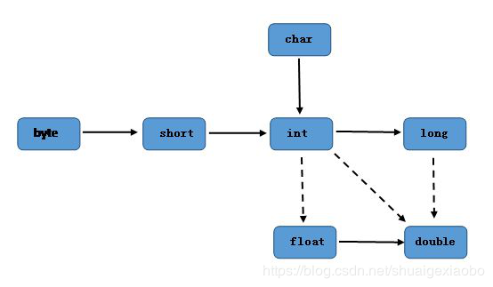

# 四、 数据

- 4.1 [常量](#4.1-常量)
- 4.2 [变量和数据类型](#4.2-变量和数据类型)
- 4.3 [数据类型转换](#4.3-数据类型转换)
- 4.4 [运算符](#4.4-运算符)

## 4.1 常量

**常量：是指在Java程序中固定不变的数据。**

### 4.1.1 分类

| 类型       | 含义                                       | 数据举例                 |
| ---------- | ------------------------------------------ | ------------------------ |
| 整数常量   | 所有的整数                                 | 0, 1, 534, -324          |
| 小数常量   | 所有的小数                                 | 0.0, -0.1, 2.33          |
| 字符常量   | 单引号引起来，只能写入一个字符，必须有内容 | 'a', ' ', '1', '和'      |
| 字符串常量 | 双引号引起来，可以写入多个字符，也可以不写 | “A”, “Hello”, "你好", "" |
| 布尔常量   | 只有两个值                                 | true, false              |
| 空常量     | 只有一个值                                 | null                     |

### 4.1.2 练习

需求：输出各种类型的常量。

```java
public class ConstantDemo {
    public static void main(String[] args){
        //输出整数常量
        System.out.println(123);
        //输出小数常量
        System.out.println(0.125);
        //输出字符常量
        System.out.println('A');
        //输出布尔常量
        System.out.println(true);
        //输出字符串常量
        System.out.println("你好Java");
    }
}
```

## 4.2 变量和数据类型

- 变量：常量是固定不变的数据，那么在程序中可以变化的量称为变量。

> 数学中，可以使用字母代替数字运算,例如 x=1+5 或者 6=x+5。 
>
> 程序中，可以使用字母保存数字的方式进行运算，提高计算能力，可以解决更多的问题。比如x保存5，x也可以保存6，这样x保存的数据是可以改变的，也就是我们所讲解的变量。

Java中要求一个变量每次只能保存一个数据，必须要明确保存的数据类型

### 4.2.1 数据类型

**1. 数据类型分类**

Java的数据类型分为两大类：

- 基本数据类型：包括`整数`、`浮点数`、`字符`、`布尔`。

- 引用数据类型：包括`类`、`数组`、`接口`。

**2. 基本数据类型**

四类八种基本数据类型：

| 数据类型     | 关键字       | 内存占用 | 取值范围                |
| ------------ | ------------ | -------- | ----------------------- |
| 字节型       | byte         | 1个字节  | -128 ~ 127              |
| 短整型       | short        | 2个字节  | -32768 ~ 32767          |
| 整型         | int(默认)    | 4个字节  | -2^31 ~ (2^31) - 1      |
| 长整型       | long         | 8个字节  | -2^63 ~ (2^63) - 1      |
| 单精度浮点数 | float        | 4个字节  | 1.4013E-45 ~ 3.4028E+38 |
| 双精度浮点数 | double(默认) | 8个字节  | 4.9E-324 ~ 1.7977E+308  |
| 字符型       | char         | 2个字节  | 0 - 65535               |
| 布尔类型     | boolean      | 1个字节  | true, false             |

> Java中的默认类型：整数类型是`int`、浮点类型是`double`。

### 4.2.2 变量的定义

变量定义的格式包括三个要素：`数据类型`、`变量名`、`数据值`。

**格式**

```java
数据类型 变量名 = 数据值;
```

**练习**

定义所有基本数据类型的变量，代码如下：

```java
public class Variable {
    public static void main(String[] args){
        //定义字节型变量
        byte b = 100;
        System.out.println(b);
        //定义短整型变量
        short s = 1000;
        System.out.println(s);
        //定义整型变量
        int i = 123456;
        System.out.println(i);
        //定义长整型变量
        long l = 12345678900L;
        System.out.println(l);
        //定义单精度浮点型变量
        float f = 5.5F;
        System.out.println(f);
        //定义双精度浮点型变量
        double d = 8.5;
        System.out.println(d);
        //定义布尔型变量
        boolean bool = false;
        System.out.println(bool);
        //定义字符型变量
        char c = 'A';
        System.out.println(c);
    }
}
```

> long类型：建议数据后加L表示。
>
> float类型：建议数据后加F表示。

> **注意事项**
>
> - 变量名称：在同一个大括号范围内，变量的名字不可以相同。
> - 变量赋值：定义的变量，不赋值不能使用。

## 4.3 数据类型转换

Java程序中要求参与的计算的数据，必须要保证数据类型的一致性，如果数据类型不一致将发生类型的转换。

### 4.3.1 自动类型转换

范围小的类型向范围大的类型提升，`byte`、`short`、`char`运算时直接提升为`int`。

```java
byte、short、char‐‐>int‐‐>long‐‐>float‐‐>double
```



> 注意：
>
> 布尔类型`boolean`占有一个字节，由于其本身所代码的特殊含义，`boolean`类型与其他基本类型不能进行类型的转换（既不能进行自动类型的提升，也不能强制类型转换），否则，将编译出错。

不仅如此，把任何基本类型的值和**字符串**进行连接运算时，基本类型的值将自动转换成为字符串类型，虽然字符串类型不是基本类型，而是引用类型。因此，如果想将基本类型的值转换为对应的字符串，可以把基本类型的值和一个空字符串进行连接。

 当一个**算数表达式**中包含多个基本类型的值的时候 ，整个算数表达式的数据类型将发生自动提升。java定义了如下的自动提升规则：

1. 所有的`byte`类型，`short`类型和`char`类型将被提升到`int`类型。
2. 整个算数表达式的数据类型自动提升到与表达式中最高等级操作数同样的类型。
3. java中整数类型默认是`int`类型，小数类型默认是`double`类型。

### 4.3.2 强制类型转换

强制类型转换：将`取值范围大的类型`强制转换成`取值范围小的类型`。 比较而言，自动转换是Java自动执行的，而强制转换需要我们自己手动执行。

转换格式：

```java
数据类型 变量名 = (数据类型)被转数据值;
```

例如：

```java
public static void main(String[] args) {
    //short类型变量，内存中2个字节
    short s = 1;
    /*
    出现编译失败
    s和1做运算的时候，1是int类型，s会被提升为int类型
    s+1后的结果是int类型，将结果在赋值会short类型时发生错误
    short内存2个字节，int类型4个字节
    必须将int强制转成short才能完成赋值
    */
    s = s + 1；//编译失败
    s = (short)(s+1);//编译成功
}
```

> **强烈注意：**
>
> - 浮点转成整数，直接取消小数点，可能造成数据损失精度。
> - `int`强制转成`short`砍掉2个字节，可能造成数据丢失。

### 4.3.3 ASCII编码表

```java
public static void main(String[] args) {
    //字符类型变量
    char c = 'a';
    int i = 1;
    //字符类型和int类型计算
    System.out.println(c+i);//输出结果是98
}

```

在计算机的内部都是二进制的0、1数据，如何让计算机可以直接识别人类文字的问题呢？就产生出了编码表的概念。

编码表 ：就是将人类的文字和一个十进制数进行对应起来组成一张表格。

常用ASCII码

| 字符 | 数值 |
| ---- | ---- |
| 0    | 48   |
| 9    | 57   |
| A    | 65   |
| Z    | 90   |
| a    | 97   |
| z    | 122  |

> 将所有的英文字母，数字，符号都和十进制进行了对应，因此产生了世界上第一张编码表[ASCII（ American Standard Code for Information Interchange 美国标准信息交换码）](参考/ASCII码表.pdf)。
>
> 还有其他常用编码表如：Unicode、UTF-8等等。

上面在`char`类型和`int`类型计算的过程中，`char`类型的字符先查询编码表，得到97，再和1求和，结果为98。`char`类型提升为了`int`类型。`char`类型内存2个字节，`int`类型内存4个字节。

## 4.4 运算符

### 4.4.1 算术运算符

| 算术运算符 |                          |
| ---------- | ------------------------ |
| `+`        | 加法运算、字符数连接运算 |
| `-`        | 减法运算                 |
| `*`        | 乘法运算                 |
| `/`        | 除法运算                 |
| `%`        | 取模运算                 |
| `++`、`--` | 自增、自减运算           |

Java中，整数使用以上运算符，无论怎么计算，也不会得到小数。

```java
public static void main(String[] args) {
    int i = 1234;
    System.out.println(i/1000*1000);//计算结果是1000
}

```

- `++`运算，变量自己增长1。反之，`--`运算，变量自己减少1，用法与`++`一致。

  - 独立运算：

    - 变量在独立运算时，`前++`和`后++`没有区别 。
    - 变量`前++`：例如`++i`。
    - 变量`后++`：例如`i++`。

  - 混合运算：

    - 和其他变量放在一起，`前++`和`后++`就产生了不同。
    - 变量`前++`：变量a自己加1，将加1后的结果赋值给b，也就是说a先计算。a和b的结果都是2。

    ```java
    public static void main(String[] args) {
        int a = 1;
        int b = ++a;
        System.out.println(a);//计算结果是2
        System.out.println(b);//计算结果是2
    }
    
    ```

    - 变量`后++`：变量a先把自己的值1，赋值给变量b，此时变量b的值就是1，变量a自己再加1。a的结果是2，b 的结果是1。

    ```java
    public static void main(String[] args) {
        int a = 1;
        int b = a++;
        System.out.println(a);//计算结果是2
        System.out.println(b);//计算结果是1
    }
    
    ```

- `+`符号在字符串中的操作：

  - `+`符号在遇到字符串的时候，表示连接、拼接的含义。
  - "a"+"b"的结果是“ab”，连接含义

```java
public static void main(String[] args){
    System.out.println("5+5="+5+5);//输出5+5=55
}
```

### 4.4.2 赋值运算符

| 赋值运算符 |        |
| ---------- | ------ |
| `=`        | 等于号 |
| `+=`       | 加等于 |
| `-=`       | 减等于 |
| `*=`       | 乘等于 |
| `/=`       | 除等于 |
| `%=`       | 取模等 |

赋值运算符，就是将符号右边的值，赋给左边的变量。

```java
public static void main(String[] args){
    int i = 5;
    i+=5;//计算方式 i=i+5 变量i先加5，再赋值变量i
    System.out.println(i); //输出结果是10
}

```

### 4.4.3 比较运算符

| 比较运算符 |                                                              |
| ---------- | ------------------------------------------------------------ |
| `==`       | 比较符号两边数据是否相等，相等结果是true。                   |
| `<`        | 比较符号左边的数据是否小于右边的数据，如果小于结果是true。   |
| `>`        | 比较符号左边的数据是否大于右边的数据，如果大于结果是true。   |
| `<=`       | 比较符号左边的数据是否小于或者等于右边的数据，如果小于结果是true。 |
| `>=`       | 比较符号左边的数据是否大于或者等于右边的数据，如果小于结果是true。 |
| `!=`       | 不等于符号 ，如果符号两边的数据不相等，结果是true。          |

比较运算符，是两个数据之间进行比较的运算，运算结果都是布尔值`true`或者`false`。

```java
public static void main(String[] args) {
    System.out.println(1==1);//true
    System.out.println(1<2);//true
    System.out.println(3>4);//false
    System.out.println(3<=4);//true
    System.out.println(3>=4);//false
    System.out.println(3!=4);//true
}
```

### 4.4.4 逻辑运算符

| 逻辑运算符 |                                                              |
| ---------- | ------------------------------------------------------------ |
| `&&`       | 1. 两边都是true，结果是true<br>2. 一边是false，结果是false<br>特点：符号左边是false，右边不再运算 |
| `||`       | 1. 两边都是false，结果是false<br>2. 一边是true，结果是true<br>特点： 符号左边是true，右边不再运算 |
| `!`        | 1.`! true`结果是false<br>2.`! false`结果是true               |

逻辑运算符，是用来连接两个布尔类型结果的运算符，运算结果都是布尔值`true`或者`false`

```java
public static void main(String[] args) {
    System.out.println(true && true);//true
    System.out.println(true && false);//false
    System.out.println(false && true);//false，右边不计算
    System.out.println(false || false);//falase
    System.out.println(false || true);//true
    System.out.println(true || false);//true，右边不计算
    System.out.println(!false);//true
}
```

### 4.4.5 三元运算符

格式：

```java
数据类型 变量名 = 布尔类型表达式？结果1：结果2
```

- 三元运算符计算方式： 
  - 布尔类型表达式结果是true，三元运算符整体结果为结果1，赋值给变量。 
  - 布尔类型表达式结果是false，三元运算符整体结果为结果2，赋值给变量。

```java
public static void main(String[] args) {
    int i = (1==2 ? 100 : 200);
    System.out.println(i);//200
    int j = (3<=4 ? 500 : 600);
    System.out.println(j);//500
}

```

### 4.4.6 运算优先级

程序的基本功能是处理数据，任何编程语言都有自己的运算符。因为有了运算符，程序员才写出表达式，实现各种运算操作，实现各种逻辑要求。

  为实现逻辑和运算要求，编程语言设置了各种不同的运算符，且有优先级顺序，所以有的初学者使用复杂表达式的时候搞不清楚。这里详细介绍一下Java中的运算符。

  Java运算符很多，下面按优先顺序列出了各种运算符。

| 优先级（由高到低） | 运算符分类               | 结合顺序 | 运算符                                                    |
| ------------------ | ------------------------ | -------- | --------------------------------------------------------- |
| 1                  | 分隔符                   | 左结合   | `.` `[]` `()` `;` `,`                                     |
| 2                  | 一元运算符               | 右结合   | `!` `++` `--` `-` `~`                                     |
| 3                  | 算术运算符<br>移位运算符 | 左结合   | `*` `/` `%` `+` `-` `<<` `>>` `>>>`                       |
| 4                  | 关系运算符               | 左结合   | `<` `>` `<=` `>=` `instanceof(Java特有)` `==` `!=`        |
| 5                  | 逻辑运算符               | 左结合   | `!` `&&` `||` `~` `&` `|` `^`                             |
| 6                  | 三目运算符               | 右结合   | 布尔表达式?表达式1:表达式2                                |
| 7                  | 赋值运算符               | 右结合   | `=` `*=` `/=` `%=` `+=` `-=` `<<=` `>>=` `>>>=` `&=` `*=` |

