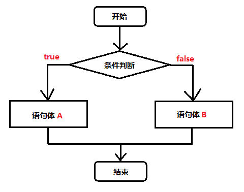
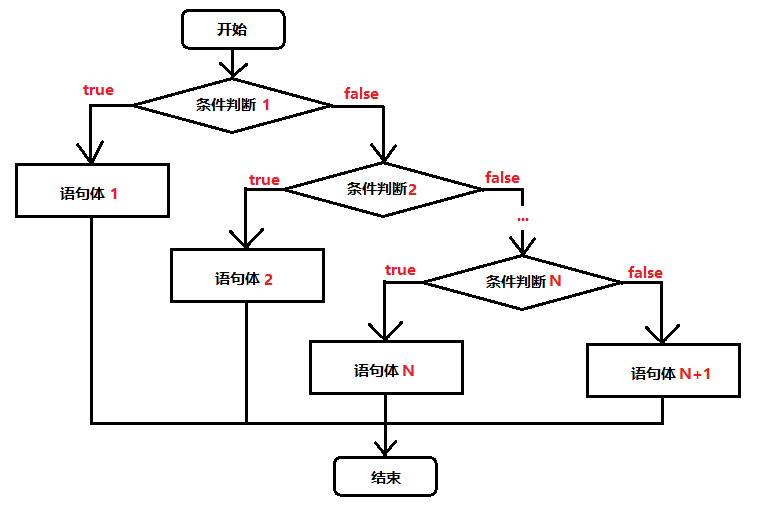

# 六、 流程控制语句

- 6.1 [if判断语句](#6.1-if判断语句)
- 6.2 [switch选择语句](#6.2-switch选择语句)
- 6.3 [for循环语句](#6.3-for循环语句)
- 6.4 [while循环语句](#6.4-while循环语句)
- 6.5 [do…while循环语句](#6.5-do…while循环语句)
- 6.6 [中断语句](#6.6-中断语句)
- 6.7 [其他](#6.7-其他)

在一个程序执行的过程中，各条语句的执行顺序对程序的结果是有直接影响的。也就是说，程序的流程对运行结果有直接的影响。所以，我们必须清楚每条语句的执行流程。而且，很多时候我们要通过控制语句的执行顺序来实现我们要完成的功能。


## 6.1 if判断语句

格式：

```java
if(关系表达式){
    执行语句；
}
```


```java
if(关系表达式){
    执行语句1；
}else{
	执行语句2；
}
```



```java
if(关系表达式1){
    语句体；
}else if(关系表达式2){
    执行语句2；
}
……
}else if(关系表达式n){
    执行语句n;
}else{
    执行语句n+1；
}
```



```java
public static void main(String[] args) {
    // x和y的关系满足如下：
    // x>=3 y = 2x + 1;
    //‐1<=x<3 y = 2x;
    // x<=‐1 y = 2x – 1;
    // 根据给定的x的值，计算出y的值并输出。
    // 定义变量
    int x = 5;
    int y;
    if (x>= 3) {
	y = 2 * x + 1;
	} else if (x >= ‐1 && x < 3) {
        y = 2 * x;
    } else {
        y = 2 * x ‐ 1;
    }
    System.out.println("y的值是："+y);
}
```

在某些简单的应用中，if语句也可以写成三元表达式。

```java
public static void main(String[] args) {
    int a = 10;
    int b = 20;
    //定义变量，保存a和b的较大值
    int c;
    if(a > b) {
        c = a;
    } else {
        c = b;
    }
    //可以上述功能改写为三元运算符形式
    c = a > b ? a:b;
}
```


## 6.2 switch选择语句

格式：

```java
switch(表达式) {
    case 常量值1:
        语句体1;
        break;
    case 常量值2:
        语句体2;
        break;
        ...
    default:
        语句体n+1;
        break;
}
```

- 执行流程
  - 首先计算出表达式的值
  - 其次，和`case`依次比较，一旦有对应的值，就会执行相应的语句，在执行的过程中，遇到`break`就会结束。
  - 最后，如果所有的`case`都和表达式的值不匹配，就会执行`default`语句体部分，然后程序结束掉。

> 注意：
>
> 如果漏掉`break`，会一直执行到下一个`case`，直到遇到一个`break`，或者整个switch执行结束。

```java
public static void main(String[] args) {
    //定义变量，判断是星期几
    int weekday = 6;
    //switch语句实现选择
    switch(weekday) {
        case 1:
            System.out.println("星期一");
            break;
        case 2:
            System.out.println("星期二");
            break;
        case 3:
            System.out.println("星期三");
            break;
        case 4:
            System.out.println("星期四");
            break;
        case 5:
            System.out.println("星期五");
            break;
        case 6:
            System.out.println("星期六");
            break;
        case 7:
            System.out.println("星期日");
            break;
        default:
            System.out.println("你输入的数字有误");
            break;
    }
}
```

switch语句中，表达式的数据类型，可以是`byte`，`short`，`int`，`char`，`enum`（枚举），JDK7后可以接收字符串。

## 6.3 for循环语句

循环语句可以在满足循环条件的情况下，反复执行某一段代码，这段被重复执行的代码被称为循环体语句，当反复执行这个循环体时，需要在合适的时候把循环判断条件修改为false，从而结束循环，否则循环将一直执行下去，形成死循环。

格式：

```java
for(初始化表达式①;布尔表达式②;步进表达式③){
    循环体④;
}
```

- 执行流程
  - 执行顺序：①②③④>②③④>②③④…②不满足为止。
  - ①负责完成循环变量初始化
  - ②负责判断是否满足循环条件，不满足则跳出循环
  - ③具体执行的语句
  - ④循环后，循环条件所涉及变量的变化情况


```java
public static void main(String[] args) {
    //1.定义一个初始化变量,记录累加求和,初始值为0
    int sum = 0;
    //2.利用for循环获取1‐100之间的数字
    for (int i = 1; i <= 100; i++) {
        //3.判断获取的数组是奇数还是偶数
        if(i % 2==0){
            //4.如果是偶数就累加求和
            sum += i;
        }
    }
    //5.循环结束之后,打印累加结果
    System.out.println("sum:"+sum);
}
```

## 6.4 while循环语句

格式：

```java
初始化表达式①
    while(布尔表达式②){
        循环体③
            步进表达式④
    }

```


```java
public static void main(String[] args) {
    //使用while循环实现
    //定义一个变量,记录累加求和
    int sum = 0;
    //定义初始化表达式
    int i = 1;
    //使用while循环让初始化表达式的值变化
    while(i<=100){
        //累加求和
        sum += i ;
        //步进表达式改变变量的值
        i++;
    }
    //打印求和的变量
    System.out.println("1‐100的和是："+sum);
}

```

## 6.5 do…while循环语句

格式：

```java
初始化表达式①
    do{
        循环体③
        步进表达式④
    }while(布尔表达式②);
```

> do...while循环的特点：无条件执行一次循环体，即使我们将循环条件直接写成false，也依然会循环一次。

- `for`和`while`的小区别：
  - 控制条件语句所控制的那个变量，在for循环结束后，就不能再被访问到了，而while循环结束还可以继续使用，如果你想继续使用，就用while，否则推荐使用for。原因是for循环结束，该变量就从内存中消失，能够提高内存的使用效率。
  - 在已知循环次数的时候使用推荐使用for，循环次数未知的时推荐使用while。

## 6.6 中断语句

**1. break**

- **使用场景：终止switch或者循环**
  - 在选择结构switch语句中
  - 在循环语句中
  - 离开使用场景的存在是没有意义的

```java
public static void main(String[] args) {
    for (int i = 1; i<=10; i++) {
        //需求:打印完两次HelloWorld之后结束循环
        if(i == 3){
            break;
        }
        System.out.println("HelloWorld"+i);
    }
}
```


**2. continue**

- **使用场景：结束本轮循环，继续开始下一次循环**

```java
public static void main(String[] args) {
    for (int i = 1; i <= 10; i++) {
       //需求:不打印第三次HelloWorld
        if(i == 3){
            continue;
        }
        System.out.println("HelloWorld"+i);
    }
}
```

## 6.7 其他

**1. 死循环**

- 死循环：也就是循环中的条件永远为true，死循环的是永不结束的循环。例如：`while(true){}`和`for(;;){}`

在后期的开发中，会出现使用死循环的场景，例如：我们需要读取用户输入的输入，但是用户输入多少数据我们并不清楚，也只能使用死循环，当用户不想输入数据了，就可以结束循环了，如何去结束一个死循环呢，就需要使用到跳出语句了。

**2. 嵌套循环**

- 所谓嵌套循环，是指一个循环的循环体是另一个循环。比如for循环里面还有一个for循环，就是嵌套循环。总共的循环次数=外循环次数*内循环次数
- 例如：

```java
public static void main(String[] args) {
    //5*8的矩形，打印5行*号，每行8个
    //外循环5次，内循环8次
    for(int i = 0; i < 5; i++){
        for(int j = 0; j < 8; j++){
            //不换行打印星号
            System.out.print("*");
        }
        //内循环打印8个星号后，需要一次换行
        System.out.println();
    }
}
```

每外循环一次，内循环多次。

