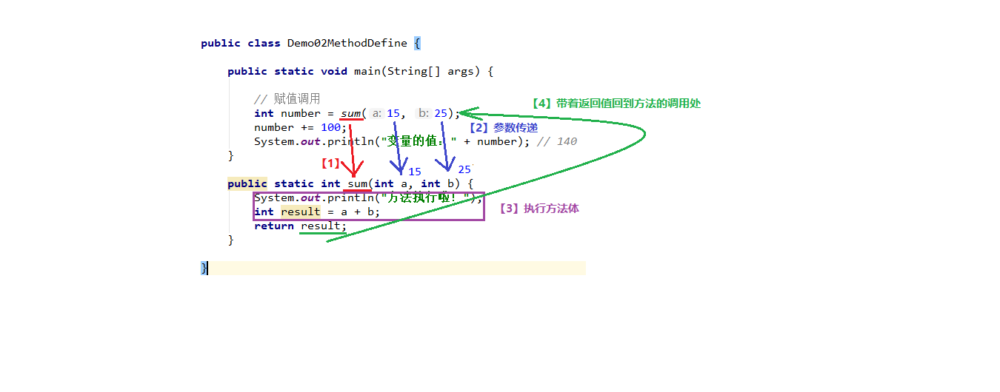
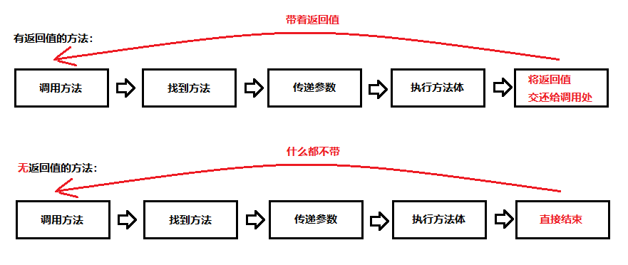

# 七、 JAVA入门

- 7.1 [常用软件推荐](#7.1-常用软件推荐)
- 7.2 [方法](#7.2-方法)
- 7.3 [方法重载](#7.3-方法重载)

## 7.1 常用软件推荐

- IDE（Integrated Development Environment，集成开发环境）：用来提高开发效率
  - 免费的IDE当中：Eclipse
  - 收费的IDE当中：IntelliJ IDEA（Jetbrain全家桶值得拥有）
- 记事本：
  - notepad++（免费）
  - Typora(免费，MarkDown记事本)
- 文件索引工具：Everything（免费）
- 项目管理工具：git

**IEAD项目结构**


**IDEA常用快捷键**

| 快捷键                   | 功能                                   |
| ------------------------ | -------------------------------------- |
| `Alt`+`Enter`            | 导入包，自动修正代码                   |
| `Ctrl`+`Y`               | 删除光标所在行                         |
| `Ctrl`+`D`               | 复制光标所在行的内容，插入光标位置下面 |
| `Ctrl`+`Alt`+`L`         | 格式化代码                             |
| `Ctrl`+`/`               | 单行注释                               |
| `Ctrl`+`Shift`+`/`       | 选中代码注释，多行注释，再按取消注释   |
| `Alt`+`Ins`              | 自动生成代码，toString，get，set等方法 |
| `Alt`+`Shift`+`上下箭头` | 移动当前代码行                         |

## 7.2 方法

前面的课程中，使用过嵌套循环输出矩形，控制台打印出矩形就可以了，因此将方法定义为`void`，没有返回值。 在主方法`main`中直接被调用。

```java
public class Method_Demo1 {
    public static void main(String[] args) {
        print();
    }
    
    private static void print() {
        for (int i = 0; i < 5; i++) {
            for (int j = 0; j < 8; j++) {
                System.out.print("*");
            }
            System.out.println();
        }
    }
}
```

`print`方法被`main`方法调用后直接输出结果，而`main`方法并不需要`print`方法的执行结果，所以被定义为`void`。

### 7.2.1 定义方法的格式详解

```java
修饰符 返回值类型 方法名(参数列表){
    //代码省略...
    return 结果;
}

```

- 修饰符： public static 固定写法
- 返回值类型： 表示方法运行的结果的数据类型，方法执行后将结果返回到调用者
- 参数列表：方法在运算过程中的未知数据，调用者调用方法时传递 return：将方法执行后的结果带给调用者，方法执行到`return`，整体方法运行结束

>  小贴士：return 结果; 这里的"结果"在开发中，我们正确的叫法成为**方法的返回值**

### 7.2.2 定义方法的两个明确

- 需求：定义方法实现两个整数的求和计算。
  - **明确返回值类型**：方法计算的是整数的求和，结果也必然是个整数，返回值类型定义为`int`类型。
  - **明确参数列表**：计算哪两个整数的和，并不清楚，但可以确定是整数，参数列表可以定义两个`int`类型的变量，由调用者调用方法时传递

```java
public class Method_Demo2 {
    public static void main(String[] args) {
        // 调用方法getSum，传递两个整数，这里传递的实际数据又称为实际参数
        // 并接收方法计算后的结果，返回值
        int sum = getSum(5, 6);
        System.out.println(sum);
    }
    /*
    定义计算两个整数和的方法
    返回值类型，计算结果是int
    参数：不确定数据求和，定义int参数.参数又称为形式参数
    */
    public static int getSum(int a, int b) {
        return a + b;
    }
}
```

程序执行，主方法`main`调用`getSum`方法，传递了实际数据`5`和`6`，两个变量`a`和`b`接收到的就是实际参数，并将计算后的结果返回，主方法`main`中的变量`sum`接收的就是方法的返回值。

### 7.2.3 调用方法的流程图解





### 7.2.4 练习

**一：比较两个整数是否相同**

- 分析：定义方法实现功能，需要有两个明确，即`返回值`和`参数列表`。
  - 明确返回值：比较整数，比较的结果只有两种可能，相同或不同，因此结果是布尔类型，比较的结果相同为`true`。 
  - 明确参数列表：比较的两个整数不确定，所以默认定义两个`int`类型的参数。

```java
public class Method_Demo3 {
    public static void main(String[] args) {
        //调用方法compare，传递两个整数
        //并接收方法计算后的结果，布尔值
        boolean bool = compare(3, 8);
        System.out.println(bool);
    }
    /*
    定义比较两个整数是否相同的方法
    返回值类型，比较的结果布尔类型
    参数：不确定参与比较的两个整数
    */
    public static boolean compare(int a, int b) {
        if (a == b) {
            return true;
        } else {
            return false;
        }
    }
}
```

**二：计算1+2+3...+100的和**

- 分析：定义方法实现功能，需要有两个明确，即`返回值`和`参数`。
  - 明确返回值：1~100的求和，计算后必然还是整数，返回值类型是`int` 
  - 明确参数：需求中已知到计算的数据，没有未知的数据，不定义参数

```java
public class Method_Demo4 {
    public static void main(String[] args) {
        //调用方法getSum       
        //并接收方法计算后的结果，整数
        int sum = getSum();
        System.out.println(sum);
    }
    /*
    定义计算1~100的求和方法
    返回值类型，计算结果整数int
    参数：没有不确定数据
    */
    public static int getSum() {
        //定义变量保存求和
        int sum = 0;
        //从1开始循环，到100结束
        for (int i = 1; i <= 100; i++) {
            sum = sum + i;
        }
        return sum;
    }
}
```

**三：实现不定次数打印**

- 分析：定义方法实现功能，需要有两个明确，即`返回值`和`参数`。
  - 明确返回值：方法中打印出`HelloWorld`即可，没有计算结果，返回值类型`void`。
  - 明确参数：打印几次不清楚，参数定义一个整型参数

```java
public class Method_Demo5 {
    public static void main(String[] args) {
        //调用方法printHelloWorld，传递整数
        printHelloWorld(9);
    }
    /*
    定义打印HelloWorld方法
    返回值类型，计算没有结果 void
    参数：不确定打印几次
    */
    public static void printHelloWorld(int n) {
        for (int i = 0; i < n; i++) {
            System.out.println("HelloWorld");
        }
    }
}
```

### 7.2.5 注意事项

- 定义位置，类中方法外面。
- 返回值类型，必须要和`return`语句返回的类型相同，否则编译失败 。

```java
// 返回值类型要求是int
public static int getSum() {
    return 5;// 正确，int类型
    return 1.2;// 错误，类型不匹配
    return true;// 错误，类型不匹配
}
```

- 不能在`return`后面写代码，`return`意味着方法结束，所有后面的代码永远不会执行，属于无效代码。

```java
public static int getSum(int a,int b) {
    return a + b;
    System.out.println("Hello");// 错误，return已经结束，这里不会执行，无效代码
}
```

### 7.2.6 方法调用

- **直接调用：**直接写方法名调用

```java
public static void main(String[] args) {
    print();
}
public static void print() {
    System.out.println("方法被调用");
}
```


- **赋值调用：**调用方法，在方法前面定义变量，接受方法返回值

```java
public static void main(String[] args) {
    int sum = getSum(5,6);
    System.out.println(sum);
}
public static int getSum(int a,int b) {
    return a + b;
}
```


- **输出语句调用：**

  - 在输出语句中调用方法，`System.out.println(方法名())`。

  ```java
  public static void main(String[] args) {
      System.out.println(getSum(5,6));
  }
  public static int getSum(int a,int b) {
      return a + b;
  }
  
  ```

  

  - 不能用输出语句调用`void`类型的方法。因为方法执行后没有结果，也就打印不出任何内容。

  ```java
  public static void main(String[] args) {
      System.out.println(printHello());// 错误，不能输出语句调用void类型方法
  }
  public static void printHello() {
      System.out.println("Hello");
  }
  ```

## 7.3方法重载

- **方法重载**：指在同一个类中，允许存在一个以上的同名方法，只要它们的参数列表不同即可，与修饰符和返回值类型无关。
- 参数列表：个数不同，数据类型不同，顺序不同。
- 重载方法调用：JVM通过方法的参数列表，调用不同的方法。

**练习一**

比较两个数据是否相等。参数类型分别为两个`byte`类型，两个`short`类型，两个`int`类型，两个`long`类型，并在`main`方法中进行测试。

```java
public class Method_Demo6 {
    public static void main(String[] args) {
        //定义不同数据类型的变量
        byte a = 10;       
        byte b = 20;
        short c = 10;
        short d = 20;
        int e = 10;
        int f = 10;
        long g = 10;
        long h = 20;
        // 调用
        System.out.println(compare(a, b));
        System.out.println(compare(c, d));
        System.out.println(compare(e, f));
        System.out.println(compare(g, h));
    }
    // 两个byte类型的
    public static boolean compare(byte a, byte b) {
        System.out.println("byte");
        return a == b;
    }
    // 两个short类型的
    public static boolean compare(short a, short b) {
        System.out.println("short");
        return a == b;
    }
    // 两个int类型的
    public static boolean compare(int a, int b) {
        System.out.println("int");
        return a == b;
    }
    // 两个long类型的
    public static boolean compare(long a, long b) {
        System.out.println("long");
        return a == b;
    }
}
```

**练习二**

判断哪些方法是重载关系。

```java
public static void open(){}
public static void open(int a){}
static void open(int a,int b){}
public static void open(double a,int b){}
public static void open(int a,double b){}
public void open(int i,double d){}
public static void OPEN(){}
public static void open(int i,int j){}
```

**练习三**

模拟输出语句中的`println`方法效果，传递什么类型的数据就输出什么类型的数据，只允许定义一个方法名`println`。

```java
public class Method_Demo7 {
    public static void println(byte a) {
        System.out.println(a);
    }
   
    public static void println(short a) {
        System.out.println(a);
    }
    
    public static void println(int a) {
        System.out.println(a);
    }
    
    public static void println(long a) {
        System.out.println(a);
    }
    
    public static void println(float a) {
        System.out.println(a);
    }
    
    public static void println(double a) {
        System.out.println(a);
    }
    
    public static void println(char a) {
        System.out.println(a);
    }
    
    public static void println(boolean a) {
        System.out.println(a);
    }
    
    public static void println(String a) {
        System.out.println(a);
    }
}

```

