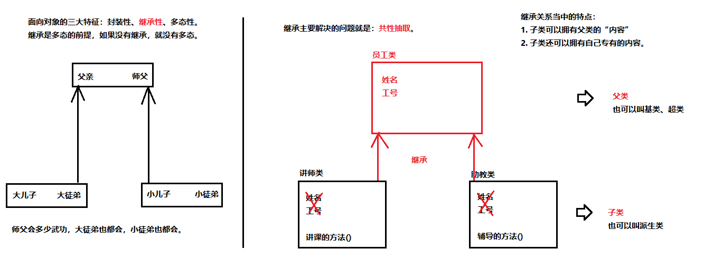
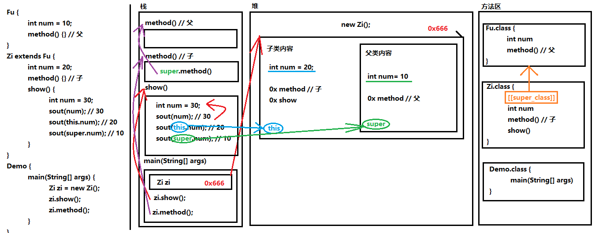

# 四、 继承与多态

- 4.1 [继承](#4.1-继承)
- 4.2 [抽象类](#4.2-抽象类)
- 4.3 [继承的综合案例](#4.3-继承的综合案例)
- 4.4 [接口](#4.4-接口)
- 4.5 [多态](#4.5-多态)
- 4.6 [接口多态的综合案例](#4.6-接口多态的综合案例)
- 4.7 [final关键字](#4.7-final关键字)
- 4.8 [权限修饰符](#4.8-权限修饰符)
- 4.9 [内部类](#4.9-内部类)
- 4.10 [引用类型用法总结](#4.10-引用类型用法总结)
- 4.11 [综合案例——界面版发红包](#4.11-综合案例——界面版发红包)

## 4.1 继承

多个类中存在相同属性和行为时，将这些内容抽取到单独一个类中，那么多个类无需再定义这些属性和行为，只要继承那一个类即可。如图所示：


其中，多个类可以称为**子类**或者**派生类**，单独那一个类称为**父类**、超类（superclass）或者**基类**。

继承描述的是事物之间的所属关系，这种关系是：`is-a`的关系。例如，图中兔子属于食草动物，食草动物属于动物。可见，父类更通用，子类更具体。我们通过继承，可以使多种事物之间形成一种关系体系。



**定义**

- **继承**：就是子类继承父类的**属性**和**行为**，使得子类对象具有与父类相同的属性、相同的行为。子类可以直接访问父类中的**非私有**的属性和行为。

**好处**

1. 提高了**代码的复用性**。
2. 类与类之间产生了关系，是**多态的前提**。

### 4.1.1 继承的格式

通过`extends`关键字，可以声明一个子类继承另外一个父类，定义格式如下：

```java
class 父类 {
    ...
}

class 子类 extends 父类 {
    ...
}
```

演示：

```java
/*
* 定义员工类Employee，做为父类
*/
class Employee {
    String name; // 定义name属性
    // 定义员工的工作方法
    public void work() {
        System.out.println("尽心尽力地工作");
    }
}

/*
* 定义讲师类Teacher 继承 员工类Employee
*/
class Teacher extends Employee {
    // 定义一个打印name的方法
    public void printName() {
        System.out.println("name=" + name);
    }
}

/*
* 定义测试类
*/
public class ExtendDemo01 {
    public static void main(String[] args) {
        // 创建一个讲师类对象
        Teacher t = new Teacher();
        // 为该员工类的name属性进行赋值
        t.name = "小明";
        // 调用该员工的printName()方法
        t.printName(); // name = 小明
        // 调用Teacher类继承来的work()方法
        t.work(); // 尽心尽力地工作
    }
}
```

### 4.1.2 继承后的特点——成员变量

当类之间产生了关系后，其中各类中的成员变量，又产生了哪些影响呢？

- **成员变量不重名**

如果子类父类中出现**不重名**的成员变量，这时的访问是**没有影响的**。代码如下：

```java
class Fu {
    // Fu中的成员变量。
    int num = 5;
     public void showFu(){
        System.out.println("num=" + num);
    }
}

class Zi extends Fu {
    // Zi中的成员变量
    int num2 = 6;
    // Zi中的成员方法
    public void showZi(){
        System.out.println("num=" + num);
    }
    public void show() {
        // 访问父类中的num，
        System.out.println("Fu num="+num); // 继承而来，所以直接访问。
        // 访问子类中的num2
        System.out.println("Zi num2="+num2);
    }
}

class ExtendDemo02 {
    public static void main(String[] args) {
        // 创建子类对象
        Zi z = new Zi();
        // 调用子类中的show方法
        z.show();
        z.showZi();
        z.showFu();
    }
}
/*
* 演示结果：
* Fu num = 5
* Zi num2 = 6
* num = 6
* num = 5
*/
```

> 小贴士：
>
> 直接调用时(.num)，变量优先在本类中查找，没有则向上查找
>
> 间接调用时，变量优先使用方法定义所在类


- **成员变量重名**

如果子类父类中出现**重名**的成员变量，这时的访问是**有影响的**。代码如下：

```java
class Fu {
    // Fu中的成员变量。
    int num = 5;
}

class Zi extends Fu {
    // Zi中的成员变量
    int num = 6;
    public void show() {
        // 访问父类中的num
        System.out.println("Fu num=" + num);
        // 访问子类中的num
        System.out.println("Zi num=" + num);
    }
}

class ExtendsDemo03 {
    public static void main(String[] args) {
        // 创建子类对象
        Zi z = new Zi();
        // 调用子类中的show方法
        z.show();        
    }
}
/*
* 演示结果：
* Fu num = 6
* Zi num = 6
*/
```

子父类中出现了同名的成员变量时，在子类中需要访问父类中非私有成员变量时，需要使用`super`关键字，修饰父类成员变量，类似于之前学过的`this`。

使用格式：

```java
super.父类成员变量名
```

子类方法需要修改，代码如下：

```java
class Zi extends Fu {
    // Zi中的成员变量
    int num = 6;
    public void show() {
        //访问父类中的num
        System.out.println("Fu num=" + super.num);
        //访问子类中的num
        System.out.println("Zi num=" + this.num);
    }
}
/*
* 演示结果：
* Fu num = 5
* Zi num = 6
*/
```

> 小贴士：Fu类中的成员变量是非私有的，子类中可以直接访问。若Fu类中的成员变量私有了，子类是不能直接访问的。通常编码时，我们遵循封装的原则，使用private修饰成员变量，那么如何访问父类的私有成员变量呢？对！可以在父类中提供公共的getXxx方法和setXxx方法。

### 4.1.3 继承后的特点——成员方法

当类之间产生了关系，其中各类中的成员方法，又产生了哪些影响呢？

- **成员方法不重名**

如果子类父类中出现**不重名**的成员方法，这时的调用是**没有影响的**。对象调用方法时，会先在子类中查找有没有对应的方法，若子类中存在就会执行子类中的方法，若子类中不存在就会执行父类中相应的方法。代码如下：

```java
class Fu{
    public void show(){
        System.out.println("Fu类中的show方法执行");
    }
}

class Zi extends Fu{
    public void show2(){
        System.out.println("Zi类中的show2方法执行");
    }
}

public class ExtendsDemo04{
    public static void main(String[] args) {
        Zi z = new Zi();
        //子类中没有show方法，但是可以找到父类方法去执行
        z.show();
        z.show2();
    }
}
```

- **成员方法重名——重写(Override)**

  如果子类父类中出现重名的成员方法，这时的访问是一种特殊情况，叫做**方法重写** (Override)。

  **方法重写** ：子类中出现与父类一模一样的方法时（返回值类型，方法名和参数列表都相同），会出现覆盖效果，也称为重写或者复写。**声明不变，重新实现。** 代码如下：

```java
class Fu {
    public void show() {
        System.out.println("Fu show");
    }
}

class Zi extends Fu {
    //子类重写了父类的show方法
    public void show() {
        System.out.println("Zi show");
    }
}

public class ExtendsDemo05{
    public static void main(String[] args) {
        Zi z = new Zi();
        // 子类中有show方法，只执行重写后的show方法
        z.show(); // Zi show
    }
}
```

- **重写的应用**

子类可以根据需要，定义特定于自己的行为。既沿袭了父类的功能名称，又根据子类的需要重新实现父类方法，从而进行扩展增强。比如新的手机增加来电显示头像的功能，代码如下：

```java
class Phone {
    public void sendMessage(){
        System.out.println("发短信");
    }
    public void call(){
        System.out.println("打电话");
    }
    public void showNum(){
        System.out.println("来电显示号码");
    }
}

//智能手机类
class NewPhone extends Phone {
    //重写父类的来电显示号码功能，并增加自己的显示姓名和图片功能
    public void showNum(){
        //调用父类已经存在的功能使用super
        super.showNum();
        //增加自己特有显示姓名和图片功能
        System.out.println("显示来电姓名");
        System.out.println("显示头像");
    }
}

public class ExtendsDemo06 {
    public static void main(String[] args) {
        // 创建子类对象
        NewPhone np = new NewPhone()；
            // 调用父类继承而来的方法
            np.call();
        // 调用子类重写的方法
        np.showNum();
   }
}
```

> 小贴士：
>
> 这里重写时，用到super.父类成员方法，表示调用父类的成员方法。
>
> 另外，重写时如果在子类重写的方法前写上`@Override`，编译器会自动检测该方法是否是重写方法，方便检查。

**注意事项**

1. 子类方法覆盖父类方法，必须要保证权限**大于等于**父类权限。
2. 子类方法覆盖父类方法，函数名和参数列表都要一模一样。
3. 子类方法覆盖父类方法，返回值必须**小于等于**父类方法的返回值范围。

> 小贴士：
>
> `java.lang.Object`类是所有类的公共最高基类，`java.lang.String`类是Object的子类。


### 4.1.4 继承后的特点——构造方法

当类之间产生了关系，其中各类中的构造方法，又产生了哪些影响呢？

首先我们要回忆两个事情，构造方法的定义格式和作用。

1. 构造方法的名字是与类名一致的。所以子类是无法继承父类构造方法的。
2. 构造方法的作用是初始化成员变量的。所以子类的初始化过程中，必须先执行父类的初始化动作。子类的构造方法中默认有一个`super()`，表示调用父类的构造方法，父类成员变量初始化后，才可以给子类使用。代码如下：

```java
class Fu {
    private int n;
    Fu(){
        System.out.println("Fu()");
    }
}

class Zi extends Fu {
    Zi(){
        // super（），调用父类构造方法
        super();
        System.out.println("Zi（）");
    }
}

public class ExtendsDemo07{
    public static void main (String args[]){
        Zi zi = new Zi();
    }
}
/*
* 输出结果：
* Fu（）
* Zi（）
*/
```

### 4.1.5 super和this

- **父类空间优先于子类对象产生**

在每次创建子类对象时，先初始化父类空间，再创建其子类对象本身。目的在于子类对象中包含了其对应的父类空间，便可以包含其父类的成员，如果父类成员非private修饰，则子类可以随意使用父类成员。代码体现在子类的构造方法调用时，一定先调用父类的构造方法。理解图解如下：




- **super和this的含义**

super ：代表父类的存储空间标识(可以理解为父亲的引用)。

this ：代表当前对象的引用(谁调用就代表谁)。

- **super和this的用法**

1. 访问成员

```java
this.成员变量 ‐‐ 本类的
super.成员变量 ‐‐ 父类的
    
this.成员方法名() ‐‐ 本类的
super.成员方法名() ‐‐ 父类的
```

用法演示，代码如下：

```java
class Animal {
    public void eat() {
        System.out.println("animal : eat");
    }
}

class Cat extends Animal {
    public void eat() {
        System.out.println("cat : eat");
    }
    public void eatTest() {
        this.eat(); // this 调用本类的方法
        super.eat(); // super 调用父类的方法
    }
}

public class ExtendsDemo08 {
    public static void main(String[] args) {
        Animal a = new Animal();
        a.eat();
        Cat c = new Cat();
        c.eatTest();
    }
}
/*
* 输出结果为：
* animal : eat
* cat : eat
* animal : eat
*/
```

2. 访问构造方法

```java
this(...) ‐‐ 本类的构造方法
super(...) ‐‐ 父类的构造方法
```

> 子类的每个构造方法中均有默认的super()，调用父类的空参构造。手动调用父类构造会覆盖默认的super()。super() 和 this() 都必须是在构造方法的第一行，所以不能同时出现。

### 4.1.6 继承的特点

1. Java只支持单继承，不支持多继承。

```java
//一个类只能有一个父类，不可以有多个父类。
class C extends A{} //ok
class C extends A，B... //error
```

2. Java支持多层继承(继承体系)。

```java
class A{}
class B extends A{}
class C extends B{}
```

> 顶层父类是Object类。所有的类默认继承Object，作为父类。

3. 子类和父类是一种相对的概念。

## 4.2 抽象类

父类中的方法，被它的子类们重写，子类各自的实现都不尽相同。那么父类的方法声明和方法主体，只有声明还有意义，而方法主体则没有存在的意义了。我们把没有方法主体的方法称为**抽象方法**。Java语法规定，包含抽象方法的类就是**抽象类**。

**定义**

- **抽象方法**：没有方法体的方法。
- **抽象类**：包含抽象方法的类。

### 4.2.1 abstract使用格式

**抽象方法**

使用`abstract`关键字修饰方法，该方法就成了抽象方法，抽象方法只包含一个方法名，而没有方法体。

定义格式：

```java
修饰符 abstract 返回值类型 方法名 (参数列表)；
```

代码举例：

```java
public abstract void run()；
```

**抽象类**

如果一个类包含抽象方法，那么该类必须是抽象类。

定义格式：

```java
abstract class 类名字 {
}
```

代码举例：

```java
public abstract class Animal {
    public abstract void run()；
}
```

**抽象的使用**

继承抽象类的子类**必须重写父类所有的抽象方法**。否则，该子类也必须声明为抽象类。最终，必须有子类实现该父类的抽象方法，否则，从最初的父类到最终的子类都不能创建对象，失去意义。

代码举例：

```java
public class Cat extends Animal {
    public void run (){
        System.out.println("小猫在墙头走~~~")；
    }
}

public class CatTest {
    public static void main(String[] args) {
        // 创建子类对象
        Cat c = new Cat();
        // 调用run方法
        c.run();
    }
}
/*
* 输出结果：
* 小猫在墙头走~~~
*/
```

此时的方法重写，是子类对父类抽象方法的完成实现，我们将这种方法重写的操作，也叫做**实现方法**。

### 4.2.2 注意事项

关于抽象类的使用，以下为语法上要注意的细节，虽然条目较多，但若理解了抽象的本质，无需死记硬背。

1. 抽象类**不能创建对象**，如果创建，编译无法通过而报错。只能创建其非抽象子类的对象。

> 理解：假设创建了抽象类的对象，调用抽象的方法，而抽象方法没有具体的方法体，没有意义。

2. 抽象类中，可以有构造方法，是供子类创建对象时，初始化父类成员使用的。 

> 理解：子类的构造方法中，有默认的super()，需要访问父类构造方法。

3. 抽象类中，不一定包含抽象方法，但是有抽象方法的类必定是抽象类。

> 理解：未包含抽象方法的抽象类，目的就是不想让调用者创建该类对象，通常用于某些特殊的类结构设计。

4. 抽象类的子类，必须重写抽象父类中所有的抽象方法，否则，编译无法通过而报错。除非该子类也是抽象类。 

> 理解：假设不重写所有抽象方法，则类中可能包含抽象方法。那么创建对象后，调用抽象的方法，没有意义。

## 4.3 继承的综合案例

### 4.3.1 综合案例：群主发普通红包

群主发普通红包。某群有多名成员，群主给成员发普通红包。普通红包的规则：

1. 群主的一笔金额，从群主余额中扣除，平均分成n等份，让成员领取。
2. 成员领取红包后，保存到成员余额中。

请根据描述，完成案例中所有类的定义以及指定类之间的继承关系，并完成发红包的操作。

### 4.3.2 案例分析

根据描述分析，得出如下继承体系：


### 4.3.3 案例实现

定义用户类：

```java
public class User {
    // 成员变量
    private String username; // 用户名
    private double leftMoney; // 余额
    // 构造方法
    public User() { }
    public User(String username, double leftMoney) {
        this.username = username;
        this.leftMoney = leftMoney;
    }
    // get/set方法
    public String getUsername() {
        return username;
    }
    public void setUsername(String username) {
        this.username = username;
    }
    public double getLeftMoney() {
        return leftMoney;
    }
    public void setLeftMoney(double leftMoney) {
        this.leftMoney = leftMoney;
    }
    // 展示信息的方法
    public void show() {
        System.out.println("用户名:"+ username +" , 余额为:" + leftMoney + "元");
    }
}
```

定义群主类：

```java
public class QunZhu extends User {
    // 添加构造方法
    public QunZhu() {
        
    }
    public QunZhu(String username, double leftMoney) {
        // 通过super 调用父类构造方法
        super(username, leftMoney);
    }
    /*
    群主发红包，就是把一个整数的金额，分层若干等份。
    1.获取群主余额,是否够发红包.
    不能则返回null,并提示.
    能则继续.
    2.修改群主余额.
    3.拆分红包.
    3.1.如果能整除，那么就平均分。
    3.2.如果不能整除，那么就把余数分给最后一份。
    */

    public ArrayList<Double> send(int money, int count) {
        // 获取群主余额
        double leftMoney = getLeftMoney();
        if(money > leftMoney) {
            return null;
}
        // 修改群主余额的
        setLeftMoney(leftMoney ‐ money);
        // 创建一个集合,保存等份金额
        ArrayList<Double> list = new ArrayList<>();
        // 扩大100倍,相当于折算成'分'为单位,避免小数运算损失精度的问题
        money = money * 100;
        // 每份的金额
        int m = money / count;
        // 不能整除的余数
        int l = money % count;
        // 无论是否整除,n‐1份,都是每份的等额金额
        for (int i = 0; i < count ‐ 1; i++) {
            // 缩小100倍,折算成 '元'
            list.add(m / 100.0);
        }
        // 判断是否整除
        if (l == 0) {
            // 能整除, 最后一份金额,与之前每份金额一致
            list.add(m / 100.0);
        } else {
            // 不能整除, 最后一份的金额,是之前每份金额+余数金额
            list.add((m + l) / 100.00);
        }
        // 返回集合
        return list;
    }
}
```

定义成员类：

```java
public class Member extends User {
    public Member() {
        
    }
    public Member(String username, double leftMoney) {
        super(username, leftMoney);
    }
    // 打开红包,就是从集合中,随机取出一份,保存到自己的余额中
    public void openHongbao(ArrayList<Double> list) {
        // 创建Random对象
        Random r = new Random();
        // 随机生成一个角标
        int index = r.nextInt(list.size());
        // 移除一个金额
        Double money = list.remove(index);
        // 直接调用父类方法,设置到余额
        setLeftMoney( money );
    }
}
```

定义测试类：

```java
public class Test {
    public static void main(String[] args) {
        // 创建一个群主对象
        QunZhu qz = new QunZhu("群主" , 200);
        // 创建一个键盘录入
        Scanner sc = new Scanner(System.in);
        System.out.println("请输入金额:");
        int money = sc.nextInt();
        System.out.println("请输入个数:");
        int count = sc.nextInt();
        // 发送红包
        ArrayList<Double> sendList = qz.send(money,count);
        // 判断,如果余额不足
        if(sendList == null){
            System.out.println(" 余额不足...");
            return;
        }
        // 创建三个成员
        Member m = new Member();
        Member m2 = new Member();
        Member m3 = new Member();
        // 打开红包
        m.openHongbao(sendList);
        m2.openHongbao(sendList);
        m3.openHongbao(sendList);
        // 展示信息
        qz.show();
        m.show();
        m2.show();
        m3.show();
    }
}
```

> 课后请同学自己思考并完成扩展需求。
>
> 案例扩展：
>
> 1. 如果成员的余额不为0呢，将如何处理？
> 2. 如果群主想输入带小数的金额呢，将如何处理？

## 4.4 接口

接口，是Java语言中一种引用类型，是方法的集合，如果说类的内部封装了成员变量、构造方法和成员方法，那么接口的内部主要就是**封装了方法**，包含抽象方法（JDK 7及以前），默认方法和静态方法（JDK 8），私有方法（JDK 9）。

接口的定义，它与定义类方式相似，但是使用`interface`关键字。它也会被编译成.class文件，但一定要明确它并不是类，而是另外一种引用数据类型。

> 引用数据类型：数组，类，接口。

接口的使用，它不能创建对象，但是可以被实现（`implements`，类似于被继承）。一个实现接口的类（可以看做是接口的子类），需要实现接口中所有的抽象方法，创建该类对象，就可以调用方法了，否则它必须是一个抽象类。

**定义格式**

```java
public interface 接口名称 {
    // 抽象方法
    // 默认方法
    // 静态方法
    // 私有方法
}
```

**含有抽象方法**

抽象方法：使用`abstract`关键字修饰，可以省略，没有方法体。该方法供子类实现使用。

代码如下：

```java
public interface InterFaceName {
    public abstract void method();
}
```

**含有默认方法和静态方法**

默认方法：使用`default`修饰，不可省略，供子类调用或者子类重写。 

静态方法：使用`static`修饰，供接口直接调用。

代码如下：

```java
public interface InterFaceName {
    public default void method() {
        // 执行语句
    }
    public static void method2() {
        // 执行语句
    }
}
```

**含有私有方法和私有静态方法**

私有方法：使用`private`修饰，供接口中的默认方法或者静态方法调用。

代码如下：

```java
public interface InterFaceName {
    private void method() {
        // 执行语句
    }
}
```

### 4.4.1 基本的实现

类与接口的关系为实现关系，即**类实现接口**，该类可以称为接口的实现类，也可以称为接口的子类。实现的动作类似继承，格式相仿，只是关键字不同，实现使用`implements`关键字。

非抽象子类实现接口：

1. 必须重写接口中所有抽象方法。
2. 继承了接口的默认方法，即可以直接调用，也可以重写。

实现格式：

```java
class 类名 implements 接口名 {
    // 重写接口中抽象方法【必须】
    // 重写接口中默认方法【可选】
}
```

**抽象方法的使用**

必须全部实现，代码如下：

定义接口：

```java
public interface LiveAble {
    // 定义抽象方法
    public abstract void eat();
    public abstract void sleep();
}
```

定义实现类：

```java
public class Animal implements LiveAble {
    @Override
    public void eat() {
        System.out.println("吃东西");
    }
    @Override
    public void sleep() {
        System.out.println("晚上睡");
    }
}
```

定义测试类：

```java
public class InterfaceDemo {
    public static void main(String[] args) {
        // 创建子类对象
        Animal a = new Animal();
        // 调用实现后的方法
        a.eat();
        a.sleep();
    }
}
/*
* 输出结果：
* 吃东西
* 晚上睡
*/
```

**默认方法的使用**

可以继承，可以重写，二选一，但是只能通过实现类的对象来调用。

1. 继承默认方法，代码如下：

定义接口：

```java
public interface LiveAble {
    public default void fly(){
        System.out.println("天上飞");
    }
}
```

定义实现类：

```java
public class Animal implements LiveAble {
    // 继承，什么都不用写，直接调用
}
```

定义测试类：

```java
public class InterfaceDemo {
    public static void main(String[] args) {
        // 创建子类对象
        Animal a = new Animal();
        // 调用默认方法
        a.fly();
    }
}
/*
* 输出结果：
* 天上飞
*/
```

2. 重写默认方法，代码如下：

定义接口：

```java
public interface LiveAble {
    public default void fly(){
        System.out.println("天上飞");
    }
}
```

定义实现类：

```java
public class Animal implements LiveAble {
    @Override
    public void fly() {
        System.out.println("自由自在的飞");
    }
}
```

定义测试类：

```java
public class InterfaceDemo {
    public static void main(String[] args) {
        // 创建子类对象
        Animal a = new Animal();
        // 调用重写方法
        a.fly();
    }
}
/*
* 输出结果：
* 自由自在的飞
*/
```

**静态方法的使用**

静态与.class 文件相关，只能使用接口名调用，不可以通过实现类的类名或者实现类的对象调用，代码如下：

定义接口：

```java
public interface LiveAble {
    public static void run(){
        System.out.println("跑起来~~~");
    }
}
```

定义实现类：

```java
public class Animal implements LiveAble {
    // 无法重写静态方法
}
```

定义测试类：

```java
public class InterfaceDemo {
    public static void main(String[] args) {
        // Animal.run(); // 【错误】无法继承方法,也无法调用
        LiveAble.run(); //
    }
}
/*
* 输出结果：
* 跑起来~~~
*/
```

**私有方法的使用**

- 私有方法：只有默认方法可以调用。

私有静态方法：默认方法和静态方法可以调用。

- 如果一个接口中有多个默认方法，并且方法中有重复的内容，那么可以抽取出来，封装到私有方法中，供默认方法去调用。从设计的角度讲，私有的方法是对默认方法和静态方法的辅助。同学们在已学技术的基础上，可以自行测试。

定义接口：

```java
public interface LiveAble {
    default void func(){
        func1();
        func2();
    }
    private void func1(){
        System.out.println("跑起来~~~");
    }
    private void func2(){
        System.out.println("跑起来~~~");
    }
}
```

**成员变量的使用**

接口中也可以定义“成员变量”，但是必须使用`public static final`三个关键字进行修饰。

从效果上来看，这实际就是接口的“常量”，一旦被赋值，不可以被修改。

```java
public interface MyInterfaceConst{
    public static final int NUM_OF_ANIMALS = 10;
}
```

> 注意事项：
>
> 1. 接口中的常量的修饰关键字可省略
> 2. 接口中的常量必须进行赋值
> 3. 接口中常量名称，用大写单词和下划线分隔

### 4.4.2 接口的多实现

之前学过，在继承体系中，一个类只能继承一个父类。而对于接口而言，一个类是可以实现多个接口的，这叫做接口的**多实现**。并且，一个类能继承一个父类，同时实现多个接口。

实现格式：

```java
class 类名 [extends 父类名] implements 接口名1,接口名2,接口名3... {
    // 重写接口中抽象方法【必须】
    // 重写接口中默认方法【不重名时可选】
}
```

> []：表示可选操作。

**抽象方法**

接口中，有多个抽象方法时，实现类必须重写所有抽象方法。**如果抽象方法有重名的，只需要重写一次**。代码如下：

定义多个接口：

```java
interface A {
    public abstract void showA();
    public abstract void show();
}
interface B {
    public abstract void showB();
    public abstract void show();
}
```

定义实现类：

```java
public class C implements A,B{
    @Override
    public void showA() {
        System.out.println("showA");
    }
    @Override
    public void showB() {
        System.out.println("showB");
    }
    @Override
    public void show() {
        System.out.println("show");
    }
}
```

**默认方法**

接口中，有多个默认方法时，实现类都可继承使用。**如果默认方法有重名的，必须重写一次**。代码如下：

定义多个接口：

```java
interface A {
    public default void methodA(){}
    public default void method(){}
}
interface B {
    public default void methodB(){}
    public default void method(){}
}
```

定义实现类：

```java
public class C implements A,B{
    @Override
    public void method() {
        System.out.println("method");
    }
}
```

**静态方法**

接口中，存在同名的静态方法并不会冲突，原因是只能通过各自接口名访问静态方法。

**优先级的问题**

当一个类，既继承一个父类，又实现若干个接口时，父类中的成员方法与接口中的默认方法重名，子类就近选择执 行父类的成员方法。代码如下：

定义接口：

```java
interface A {
    public default void methodA(){
        System.out.println("AAAAAAAAAAAA");
    }
}
```

定义父类：

```java
class D {
    public void methodA(){
        System.out.println("DDDDDDDDDDDD");
    }
}
```

定义子类：

```java
class C extends D implements A {
    // 未重写methodA方法
}
```

定义测试类：

```java
public class Test {
    public static void main(String[] args) {
        C c = new C();
        c.methodA();
    }
}
/*
* 输出结果:
* DDDDDDDDDDDD
*/
```

### 4.4.3 接口的多继承[了解]

一个接口能继承另一个或者多个接口，这和类之间的继承比较相似。接口的继承使用 extends 关键字，子接口继承父接口的方法。**如果父接口中的默认方法有重名的，那么子接口需要重写一次**。代码如下：

定义父接口：

```java
interface A {
    public default void method(){
        System.out.println("AAAAAAAAAAAAAAAAAAA");
    }
}
interface B {
    public default void method(){
        System.out.println("BBBBBBBBBBBBBBBBBBB");
    }
}
```

定义子接口：

```java
interface D extends A,B{
    @Override
    public default void method() {
        System.out.println("DDDDDDDDDDDDDD");
    }
}
```

> 小贴士：
>
> 子接口重写默认方法时，default关键字可以保留。
>
> 子类重写默认方法时，default关键字不可以保留。

**注意：**

1. 如果实现类所实现的多个接口当中，存在重复的抽象方法，那么只需要覆盖重写一次即可。
2. 如果实现类没有覆盖重写所有接口当中的所有抽象方法，那么实现类只能是一个抽象类。
3. 如果实现类所实现的多个接口中，存在重复的默认方法，那么实现类一定要对冲突的默认方法进行覆盖重写。
4. 一个类如果直接父类中的方法，和接口中的默认方法产生了冲突，优先使用父类中的方法。

### 4.4.4 其他成员特点

- 接口中，无法定义成员变量，但是可以定义常量，其值不可以改变，默认使用public static final修饰。
- 接口中，没有构造方法，不能创建对象。
- 接口中，没有静态代码块。

## 4.5 多态

**引入**

多态是继封装、继承之后，面向对象的第三大特性。

生活中，比如跑的动作，小猫、小狗和大象，跑起来是不一样的。再比如飞的动作，昆虫、鸟类和飞机，飞起来也是不一样的。可见，同一行为，通过不同的事物，可以体现出来的不同的形态。多态，描述的就是这样的状态。

**定义**

- 多态： 是指同一行为，具有多个不同表现形式。

**前提**【重点】

1. 继承或者实现【二选一】

2. 方法的重写【意义体现：不重写，无意义】
3. 父类引用指向子类对象【格式体现】

### 4.5.1 多态的体现

多态体现的格式：

```java
父类类型 变量名 = new 子类对象；
变量名.方法名();
```

> 父类类型：指子类对象继承的父类类型，或者实现的父接口类型。

代码如下：

```java
Fu f = new Zi();
f.method();
```

**当使用多态方式调用方法时，首先检查父类中是否有该方法，如果没有，则编译错误；如果有，执行的是子类重写后方法。**

代码如下：

定义父类：

```java
public abstract class Animal {
    public abstract void eat();
}
```

定义子类：

```java
class Cat extends Animal {
    public void eat() {
        System.out.println("吃鱼");
    }
}
class Dog extends Animal {
    public void eat() {
        System.out.println("吃骨头");
    }
}
```

定义测试类：

```java
public class Test {
    public static void main(String[] args) {
        // 多态形式，创建对象
        Animal a1 = new Cat();
        // 调用的是 Cat 的 eat
        a1.eat();
        // 多态形式，创建对象
        Animal a2 = new Dog();
        // 调用的是 Dog 的 eat
        a2.eat();
    }
}
```

> 总结：
>
> 多态形式中，调用成员变量时，编译时看左边，运行时看左边。
>
> 多态形式中，调用成员方法时，编译时看左边，运行时看右边。

### 4.5.2 多态的好处

实际开发的过程中，父类类型作为方法形式参数，传递子类对象给方法，进行方法的调用，更能体现出多态的扩展性与便利。代码如下：

定义父类：

```java
public abstract class Animal {
    public abstract void eat();
}
```

定义子类：

```java
class Cat extends Animal {
    public void eat() {
        System.out.println("吃鱼");
    }
}
class Dog extends Animal {
    public void eat() {
        System.out.println("吃骨头");
    }
}
```

定义测试类：

```java
public class Test {
    public static void main(String[] args) {
        // 多态形式，创建对象
        Cat c = new Cat();
        Dog d = new Dog();
        // 调用showCatEat
        showCatEat(c);
        // 调用showDogEat
        showDogEat(d);
        /*
        以上两个方法, 均可以被showAnimalEat(Animal a)方法所替代
        而执行效果一致
        */
        showAnimalEat(c);
        showAnimalEat(d);
    }
    public static void showCatEat (Cat c){
        c.eat();
    }
    public static void showDogEat (Dog d){
        d.eat();
}
    public static void showAnimalEat (Animal a){
        a.eat();
    }
}
```

由于多态特性的支持，showAnimalEat方法的Animal类型，是Cat和Dog的父类类型，父类类型接收子类对象，当然可以把Cat对象和Dog对象，传递给方法。

当eat方法执行时，多态规定，执行的是子类重写的方法，那么效果自然与showCatEat、showDogEat方法一致，所以showAnimalEat完全可以替代以上两方法。

不仅仅是替代，在扩展性方面，无论之后再多的子类出现，我们都不需要编写showXxxEat方法了，直接使用showAnimalEat都可以完成。

所以，多态的好处，体现在，可以使程序编写的更简单，并有良好的扩展。

### 4.5.3 引用类型转换

多态的转型分为向上转型与向下转型两种：

**向上转型**

- **向上转型**：多态本身是子类类型向父类类型向上转换的过程，这个过程是默认的。

当父类引用指向一个子类对象时，便是向上转型。

使用格式：

```java
父类类型 变量名 = new 子类类型();
如：Animal a = new Cat();
```

**向下转型**

- **向下转型**：父类类型向子类类型向下转换的过程，这个过程是强制的。

一个已经向上转型的子类对象，将父类引用转为子类引用，可以使用强制类型转换的格式，便是向下转型。

使用格式：

```java
子类类型 变量名 = (子类类型) 父类变量名;
如:Cat c =(Cat) a;
```

**为什么要转型**

当使用多态方式调用方法时，首先检查父类中是否有该方法，如果没有，则编译错误。也就是说，**不能调用**子类拥有，而父类没有的方法。编译都错误，更别说运行了。这也是多态给我们带来的一点"小麻烦"。所以，想要调用子类特有的方法，必须做向下转型。

转型演示，代码如下：

定义类：

```java
abstract class Animal {
    abstract void eat();
}
class Cat extends Animal {
    public void eat() {
        System.out.println("吃鱼");
    }
    public void catchMouse() {
        System.out.println("抓老鼠");
    }
}
class Dog extends Animal {
    public void eat() {
        System.out.println("吃骨头");
    }
    public void watchHouse() {
        System.out.println("看家");
    }
}
```

定义测试类：

```java
public class Test {
    public static void main(String[] args) {
        // 向上转型
        Animal a = new Cat();
        a.eat(); // 调用的是 Cat 的 eat
        // 向下转型
        Cat c = (Cat)a;
        c.catchMouse(); // 调用的是 Cat 的 catchMouse
    }
}
```

**转型的异常**

转型的过程中，一不小心就会遇到这样的问题，请看如下代码：

```java
public class Test {
    public static void main(String[] args) {
        // 向上转型
        Animal a = new Cat();
        a.eat(); // 调用的是 Cat 的 eat
        // 向下转型
        Dog d = (Dog)a;
        d.watchHouse(); // 调用的是 Dog 的 watchHouse 【运行报错】
    }
}
```

这段代码可以通过编译，但是运行时，却报出了`ClassCastException`，类型转换异常！这是因为，明明创建了Cat类型对象，运行时，当然不能转换成Dog对象的。这两个类型并没有任何继承关系，不符合类型转换的定义。

为了避免ClassCastException的发生，Java提供了`instanceof`关键字，给引用变量做类型的校验，格式如下：

```java
变量名 instanceof 数据类型
如果变量属于该数据类型，返回true。
如果变量不属于该数据类型，返回false。
```

所以，转换前，我们最好先做一个判断，代码如下：

```java
public class Test {
    public static void main(String[] args) {
        // 向上转型
        Animal a = new Cat();
        a.eat(); // 调用的是 Cat 的 eat
        // 向下转型
        if (a instanceof Cat){
            Cat c = (Cat)a;
            c.catchMouse(); // 调用的是 Cat 的 catchMouse
        } else if (a instanceof Dog){
            Dog d = (Dog)a;
            d.watchHouse(); // 调用的是 Dog 的 watchHouse
        }
    }
}
```

## 4.6 接口多态的综合案例

### 4.6.1 笔记本电脑

笔记本电脑（laptop）通常具备使用USB设备的功能。在生产时，笔记本都预留了可以插入USB设备的USB接口， 但具体是什么USB设备，笔记本厂商并不关心，只要符合USB规格的设备都可以。

定义USB接口，具备最基本的开启功能和关闭功能。鼠标和键盘要想能在电脑上使用，那么鼠标和键盘也必须遵守 USB规范，实现USB接口，否则鼠标和键盘的生产出来也无法使用。

### 4.6.2 案例分析

进行描述笔记本类，实现笔记本使用USB鼠标、USB键盘

- USB接口，包含开启功能、关闭功能
- 笔记本类，包含运行功能、关机功能、使用USB设备功能
- 鼠标类，要实现USB接口，并具备点击的方法
- 键盘类，要实现USB接口，具备敲击的方法

### 4.6.3 案例实现

定义USB接口：

```java
interface USB {
    void open();// 开启功能
    void close();// 关闭功能
}
```

定义鼠标类：

```java
class Mouse implements USB {
    public void open() {
        System.out.println("鼠标开启，红灯闪一闪");
    }
    public void close() {
        System.out.println("鼠标关闭，红灯熄灭");
    }
    public void click(){
        System.out.println("鼠标单击");
    }
}
```

定义键盘类：

```java
class KeyBoard implements USB {
    public void open() {
        System.out.println("键盘开启，绿灯闪一闪");
    }
    public void close() {
        System.out.println("键盘关闭，绿灯熄灭");
    }
    public void type(){
        System.out.println("键盘打字");
    }
}
```

定义笔记本类：

```java
class Laptop {
    // 笔记本开启运行功能
    public void run() {
        System.out.println("笔记本运行");
    }
    // 笔记本使用usb设备，这时当笔记本对象调用这个功能时，必须给其传递一个符合USB规则的USB设备
    public void useUSB(USB usb) {
        // 判断是否有USB设备
        if (usb != null) {
            usb.open();
            // 类型转换,调用特有方法
            if(usb instanceof Mouse){
                Mouse m = （Mouse）usb；
                    m.click();
            }else if (usb instanceof KeyBoard){
                KeyBoard kb = (KeyBoard)usb;
                kb.type();
            }
            usb.close();
        }
    }
    public void shutDown() {
        System.out.println("笔记本关闭");
    }
}
```

测试类，代码如下：

```java
public class Test {
    public static void main(String[] args) {
        // 创建笔记本实体对象
        Laptop lt = new Laptop();
        // 笔记本开启
        lt.run();
        // 创建鼠标实体对象
        Usb u = new Mouse();
        // 笔记本使用鼠标
        lt.useUSB(u);
        // 创建键盘实体对象
        KeyBoard kb = new KeyBoard();
        // 笔记本使用键盘
        lt.useUSB(kb);
        // 笔记本关闭
        lt.shutDown();
    }
}
```

## 4.7 final关键字

学习了继承后，我们知道，子类可以在父类的基础上改写父类内容，比如，方法重写。那么我们能不能随意的继承API中提供的类，改写其内容呢？显然这是不合适的。为了避免这种随意改写的情况，Java提供了`final`关键字，用于修饰不可改变内容。

- final：不可改变。可以用于修饰类、方法和变量。
  - 类：被修饰的类，不能被继承。
  - 方法：被修饰的方法，不能被重写。
  - 变量：被修饰的变量，不能被重新赋值。

### 4.7.1 使用方式

**修饰类**

格式如下：

```java
final class 类名{
    
}
```

查询API发现像`public final class String`、`public final class Math`、`public final class Scanner`等，很多我们学习过的类，都是被final修饰的，目的就是供我们使用，而不让我们所以改变其内容。

**修饰方法**

格式如下：

```java
修饰符 final 返回值类型 方法名(参数列表){
    //方法体
}
```

重写被`final`修饰的方法，编译时就会报错。

修饰变量

1. **局部变量——基本类型**

基本类型的局部变量，被final修饰后，只能赋值一次，不能再更改。代码如下：

```java
public class FinalDemo1 {
    public static void main(String[] args) {
        // 声明变量，使用final修饰
        final int a;
        // 第一次赋值
        a = 10;
        // 第二次赋值
        a = 20; // 报错,不可重新赋值
        // 声明变量，直接赋值，使用final修饰
        final int b = 10;
        // 第二次赋值
        b = 20; // 报错,不可重新赋值
    }
}
```

思考，如下两种写法，哪种可以通过编译？

写法1：

```java
final int c = 0;
for (int i = 0; i < 10; i++) {
    c = i;
    System.out.println(c);
}
```

写法2：

```java
for (int i = 0; i < 10; i++) {
    final int c = i;
    System.out.println(c);
}
```

根据`final`的定义，写法1报错！写法2，为什么通过编译呢？因为每次循环，都是一次新的变量c。这也是大家 需要注意的地方。

2. **局部变量——引用类型**

引用类型的局部变量，被final修饰后，只能指向一个对象，地址不能再更改。但是不影响对象内部的成员变量值的修改，代码如下：

```java
public class FinalDemo2 {
    public static void main(String[] args) {
        // 创建 User 对象
        final User u = new User();
        // 创建 另一个 User对象
        u = new User(); // 报错，指向了新的对象，地址值改变。
        // 调用setName方法
        u.setName("张三"); // 可以修改
    }
}
```

3. **成员变量**

成员变量涉及到初始化的问题，初始化方式有两种，只能二选一：

- 显示初始化；

```java
public class User {
    final String USERNAME = "张三";
    private int age;
}
```

- 构造方法初始化。

```java
public class User {
    final String USERNAME ;
    private int age;
    public User(String username, int age) {
        this.USERNAME = username;
        this.age = age;
    }
}
```

> 被final修饰的常量名称，一般都有书写规范，所有字母都大写。

## 4.8 权限修饰符

在Java中提供了四种访问权限，使用不同的访问权限修饰符修饰时，被修饰的内容会有不同的访问权限，

- public：公共的
- protected：受保护的
- default（即什么都不写）：默认的
- private：私有的

### 4.8.1 不同权限的访问能力

|                        | public | protected | default | private |
| ---------------------- | ------ | --------- | ------- | ------- |
| 同一类中               | √      | √         | √       | √       |
| 同一包中(子类与无关类) | √      | √         | √       |         |
| 不同包的子类           | √      | √         |         |         |
| 不同包中的无关类       | √      |           |         |         |

可见，public具有最大权限。private则是最小权限。

编写代码时，如果没有特殊的考虑，建议这样使用权限：

- 成员变量使用`private`，隐藏细节。
- 构造方法使用`public`，方便创建对象。
- 成员方法使用`public`，方便调用方法。

> 小贴士：不加权限修饰符，其访问能力与default修饰符相同

## 4.9 内部类

**什么是内部类**

将一个类A定义在另一个类B里面，里面的那个类A就称为内部类，B则称为外部类。

**成员内部类**

**成员内部类** ：定义在**类中方法外**的类。

定义格式：

```java
class 外部类 {
    class 内部类{
    }
}
```

在描述事物时，若一个事物内部还包含其他事物，就可以使用内部类这种结构。比如，汽车类`Car`中包含发动机类`Engine`，这时，`Engine`就可以使用内部类来描述，定义在成员位置。

代码举例：

```java
class Car { //外部类
    class Engine { //内部类
    }
}
```

**访问特点**

- 内部类可以直接访问外部类的成员，包括私有成员。
- 外部类要访问内部类的成员，必须要建立内部类的对象。

创建内部类对象格式：

```java
外部类名.内部类名 对象名 = new 外部类型().new 内部类型()；
```

访问演示，代码如下：

定义类：

```java
public class Person {
    private boolean live = true;
    class Heart {
        public void jump() {
            // 直接访问外部类成员
            if (live) {
                System.out.println("心脏在跳动");
            } else {
                System.out.println("心脏不跳了");
            }
        }
    }
    public boolean isLive() {
        return live;
    }
    public void setLive(boolean live) {
        this.live = live;
    }
}
```

定义测试类：

```java
public class InnerDemo{
    public static void main(String[] args) {
        // 创建外部类对象
        Person p = new Person();
        // 创建内部类对象
        Heart heart = p.new Heart();
        // 调用内部类方法
        heart.jump();
        // 调用外部类方法
        p.setLive(false);
        // 调用内部类方法
        heart.jump();
    }
}
/*
* 输出结果:
* 心脏在跳动
* 心脏不跳了
*/
```

> 内部类仍然是一个独立的类，在编译之后会内部类会被编译成独立的.class文件，但是前面冠以外部类的类名 和$符号 。
>
> 比如，Person$Heart.class

### 4.9.1 匿名内部类[重点]

- **匿名内部类**：是内部类的简化写法。它的本质是一个`带具体实现的` `父类或者父接口的` `匿名的`**子类对象**。开发中，最常用到的内部类就是匿名内部类了。以接口举例，当你使用一个接口时，似乎得做如下几步操作，

1. 定义子类
2. 重写接口中的方法
3. 创建子类对象
4. 调用重写后的方法

我们的目的，最终只是为了调用方法，那么能不能简化一下，把以上四步合成一步呢？匿名内部类就是做这样的快捷方式。

**前提**

匿名内部类必须**继承一个父类**或者**实现一个父接口**。

**格式**

```java
new 父类名或者接口名(){
    // 方法重写
    @Override
    public void method() {
        // 执行语句
    }
};
```

**使用方式**

以接口为例，匿名内部类的使用，代码如下：

定义接口：

```java
public abstract class FlyAble{
    public abstract void fly();
}
```

创建匿名内部类，并调用：

```java
public class InnerDemo {
    public static void main(String[] args) {
        /*
        1.等号右边:是匿名内部类，定义并创建该接口的子类对象
        2.等号左边:是多态赋值,接口类型引用指向子类对象
        */
        FlyAble f = new FlyAble(){
            public void fly() {
                System.out.println("我飞了~~~");
            }
        };
        //调用 fly方法,执行重写后的方法
        f.fly();
    }
}
```

通常在方法的形式参数是接口或者抽象类时，也可以将匿名内部类作为参数传递。代码如下：

```java
public class InnerDemo2 {
    public static void main(String[] args) {
        /*
        1.等号右边:定义并创建该接口的子类对象
        2.等号左边:是多态,接口类型引用指向子类对象
        */
        FlyAble f = new FlyAble(){
            public void fly() {
                System.out.println("我飞了~~~");
            }
        };
        // 将f传递给showFly方法中
        showFly(f);
    }
    public static void showFly(FlyAble f) {
        f.fly();
    }
}
```

以上两步，也可以简化为一步，代码如下：

```java
public class InnerDemo3{
    public static void main(String[] args) {
        /*
        创建匿名内部类,直接传递给showFly(FlyAble f)
        */
        showFly( new FlyAble(){
            public void fly() {
                System.out.println("我飞了~~~");
            }
        });
    }
    public static void showFly(FlyAble f) {
        f.fly();
    }
}
```

### 4.9.2 局部内部类

观察下面代码：

```java
public class MyOuter{
    
    public void methodOuter(){
        int num = 10;//所在方法的局部变量
        
        class MyInner{
            public void methodInner(){
                System.out.println(num);
            }
        }
    }
}
```

此时编译可以运行，但如果在`int num = 10`之后修改局部变量`num = 20`，编译会报错。

**注意**：局部内部类，如果希望访问所在方法的局部变量，那么这个局部变量必须是**有效final的**。

> 从Java 8+开始，只要局部变量事实不变，那么final关键字可以省略。

**原因**：

1. new出来的对象存放在堆内存中。
2. 局部变量是跟着方法走的，存放在栈内存中。
3. 方法运行结束后，立即出栈，局部变量失效。
4. new出来的对象会在堆内存中持续存在，直到垃圾回收。 

## 14.10 引用类型用法总结

实际的开发中，引用类型的使用非常重要，也是非常普遍的。我们可以在理解基本类型的使用方式基础上，进一步去掌握引用类型的使用方式。基本类型可以作为成员变量、作为方法的参数、作为方法的返回值，那么当然引用类型也是可以的。

### 4.10.1 class作为成员变量

再定义一个类Role(游戏角色)时，代码如下：

```java
class Role {
    int id; // 角色id
    int blood; // 生命值
    String name; // 角色名称
}
```

使用`int`类型表示 角色id和生命值，使用`String`类型表示姓名。此时，`String`本身就是引用类型，由于使用的方式类似常量，所以往往忽略了它是引用类型的存在。如果我们继续丰富这个类的定义，给`Role`增加武器，穿戴装备等属性，我们将如何编写呢？

定义武器类，将增加攻击能力：

```java
class Weapon {
    String name； // 武器名称
        int hurt； // 伤害值
}
```

定义穿戴盔甲类，将增加防御能力，也就是提升生命值：

```java
class Armour {
    String name；// 装备名称
    int protect；// 防御值
}
```

定义角色类：

```java
class Role {
    int id；
    int blood；
    String name；
    // 添加武器属性
    Weapon wp；
    // 添加盔甲属性
    Armour ar；
    // 提供get/set方法
    public Weapon getWp() {
        return wp;
    }
    public void setWeapon(Weapon wp) {
        this.wp = wp;
    }
    public Armour getArmour() {
        return ar;
    }
    public void setArmour(Armour ar) {
        this.ar = ar;
    }
    // 攻击方法
    public void attack(){
        System.out.println("使用"+ wp.getName() +", 造成"+wp.getHurt()+"点伤害");
    }
    // 穿戴盔甲
    public void wear(){
        // 增加防御,就是增加blood值
        this.blood += ar.getProtect();
        System.out.println("穿上"+ar.getName()+", 生命值增加"+ar.getProtect());
    }
}
```

测试类：

```java
public class Test {
    public static void main(String[] args) {
        // 创建Weapon 对象       
        Weapon wp = new Weapon("屠龙刀" , 999999);
        // 创建Armour 对象
        Armour ar = new Armour("麒麟甲",10000);
        // 创建Role 对象
        Role r = new Role();
        // 设置武器属性
        r.setWeapon(wp);
        // 设置盔甲属性
        r.setArmour(ar);
        // 攻击
        r.attack();
        // 穿戴盔甲
        r.wear();
    }
}
/*
* 输出结果:
* 使用屠龙刀,造成999999点伤害
* 穿上麒麟甲 ,生命值增加10000
*/
```

> 类作为成员变量时，对它进行赋值的操作，实际上，是赋给它该类的一个对象。

### 4.10.2 interface作为成员变量

接口是对方法的封装，对应游戏当中，可以看作是扩展游戏角色的技能。所以，如果想扩展更强大技能，我们在`Role`中，可以增加接口作为成员变量，来设置不同的技能。

定义接口：

```java
// 法术攻击
public interface FaShuSkill {
    public abstract void faShuAttack();
}
```

定义角色类：

```java
public class Role {
    FaShuSkill fs;
    public void setFaShuSkill(FaShuSkill fs) {
        this.fs = fs;
    }
    // 法术攻击
    public void faShuSkillAttack(){
        System.out.print("发动法术攻击:");
        fs.faShuAttack();
        System.out.println("攻击完毕");
    }
}
```

定义测试类：

```java
public class Test {
    public static void main(String[] args) {
        // 创建游戏角色
        Role role = new Role();
        // 设置角色法术技能
        role.setFaShuSkill(new FaShuSkill() {
            @Override
            public void faShuAttack() {
                System.out.println("纵横天下");
            }
        });
        // 发动法术攻击
        role.faShuSkillAttack();
        // 更换技能
        role.setFaShuSkill(new FaShuSkill() {
            @Override
            public void faShuAttack() {
                System.out.println("逆转乾坤");
            }
        });
        // 发动法术攻击
        role.faShuSkillAttack();
    }
}
/*
* 输出结果:
* 发动法术攻击:纵横天下
* 攻击完毕
* 发动法术攻击:逆转乾坤
* 攻击完毕
*/
```

> 我们使用一个接口，作为成员变量，以便随时更换技能，这样的设计更为灵活，增强了程序的扩展性。
>
> 接口作为成员变量时，对它进行赋值的操作，实际上，是赋给它该接口的一个子类对象。

### 4.10.3 interface作为方法参数和返回值类型

当接口作为方法的参数时,需要传递什么呢？当接口作为方法的返回值类型时，需要返回什么呢？对，其实都是它的子类对象。`ArrayList`类我们并不陌生，查看API我们发现，实际上，它是`java.util.List`接口的实现类。所以，当我们看见`List`接口作为参数或者返回值类型时，当然可以将`ArrayList`的对象进行传递或返回。

请观察如下方法：**获取某集合中所有的偶数**。

定义方法：

```java
public static List<Integer> getEvenNum(List<Integer> list) {
    // 创建保存偶数的集合
    ArrayList<Integer> evenList = new ArrayList<>();
    // 遍历集合list,判断元素为偶数,就添加到evenList中
    for (int i = 0; i < list.size(); i++) {
        Integer integer = list.get(i);
        if (integer % 2 == 0) {
            evenList.add(integer);
        }
    }
    /*
    返回偶数集合
    因为getEvenNum方法的返回值类型是List,而ArrayList是List的子类,
    所以evenList可以返回
    */
    return evenList;
}
```

调用方法：

```java
public class Test {
    public static void main(String[] args) {
        // 创建ArrayList集合,并添加数字
        ArrayList<Integer> srcList = new ArrayList<>();
        for (int i = 0; i < 10; i++) {
            srcList.add(i);
        }
        /*
        获取偶数集合
        因为getEvenNum方法的参数是List,而ArrayList是List的子类,
        所以srcList可以传递
        */
        List list = getEvenNum(srcList);
        System.out.println(list);
    }
}
```

> 接口作为参数时，传递它的子类对象。
>
> 接口作为返回值类型时，返回它的子类对象。

## 4.11 综合案例——界面版发红包

红包文化源远流长。从古时的红色纸包，到手机App中的手气红包，红包作为一种独特的中华文化传承至今。之前 的课程中，我们也编写过程序，模拟发普通红包。那么今天，我们将整合基础班课程中所有的技术和知识，编写一 个带界面版的`发红包`案例。

> 目前，我们尚未学习过任何与界面相关的类。所以，界面相关代码，已经给出。请运用所学技术分析并使用。

### 4.11.1 案例需求

分析并使用已给出的类，编写程序，设置红包类型。

> 小贴士
>
> 红包类型：
>
> 1. 普通红包：金额均分。不能整除的，余额添加到最后一份红包中。
> 2. 手气红包：金额随机。各个红包金额累和与总金额相等。
>
> 红包场景：
>
> 此案例是模拟群主给群成员发红包，群主自己打开最后一个红包的场景。

### 4.11.2 案例分析

已知的类：

1. `RedPacketFrame`：一个抽象类，包含了一些属性，是红包案例的页面。

```java
public abstract class RedPacketFrame extends JFrame {
    /* ownerName : 群主名称 */
    public String ownerName = "谁谁谁谁";
    /* openMode : 红包的类型 [普通红包/手气红包] */
    public OpenMode openMode = null;
    /**
    * 构造方法:生成红包界面.
    * @param title 页面的标题.
    */
    public RedPacketFrame(String title) {
        super(title);
        init();// 页面相关的初始化操作
    }
    /* set方法 */
    public void setOwnerName(String ownerName) {
        this.ownerName = ownerName;
    }
    public void setOpenMode(OpenMode openMode) {
        this.openMode = openMode;
    }
}
```

2. `OpenMode`：一个接口，包含一个分配方法，用来指定红包类型。

```java
public interface OpenMode {
    /**
    * @param totalMoney 总金额,单位是"分"。总金额为方便计算,已经转换为整数,单位为分。
    * @param count 红包个数
    * @return ArrayList<Integer> 元素为各个红包的金额值,所有元素的值累和等于总金额.
    *
    * 请将totalMoney,分成count分,保存到ArrayList<Integer>中,返回即可.
    */
    public abstract ArrayList<Integer> divide(int totalMoney, int count);
}
```

### 4.11.3 案例实现

环境搭建：

1. 创建项目：名称自定义，建议为`RedPacketDemo`。
2. 导入图片：将`pic`目录，导入项目中，与`src`目录平级。
3. 导入已知类：在`src`下创建一个包，名字自定义，建议为`known`，将类`RedPacketFrame`、接口`OpenMode`拷入。

代码实现：

1. 定义`RedPacket`类，继承`RedPacketFrame`，代码如下：

```java
public class RedPacket extends RedPacketFrame {
    public RedPacket(String title) {
        super(title);
    }
}
```

2. 定义测试类，创建`RedPacket`对象，代码如下：

```java
public class RedPacketTest {
    public static void main(String[] args) {
        RedPacket rp = new RedPacket("大红包");
    }
}
```

运行代码，打开一个发红包的页面。可以输入总金额，红包个数，留言信息。


点击`塞钱进红包`按钮，跳转到下一页面。


点击`somebody`和`開`，两个区域，发现可以设置两项内容：

- `somebody`：表示群主在发红包，可设置群主名称。通过此方法，熟悉类结构，直接调用父类的方法。


- `開`：表示打开红包，跳转到下一页面。但是开启之前，必须先设置红包的类型，否则无法开启。


3. `RedPacket`对象，设置群主名称。`setOwnerName（String ownerName）`，是字符串作为参数。我们只需要传递一个字符串即可。

```java
public class RedPacketTest {
    public static void main(String[] args) {
        // 创建红包对象
        RedPacket rp = new RedPacket("大红包");
        // 设置群主名称
        rp.setOwnerName("我是群大大");
        }
}
```

4. `RedPacket`对象，设置红包类型。`setOpenMode(OpenMode openMode)`，是接口作为参数。我们必须定义接口的实现类，重写接口中方法，并传递实现类对象到`setOpenMode`方法中，方可设置完成。再观察接口：

```java
public interface OpenMode {
    /**
    * @param totalMoney 总金额,单位是"分"。总金额为方便计算,已经转换为整数,单位为分。
    * @param count 红包个数
    * @return ArrayList<Integer> 元素为各个红包的金额值,所有元素的值累和等于总金额.
    *
    * 请将totalMoney,分成count分,保存到ArrayList<Integer>中,返回即可.
    */
    public abstract ArrayList<Integer> divide(int totalMoney, int count);
}
```

5. 普通红包，打开方式`Common`，代码如下：

```java
public class Common implements OpenMode {
    @Override
    public ArrayList<Integer> divide(int totalMoney, int count) {
        // 创建保存各个红包金额的集合
        ArrayList<Integer> list = new ArrayList<>();
        // 定义循环次数,总个数‐1次
        int time = count ‐ 1;
        // 一次计算,生成平均金额
        int money = totalMoney / count;
        // 循环分配
        for (int i = 0; i < time; i++) {
            // 添加到集合中
            list.add(money);
            // 总金额扣除已分配金额
            totalMoney ‐= money;
        }
        // 剩余的金额,为最后一个红包
        list.add(totalMoney);
        System.out.println("普通红包金额:" + list);
        // 返回集合
        return list;
    }
}
```

6. 发普通红包，代码如下：

```java
public class RedPacketTest {
    public static void main(String[] args) {
        // 创建红包对象
        RedPacket rp = new RedPacket("大红包");
        // 设置群主名称
        rp.setOwnerName("我是群大大");
        // 设置红包类型
        rp.setOpenWay(new Common()); // 普通红包
    }
}
```

7. 手气红包[重点]

本质上，手气红包就是把总金额`totalMoney`随机分成指定的`count`份，所以必须规定每一份金额的取值范围。如果范围太小，可能导致后分配红包金额特别大。反之范围太大，可能导致后分配红包金额为0，不够分。可见，取值范围的定义规则，是手气红包的关键所在。

我们规定：每一份随机金额范围（除最后一份），最小值为1，最大值为**当前剩余平均金额的2倍** ，单位为"分"。

计算公式：

```java
当前剩余平均金额 = 剩余总金额 / 剩余红包个数
```

手气红包，打开方式`Lucky`，代码如下：

```java
public class Lucky implements OpenMode {
    @Override
    public ArrayList<Integer> divide(int totalMoney, int count) {
        // 创建保存各个红包金额的集合
        ArrayList<Integer> list = new ArrayList<>();
        // 定义循环次数,总个数‐1次
        int time = count ‐ 1;
        // 创建随机数对象
        Random random = new Random();
        // 循环分配
        for (int i = 0; i < time; i++) {
            /*
            * 每次重新计算,生成随机金额
            * 随机范围: totalMoney / count * 2,totalMoney不断的减少,
            * count也不断的减少,所以这是一个可变化的范围.
            */
            int money = random.nextInt(totalMoney / count * 2) + 1;
            // 金额添加到集合
            list.add(money);
            // 总金额扣除已分配金额
            totalMoney ‐= money;
            // 红包个数‐1
            count‐‐;
        }
        // 剩余的金额,为最后一个红包
        list.add(totalMoney);
        return list;
    }
}
```

8. 发手气红包，代码如下：

```java
public class RedPacketTest {
    public static void main(String[] args) {
        // 创建红包对象
        RedPacket rp = new RedPacket("大红包");
        // 设置群主名称
        rp.setOwnerName("我是群大大");
        // 设置红包类型,二选一
        // rp.setOpenMode(new Common()); // 普通红包
        rp.setOpenMode(new Lucky()); // 手气红包
    }
}
```

**案例总结**

通过`发红包`案例，你都学到了什么呢？请你思考如下问题：

1. 基础语法，你是否清晰？
2. 一些基本的类的方法，你是否能够调用？
3. 案例中哪里体现了继承，继承的作用是什么？
4. 接口作为参数，如何使用？
5. 接口作为成员变量，如何使用？
6. 如何简化接口的使用方式？

