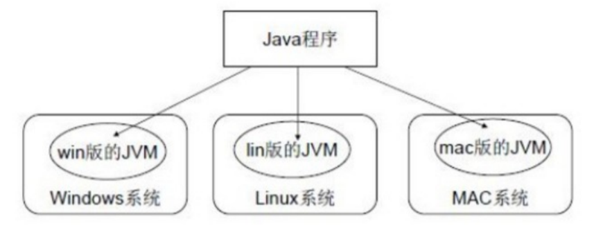
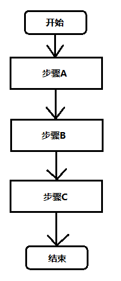
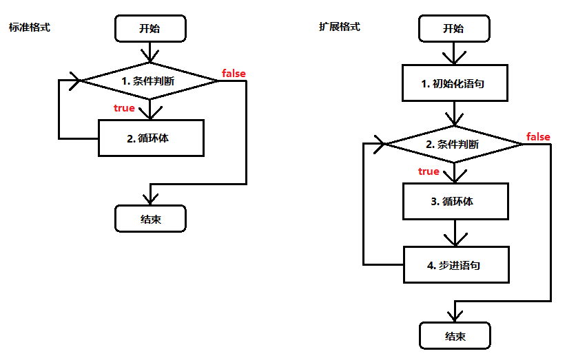

# 一、JAVA基础

## 1.1 计算机基础知识

###### 二进制

计算机中的数据不同于人们生活中的数据，人们生活采用十进制数，而计算机中全部采用二进制数表示，它只包含 0、1两个数，逢二进一，1+1=10。每一个0或者每一个1，叫做一个bit（比特）。

下面了解一下十进制和二进制数据之间的转换计算。 

**十进制数据转成二进制数据**：使用除以2获取余数的方式

​	**二进制数据转成十进制数据**：使用8421编码的方式

> 小贴士：
>
>  二进制数系统中，每个0或1就是一个位，叫做bit（比特）。

###### 字节

字节是我们常见的计算机中最小存储单元。计算机存储任何的数据，都是以字节的形式存储，右键点击文件属性， 我们可以查看文件的字节大小。

位（bit）：一个数字0或者一个数字1，代表一位。

字节（Byte）：每逢8位是一个字节，这是数据存储的最小单位。

- 1 Byte = 8 bit
- 1 KB = 1024 Byte
- 1 MB = 1024 KB
- 1 GB = 1024 MB
- 1 TB = 1024 GB
- 1 PB = 1024 TB
- 1 EB = 1024 PB
- 1 ZB = 1024 EB

###### 常用DOS命令

Java语言的初学者，学习一些DOS命令，会非常有帮助。DOS是一个早期的操作系统，现在已经被Windows系统取代，对于我们开发人员，目前需要在DOS中完成一些事情，因此就需要掌握一些必要的命令。 

- 进入DOS操作窗口
  - 按下Windows+R键盘，打开运行窗口，输入cmd回车，进入到DOS的操作窗口。
  - 打开DOS命令行后，看到一个路径 c:\user 就表示我们现在操作的磁盘是c盘。

- 常用命令

  | 命令               | 操作符号                     |
  | :----------------- | ---------------------------- |
  | 盘符切换           | `盘符号:`                    |
  | 查看当前文件夹内容 | `dir`                        |
  | 进入文件夹         | `cd 文件夹名`                |
  | 进入多级文件夹     | `cd 文件夹1\文件夹2\文件夹3` |
  | 退出文件夹         | `cd ..`                      |
  | 退出到磁盘根目录   | `cd\`                        |
  | 清屏               | `cls`                        |
  | 退出               | `exit`                       |

## 1.2 JAVA语言开发环境

### 1.2.1 Java虚拟机——JVM

- **JVM**（Java Virtual Machine ）：Java虚拟机，简称JVM，是运行所有Java程序的假想计算机，是Java程序的 运行环境，是Java 最具吸引力的特性之一。我们编写的Java代码，都运行在 `JVM `之上。
- **跨平台**：任何软件的运行，都必须要运行在操作系统之上，而我们用Java编写的软件可以运行在任何的操作系 统上，这个特性称为**Java语言的跨平台特性**。该特性是由JVM实现的，我们编写的程序运行在JVM上，而JVM 运行在操作系统上。



如图所示，Java的虚拟机本身不具备跨平台功能的，每个操作系统下都有不同版本的虚拟机。

### 1.2.2 JRE和JDK

- JRE (Java Runtime Environment) ：是Java程序的运行时环境，包含`JVM`和运行时所需要的`核心类库` 。
- JDK (Java Development Kit)：是Java程序开发工具包，包含`JRE`和开发人员使用的工具。

我们想要运行一个已有的Java程序，那么只需安装`JRE`即可。 

我们想要开发一个全新的Java程序，那么必须安装`JDK`。


> 小贴士： 
>
> 三者关系： JDK > JRE > JVM

### 1.2.3 jdk的安装与环境变量的配置

###### oracle官方jdk[下载地址](https://www.oracle.com/technetwork/java/javase/downloads/index.html)

###### 配置环境变量的作用

开发Java程序，需要使用JDK中提供的工具，工具在JDK9安装目录的`bin`目录下。

怎么配置百度吧，好烦。。。。

###### 程序开发步骤

开发环境已经搭建完毕，可以开发我们第一个Java程序了。 Java程序开发三步骤：编写、编译、运行。


## 1.3 第一个Java程序

### 1.3.1 HelloWorld

1. 在`d:\javacode`目录下新建文本文件，完整的文件名修改为`HelloWorld.java`，其中文件名为`HelloWorld`，后缀名必须为`.java`。
2. 用记事本打开。
3. 在文件中键入文本并保存，代码如下：

```java
public class HelloWorld {
    public static void main(String[] args) {
        System.out.println("Hello World!");
    }
}

```

> 文件名必须是`HelloWorld`，保证文件名和类的名字是一致的，注意大小写。每个字母和符号必须与示例代码一模一样。

第一个`HelloWord`源程序就编写完成了，但是这个文件是程序员编写的，JVM是看不懂的，也就不能运行，因此我 们必须将编写好的`Java源文件`编译成JVM可以看懂的`字节码文件`。

### 1.3.2 编译Java源文件

在DOS命令行中，进入**Java源文件的目录**，使用`javac`命令进行编译。

命令：

```shell
javac Java源文件名.后缀名
```

举例：

```shell
javac HelloWorld.java
```

编译成功后，命令行没有任何提示。打开`d:\mycode`目录，发现产生了一个新的文件`HelloWorld.class`，该文件 就是编译后的文件，是Java的可运行文件，称为字节码文件，**有了字节码文件**，就可以运行程序了。

> Java源文件的编译工具`javac.exe`，在JDK安装目录的bin目录下。但是由于配置了环境变量，可以再任意目录下使用。

### 1.3.3 运行Java程序

在DOS命令行中，进入Java源文件的目录，使用 java 命令进行运行。

命令：

```shell
java 类名称
```

举例：

```shell
java HelloWorld
```

> java HelloWorld不要写 不要写 不要写.class
>
> Java程序`.class文件`的运行工具`java.exe`，在JDK安装目录的bin目录下。但是由于配置了环境变量，可以再任意目录下使用。

## 1.4 说明

###### 编译和运行时两回事

- **编译**：是指将我们编写的Java源文件翻译成JVM认识的class文件，在这个过程中，`javac`编译器会检查我们 所写的程序是否有错误，有错误就会提示出来，如果没有错误就会编译成功。
- **运行**：是指将`class文件`交给JVM去运行，此时JVM就会去执行我们编写的程序了。

###### 关于main方法

- **main方法**：称为主方法。写法是**固定格式**不可以更改。main方法是程序的入口点或起始点，无论我们编写多 少程序，JVM在运行的时候，都会从main方法这里开始执行。

###### 添加注释comment

- **注释**：就是对代码的解释和说明。其目的是让人们能够更加轻松地了解代码。为代码添加注释，是十分必须要的，它不影响程序的编译和运行。

- Java中有单行注释和多行注释
  - 单行注释以`//开头 换行结束`
  - 多行注释以`/*开头 以*/结束`

###### 关键字keywords

- **关键字**：是指在程序中，Java已经定义好的单词，具有特殊含义。
  - HelloWorld案例中，出现的关键字有`public`、`class`、`static`、`void`等，这些单词已经被 Java定义好，全部都是小写字母，notepad++中颜色特殊。
  - 关键字比较多，不能死记硬背，学到哪里记到哪里即可。

###### 标识符

- **标识符**：是指在程序中，我们自己定义内容。比如类的名字、方法的名字和变量的名字等等，都是标识符
  - HelloWorld案例中，出现的标识符有类名字`HelloWorld`。
- **命名规则：`硬性要求`**
  - 标识符可以包含`英文字母26个(区分大小写)`、`0-9数字`、`$（美元符号` 和`_（下划线）`。
  - 标识符不能以数字开头。
  - 标识符不能是关键字。
- **命名规范：`软性建议`**
  - 类名规范：首字母大写，后面每个单词首字母大写（大驼峰式）。
  - 方法名规范： 首字母小写，后面每个单词首字母大写（小驼峰式）。
  - 变量名规范：全部小写。

## 1.5 常量

### 1.5.1 概述

**常量：是指在Java程序中固定不变的数据。**

### 1.5.2 分类

| 类型       | 含义                                       | 数据举例                 |
| ---------- | ------------------------------------------ | ------------------------ |
| 整数常量   | 所有的整数                                 | 0, 1, 534, -324          |
| 小数常量   | 所有的小数                                 | 0.0, -0.1, 2.33          |
| 字符常量   | 单引号引起来，只能写入一个字符，必须有内容 | 'a', ' ', '1', '和'      |
| 字符串常量 | 双引号引起来，可以写入多个字符，也可以不写 | “A”, “Hello”, "你好", "" |
| 布尔常量   | 只有两个值                                 | true, false              |
| 空常量     | 只有一个值                                 | null                     |

### 1.5.3 练习

需求：输出各种类型的常量。

```java
public class ConstantDemo {
    public static void main(String[] args){
        //输出整数常量
        System.out.println(123);
        //输出小数常量
        System.out.println(0.125);
        //输出字符常量
        System.out.println('A');
        //输出布尔常量
        System.out.println(true);
        //输出字符串常量
        System.out.println("你好Java");
    }
}
```

## 1.6 变量和数据类型

### 1.6.1 变量概述

- 变量：常量是固定不变的数据，那么在程序中可以变化的量称为变量。

> 数学中，可以使用字母代替数字运算,例如 x=1+5 或者 6=x+5。 
>
> 程序中，可以使用字母保存数字的方式进行运算，提高计算能力，可以解决更多的问题。比如x保存5，x也可以保存6，这样x保存的数据是可以改变的，也就是我们所讲解的变量。

Java中要求一个变量每次只能保存一个数据，必须要明确保存的数据类型

### 1.6.2 数据类型

###### 数据类型分类

Java的数据类型分为两大类：

- 基本数据类型：包括`整数`、`浮点数`、`字符`、`布尔`。

- 引用数据类型：包括`类`、`数组`、`接口`。

###### 基本数据类型

四类八种基本数据类型：

| 数据类型     | 关键字       | 内存占用 | 取值范围                |
| ------------ | ------------ | -------- | ----------------------- |
| 字节型       | byte         | 1个字节  | -128 ~ 127              |
| 短整型       | short        | 2个字节  | -32768 ~ 32767          |
| 整型         | int(默认)    | 4个字节  | -2^31 ~ (2^31) - 1      |
| 长整型       | long         | 8个字节  | -2^63 ~ (2^63) - 1      |
| 单精度浮点数 | float        | 4个字节  | 1.4013E-45 ~ 3.4028E+38 |
| 双精度浮点数 | double(默认) | 8个字节  | 4.9E-324 ~ 1.7977E+308  |
| 字符型       | char         | 2个字节  | 0 - 65535               |
| 布尔类型     | boolean      | 1个字节  | true, false             |

> Java中的默认类型：整数类型是`int`、浮点类型是`double`。

### 1.6.3 变量的定义

变量定义的格式包括三个要素：`数据类型`、`变量名`、`数据值`。

###### 格式

```java
数据类型 变量名 = 数据值;
```

###### 练习

定义所有基本数据类型的变量，代码如下：

```java
public class Variable {
    public static void main(String[] args){
        //定义字节型变量
        byte b = 100;
        System.out.println(b);
        //定义短整型变量
        short s = 1000;
        System.out.println(s);
        //定义整型变量
        int i = 123456;
        System.out.println(i);
        //定义长整型变量
        long l = 12345678900L;
        System.out.println(l);
        //定义单精度浮点型变量
        float f = 5.5F;
        System.out.println(f);
        //定义双精度浮点型变量
        double d = 8.5;
        System.out.println(d);
        //定义布尔型变量
        boolean bool = false;
        System.out.println(bool);
        //定义字符型变量
        char c = 'A';
        System.out.println(c);
    }
}
```

> long类型：建议数据后加L表示。
>
> float类型：建议数据后加F表示。

###### 注意事项

- 变量名称：在同一个大括号范围内，变量的名字不可以相同。
- 变量赋值：定义的变量，不赋值不能使用。

## 1.7 数据类型转换

Java程序中要求参与的计算的数据，必须要保证数据类型的一致性，如果数据类型不一致将发生类型的转换。

### 1.7.1 自动类型转换

范围小的类型向范围大的类型提升，`byte`、`short`、`char`运算时直接提升为`int`。

```java
byte、short、char‐‐>int‐‐>long‐‐>float‐‐>double
```


> 注意：
>
> 布尔类型`boolean`占有一个字节，由于其本身所代码的特殊含义，`boolean`类型与其他基本类型不能进行类型的转换（既不能进行自动类型的提升，也不能强制类型转换），否则，将编译出错。

不仅如此，把任何基本类型的值和**字符串**进行连接运算时，基本类型的值将自动转换成为字符串类型，虽然字符串类型不是基本类型，而是引用类型。因此，如果想将基本类型的值转换为对应的字符串，可以把基本类型的值和一个空字符串进行连接。

 当一个**算数表达式**中包含多个基本类型的值的时候 ，整个算数表达式的数据类型将发生自动提升。java定义了如下的自动提升规则：

1. 所有的`byte`类型，`short`类型和`char`类型将被提升到`int`类型。
2. 整个算数表达式的数据类型自动提升到与表达式中最高等级操作数同样的类型。
3. java中整数类型默认是`int`类型，小数类型默认是`double`类型。

### 1.7.2 强制类型转换

强制类型转换：将`取值范围大的类型`强制转换成`取值范围小的类型`。 比较而言，自动转换是Java自动执行的，而强制转换需要我们自己手动执行。

转换格式：

```java
数据类型 变量名 = (数据类型)被转数据值;
```

例如：

```java
public static void main(String[] args) {
    //short类型变量，内存中2个字节
    short s = 1;
    /*
    出现编译失败
    s和1做运算的时候，1是int类型，s会被提升为int类型
    s+1后的结果是int类型，将结果在赋值会short类型时发生错误
    short内存2个字节，int类型4个字节
    必须将int强制转成short才能完成赋值
    */
    s = s + 1；//编译失败
    s = (short)(s+1);//编译成功
}
```

> **强烈注意：**
>
> - 浮点转成整数，直接取消小数点，可能造成数据损失精度。
> - `int`强制转成`short`砍掉2个字节，可能造成数据丢失。

### 1,7.3 ASCII编码表

```java
public static void main(String[] args) {
    //字符类型变量
    char c = 'a';
    int i = 1;
    //字符类型和int类型计算
    System.out.println(c+i);//输出结果是98
}

```

在计算机的内部都是二进制的0、1数据，如何让计算机可以直接识别人类文字的问题呢？就产生出了编码表的概念。

编码表 ：就是将人类的文字和一个十进制数进行对应起来组成一张表格。

常用ASCII码

| 字符 | 数值 |
| ---- | ---- |
| 0    | 48   |
| 9    | 57   |
| A    | 65   |
| Z    | 90   |
| a    | 97   |
| z    | 122  |

> 将所有的英文字母，数字，符号都和十进制进行了对应，因此产生了世界上第一张编码表ASCII（ American Standard Code for Information Interchange 美国标准信息交换码）。
>
> 还有其他常用编码表如：Unicode、UTF-8等等。

上面在`char`类型和`int`类型计算的过程中，`char`类型的字符先查询编码表，得到97，再和1求和，结果为98。`char`类型提升为了`int`类型。`char`类型内存2个字节，`int`类型内存4个字节。

### 1.7.4 运算符

#### 1.7.4.1 算术运算符

| 算术运算符 |                          |
| ---------- | ------------------------ |
| `+`        | 加法运算、字符数连接运算 |
| `-`        | 减法运算                 |
| `*`        | 乘法运算                 |
| `/`        | 除法运算                 |
| `%`        | 取模运算                 |
| `++`、`--` | 自增、自减运算           |

Java中，整数使用以上运算符，无论怎么计算，也不会得到小数。

```java
public static void main(String[] args) {
    int i = 1234;
    System.out.println(i/1000*1000);//计算结果是1000
}

```

- `++`运算，变量自己增长1。反之，`--`运算，变量自己减少1，用法与`++`一致。

  - 独立运算：

    - 变量在独立运算时，`前++`和`后++`没有区别 。
    - 变量`前++`：例如`++i`。
    - 变量`后++`：例如`i++`。

  - 混合运算：

    - 和其他变量放在一起，`前++`和`后++`就产生了不同。
    - 变量`前++`：变量a自己加1，将加1后的结果赋值给b，也就是说a先计算。a和b的结果都是2。

    ```java
    public static void main(String[] args) {
        int a = 1;
        int b = ++a;
        System.out.println(a);//计算结果是2
        System.out.println(b);//计算结果是2
    }
    
    ```

    - 变量`后++`：变量a先把自己的值1，赋值给变量b，此时变量b的值就是1，变量a自己再加1。a的结果是2，b 的结果是1。

    ```java
    public static void main(String[] args) {
        int a = 1;
        int b = a++;
        System.out.println(a);//计算结果是2
        System.out.println(b);//计算结果是1
    }
    
    ```

- `+`符号在字符串中的操作：

  - `+`符号在遇到字符串的时候，表示连接、拼接的含义。
  - "a"+"b"的结果是“ab”，连接含义

```java
public static void main(String[] args){
    System.out.println("5+5="+5+5);//输出5+5=55
}
```

#### 1.7.4.2 赋值运算符

| 赋值运算符 |        |
| ---------- | ------ |
| `=`        | 等于号 |
| `+=`       | 加等于 |
| `-=`       | 减等于 |
| `*=`       | 乘等于 |
| `/=`       | 除等于 |
| `%=`       | 取模等 |

赋值运算符，就是将符号右边的值，赋给左边的变量。

```java
public static void main(String[] args){
    int i = 5;
    i+=5;//计算方式 i=i+5 变量i先加5，再赋值变量i
    System.out.println(i); //输出结果是10
}

```

#### 1.7.4.3 比较运算符

| 比较运算符 |                                                              |
| ---------- | ------------------------------------------------------------ |
| `==`       | 比较符号两边数据是否相等，相等结果是true。                   |
| `<`        | 比较符号左边的数据是否小于右边的数据，如果小于结果是true。   |
| `>`        | 比较符号左边的数据是否大于右边的数据，如果大于结果是true。   |
| `<=`       | 比较符号左边的数据是否小于或者等于右边的数据，如果小于结果是true。 |
| `>=`       | 比较符号左边的数据是否大于或者等于右边的数据，如果小于结果是true。 |
| `!=`       | 不等于符号 ，如果符号两边的数据不相等，结果是true。          |

比较运算符，是两个数据之间进行比较的运算，运算结果都是布尔值`true`或者`false`。

```java
public static void main(String[] args) {
    System.out.println(1==1);//true
    System.out.println(1<2);//true
    System.out.println(3>4);//false
    System.out.println(3<=4);//true
    System.out.println(3>=4);//false
    System.out.println(3!=4);//true
}
```

#### 1.7.4.4 逻辑运算符

| 逻辑运算符 |                                                              |
| ---------- | ------------------------------------------------------------ |
| `&&`       | 1. 两边都是true，结果是true<br>2. 一边是false，结果是false<br>特点：符号左边是false，右边不再运算 |
| `||`       | 1. 两边都是false，结果是false<br>2. 一边是true，结果是true<br>特点： 符号左边是true，右边不再运算 |
| `!`        | 1.`! true`结果是false<br>2.`! false`结果是true               |

逻辑运算符，是用来连接两个布尔类型结果的运算符，运算结果都是布尔值`true`或者`false`

```java
public static void main(String[] args) {
    System.out.println(true && true);//true
    System.out.println(true && false);//false
    System.out.println(false && true);//false，右边不计算
    System.out.println(false || false);//falase
    System.out.println(false || true);//true
    System.out.println(true || false);//true，右边不计算
    System.out.println(!false);//true
}
```

#### 1.7.4.5 三元运算符

格式：

```java
数据类型 变量名 = 布尔类型表达式？结果1：结果2
```

- 三元运算符计算方式： 
  - 布尔类型表达式结果是true，三元运算符整体结果为结果1，赋值给变量。 
  - 布尔类型表达式结果是false，三元运算符整体结果为结果2，赋值给变量。

```java
public static void main(String[] args) {
    int i = (1==2 ? 100 : 200);
    System.out.println(i);//200
    int j = (3<=4 ? 500 : 600);
    System.out.println(j);//500
}

```

#### 1.7.4.6 运算优先级

程序的基本功能是处理数据，任何编程语言都有自己的运算符。因为有了运算符，程序员才写出表达式，实现各种运算操作，实现各种逻辑要求。

  为实现逻辑和运算要求，编程语言设置了各种不同的运算符，且有优先级顺序，所以有的初学者使用复杂表达式的时候搞不清楚。这里详细介绍一下Java中的运算符。

  Java运算符很多，下面按优先顺序列出了各种运算符。

| 优先级（由高到低） | 运算符分类               | 结合顺序 | 运算符                                                    |
| ------------------ | ------------------------ | -------- | --------------------------------------------------------- |
| 1                  | 分隔符                   | 左结合   | `.` `[]` `()` `;` `,`                                     |
| 2                  | 一元运算符               | 右结合   | `!` `++` `--` `-` `~`                                     |
| 3                  | 算术运算符<br>移位运算符 | 左结合   | `*` `/` `%` `+` `-` `<<` `>>` `>>>`                       |
| 4                  | 关系运算符               | 左结合   | `<` `>` `<=` `>=` `instanceof(Java特有)` `==` `!=`        |
| 5                  | 逻辑运算符               | 左结合   | `!` `&&` `||` `~` `&` `|` `^`                             |
| 6                  | 三目运算符               | 右结合   | 布尔表达式?表达式1:表达式2                                |
| 7                  | 赋值运算符               | 右结合   | `=` `*=` `/=` `%=` `+=` `-=` `<<=` `>>=` `>>>=` `&=` `*=` |

## 1.8 方法入门

我们在学习运算符的时候，都为每个运算符单独的创建一个新的类和main方法，我们会发现这样编写代码非常的繁琐，而且重复的代码过多。能否避免这些重复的代码呢，就需要使用方法来实现。

**方法**：就是将一个**功能**抽取出来，把代码单独定义在一个大括号内，形成一个单独的功能。 

当我们需要这个功能的时候，就可以去调用。这样即实现了代码的复用性，也解决了代码冗余的现象。

### 1.8.1 方法的定义

定义格式：

```java
修饰符 返回值类型 方法名 (参数列表){
    代码...;
    return ;
}
```

- 定义格式解释：
  - 修饰符： 目前固定写法`public static`。
  - 返回值类型： 目前固定写法 void ，其他返回值类型在后面的课程讲解。
  - 方法名：为我们定义的方法起名，满足标识符的规范，用来调用方法。
  - 参数列表： 目前无参数，带有参数的方法在后面的课程讲解。 
  - return：方法结束。因为返回值类型是void，方法大括号内的return可以不写。

```java
public static void methodName() {
    System.out.println("这是一个方法");
}
```

### 1.8.2 方法的调用

方法在定义完毕后，方法不会自己运行，必须被调用才能执行，我们可以在主方法main中来调用我们自己定义好的方法。在主方法中，直接写要调用的方法名字就可以调用了。

```java
public static void main(String[] args) {
    //调用定义的方法methodName
    methodName();
}
```

> 注意：
>
> - 方法必须定义在一个类中
> - 方法不能定义在另一个方法内

```java
public class Demo {
    public static void main(String[] args){
        
    }
    //正确写法，类中，main方法外面可以定义方法
    public static void method(){}
}
```

```java
public class Demo {
    public static void main(String[] args){
        //错误写法，一个方法不能定义在另一方法内部
        public static void method(){}
    }
}

```

## 1.9 流程控制语句

在一个程序执行的过程中，各条语句的执行顺序对程序的结果是有直接影响的。也就是说，程序的流程对运行结果有直接的影响。所以，我们必须清楚每条语句的执行流程。而且，很多时候我们要通过控制语句的执行顺序来实现我们要完成的功能。



### 1.9.1 判断语句


#### 1.9.1.1 if语句

格式：

```java
if(关系表达式){
    执行语句；
}
```


```java
if(关系表达式){
    执行语句1；
}else{
	执行语句2；
}
```


```java
if(关系表达式1){
    语句体；
}else if(关系表达式2){
    执行语句2；
}
……
}else if(关系表达式n){
    执行语句n;
}else{
    执行语句n+1；
}
```


```java
public static void main(String[] args) {
    // x和y的关系满足如下：
    // x>=3 y = 2x + 1;
    //‐1<=x<3 y = 2x;
    // x<=‐1 y = 2x – 1;
    // 根据给定的x的值，计算出y的值并输出。
    // 定义变量
    int x = 5;
    int y;
    if (x>= 3) {
	y = 2 * x + 1;
	} else if (x >= ‐1 && x < 3) {
        y = 2 * x;
    } else {
        y = 2 * x ‐ 1;
    }
    System.out.println("y的值是："+y);
}
```

在某些简单的应用中，if语句也可以写成三元表达式。

```java
public static void main(String[] args) {
    int a = 10;
    int b = 20;
    //定义变量，保存a和b的较大值
    int c;
    if(a > b) {
        c = a;
    } else {
        c = b;
    }
    //可以上述功能改写为三元运算符形式
    c = a > b ? a:b;
}
```


#### 1.9.1.2 选择语句

格式：

```java
switch(表达式) {
    case 常量值1:
        语句体1;
        break;
    case 常量值2:
        语句体2;
        break;
        ...
    default:
        语句体n+1;
        break;
}
```

- 执行流程
  - 首先计算出表达式的值
  - 其次，和`case`依次比较，一旦有对应的值，就会执行相应的语句，在执行的过程中，遇到`break`就会结束。
  - 最后，如果所有的`case`都和表达式的值不匹配，就会执行`default`语句体部分，然后程序结束掉。

> 注意：
>
> 如果漏掉`break`，会一直执行到下一个`case`，直到遇到一个`break`，或者整个switch执行结束。

```java
public static void main(String[] args) {
    //定义变量，判断是星期几
    int weekday = 6;
    //switch语句实现选择
    switch(weekday) {
        case 1:
            System.out.println("星期一");
            break;
        case 2:
            System.out.println("星期二");
            break;
        case 3:
            System.out.println("星期三");
            break;
        case 4:
            System.out.println("星期四");
            break;
        case 5:
            System.out.println("星期五");
            break;
        case 6:
            System.out.println("星期六");
            break;
        case 7:
            System.out.println("星期日");
            break;
        default:
            System.out.println("你输入的数字有误");
            break;
    }
}
```

switch语句中，表达式的数据类型，可以是`byte`，`short`，`int`，`char`，`enum`（枚举），JDK7后可以接收字符串。

#### 1.9.1.3 for循环语句

循环语句可以在满足循环条件的情况下，反复执行某一段代码，这段被重复执行的代码被称为循环体语句，当反复执行这个循环体时，需要在合适的时候把循环判断条件修改为false，从而结束循环，否则循环将一直执行下去，形成死循环。

格式：

```java
for(初始化表达式①;布尔表达式②;步进表达式③){
    循环体④;
}
```

- 执行流程
  - 执行顺序：①②③④>②③④>②③④…②不满足为止。
  - ①负责完成循环变量初始化
  - ②负责判断是否满足循环条件，不满足则跳出循环
  - ③具体执行的语句
  - ④循环后，循环条件所涉及变量的变化情况


```java
public static void main(String[] args) {
    //1.定义一个初始化变量,记录累加求和,初始值为0
    int sum = 0;
    //2.利用for循环获取1‐100之间的数字
    for (int i = 1; i <= 100; i++) {
        //3.判断获取的数组是奇数还是偶数
        if(i % 2==0){
            //4.如果是偶数就累加求和
            sum += i;
        }
    }
    //5.循环结束之后,打印累加结果
    System.out.println("sum:"+sum);
}
```

#### 1.9.1.4 while循环语句

格式：

```java
初始化表达式①
    while(布尔表达式②){
        循环体③
            步进表达式④
    }

```



```java
public static void main(String[] args) {
    //使用while循环实现
    //定义一个变量,记录累加求和
    int sum = 0;
    //定义初始化表达式
    int i = 1;
    //使用while循环让初始化表达式的值变化
    while(i<=100){
        //累加求和
        sum += i ;
        //步进表达式改变变量的值
        i++;
    }
    //打印求和的变量
    System.out.println("1‐100的和是："+sum);
}

```

#### 1.9.1.5 do …while

格式：

# 二、面向对象与封装

# 三、JAVA高级