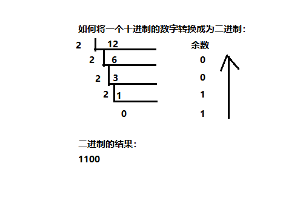
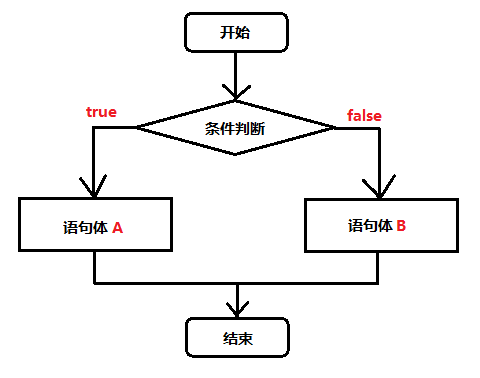
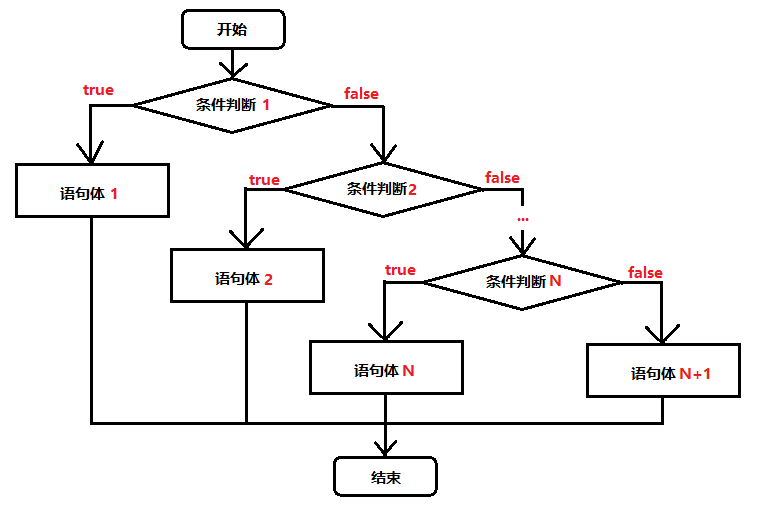
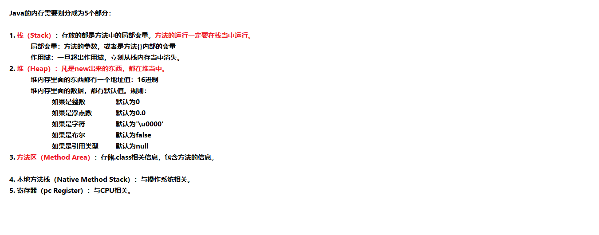

# 目录

- 一、[计算机基础知识](#一、-计算机基础知识)

- 二、[JAVA语言开发环境](二、-JAVA语言开发环境)
  - 2.1 [Java虚拟机——JVM](#2.1-Java虚拟机——JVM)
  - 2.2 [JRE和JDK](#2.2-JRE和JDK)
  - 2.3 [jdk的安装与环境变量的配置](#2.3-jdk的安装与环境变量的配置)

- 三、[第一个Java程序](#三、-第一个Java程序)
  - 3.1 [HelloWorld](#3.1-HelloWorld)
  - 3.2 [编译Java源文件](#3.2-编译Java源文件)
  - 3.3 [说明](#3.3-说明)

- 四、[数据](#四、-数据)
  - 4.1 [常量](#4.1-常量)
  - 4.2 [变量和数据类型](#4.2-变量和数据类型)
  - 4.3 [数据类型转换](#4.3-数据类型转换)
  - 4.4 [运算符](#4.4-运算符)

- 五、 [方法入门](五、-方法入门)
  - 5.1 [方法的定义](#5.1-方法的定义)
  - 5.2 [方法的调用](#5.2-方法的调用)

- 六、 [流程控制语句](#六、-流程控制语句)
  - 6.1 [if判断语句](#6.1-if判断语句)
  - 6.2 [switch选择语句](#6.2-switch选择语句)
  - 6.3 [for循环语句](#6.3-for循环语句)
  - 6.4 [while循环语句](#6.4-while循环语句)
  - 6.5 [do …while循环语句](#6.5-do …while循环语句)
  - 6.6 [中断语句](#6.6-中断语句)
  - 6.7 [其他](#6.7-其他)

- 七、 [JAVA入门](#七、-JAVA入门)
  - 7.1 [常用软件推荐](#7.1-常用软件推荐)
  - 7.2 [方法](#7.2-方法)
  - 7.3 [方法重载](#7.3-方法重载)

- 八、 [数组](#八、-数组)
  - 8.1 [数组的定义](#8.1-数组的定义)
  - 8.2 [数组的访问](#8.2-数组的访问)
  - 8.3 [数组内存](#8.2-数组的访问)
  - 8.4 [数组常见操作](#8.4-数组常见操作)
  - 8.5 [数组作为方法参数和返回值](#8.5-数组作为方法参数和返回值)

# 一、 计算机基础知识

**二进制**

计算机中的数据不同于人们生活中的数据，人们生活采用十进制数，而计算机中全部采用二进制数表示，它只包含 0、1两个数，逢二进一，1+1=10。每一个0或者每一个1，叫做一个bit（比特）。

下面了解一下十进制和二进制数据之间的转换计算。 

**十进制数据转成二进制数据**：使用除以2获取余数的方式



​	**二进制数据转成十进制数据**：使用8421编码的方式


> 小贴士：
>
> 二进制数系统中，每个0或1就是一个位，叫做bit（比特）。

**字节**

字节是我们常见的计算机中最小存储单元。计算机存储任何的数据，都是以字节的形式存储，右键点击文件属性， 我们可以查看文件的字节大小。

位（bit）：一个数字0或者一个数字1，代表一位。

字节（Byte）：每逢8位是一个字节，这是数据存储的最小单位。

- 1 Byte = 8 bit
- 1 KB = 1024 Byte
- 1 MB = 1024 KB
- 1 GB = 1024 MB
- 1 TB = 1024 GB
- 1 PB = 1024 TB
- 1 EB = 1024 PB
- 1 ZB = 1024 EB

**常用DOS命令**

Java语言的初学者，学习一些DOS命令，会非常有帮助。DOS是一个早期的操作系统，现在已经被Windows系统取代，对于我们开发人员，目前需要在DOS中完成一些事情，因此就需要掌握一些必要的命令。 

- 进入DOS操作窗口

  - 按下Windows+R键盘，打开运行窗口，输入cmd回车，进入到DOS的操作窗口。
  - 打开DOS命令行后，看到一个路径 c:\user 就表示我们现在操作的磁盘是c盘。

- 常用命令

  | 命令               | 操作符号                     |
  | :----------------- | ---------------------------- |
  | 盘符切换           | `盘符号:`                    |
  | 查看当前文件夹内容 | `dir`                        |
  | 进入文件夹         | `cd 文件夹名`                |
  | 进入多级文件夹     | `cd 文件夹1\文件夹2\文件夹3` |
  | 退出文件夹         | `cd ..`                      |
  | 退出到磁盘根目录   | `cd\`                        |
  | 清屏               | `cls`                        |
  | 退出               | `exit`                       |

# 二、 JAVA语言开发环境

## 2.1 Java虚拟机——JVM

- **JVM**（Java Virtual Machine ）：Java虚拟机，简称JVM，是运行所有Java程序的假想计算机，是Java程序的 运行环境，是Java 最具吸引力的特性之一。我们编写的Java代码，都运行在 `JVM `之上。
- **跨平台**：任何软件的运行，都必须要运行在操作系统之上，而我们用Java编写的软件可以运行在任何的操作系 统上，这个特性称为**Java语言的跨平台特性**。该特性是由JVM实现的，我们编写的程序运行在JVM上，而JVM 运行在操作系统上。


如图所示，Java的虚拟机本身不具备跨平台功能的，每个操作系统下都有不同版本的虚拟机。

## 2.2 JRE和JDK

- JRE (Java Runtime Environment) ：是Java程序的运行时环境，包含`JVM`和运行时所需要的`核心类库` 。
- JDK (Java Development Kit)：是Java程序开发工具包，包含`JRE`和开发人员使用的工具。

我们想要运行一个已有的Java程序，那么只需安装`JRE`即可。 

我们想要开发一个全新的Java程序，那么必须安装`JDK`。


> 小贴士： 
>
> 三者关系： JDK > JRE > JVM

## 2.3 jdk的安装与环境变量的配置

**oracle官方jdk[下载地址](https://www.oracle.com/technetwork/java/javase/downloads/index.html)**

**配置环境变量的作用**

开发Java程序，需要使用JDK中提供的工具，工具在JDK9安装目录的`bin`目录下。

怎么配置百度吧，好烦。。。。

**程序开发步骤**

开发环境已经搭建完毕，可以开发我们第一个Java程序了。 Java程序开发三步骤：编写、编译、运行。


# 三、 第一个Java程序

## 3.1 HelloWorld

1. 在`d:\javacode`目录下新建文本文件，完整的文件名修改为`HelloWorld.java`，其中文件名为`HelloWorld`，后缀名必须为`.java`。
2. 用记事本打开。
3. 在文件中键入文本并保存，代码如下：

```java
public class HelloWorld {
    public static void main(String[] args) {
        System.out.println("Hello World!");
    }
}

```

> 文件名必须是`HelloWorld`，保证文件名和类的名字是一致的，注意大小写。每个字母和符号必须与示例代码一模一样。

第一个`HelloWord`源程序就编写完成了，但是这个文件是程序员编写的，JVM是看不懂的，也就不能运行，因此我 们必须将编写好的`Java源文件`编译成JVM可以看懂的`字节码文件`。

## 3.2 编译Java源文件

在DOS命令行中，进入**Java源文件的目录**，使用`javac`命令进行编译。

命令：

```shell
javac Java源文件名.后缀名
```

举例：

```shell
javac HelloWorld.java
```

编译成功后，命令行没有任何提示。打开`d:\mycode`目录，发现产生了一个新的文件`HelloWorld.class`，该文件 就是编译后的文件，是Java的可运行文件，称为字节码文件，**有了字节码文件**，就可以运行程序了。

> Java源文件的编译工具`javac.exe`，在JDK安装目录的bin目录下。但是由于配置了环境变量，可以再任意目录下使用。

## 3.3 运行Java程序

在DOS命令行中，进入Java源文件的目录，使用 java 命令进行运行。

命令：

```shell
java 类名称
```

举例：

```shell
java HelloWorld
```

> java HelloWorld不要写 不要写 不要写.class
>
> Java程序`.class文件`的运行工具`java.exe`，在JDK安装目录的bin目录下。但是由于配置了环境变量，可以再任意目录下使用。

## 3.3 说明

**1. 编译和运行时两回事**

- **编译**：是指将我们编写的Java源文件翻译成JVM认识的class文件，在这个过程中，`javac`编译器会检查我们 所写的程序是否有错误，有错误就会提示出来，如果没有错误就会编译成功。
- **运行**：是指将`class文件`交给JVM去运行，此时JVM就会去执行我们编写的程序了。

**2. 关于main方法**

- **main方法**：称为主方法。写法是**固定格式**不可以更改。main方法是程序的入口点或起始点，无论我们编写多 少程序，JVM在运行的时候，都会从main方法这里开始执行。

**3. 添加注释comment**

- **注释**：就是对代码的解释和说明。其目的是让人们能够更加轻松地了解代码。为代码添加注释，是十分必须要的，它不影响程序的编译和运行。

- Java中有单行注释和多行注释
  - 单行注释以`//开头 换行结束`
  - 多行注释以`/*开头 以*/结束`

**4. 关键字keywords**

- **关键字**：是指在程序中，Java已经定义好的单词，具有特殊含义。
  - HelloWorld案例中，出现的关键字有`public`、`class`、`static`、`void`等，这些单词已经被 Java定义好，全部都是小写字母，notepad++中颜色特殊。
  - 关键字比较多，不能死记硬背，学到哪里记到哪里即可。

**5. 标识符**

- **标识符**：是指在程序中，我们自己定义内容。比如类的名字、方法的名字和变量的名字等等，都是标识符
  - HelloWorld案例中，出现的标识符有类名字`HelloWorld`。
- **命名规则：`硬性要求`**
  - 标识符可以包含`英文字母26个(区分大小写)`、`0-9数字`、`$（美元符号` 和`_（下划线）`。
  - 标识符不能以数字开头。
  - 标识符不能是关键字。
- **命名规范：`软性建议`**
  - 类名规范：首字母大写，后面每个单词首字母大写（大驼峰式）。
  - 方法名规范： 首字母小写，后面每个单词首字母大写（小驼峰式）。
  - 变量名规范：全部小写。

# 四、 数据

## 4.1 常量

**常量：是指在Java程序中固定不变的数据。**

### 4.1.1 分类

| 类型       | 含义                                       | 数据举例                 |
| ---------- | ------------------------------------------ | ------------------------ |
| 整数常量   | 所有的整数                                 | 0, 1, 534, -324          |
| 小数常量   | 所有的小数                                 | 0.0, -0.1, 2.33          |
| 字符常量   | 单引号引起来，只能写入一个字符，必须有内容 | 'a', ' ', '1', '和'      |
| 字符串常量 | 双引号引起来，可以写入多个字符，也可以不写 | “A”, “Hello”, "你好", "" |
| 布尔常量   | 只有两个值                                 | true, false              |
| 空常量     | 只有一个值                                 | null                     |

### 4.1.2 练习

需求：输出各种类型的常量。

```java
public class ConstantDemo {
    public static void main(String[] args){
        //输出整数常量
        System.out.println(123);
        //输出小数常量
        System.out.println(0.125);
        //输出字符常量
        System.out.println('A');
        //输出布尔常量
        System.out.println(true);
        //输出字符串常量
        System.out.println("你好Java");
    }
}
```

## 4.2 变量和数据类型

- 变量：常量是固定不变的数据，那么在程序中可以变化的量称为变量。

> 数学中，可以使用字母代替数字运算,例如 x=1+5 或者 6=x+5。 
>
> 程序中，可以使用字母保存数字的方式进行运算，提高计算能力，可以解决更多的问题。比如x保存5，x也可以保存6，这样x保存的数据是可以改变的，也就是我们所讲解的变量。

Java中要求一个变量每次只能保存一个数据，必须要明确保存的数据类型

### 4.2.1 数据类型

**1. 数据类型分类**

Java的数据类型分为两大类：

- 基本数据类型：包括`整数`、`浮点数`、`字符`、`布尔`。

- 引用数据类型：包括`类`、`数组`、`接口`。

**2. 基本数据类型**

四类八种基本数据类型：

| 数据类型     | 关键字       | 内存占用 | 取值范围                |
| ------------ | ------------ | -------- | ----------------------- |
| 字节型       | byte         | 1个字节  | -128 ~ 127              |
| 短整型       | short        | 2个字节  | -32768 ~ 32767          |
| 整型         | int(默认)    | 4个字节  | -2^31 ~ (2^31) - 1      |
| 长整型       | long         | 8个字节  | -2^63 ~ (2^63) - 1      |
| 单精度浮点数 | float        | 4个字节  | 1.4013E-45 ~ 3.4028E+38 |
| 双精度浮点数 | double(默认) | 8个字节  | 4.9E-324 ~ 1.7977E+308  |
| 字符型       | char         | 2个字节  | 0 - 65535               |
| 布尔类型     | boolean      | 1个字节  | true, false             |

> Java中的默认类型：整数类型是`int`、浮点类型是`double`。

### 4.2.2 变量的定义

变量定义的格式包括三个要素：`数据类型`、`变量名`、`数据值`。

**格式**

```java
数据类型 变量名 = 数据值;
```

**练习**

定义所有基本数据类型的变量，代码如下：

```java
public class Variable {
    public static void main(String[] args){
        //定义字节型变量
        byte b = 100;
        System.out.println(b);
        //定义短整型变量
        short s = 1000;
        System.out.println(s);
        //定义整型变量
        int i = 123456;
        System.out.println(i);
        //定义长整型变量
        long l = 12345678900L;
        System.out.println(l);
        //定义单精度浮点型变量
        float f = 5.5F;
        System.out.println(f);
        //定义双精度浮点型变量
        double d = 8.5;
        System.out.println(d);
        //定义布尔型变量
        boolean bool = false;
        System.out.println(bool);
        //定义字符型变量
        char c = 'A';
        System.out.println(c);
    }
}
```

> long类型：建议数据后加L表示。
>
> float类型：建议数据后加F表示。

> **注意事项**
>
> - 变量名称：在同一个大括号范围内，变量的名字不可以相同。
> - 变量赋值：定义的变量，不赋值不能使用。
>

## 4.3 数据类型转换

Java程序中要求参与的计算的数据，必须要保证数据类型的一致性，如果数据类型不一致将发生类型的转换。

### 4.3.1 自动类型转换

范围小的类型向范围大的类型提升，`byte`、`short`、`char`运算时直接提升为`int`。

```java
byte、short、char‐‐>int‐‐>long‐‐>float‐‐>double
```


> 注意：
>
> 布尔类型`boolean`占有一个字节，由于其本身所代码的特殊含义，`boolean`类型与其他基本类型不能进行类型的转换（既不能进行自动类型的提升，也不能强制类型转换），否则，将编译出错。

不仅如此，把任何基本类型的值和**字符串**进行连接运算时，基本类型的值将自动转换成为字符串类型，虽然字符串类型不是基本类型，而是引用类型。因此，如果想将基本类型的值转换为对应的字符串，可以把基本类型的值和一个空字符串进行连接。

 当一个**算数表达式**中包含多个基本类型的值的时候 ，整个算数表达式的数据类型将发生自动提升。java定义了如下的自动提升规则：

1. 所有的`byte`类型，`short`类型和`char`类型将被提升到`int`类型。
2. 整个算数表达式的数据类型自动提升到与表达式中最高等级操作数同样的类型。
3. java中整数类型默认是`int`类型，小数类型默认是`double`类型。

### 4.3.2 强制类型转换

强制类型转换：将`取值范围大的类型`强制转换成`取值范围小的类型`。 比较而言，自动转换是Java自动执行的，而强制转换需要我们自己手动执行。

转换格式：

```java
数据类型 变量名 = (数据类型)被转数据值;
```

例如：

```java
public static void main(String[] args) {
    //short类型变量，内存中2个字节
    short s = 1;
    /*
    出现编译失败
    s和1做运算的时候，1是int类型，s会被提升为int类型
    s+1后的结果是int类型，将结果在赋值会short类型时发生错误
    short内存2个字节，int类型4个字节
    必须将int强制转成short才能完成赋值
    */
    s = s + 1；//编译失败
    s = (short)(s+1);//编译成功
}
```

> **强烈注意：**
>
> - 浮点转成整数，直接取消小数点，可能造成数据损失精度。
> - `int`强制转成`short`砍掉2个字节，可能造成数据丢失。

### 4.3.3 ASCII编码表

```java
public static void main(String[] args) {
    //字符类型变量
    char c = 'a';
    int i = 1;
    //字符类型和int类型计算
    System.out.println(c+i);//输出结果是98
}

```

在计算机的内部都是二进制的0、1数据，如何让计算机可以直接识别人类文字的问题呢？就产生出了编码表的概念。

编码表 ：就是将人类的文字和一个十进制数进行对应起来组成一张表格。

常用ASCII码

| 字符 | 数值 |
| ---- | ---- |
| 0    | 48   |
| 9    | 57   |
| A    | 65   |
| Z    | 90   |
| a    | 97   |
| z    | 122  |

> 将所有的英文字母，数字，符号都和十进制进行了对应，因此产生了世界上第一张编码表[ASCII（ American Standard Code for Information Interchange 美国标准信息交换码）](参考/ASCII码表.pdf)。
>
> 还有其他常用编码表如：Unicode、UTF-8等等。

上面在`char`类型和`int`类型计算的过程中，`char`类型的字符先查询编码表，得到97，再和1求和，结果为98。`char`类型提升为了`int`类型。`char`类型内存2个字节，`int`类型内存4个字节。

## 4.4 运算符

### 4.4.1 算术运算符

| 算术运算符 |                          |
| ---------- | ------------------------ |
| `+`        | 加法运算、字符数连接运算 |
| `-`        | 减法运算                 |
| `*`        | 乘法运算                 |
| `/`        | 除法运算                 |
| `%`        | 取模运算                 |
| `++`、`--` | 自增、自减运算           |

Java中，整数使用以上运算符，无论怎么计算，也不会得到小数。

```java
public static void main(String[] args) {
    int i = 1234;
    System.out.println(i/1000*1000);//计算结果是1000
}

```

- `++`运算，变量自己增长1。反之，`--`运算，变量自己减少1，用法与`++`一致。

  - 独立运算：

    - 变量在独立运算时，`前++`和`后++`没有区别 。
    - 变量`前++`：例如`++i`。
    - 变量`后++`：例如`i++`。

  - 混合运算：

    - 和其他变量放在一起，`前++`和`后++`就产生了不同。
    - 变量`前++`：变量a自己加1，将加1后的结果赋值给b，也就是说a先计算。a和b的结果都是2。

    ```java
    public static void main(String[] args) {
        int a = 1;
        int b = ++a;
        System.out.println(a);//计算结果是2
        System.out.println(b);//计算结果是2
    }
    
    ```

    - 变量`后++`：变量a先把自己的值1，赋值给变量b，此时变量b的值就是1，变量a自己再加1。a的结果是2，b 的结果是1。

    ```java
    public static void main(String[] args) {
        int a = 1;
        int b = a++;
        System.out.println(a);//计算结果是2
        System.out.println(b);//计算结果是1
    }
    
    ```

- `+`符号在字符串中的操作：

  - `+`符号在遇到字符串的时候，表示连接、拼接的含义。
  - "a"+"b"的结果是“ab”，连接含义

```java
public static void main(String[] args){
    System.out.println("5+5="+5+5);//输出5+5=55
}
```

### 4.4.2 赋值运算符

| 赋值运算符 |        |
| ---------- | ------ |
| `=`        | 等于号 |
| `+=`       | 加等于 |
| `-=`       | 减等于 |
| `*=`       | 乘等于 |
| `/=`       | 除等于 |
| `%=`       | 取模等 |

赋值运算符，就是将符号右边的值，赋给左边的变量。

```java
public static void main(String[] args){
    int i = 5;
    i+=5;//计算方式 i=i+5 变量i先加5，再赋值变量i
    System.out.println(i); //输出结果是10
}

```

### 4.4.3 比较运算符

| 比较运算符 |                                                              |
| ---------- | ------------------------------------------------------------ |
| `==`       | 比较符号两边数据是否相等，相等结果是true。                   |
| `<`        | 比较符号左边的数据是否小于右边的数据，如果小于结果是true。   |
| `>`        | 比较符号左边的数据是否大于右边的数据，如果大于结果是true。   |
| `<=`       | 比较符号左边的数据是否小于或者等于右边的数据，如果小于结果是true。 |
| `>=`       | 比较符号左边的数据是否大于或者等于右边的数据，如果小于结果是true。 |
| `!=`       | 不等于符号 ，如果符号两边的数据不相等，结果是true。          |

比较运算符，是两个数据之间进行比较的运算，运算结果都是布尔值`true`或者`false`。

```java
public static void main(String[] args) {
    System.out.println(1==1);//true
    System.out.println(1<2);//true
    System.out.println(3>4);//false
    System.out.println(3<=4);//true
    System.out.println(3>=4);//false
    System.out.println(3!=4);//true
}
```

### 4.4.4 逻辑运算符

| 逻辑运算符 |                                                              |
| ---------- | ------------------------------------------------------------ |
| `&&`       | 1. 两边都是true，结果是true<br>2. 一边是false，结果是false<br>特点：符号左边是false，右边不再运算 |
| `||`       | 1. 两边都是false，结果是false<br>2. 一边是true，结果是true<br>特点： 符号左边是true，右边不再运算 |
| `!`        | 1.`! true`结果是false<br>2.`! false`结果是true               |

逻辑运算符，是用来连接两个布尔类型结果的运算符，运算结果都是布尔值`true`或者`false`

```java
public static void main(String[] args) {
    System.out.println(true && true);//true
    System.out.println(true && false);//false
    System.out.println(false && true);//false，右边不计算
    System.out.println(false || false);//falase
    System.out.println(false || true);//true
    System.out.println(true || false);//true，右边不计算
    System.out.println(!false);//true
}
```

### 4.4.5 三元运算符

格式：

```java
数据类型 变量名 = 布尔类型表达式？结果1：结果2
```

- 三元运算符计算方式： 
  - 布尔类型表达式结果是true，三元运算符整体结果为结果1，赋值给变量。 
  - 布尔类型表达式结果是false，三元运算符整体结果为结果2，赋值给变量。

```java
public static void main(String[] args) {
    int i = (1==2 ? 100 : 200);
    System.out.println(i);//200
    int j = (3<=4 ? 500 : 600);
    System.out.println(j);//500
}

```

### 4.4.6 运算优先级

程序的基本功能是处理数据，任何编程语言都有自己的运算符。因为有了运算符，程序员才写出表达式，实现各种运算操作，实现各种逻辑要求。

  为实现逻辑和运算要求，编程语言设置了各种不同的运算符，且有优先级顺序，所以有的初学者使用复杂表达式的时候搞不清楚。这里详细介绍一下Java中的运算符。

  Java运算符很多，下面按优先顺序列出了各种运算符。

| 优先级（由高到低） | 运算符分类               | 结合顺序 | 运算符                                                    |
| ------------------ | ------------------------ | -------- | --------------------------------------------------------- |
| 1                  | 分隔符                   | 左结合   | `.` `[]` `()` `;` `,`                                     |
| 2                  | 一元运算符               | 右结合   | `!` `++` `--` `-` `~`                                     |
| 3                  | 算术运算符<br>移位运算符 | 左结合   | `*` `/` `%` `+` `-` `<<` `>>` `>>>`                       |
| 4                  | 关系运算符               | 左结合   | `<` `>` `<=` `>=` `instanceof(Java特有)` `==` `!=`        |
| 5                  | 逻辑运算符               | 左结合   | `!` `&&` `||` `~` `&` `|` `^`                             |
| 6                  | 三目运算符               | 右结合   | 布尔表达式?表达式1:表达式2                                |
| 7                  | 赋值运算符               | 右结合   | `=` `*=` `/=` `%=` `+=` `-=` `<<=` `>>=` `>>>=` `&=` `*=` |

# 五、 方法入门

我们在学习运算符的时候，都为每个运算符单独的创建一个新的类和main方法，我们会发现这样编写代码非常的繁琐，而且重复的代码过多。能否避免这些重复的代码呢，就需要使用方法来实现。

**方法**：就是将一个**功能**抽取出来，把代码单独定义在一个大括号内，形成一个单独的功能。 

当我们需要这个功能的时候，就可以去调用。这样即实现了代码的复用性，也解决了代码冗余的现象。

## 5.1 方法的定义

定义格式：

```java
修饰符 返回值类型 方法名 (参数列表){
    代码...;
    return ;
}
```

- 定义格式解释：
  - 修饰符： 目前固定写法`public static`。
  - 返回值类型： 目前固定写法 void ，其他返回值类型在后面的课程讲解。
  - 方法名：为我们定义的方法起名，满足标识符的规范，用来调用方法。
  - 参数列表： 目前无参数，带有参数的方法在后面的课程讲解。 
  - return：方法结束。因为返回值类型是void，方法大括号内的return可以不写。

```java
public static void methodName() {
    System.out.println("这是一个方法");
}
```

## 5.2 方法的调用

方法在定义完毕后，方法不会自己运行，必须被调用才能执行，我们可以在主方法main中来调用我们自己定义好的方法。在主方法中，直接写要调用的方法名字就可以调用了。

```java
public static void main(String[] args) {
    //调用定义的方法methodName
    methodName();
}
```

> 注意：
>
> - 方法必须定义在一个类中
> - 方法不能定义在另一个方法内

```java
public class Demo {
    public static void main(String[] args){
        
    }
    //正确写法，类中，main方法外面可以定义方法
    public static void method(){}
}
```

```java
public class Demo {
    public static void main(String[] args){
        //错误写法，一个方法不能定义在另一方法内部
        public static void method(){}
    }
}

```

# 六、 流程控制语句

在一个程序执行的过程中，各条语句的执行顺序对程序的结果是有直接影响的。也就是说，程序的流程对运行结果有直接的影响。所以，我们必须清楚每条语句的执行流程。而且，很多时候我们要通过控制语句的执行顺序来实现我们要完成的功能。


## 6.1 if判断语句

格式：

```java
if(关系表达式){
    执行语句；
}
```


```java
if(关系表达式){
    执行语句1；
}else{
	执行语句2；
}
```



```java
if(关系表达式1){
    语句体；
}else if(关系表达式2){
    执行语句2；
}
……
}else if(关系表达式n){
    执行语句n;
}else{
    执行语句n+1；
}
```



```java
public static void main(String[] args) {
    // x和y的关系满足如下：
    // x>=3 y = 2x + 1;
    //‐1<=x<3 y = 2x;
    // x<=‐1 y = 2x – 1;
    // 根据给定的x的值，计算出y的值并输出。
    // 定义变量
    int x = 5;
    int y;
    if (x>= 3) {
	y = 2 * x + 1;
	} else if (x >= ‐1 && x < 3) {
        y = 2 * x;
    } else {
        y = 2 * x ‐ 1;
    }
    System.out.println("y的值是："+y);
}
```

在某些简单的应用中，if语句也可以写成三元表达式。

```java
public static void main(String[] args) {
    int a = 10;
    int b = 20;
    //定义变量，保存a和b的较大值
    int c;
    if(a > b) {
        c = a;
    } else {
        c = b;
    }
    //可以上述功能改写为三元运算符形式
    c = a > b ? a:b;
}
```


## 6.2 switch选择语句

格式：

```java
switch(表达式) {
    case 常量值1:
        语句体1;
        break;
    case 常量值2:
        语句体2;
        break;
        ...
    default:
        语句体n+1;
        break;
}
```

- 执行流程
  - 首先计算出表达式的值
  - 其次，和`case`依次比较，一旦有对应的值，就会执行相应的语句，在执行的过程中，遇到`break`就会结束。
  - 最后，如果所有的`case`都和表达式的值不匹配，就会执行`default`语句体部分，然后程序结束掉。

> 注意：
>
> 如果漏掉`break`，会一直执行到下一个`case`，直到遇到一个`break`，或者整个switch执行结束。

```java
public static void main(String[] args) {
    //定义变量，判断是星期几
    int weekday = 6;
    //switch语句实现选择
    switch(weekday) {
        case 1:
            System.out.println("星期一");
            break;
        case 2:
            System.out.println("星期二");
            break;
        case 3:
            System.out.println("星期三");
            break;
        case 4:
            System.out.println("星期四");
            break;
        case 5:
            System.out.println("星期五");
            break;
        case 6:
            System.out.println("星期六");
            break;
        case 7:
            System.out.println("星期日");
            break;
        default:
            System.out.println("你输入的数字有误");
            break;
    }
}
```

switch语句中，表达式的数据类型，可以是`byte`，`short`，`int`，`char`，`enum`（枚举），JDK7后可以接收字符串。

## 6.3 for循环语句

循环语句可以在满足循环条件的情况下，反复执行某一段代码，这段被重复执行的代码被称为循环体语句，当反复执行这个循环体时，需要在合适的时候把循环判断条件修改为false，从而结束循环，否则循环将一直执行下去，形成死循环。

格式：

```java
for(初始化表达式①;布尔表达式②;步进表达式③){
    循环体④;
}
```

- 执行流程
  - 执行顺序：①②③④>②③④>②③④…②不满足为止。
  - ①负责完成循环变量初始化
  - ②负责判断是否满足循环条件，不满足则跳出循环
  - ③具体执行的语句
  - ④循环后，循环条件所涉及变量的变化情况


```java
public static void main(String[] args) {
    //1.定义一个初始化变量,记录累加求和,初始值为0
    int sum = 0;
    //2.利用for循环获取1‐100之间的数字
    for (int i = 1; i <= 100; i++) {
        //3.判断获取的数组是奇数还是偶数
        if(i % 2==0){
            //4.如果是偶数就累加求和
            sum += i;
        }
    }
    //5.循环结束之后,打印累加结果
    System.out.println("sum:"+sum);
}
```

## 6.4 while循环语句

格式：

```java
初始化表达式①
    while(布尔表达式②){
        循环体③
            步进表达式④
    }

```


```java
public static void main(String[] args) {
    //使用while循环实现
    //定义一个变量,记录累加求和
    int sum = 0;
    //定义初始化表达式
    int i = 1;
    //使用while循环让初始化表达式的值变化
    while(i<=100){
        //累加求和
        sum += i ;
        //步进表达式改变变量的值
        i++;
    }
    //打印求和的变量
    System.out.println("1‐100的和是："+sum);
}

```

## 6.5 do …while循环语句

格式：

```java
初始化表达式①
    do{
        循环体③
        步进表达式④
    }while(布尔表达式②);
```

> do...while循环的特点：无条件执行一次循环体，即使我们将循环条件直接写成false，也依然会循环一次。

- `for`和`while`的小区别：
  - 控制条件语句所控制的那个变量，在for循环结束后，就不能再被访问到了，而while循环结束还可以继续使用，如果你想继续使用，就用while，否则推荐使用for。原因是for循环结束，该变量就从内存中消失，能够提高内存的使用效率。
  - 在已知循环次数的时候使用推荐使用for，循环次数未知的时推荐使用while。

## 6.6 中断语句

**1. break**

- **使用场景：终止switch或者循环**
  - 在选择结构switch语句中
  - 在循环语句中
  - 离开使用场景的存在是没有意义的

```java
public static void main(String[] args) {
    for (int i = 1; i<=10; i++) {
        //需求:打印完两次HelloWorld之后结束循环
        if(i == 3){
            break;
        }
        System.out.println("HelloWorld"+i);
    }
}
```


**2. continue**

- **使用场景：结束本轮循环，继续开始下一次循环**

```java
public static void main(String[] args) {
    for (int i = 1; i <= 10; i++) {
       //需求:不打印第三次HelloWorld
        if(i == 3){
            continue;
        }
        System.out.println("HelloWorld"+i);
    }
}
```

## 6.7 其他

**1. 死循环**

- 死循环：也就是循环中的条件永远为true，死循环的是永不结束的循环。例如：`while(true){}`和`for(;;){}`

在后期的开发中，会出现使用死循环的场景，例如：我们需要读取用户输入的输入，但是用户输入多少数据我们并不清楚，也只能使用死循环，当用户不想输入数据了，就可以结束循环了，如何去结束一个死循环呢，就需要使用到跳出语句了。

**2. 嵌套循环**

- 所谓嵌套循环，是指一个循环的循环体是另一个循环。比如for循环里面还有一个for循环，就是嵌套循环。总共的循环次数=外循环次数*内循环次数
- 例如：

```java
public static void main(String[] args) {
    //5*8的矩形，打印5行*号，每行8个
    //外循环5次，内循环8次
    for(int i = 0; i < 5; i++){
        for(int j = 0; j < 8; j++){
            //不换行打印星号
            System.out.print("*");
        }
        //内循环打印8个星号后，需要一次换行
        System.out.println();
    }
}
```

每外循环一次，内循环多次。

# 七、 JAVA入门

## 7.1 常用软件推荐

- IDE（Integrated Development Environment，集成开发环境）：用来提高开发效率
  - 免费的IDE当中：Eclipse
  - 收费的IDE当中：IntelliJ IDEA（Jetbrain全家桶值得拥有）
- 记事本：
  - notepad++（免费）
  - Typora(免费，MarkDown记事本)
- 文件索引工具：Everything（免费）
- 项目管理工具：git

**IEAD项目结构**


**IDEA常用快捷键**

| 快捷键                   | 功能                                   |
| ------------------------ | -------------------------------------- |
| `Alt`+`Enter`            | 导入包，自动修正代码                   |
| `Ctrl`+`Y`               | 删除光标所在行                         |
| `Ctrl`+`D`               | 复制光标所在行的内容，插入光标位置下面 |
| `Ctrl`+`Alt`+`L`         | 格式化代码                             |
| `Ctrl`+`/`               | 单行注释                               |
| `Ctrl`+`Shift`+`/`       | 选中代码注释，多行注释，再按取消注释   |
| `Alt`+`Ins`              | 自动生成代码，toString，get，set等方法 |
| `Alt`+`Shift`+`上下箭头` | 移动当前代码行                         |

## 7.2 方法

前面的课程中，使用过嵌套循环输出矩形，控制台打印出矩形就可以了，因此将方法定义为`void`，没有返回值。 在主方法`main`中直接被调用。

```java
public class Method_Demo1 {
    public static void main(String[] args) {
        print();
    }
    
    private static void print() {
        for (int i = 0; i < 5; i++) {
            for (int j = 0; j < 8; j++) {
                System.out.print("*");
            }
            System.out.println();
        }
    }
}
```

`print`方法被`main`方法调用后直接输出结果，而`main`方法并不需要`print`方法的执行结果，所以被定义为`void`。

### 7.2.1 定义方法的格式详解

```java
修饰符 返回值类型 方法名(参数列表){
    //代码省略...
    return 结果;
}

```

- 修饰符： public static 固定写法
- 返回值类型： 表示方法运行的结果的数据类型，方法执行后将结果返回到调用者
- 参数列表：方法在运算过程中的未知数据，调用者调用方法时传递 return：将方法执行后的结果带给调用者，方法执行到`return`，整体方法运行结束

>  小贴士：return 结果; 这里的"结果"在开发中，我们正确的叫法成为**方法的返回值**

### 7.2.2 定义方法的两个明确

- 需求：定义方法实现两个整数的求和计算。
  - **明确返回值类型**：方法计算的是整数的求和，结果也必然是个整数，返回值类型定义为`int`类型。
  - **明确参数列表**：计算哪两个整数的和，并不清楚，但可以确定是整数，参数列表可以定义两个`int`类型的变量，由调用者调用方法时传递

```java
public class Method_Demo2 {
    public static void main(String[] args) {
        // 调用方法getSum，传递两个整数，这里传递的实际数据又称为实际参数
        // 并接收方法计算后的结果，返回值
        int sum = getSum(5, 6);
        System.out.println(sum);
    }
    /*
    定义计算两个整数和的方法
    返回值类型，计算结果是int
    参数：不确定数据求和，定义int参数.参数又称为形式参数
    */
    public static int getSum(int a, int b) {
        return a + b;
    }
}
```

程序执行，主方法`main`调用`getSum`方法，传递了实际数据`5`和`6`，两个变量`a`和`b`接收到的就是实际参数，并将计算后的结果返回，主方法`main`中的变量`sum`接收的就是方法的返回值。

### 7.2.3 调用方法的流程图解


### 7.2.4 练习

**一：比较两个整数是否相同**

- 分析：定义方法实现功能，需要有两个明确，即`返回值`和`参数列表`。
  - 明确返回值：比较整数，比较的结果只有两种可能，相同或不同，因此结果是布尔类型，比较的结果相同为`true`。 
  - 明确参数列表：比较的两个整数不确定，所以默认定义两个`int`类型的参数。

```java
public class Method_Demo3 {
    public static void main(String[] args) {
        //调用方法compare，传递两个整数
        //并接收方法计算后的结果，布尔值
        boolean bool = compare(3, 8);
        System.out.println(bool);
    }
    /*
    定义比较两个整数是否相同的方法
    返回值类型，比较的结果布尔类型
    参数：不确定参与比较的两个整数
    */
    public static boolean compare(int a, int b) {
        if (a == b) {
            return true;
        } else {
            return false;
        }
    }
}
```

**二：计算1+2+3...+100的和**

- 分析：定义方法实现功能，需要有两个明确，即`返回值`和`参数`。
  - 明确返回值：1~100的求和，计算后必然还是整数，返回值类型是`int` 
  - 明确参数：需求中已知到计算的数据，没有未知的数据，不定义参数

```java
public class Method_Demo4 {
    public static void main(String[] args) {
        //调用方法getSum       
        //并接收方法计算后的结果，整数
        int sum = getSum();
        System.out.println(sum);
    }
    /*
    定义计算1~100的求和方法
    返回值类型，计算结果整数int
    参数：没有不确定数据
    */
    public static int getSum() {
        //定义变量保存求和
        int sum = 0;
        //从1开始循环，到100结束
        for (int i = 1; i <= 100; i++) {
            sum = sum + i;
        }
        return sum;
    }
}
```

**三：实现不定次数打印**

- 分析：定义方法实现功能，需要有两个明确，即`返回值`和`参数`。
  - 明确返回值：方法中打印出`HelloWorld`即可，没有计算结果，返回值类型`void`。
  - 明确参数：打印几次不清楚，参数定义一个整型参数

```java
public class Method_Demo5 {
    public static void main(String[] args) {
        //调用方法printHelloWorld，传递整数
        printHelloWorld(9);
    }
    /*
    定义打印HelloWorld方法
    返回值类型，计算没有结果 void
    参数：不确定打印几次
    */
    public static void printHelloWorld(int n) {
        for (int i = 0; i < n; i++) {
            System.out.println("HelloWorld");
        }
    }
}
```

### 7.2.5 注意事项

- 定义位置，类中方法外面。
- 返回值类型，必须要和`return`语句返回的类型相同，否则编译失败 。

```java
// 返回值类型要求是int
public static int getSum() {
    return 5;// 正确，int类型
    return 1.2;// 错误，类型不匹配
    return true;// 错误，类型不匹配
}
```

- 不能在`return`后面写代码，`return`意味着方法结束，所有后面的代码永远不会执行，属于无效代码。

```java
public static int getSum(int a,int b) {
    return a + b;
    System.out.println("Hello");// 错误，return已经结束，这里不会执行，无效代码
}
```

### 7.2.6 方法调用

- **直接调用：**直接写方法名调用

```java
public static void main(String[] args) {
    print();
}
public static void print() {
    System.out.println("方法被调用");
}
```


- **赋值调用：**调用方法，在方法前面定义变量，接受方法返回值

```java
public static void main(String[] args) {
    int sum = getSum(5,6);
    System.out.println(sum);
}
public static int getSum(int a,int b) {
    return a + b;
}
```


- **输出语句调用：**

  - 在输出语句中调用方法，`System.out.println(方法名())`。
  
  ```java
  public static void main(String[] args) {
      System.out.println(getSum(5,6));
  }
  public static int getSum(int a,int b) {
      return a + b;
  }
  
  ```
  
  
  
  - 不能用输出语句调用`void`类型的方法。因为方法执行后没有结果，也就打印不出任何内容。
  
  ```java
  public static void main(String[] args) {
      System.out.println(printHello());// 错误，不能输出语句调用void类型方法
  }
  public static void printHello() {
      System.out.println("Hello");
  }
  ```

## 7.3方法重载

- **方法重载**：指在同一个类中，允许存在一个以上的同名方法，只要它们的参数列表不同即可，与修饰符和返回值类型无关。
- 参数列表：个数不同，数据类型不同，顺序不同。
- 重载方法调用：JVM通过方法的参数列表，调用不同的方法。

**练习一**

比较两个数据是否相等。参数类型分别为两个`byte`类型，两个`short`类型，两个`int`类型，两个`long`类型，并在`main`方法中进行测试。

```java
public class Method_Demo6 {
    public static void main(String[] args) {
        //定义不同数据类型的变量
        byte a = 10;       
        byte b = 20;
        short c = 10;
        short d = 20;
        int e = 10;
        int f = 10;
        long g = 10;
        long h = 20;
        // 调用
        System.out.println(compare(a, b));
        System.out.println(compare(c, d));
        System.out.println(compare(e, f));
        System.out.println(compare(g, h));
    }
    // 两个byte类型的
    public static boolean compare(byte a, byte b) {
        System.out.println("byte");
        return a == b;
    }
    // 两个short类型的
    public static boolean compare(short a, short b) {
        System.out.println("short");
        return a == b;
    }
    // 两个int类型的
    public static boolean compare(int a, int b) {
        System.out.println("int");
        return a == b;
    }
    // 两个long类型的
    public static boolean compare(long a, long b) {
        System.out.println("long");
        return a == b;
    }
}
```

**练习二**

判断哪些方法是重载关系。

```java
public static void open(){}
public static void open(int a){}
static void open(int a,int b){}
public static void open(double a,int b){}
public static void open(int a,double b){}
public void open(int i,double d){}
public static void OPEN(){}
public static void open(int i,int j){}
```

**练习三**

模拟输出语句中的`println`方法效果，传递什么类型的数据就输出什么类型的数据，只允许定义一个方法名`println`。

```java
public class Method_Demo7 {
    public static void println(byte a) {
        System.out.println(a);
    }
   
    public static void println(short a) {
        System.out.println(a);
    }
    
    public static void println(int a) {
        System.out.println(a);
    }
    
    public static void println(long a) {
        System.out.println(a);
    }
    
    public static void println(float a) {
        System.out.println(a);
    }
    
    public static void println(double a) {
        System.out.println(a);
    }
    
    public static void println(char a) {
        System.out.println(a);
    }
    
    public static void println(boolean a) {
        System.out.println(a);
    }
    
    public static void println(String a) {
        System.out.println(a);
    }
}

```

# 八、数组

现在需要统计某公司员工的工资情况，例如计算平均工资、找到最高工资等。假设该公司有50名员工，用前面所学 的知识，程序首先需要声明50个变量来分别记住每位员工的工资，然后在进行操作，这样做会显得很麻烦，而且错 误率也会很高。因此我们可以使用容器进行操作。将所有的数据全部存储到一个容器中，统一操作。

容器概念：是将多个数据存储到一起，每个数据称为该容器的元素。

**数组概念：** 数组就是存储数据长度固定的容器，保证多个数据的数据类型要一致。

## 8.1 数组的定义

**方式一**

- 格式：

```java
数组存储的数据类型[] 数组名字 = new 数组存储的数据类型[长度];
```

- 数组定义格式详解：
  - 数组存储的数据类型： 创建的数组容器可以存储什么数据类型。
  - [] : 表示数组。
  - 数组名字：为定义的数组起个变量名，满足标识符规范，可以使用名字操作数组。
  - new：关键字，创建数组使用的关键字。
  - 数组存储的数据类型： 创建的数组容器可以存储什么数据类型。
  - [长度]：数组的长度，表示数组容器中可以存储多少个元素。
  - **注意：数组有定长特性，长度一旦指定，不可更改。**
    - 和水杯道理相同，买了一个2升的水杯，总容量就是2升，不能多也不能少。
- 举例：

定义可以存储3个整数的数组容器，代码如下：

```java
int[] arr = new int[3];
//jdk10保留了这种写法，但一般写作：
var arr = new int[3];
```

**方法二**

- 格式：

```java
数据类型[] 数组名 = new 数据类型[]{元素1,元素2,元素3...};
```

- 举例：

定义存储1，2，3，4，5整数的数组容器。

```java
int[] arr = new int[]{1,2,3,4,5};
```

**方法三**

- 格式：

```java
数据类型[] 数组名 = {元素1,元素2,元素3...};
```

- 举例：

定义存储1，2，3，4，5整数的数组容器

```java
int[] arr = {1,2,3,4,5};
```

## 8.2 数组的访问

- **索引：**每一个存储到数组的元素，都会自动的拥有一个编号，从**0**开始，这个自动编号称为**数组索引(index)**，可以通过数组的索引访问到数组中的元素。
- 格式：

```java
数组名[索引]
```

- **数组的长度属性：** 每个数组都具有长度，而且是固定的，Java中赋予了数组的一个属性，可以获取到数组的 长度，语句为：`数组名.length`，属性`length`的执行结果是数组的长度，`int`类型结果。由次可以推断出，数组的最大索引值为`数组名.length-1`。

```java
public static void main(String[] args) {
    int[] arr = new int[]{1,2,3,4,5};
    //打印数组的属性，输出结果是5
    System.out.println(arr.length);
}
```

- 索引访问数组中的元素：
  - 数组名[索引]=数值，为数组中的元素赋值
  - 变量=数组名[索引]，获取出数组中的元素

```java
public static void main(String[] args) {
    //定义存储int类型数组，赋值元素1，2，3，4，5
    int[] arr = {1,2,3,4,5};
    //为0索引元素赋值为6
    arr[0] = 6;
    //获取数组0索引上的元素
    int i = arr[0];
    System.out.println(i);
    //直接输出数组0索引元素
    System.out.println(arr[0]);
}
```

## 8.3 数组内存

内存是计算机中的重要原件，临时存储区域，作用是运行程序。我们编写的程序是存放在硬盘中的，在硬盘中的程 序是不会运行的，必须放进内存中才能运行，运行完毕后会清空内存。

Java虚拟机要运行程序，必须要对内存进行空间的分配和管理。

### 8.3.1 JVM中的内存划分

为了提高运算效率，就对空间进行了不同区域的划分，因为每一片区域都有特定的处理数据方式和内存管理方式。

- JVM的内存划分

| 区域名称   | 作用                                                       |
| ---------- | ---------------------------------------------------------- |
| 寄存器     | 给CPU使用，普通开发无关。                                  |
| 本地方法栈 | JVM在使用操作系统功能的时候使用，普通开发无关。            |
| 方法区     | 存储可以运行的class文件。                                  |
| 堆内存     | 存储对象或者数组，new来创建的，都存储在堆内存。            |
| 方法栈     | 方法运行时使用的内存，比如main方法运行，进入方法栈中执行。 |



### 8.3.2 数组在内存中的存储

**一个数组**

```java
public static void main(String[] args) {
    int[] arr = new int[3];
    System.out.println(arr);//[I@5f150435
}
```

以上方法执行，输出的结果是[I@5f150435，这个是什么呢？是数组在内存中的地址。`new`出来的内容，都是在堆内存中存储的，而方法中的变量`arr`保存的是数组的地址。 

输出`arr[0]`，就会输出`arr`保存的内存地址中数组中0索引上的元素


**两个数组**

```java
public static void main(String[] args) {
    int[] arr = new int[3];
    int[] arr2 = new int[2];
    System.out.println(arr);
    System.out.println(arr2);
}

```


**两个变量指向同一个数组**

```java
public static void main(String[] args) {
    // 定义数组，存储3个元素  
    int[] arr = new int[3];
    //数组索引进行赋值
    arr[0] = 5;
    arr[1] = 6;
    arr[2] = 7;
    //输出3个索引上的元素值
    System.out.println(arr[0]);
    System.out.println(arr[1]);
    System.out.println(arr[2]);
    //定义数组变量arr2，将arr的地址赋值给arr2
    int[] arr2 = arr;
    arr2[1] = 9;
    System.out.println(arr[1]);
}
```


## 8.4 数组常见操作

### 8.4.1 数组越界异常

观察一下代码，运行后会出现什么结果。

```java
public static void main(String[] args) {
    int[] arr = {1,2,3};
    System.out.println(arr[3]);
}
```

创建数组，赋值3个元素，数组的索引就是0，1，2，没有3索引，因此我们不能访问数组中不存在的索引，程序运行后，将会抛出`ArrayIndexOutOfBoundsException`数组越界异常。在开发中，数组的越界异常是**不能出现**的，一旦出现了，就必须要修改我们编写的代码。


### 8.4.2数组空指针异常

观察一下代码，运行后会出现什么结果。

```java
public static void main(String[] args) {
    int[] arr = {1,2,3};
    arr = null;
    System.out.println(arr[0]);
｝
```

`arr = null`这行代码，意味着变量`arr`将不会在保存数组的内存地址，也就不允许再操作数组了，因此运行的时候会抛出`NullPointerException`空指针异常。在开发中，数组的越界异常是不能出现的，一旦出现了，就必须要修改我们编写的代码。


### 8.4.3 数组遍历

数组遍历： 就是将数组中的每个元素分别获取出来，就是遍历。遍历也是数组操作中的基石。

```java
public static void main(String[] args) {
    int[] arr = { 1, 2, 3, 4, 5 };
    System.out.println(arr[0]);
    System.out.println(arr[1]);
    System.out.println(arr[2]);
    System.out.println(arr[3]);
    System.out.println(arr[4]);
}
```

以上代码是可以将数组中每个元素全部遍历出来，但是如果数组元素非常多，这种写法肯定不行，因此我们需要改造成循环的写法。数组的索引是`0`到`lenght-1`，可以作为循环的条件出现。

```java
public static void main(String[] args) {
    int[] arr = { 1, 2, 3, 4, 5 };
    for (int i = 0; i < arr.length; i++) {
        System.out.println(arr[i]);
    }
}
```

### 8.4.4 数组获取最大值元素

- 最大值获取：从数组的所有元素中找出最大值。
- 实现思路：
  - 定义变量，保存数组0索引上的元素
  - 遍历数组，获取出数组中的每个元素
  - 将遍历到的元素和保存数组0索引上值的变量进行比较
  - 如果数组元素的值大于了变量的值，变量记录住新的值
  - 数组循环遍历结束，变量保存的就是数组中的最大值

```java
public static void main(String[] args) {
    int[] arr = { 5, 15, 2000, 10000, 100, 4000 };
    //定义变量，保存数组中0索引的元素
    int max = arr[0];
    //遍历数组，取出每个元素
    for (int i = 0; i < arr.length; i++) {
        //遍历到的元素和变量max比较
        //如果数组元素大于max
        if (arr[i] > max) {
            //max记录住大值
            max = arr[i];
        }
    }
    System.out.println("数组最大值是： " + max);
}
```

### 8.4.5 数组反转

- 数组的反转： 数组中的元素颠倒顺序，例如原始数组为1,2,3,4,5，反转后的数组为5,4,3,2,1
- 实现思想：数组最远端的元素互换位置。
  - 实现反转，就需要将数组最远端元素位置交换
  - 定义两个变量，保存数组的最小索引和最大索引
  - 两个索引上的元素交换位置
  - 最小索引++，最大索引--，再次交换位置
  - 最小索引超过了最大索引，数组反转操作结束


```java
public static void main(String[] args) {
    int[] arr = { 1, 2, 3, 4, 5 };
    /*
    循环中定义变量min=0最小索引
    max=arr.length‐1最大索引
    min++,max‐‐
    */
    for (int min = 0, max = arr.length ‐ 1; min <= max; min++, max‐‐) {
        //利用第三方变量完成数组中的元素交换
        int temp = arr[min];
        arr[min] = arr[max];
        arr[max] = temp;
    }
    // 反转后，遍历数组
    for (int i = 0; i < arr.length; i++) {
        System.out.println(arr[i]);
    }
}
```

## 8.5 数组作为方法参数和返回值

### 8.5.1 数组作为方法参数

以前的方法中我们学习了方法的参数和返回值，但是使用的都是基本数据类型。那么作为引用类型的数组能否作为 方法的参数进行传递呢，当然是可以的。

- 数组作为方法参数传递，传递的参数是数组内存的地址。

```java
public static void main(String[] args) {
    int[] arr = { 1, 3, 5, 7, 9 };
    //调用方法，传递数组
    printArray(arr);
}
/*
创建方法，方法接收数组类型的参数
进行数组的遍历
*/
public static void printArray(int[] arr) {
    for (int i = 0; i < arr.length; i++) {
        System.out.println(arr[i]);
    }
}
```

### 8.5.2 数组作为方法返回值

- 数组作为方法的返回值，返回的是数组的内存地址

```java
public static void main(String[] args) {
    //调用方法，接收数组的返回值
    //接收到的是数组的内存地址
    int[] arr = getArray();
    for (int i = 0; i < arr.length; i++) {
        System.out.println(arr[i]);
    }
}
/*
创建方法，返回值是数组类型
return返回数组的地址
*/
public static int[] getArray() {
    int[] arr = { 1, 3, 5, 7, 9 };
    //返回数组的地址，返回到调用者
    return arr;
}
```

> 注意: 
>
> 方法的参数为基本类型时,传递的是数据值. 方法的参数为引用类型时,传递的是地址值.

