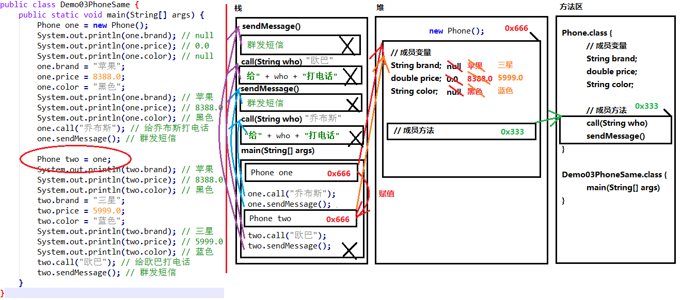

# 目录

- 一、 [面向对象思想](#一、-面向对象思想)
  - 1.1 [类和对象](#1.1-类和对象)
  - 1.2 [类的定义](#1.2-类的定义)
  - 1.3 [对象的使用](#1.3-对象的使用)
  - 1.4 [类与对象的练习](#1.4-类与对象的练习)
  - 1.5 [对象内存图](#1.5-对象内存图)
  - 1.6 [成员变量与局部变量的区别](#1.6-成员变量与局部变量的区别)
- 二、[封装](#二、-封装)
  - 2.1 [private关键字](#2.1-private关键字)
  - 2.2 [this关键字](#2.2-this关键字)
  - 2.3 [构造方法](#2.3-构造方法)
  - 2.4 [标准代码——JavaBean](#2.4-标准代码——JavaBean)

- 三、 [常用API(一)](#三、-常用API(一))
  - 3.1 [Scanner类](#3.1-Scanner类)
  - 3.2 [匿名对象](#3.2-匿名对象)
  - 3.3 [Random类](#3.3-Random类)
  - 3.4 [ArrayList类](#3.4-ArrayList类)


# 一、 面向对象思想

Java语言是一种面向对象的程序设计语言，而面向对象思想是一种程序设计思想，我们在面向对象思想的指引下，使用Java语言去设计、开发计算机程序。 这里的**对象**泛指现实中一切事物，每种事物都具备自己的**属性**和**行为**。面向对象思想就是在计算机程序设计过程中，参照现实中事物，将事物的属性特征、行为特征抽象出来，描述成计算机事件的设计思想。 它区别于面向过程思想，强调的是通过调用对象的行为来实现功能，而不是自己一步一步的去操作实现。

**举例**

洗衣服: 

- 面向过程：把衣服脱下来-->找一个盆-->放点洗衣粉-->加点水-->浸泡10分钟-->揉一揉-->清洗衣服-->拧干-->晾起来
- 面向对象：把衣服脱下来-->打开全自动洗衣机-->扔衣服-->按钮-->晾起来

区别：

- 面向过程：强调步骤。
- 面向对象：强调对象，这里的对象就是洗衣机。

**特点**

面向对象思想是一种更符合我们思考习惯的思想，它可以将复杂的事情简单化，并将我们从执行者变成了指挥者。面向对象的语言中，包含了三大基本特征，即封装、继承和多态。

## 1.1 类和对象

环顾周围，你会发现很多对象，比如桌子，椅子，同学，老师等。桌椅属于办公用品，师生都是人类。那么什么是类呢？什么是对象呢？

**什么是类**

- 类：是一组相关**属性**和**行为**的集合。可以看成是一类事物的模板，使用事物的属性特征和行为特征来描述该类事物。

现实中，描述一类事物：

- **属性**：就是该事物的状态信息。
- **行为**：就是该事物能够做什么。

举例：小猫。

属性：名字、体重、年龄、颜色。 行为：走、跑、叫。

**什么是对象**

- **对象**：是一类事物的具体体现。对象是类的一个**实例**（对象并不是找个女朋友），必然具备该类事物的属性和行为。

现实中，一类事物的一个实例：一只小猫。

举例：一只小猫。

属性：tom、5kg、2 years、yellow。 行为：溜墙根走、蹦跶的跑、喵喵叫。

**类与对象的关系**

- 类是对一类事物的描述，是**抽象的**。
- 对象是一类事物的实例，是**具体的**。
- **类是对象的模板，对象是类的实体**。


## 1.2 类的定义

**事物与类的对比**

现实世界的一类事物：

**属性**：事物的状态信息。 **行为**：事物能够做什么。

Java中用class描述事物也是如此：

**成员变量**：对应事物的属性 **成员方法**：对应事物的行为

### 1.2.1 类的定义格式

```java
public class ClassName {
    //成员变量
    //成员方法
}
```

- **定义类**：就是定义类的成员，包括成员变量和成员方法。
- **成员变量**：和以前定义变量几乎是一样的。只不过位置发生了改变。在类中，方法外。
- **成员方法**：和以前定义方法几乎是一样的。只不过把static去掉，static的作用在面向对象后面课程中再详细讲解。

类的定义格式举例：

```java
public class Student {
    //成员变量
    String name；//姓名
    int age；//年龄
    //成员方法
    //学习的方法
    public void study() {
        System.out.println("好好学习，天天向上");
    }
    //吃饭的方法
    public void eat() {
        System.out.println("学习饿了要吃饭");
    }
}
```

## 1.3 对象的使用

**对象的使用格式**

导入包：

```java
import 包名称.类名称;
```

> 小提示：
>
> 对于和当前类属于同一个包的情况，可以省略包语句不写。

创建对象：

```java
类名 对象名 = new 类名();
```

使用对象访问类中的成员：

```java
对象名.成员变量；
对象名.成员方法()；
```

对象的使用格式举例:

```java
public class Test01_Student {
    public static void main(String[] args) {
        //创建对象格式：类名 对象名 = new 类名();
        Student s = new Student();
        System.out.println("s:"+s);
        //cn.itcast.Student@100363
        //直接输出成员变量值
        System.out.println("姓名："+s.name); //null
        System.out.println("年龄："+s.age); //0
        System.out.println("‐‐‐‐‐‐‐‐‐‐");
        //给成员变量赋值
        s.name = "张三";
        s.age = 18;
        //再次输出成员变量的值
        System.out.println("姓名："+s.name); //赵丽颖
        System.out.println("年龄："+s.age); //18
        System.out.println("‐‐‐‐‐‐‐‐‐‐");
        //调用成员方法
        s.study(); // "好好学习，天天向上"
        s.eat(); // "学习饿了要吃饭"
    }
}
```

**成员变量的默认值**

|          | 数据类型                               | 默认值     |
| -------- | -------------------------------------- | ---------- |
| 基本类型 | 整数（`byte`, `short`, `int`, `long`） | `0`        |
|          | 浮点数（`float`, `double`）            | `0.0`      |
|          | 字符（`char`）                         | `‘\u0000’` |
|          | 布尔值（`boolean`）                    | `false`    |
| 引用类型 | 数组，类，接口                         | `null`     |

## 1.4 类与对象的练习

定义手机类：

```java
public class Phone {
    // 成员变量
    String brand; //品牌
    int price; //价格
    String color; //颜色
    // 成员方法
    //打电话
    public void call(String name) {
        System.out.println("给"+name+"打电话");
    }
    //发短信
    public void sendMessage() {
        System.out.println("群发短信");
    }
}
```

定义测试类：

```java
public class Test02Phone {
    public static void main(String[] args) {
        //创建对象
        Phone p = new Phone();
        //输出成员变量值
        System.out.println("品牌："+p.brand);//null
        System.out.println("价格："+p.price);//0
        System.out.println("颜色："+p.color);//null
        System.out.println("‐‐‐‐‐‐‐‐‐‐‐‐");
        //给成员变量赋值
        p.brand = "锤子";
        p.price = 2999;
        p.color = "棕色";
        //再次输出成员变量值
        System.out.println("品牌："+p.brand);//锤子
        System.out.println("价格："+p.price);//2999
        System.out.println("颜色："+p.color);//棕色
        System.out.println("‐‐‐‐‐‐‐‐‐‐‐‐");
        //调用成员方法
        p.call("紫霞");
        p.sendMessage();
    }
}
```

## 1.5 对象内存图

**一个对象，调用一个方法的内存图**


> 通过上图，我们可以理解，在栈内存中运行的方法，遵循"先进后出，后进先出"的原则。变量p指向堆内存中的空间，寻找方法信息，去执行该方法。
>
> 但是，这里依然有问题存在。创建多个对象时，如果每个对象内部都保存一份方法信息，这就非常浪费内存了，因为所有对象的方法信息都是一样的。那么如何解决这个问题呢？请看如下图解。

**两个对象，调用同一个方法的内存图**


> 对象调用方法时，根据对象中方法标记（地址值），去类中寻找方法信息。这样哪怕是多个对象，方法信息只保存一份，节约内存空间。

**两个引用指向同一个对象的内存图**



**一个引用，作为参数传递到方法中的内存图**


> 引用类型作为参数，传递的是地址值。

**使用对象类型作为方法的返回值**


## 1.6成员变量与局部变量的区别

变量根据**定义位置的不同**，我们给变量起了不同的名字。如下图所示：


- 在类中的位置不同`重点`
  - 成员变量：类中，方法外
  - 局部变量：方法中或者方法声明上(形式参数)
- 作用范围不一样`重点`
  - 成员变量：类中
  - 局部变量：方法中
- 初始化值的不同`重点`
  - 成员变量：有默认值
  - 局部变量：没有默认值。必须先定义，赋值，最后使用
- 在内存中的位置不同`了解`
  - 成员变量：堆内存
  - 局部变量：栈内存
- 生命周期不同`了解`
  - 成员变量：随着对象的创建而存在，随着对象的消失而消失
  - 局部变量：随着方法的调用而存在，随着方法的调用完毕而消失

# 二、 封装

面向对象编程语言是对客观世界的模拟，客观世界里成员变量都是隐藏在对象内部的，外界无法直接操作和修改。封装可以被认为是一个保护屏障，防止该类的代码和数据被其他类随意访问。要访问该类的数据，必须通过指定的方式。适当的封装可以让代码更容易理解与维护，也加强了代码的安全性。

**原则**

将**属性隐藏**起来，若需要访问某个属性，**提供公共方法**对其访问。

**分装的步骤**

1. 使用`private`关键字来修饰成员变量。
2. 对需要访问的成员变量，提供对应的一对`getXxx`方法 、`setXxx`方法。

## 2.1 private关键字

1. `private`是一个权限修饰符，代表最小权限。
2. 可以修饰成员变量和成员方法。
3. 被`private`修饰后的成员变量和成员方法，只在本类中才能访问。

**private的使用格式**

```java
private 数据类型 变量名;
```

1. 使用`private`修饰成员变量，代码如下：

```java
public class Student {
    private String name;
    private int age;
}
```

2. 提供`getXxx`方法/`setXxx`方法，可以访问成员变量，代码如下：

```java
public class Student {
    private String name;
    private int age;
    
    public void setName(String n) {
        name = n;
    }
    
    public String getName() {
        return name;
    }
    
    public void setAge(int a) {
        age = a;
    }
    
    public int getAge() {
        return age;
    }
}
```

## 2.2 this关键字

我们发现`setXxx`方法中的形参名字并不符合见名知意的规定，那么如果修改与成员变量名一致，是否就见名知意了呢？代码如下：

```java
public class Student {
    private String name;
    private int age;
    public void setName(String name) {
        name = name;
    }
    public void setAge(int age) {
        age = age;
    }
}
```

经过修改和测试，我们发现新的问题，成员变量赋值失败了。也就是说，在修改了`setXxx()`的形参变量名后，方法并没有给成员变量赋值！这是由于形参变量名与成员变量名重名，导致成员变量名被隐藏，方法中的变量名，无法访问到成员变量，从而赋值失败。所以，我们只能使用this关键字，来解决这个重名问题。

**this的含义**

this代表所在类的当前对象的引用（地址值），即对象自己的引用。

>  记住 ：方法被哪个对象调用，方法中的this就代表那个对象。即谁在调用，this就代表谁。

**this的使用格式**

```java
this.成员变量名;
```

使用`this`修饰方法中的变量，解决成员变量被隐藏的问题，代码如下：

```java
public class Student {
    private String name;
    private int age;
    
    public void setName(String name) {
        //name = name;
        this.name = name;
    }
    
    public String getName() {
        return name;
    }
    
    public void setAge(int age) {
        //age = age;
        this.age = age;
    }
    
    public int getAge() {
        return age;
    }
}
```

> 小贴士：方法中只有一个变量名时，默认也是使用 this 修饰，可以省略不写。

## 2.3 构造方法

当一个对象被创建时候，构造方法用来初始化该对象，给对象的成员变量赋初始值。

> 小贴士：无论你与否自定义构造方法，所有的类都有构造方法，因为Java自动提供了一个无参数构造方法，一旦自己定义了构造方法，Java自动提供的默认无参数构造方法就会失效。

构造方法的定义格式

```java
修饰符 构造方法名(参数列表){
    // 方法体
}
```

构造方法的写法上，方法名与它所在的类名相同。它没有返回值，所以不需要返回值类型，甚至不需要`void`。使用构造方法后，代码如下：

```java
public class Student {
    private String name;
    private int age;
    // 无参数构造方法
    public Student() {}
    // 有参数构造方法
    public Student(String name,int age) {
        this.name = name;
        this.age = age;
    }
}
```

**注意事项**

1. 如果你不提供构造方法，系统会给出无参数构造方法。
2. 如果你提供了构造方法，系统将不再提供无参数构造方法。
3. 构造方法是可以重载的，既可以定义参数，也可以不定义参数。

## 2.4 标准代码——JavaBean

`JavaBean`是 Java语言编写类的一种标准规范。符合`JavaBean`的类，要求类必须是具体的和公共的，并且具有无参数的构造方法，提供用来操作成员变量的`set`和`get`方法。

```java
public class ClassName{
    //private 成员变量
    //构造方法
    //无参构造方法【必须】
    //有参构造方法【建议】
    //成员方法
    //getXxx()
    //setXxx()
}
```

编写符合`JavaBean`规范的类，以学生类为例，标准代码如下：

```java
public class Student {
    //成员变量
    private String name;
    private int age;
    
    //构造方法
    public Student() {}
    public Student(String name,int age) {
        this.name = name;
        this.age = age;
    }
    
    //成员方法
    public void setName(String name) {
        this.name = name;
    }
    public String getName() {
        return name;
    }
    
    public void setAge(int age) {
        this.age = age;
    }
    
    public int getAge() {
        return age;
    }
}
```

测试类，代码如下：

```java
public class TestStudent {
    public static void main(String[] args) {
        //无参构造使用
        Student s= new Student();
        s.setName("张三");
        s.setAge(18);
        System.out.println(s.getName()+"‐‐‐"+s.getAge());
        
        //带参构造使用
        Student s2= new Student("李四",18);
        System.out.println(s2.getName()+"‐‐‐"+s2.getAge());
    }
}
```

# 三、常用API(一)

API(Application Programming Interface)，应用程序编程接口。Java API是一本程序员的字典，是JDK中提供给我们使用的类的说明文档。这些类将底层的代码实现封装了起来，我们不需要关心这些类是如何实现的，只需要学习这些类如何使用即可。所以我们可以通过查询API的方式，来学习Java提供的类，并得知如何使用它们。

**API使用步骤**

1. 打开帮助文档。
2. 点击显示，找到索引，看到输入框。
3. 你要找谁？在输入框里输入，然后回车。
4. 看包。`java.lang`下的类不需要导包，其他需要。
5. 看类的解释和说明。
6. 学习构造方法。
7. 使用成员方法。

## 3.1 Scanner类

Scanner类：一个可以解析基本类型和字符串的简单文本扫描器。 例如，以下代码使用户能够从 System.in 中读取一个数：

```java
Scanner sc = new Scanner(System.in);
int i = sc.nextInt();
```

> 备注：System.in 系统输入指的是通过键盘录入数据。

### 3.1.1 引用类型使用步骤

1. **导包**

使用import关键字导包，在类的所有代码之前导包，引入要使用的类型，`java.lang`包下的所有类无需导入。 格式：

```java
import 包名.类名;
```

举例：

```java
import java.util.Scanner;
```

2. **创建对象**

使用该类的构造方法，创建一个该类的对象。 格式：

```java
数据类型 变量名 = new 数据类型(参数列表);
```

举例：

```java
Scanner sc = new Scanner(System.in);
```

3. **调用方法**

调用该类的成员方法，完成指定功能。 格式：

```java
变量名.方法名();
```

举例：

```java
int i = sc.nextInt(); // 接收一个键盘录入的整数
```

### 3.1.2 Scanner**使用步骤**

**查看类**

`java.util.Scanner`：该类需要import导入后使用。

**查看构造方法**

`public Scanner(InputStream source)`: 构造一个新的`Scanner`，它生成的值是从指定的输入流扫描的。

**查看成员方法**

`public int nextInt()`：将输入信息的下一个标记扫描为一个`int`值。

使用Scanner类，完成接收键盘录入数据的操作，代码如下：

```java
//1. 导包
import java.util.Scanner;
public class Demo01_Scanner {
    public static void main(String[] args) {
        //2. 创建键盘录入数据的对象
        Scanner sc = new Scanner(System.in);
        //3. 接收数据
        System.out.println("请录入一个整数：");
        int i = sc.nextInt();
        //4. 输出数据
        System.out.println("i:"+i);
    }
}
```

### 3.1.3 练习

**求和**

键盘录入两个数据并求和，代码如下：

```java
import java.util.Scanner;
public class Test01Scanner {
    public static void main(String[] args) {
        // 创建对象
        Scanner sc = new Scanner(System.in);
        // 接收数据
        System.out.println("请输入第一个数据：");
        int a = sc.nextInt();
        System.out.println("请输入第二个数据：");
        int b = sc.nextInt();
        // 对数据进行求和
        int sum = a + b;
        System.out.println("sum:" + sum);
    }
}
```

**取最值**

键盘录入三个数据并获取最大值，代码如下：


```java
import java.util.Scanner;
public class Test02Scanner {
    public static void main(String[] args) {
        // 创建对象
        Scanner sc = new Scanner(System.in);
        // 接收数据
        System.out.println("请输入第一个数据：");
        int a = sc.nextInt();
        System.out.println("请输入第二个数据：");
        int b = sc.nextInt();
        System.out.println("请输入第三个数据：");
        int c = sc.nextInt();
        // 如何获取三个数据的最大值
        int temp = (a > b ? a : b);
        int max = (temp > c ? temp : c);
        System.out.println("max:" + max);
    }
}
```

## 3.2 匿名对象【了解】

创建对象时，只有创建对象的语句，却没有把对象地址值赋值给某个变量。虽然是创建对象的简化写法，但是应用场景非常有限。

**匿名对象**：没有变量名的对象。

格式：

```java
new 类名(参数列表);
```

举例：

```java
new Scanner(System,in);
```

**应用场景**

1. 创建匿名对象直接调用方法，没有变量名。

```java
new Scanner(System.in).nextInt();
```

2. 一旦调用两次方法，就是创建了两个对象，造成浪费。

```java
new Scanner(System.in).nextInt();
new Scanner(System.in).nextInt();
```

> 小贴士：一个匿名对象，只能使用一次。

3. 匿名对象可以作为方法的参数和返回值。

- 作为参数：

```java
class Test {
    public static void main(String[] args) {
        // 普通方式
        Scanner sc = new Scanner(System.in);
        input(sc);
        //匿名对象作为方法接收的参数
        input(new Scanner(System.in));
    }
    
    public static void input(Scanner sc){
        System.out.println(sc);
    }
}
```

- 作为返回值

```java
class Test2 {
    public static void main(String[] args) {
        // 普通方式
        Scanner sc = getScanner();
    }
    
    public static Scanner getScanner(){
        //普通方式
        //Scanner sc = new Scanner(System.in);
        //return sc;
        //匿名对象作为方法返回值
        return new Scanner(System.in);
    }
}
```

## 3.3 Random类

此类的实例用于生成伪随机数。

例如，以下代码使用户能够得到一个随机数：

```java
Random r = new Random();
int i = r.nextInt();
```

### 3.3.1 使用步骤

**查看类**

- `java.util.Random`：该类需要 import导入使后使用。

**查看构造方法**

- `public Random()`：创建一个新的随机数生成器。

**查看成员方法**

- `public int nextInt(int n)`：返回一个伪随机数，范围在`0`（包括）和指定值`n`（不包括）之间的`int`值。

使用Random类，完成生成3个10以内的随机整数的操作，代码如下：

```java
//1. 导包
import java.util.Random;
public class Demo01_Random {
    public static void main(String[] args) {
        //2. 创建键盘录入数据的对象
        Random r = new Random();
        for(int i = 0; i < 3; i++){
            //3. 随机生成一个数据
            int number = r.nextInt(10);
            //4. 输出数据
            System.out.println("number:"+ number);
        }
    }
}
```

> 备注：创建一个`Random`对象，每次调用`nextInt()`方法，都会生成一个随机数。

### 3.3.2 练习

**获取随机数**

获取1-n之间的随机数，包含n，代码如下：

```java
// 导包
import java.util.Random;
public class Test01Random {
    public static void main(String[] args) {
        int n = 50;
        // 创建对象
        Random r = new Random();
        // 获取随机数
        int number = r.nextInt(n) + 1;
        // 输出随机数
        System.out.println("number:" + number);
    }
}
```

**猜数字小游戏**

游戏开始时，会随机生成一个1-100之间的整数`number`。玩家猜测一个数字`guessNumber`，会与`number`作比较，系统提示大了或者小了，直到玩家猜中，游戏结束。

> 小贴士：先运行程序代码，理解此题需求，经过分析后，再编写代码

```java
// 导包
import java.util.Random;
public class Test02Random {
    public static void main(String[] args) {
        // 系统产生一个随机数1‐100之间的。
        Random r = new Random();
        int number = r.nextInt(100) + 1;
        while(true){
            // 键盘录入我们要猜的数据
            Scanner sc = new Scanner(System.in);
            System.out.println("请输入你要猜的数字(1‐100)：");
            int guessNumber = sc.nextInt();
            // 比较这两个数据(用if语句)
            if (guessNumber > number) {
                System.out.println("你猜的数据" + guessNumber + "大了");
            } else if (guessNumber < number) {
                System.out.println("你猜的数据" + guessNumber + "小了");
            } else {
                System.out.println("恭喜你,猜中了");
                break;
            }
        }
    }
}
```

## 3.4 ArrayList类

### 3.4.1 引入

使用学生数组，存储三个学生对象，代码如下：

```java
public class Student {
    private String name;
    private int age;
    public Student() {
        
    }

    public Student(String name, int age) {
        this.name = name;
        this.age = age;
    }
    
    public String getName() {
        return name;
    }

    public void setName(String name) {
        this.name = name;
    }

    public int getAge() {
        return age;
    }

    public void setAge(int age) {
        this.age = age;
    }
}

public class Test01StudentArray {
    public static void main(String[] args) {
        //创建学生数组
        Student[] students = new Student[3];
        //创建学生对象
        Student s1 = new Student("曹操",40);
        Student s2 = new Student("刘备",35);
        Student s3 = new Student("孙权",30);
        //把学生对象作为元素赋值给学生数组
        students[0] = s1;
        students[1] = s2;
        students[2] = s3;
        //遍历学生数组
        for(int x=0; x<students.length; x++) {
            Student s = students[x];
            System.out.println(s.getName()+"‐‐‐"+s.getAge());
        }
    }
}
```

到目前为止，我们想存储对象数据，选择的容器，只有对象数组。而数组的长度是固定的，无法适应数据变化的需求。为了解决这个问题，Java提供了另一个容器`java.util.ArrayList`集合类,让我们可以更便捷的存储和操作对象数据。

`java.util.ArrayList`是大小**可变的数组**的实现，存储在内的数据称为元素。此类提供一些方法来操作内部存储的元素。`ArrayList`中可不断添加元素，其大小也自动增长。

### 3.4.2 使用步骤

**查看类**

- `java.util.ArrayList`：该类需要 import导入使后使用。

`<E>`，表示一种指定的数据类型，叫做泛型。`E`，取自Element（元素）的首字母。在出现`E`的地方，我们使用一种引用数据类型将其替换即可，表示我们将存储哪种引用类型的元素。代码如下：

```java
ArrayList<String>，ArrayList<Student>
```

**查看构造方法**

- `public ArrayList()`：构造一个内容为空的集合。

基本格式:

```java
ArrayList<String> list = new ArrayList<String>();
```

在JDK 7后,右侧泛型的尖括号之内可以留空，但是<>仍然要写。简化格式：

```java
ArrayList<String> list = new ArrayList<>();
```

**查看成员方法**

- `public boolean add(E e)`： 将指定的元素添加到此集合的尾部。

  参数`E e`，在构造`ArrayList`对象时，`<E>`指定了什么数据类型，那么`add(E e)`方法中，只能添加什么数据类型的对象。

使用`ArrayList`类，存储三个字符串元素，代码如下：

```java
public class Test02StudentArrayList {
    public static void main(String[] args) {
        //创建学生数组
        ArrayList<String> list = new ArrayList<>();
        //创建学生对象
        String s1 = "曹操";
        String s2 = "刘备";
        String s3 = "孙权";
        //打印学生ArrayList集合
        System.out.println(list);
        //把学生对象作为元素添加到集合
        list.add(s1);
        list.add(s2);
        list.add(s3);
        //打印学生ArrayList集合
        System.out.println(list);
    }
}
```

### 3.4.3 常用方法和遍历

对于元素的操作,基本体现在——增、删、查。常用的方法有：

- `public boolean add(E e)`：将指定的元素添加到此集合的尾部。
- `public E remove(int index)`：移除此集合中指定位置上的元素。返回被删除的元素。
- `public E get(int index)`：返回此集合中指定位置上的元素。返回获取的元素。
- `public int size()`：返回此集合中的元素数。遍历集合时，可以控制索引范围，防止越界。

这些都是最基本的方法，操作非常简单，代码如下:

```java
public class Demo01ArrayListMethod {
    public static void main(String[] args) {
        //创建集合对象
        ArrayList<String> list = new ArrayList<String>();
        //添加元素
        list.add("hello");
        list.add("world");
        list.add("java");
        //public E get(int index):返回指定索引处的元素
        System.out.println("get:"+list.get(0));
        System.out.println("get:"+list.get(1));
        System.out.println("get:"+list.get(2));
        //public int size():返回集合中的元素的个数
        System.out.println("size:"+list.size());
        //public E remove(int index):删除指定索引处的元素，返回被删除的元素
        System.out.println("remove:"+list.remove(0));
        //遍历输出
        for(int i = 0; i < list.size(); i++){
            System.out.println(list.get(i));
        }
    }
}
```

### 3.4.4 如何存储基本数据类型

`ArrayList`对象不能存储基本类型，只能存储引用类型的数据。类似`<int>`不能写，但是存储基本数据类型对应的包装类型是可以的。所以，想要存储基本类型数据，`<>`中的数据类型，必须转换后才能编写，转换写法如下：

| 基本类型  | 基本类型包含类 |
| --------- | -------------- |
| `byte`    | `Byte`         |
| `short`   | `Short`        |
| `int`     | `Integer`      |
| `long`    | `Long`         |
| `float`   | `Float`        |
| `double`  | `Double`       |
| `char`    | `Character`    |
| `boolean` | `Boolean`      |

我们发现，只有`Integer`和`Character`需要特殊记忆，其他基本类型只是首字母大写即可。那么存储基本类型数 据，代码如下：

```java
public class Demo02ArrayListMethod {
    public static void main(String[] args) {
        ArrayList<Integer> list = new ArrayList<Integer>();
        list.add(1);
        list.add(2);
        list.add(3);
        list.add(4);
        System.out.println(list);
    }
}
```

### 3.4.5 练习

**数值添加到集合**

生成6个1~33之间的随机整数,添加到集合,并遍历

```java
public class Test01ArrayList {
    public static void main(String[] args) {
        // 创建Random 对象
        Random random = new Random();
        // 创建ArrayList 对象
        ArrayList<Integer> list = new ArrayList<>();
        // 添加随机数到集合
        for (int i = 0; i < 6; i++) {
            int r = random.nextInt(33) + 1;
            list.add(r);
        }
        // 遍历集合输出
        for (int i = 0; i < list.size(); i++) {
            System.out.println(list.get(i));
        }
    }
}
```

**对象添加到集合**

自定义4个学生对象,添加到集合,并遍历

```java
public class Test02ArrayList {
    public static void main(String[] args) {
        //创建集合对象
        ArrayList<Student> list = new ArrayList<Student>();
        //创建学生对象
        Student s1 = new Student("赵丽颖",18);
        Student s2 = new Student("唐嫣",20);
        Student s3 = new Student("景甜",25);
        Student s4 = new Student("柳岩",19);
        //把学生对象作为元素添加到集合中
        list.add(s1);
        list.add(s2);
        list.add(s3);
        list.add(s4);
        //遍历集合
        for(int x = 0; x < list.size(); x++) {
            Student s = list.get(x);
            System.out.println(s.getName()+"‐‐‐"+s.getAge());
        }
    }
}
```

**打印集合方法**

定义以指定格式打印集合的方法(ArrayList类型作为参数)，使用{}扩起集合，使用@分隔每个元素。格式参照 {元素 @元素@元素}

```java
public class Test03ArrayList {
    public static void main(String[] args) {
        // 创建集合对象
        ArrayList<String> list = new ArrayList<String>();
        // 添加字符串到集合中
        list.add("张三丰");
        list.add("宋远桥");
        list.add("张无忌");
        list.add("殷梨亭");
        // 调用方法
        printArrayList(list);
    }
    
    public static void printArrayList(ArrayList<String> list) {
        // 拼接左括号
        System.out.print("{");
        // 遍历集合
        for (int i = 0; i < list.size(); i++) {
            // 获取元素
            String s = list.get(i);
            // 拼接@符号
            if (i != list.size() ‐ 1) {
                System.out.print(s + "@");
            } else {
                // 拼接右括号
                System.out.print(s + "}");
            }
        }
    }
}
```

**获取集合方法**

定义获取所有偶数元素集合的方法(ArrayList类型作为返回值)

```java
public class Test04ArrayList {
    public static void main(String[] args) {
        // 创建Random 对象
        Random random = new Random();
        // 创建ArrayList 对象
        ArrayList<Integer> list = new ArrayList<>();
        // 添加随机数到集合
        for (int i = 0; i < 20; i++) {
            int r = random.nextInt(1000) + 1;
            list.add(r);
        }
        // 调用偶数集合的方法
        ArrayList<Integer> arrayList = getArrayList(list);
        System.out.println(arrayList);
    }
    public static ArrayList<Integer> getArrayList(ArrayList<Integer> list) {
        // 创建小集合,来保存偶数
        ArrayList<Integer> smallList = new ArrayList<>();
        // 遍历list
        for (int i = 0; i < list.size(); i++) {
            // 获取元素
            Integer num = list.get(i);
            // 判断为偶数,添加到小集合中
            if (num % 2 == 0){
                smallList.add(num);
            }
        }
        // 返回小集合
        return smallList;
    }
}
```

# 四、 