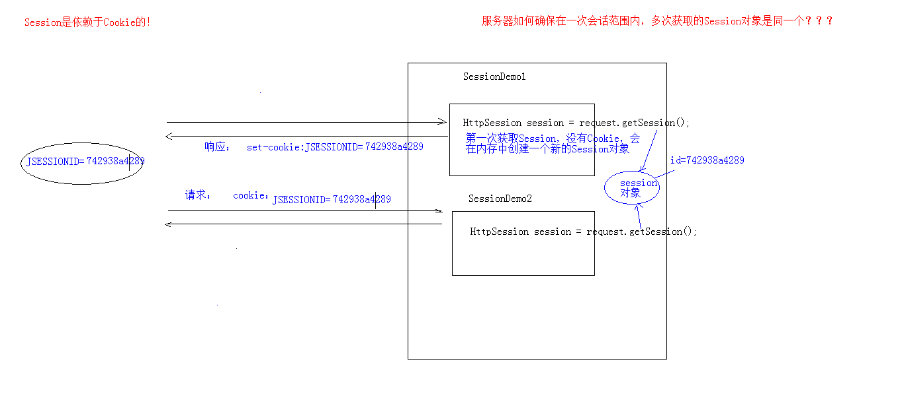
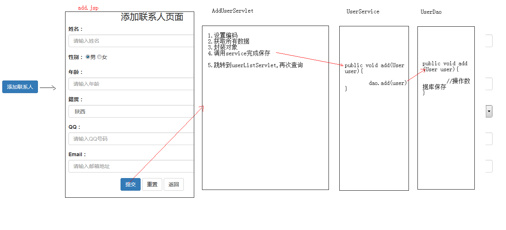
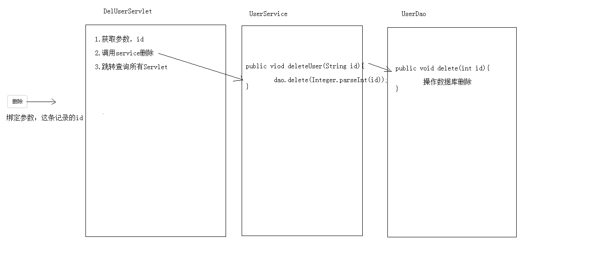
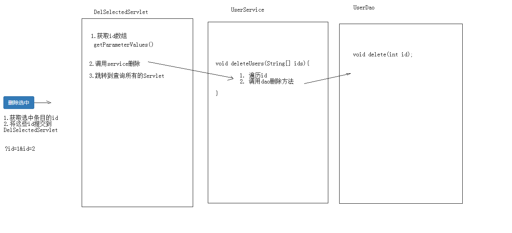
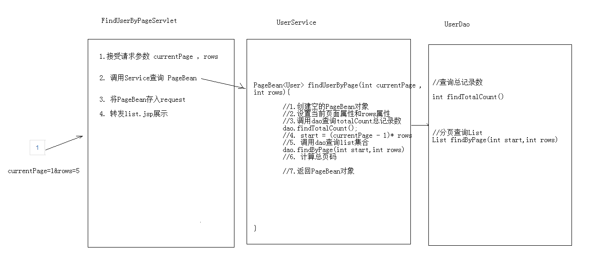

# 六、 Java Server Pages

- 6.1 [会话技术](6.1-会话技术)
- 6.2 [jsp](#6.2-jsp)
- 6.3 [综合案例](#6.3-综合案例)

## 6.1 会话技术

1. 会话：一次会话中包含多次请求和响应。

   一次会话：浏览器第一次给服务器资源发送请求，会话建立，直到有一方断开为止

2. 功能：在一次会话的范围内的多次请求间，共享数据

3. 方式：

   1. 客户端会话技术：Cookie
   2. 服务器端会话技术：Session

### 6.1.1 Cookie

1. 概念：客户端会话技术，将数据保存到客户端

2. 快速入门：

   使用步骤：

   1. 创建cookie对象，绑定数据

      new Cookie(String name, String value)

   2. 发送cookie对象

      response.addCookie(Cookie cookie) 

   3. 获取cookie，拿到数据

      Cookie[]  request.getCookies()

3. 实现原理

   基于响应头set-cookie和请求头cookie实现

   

4. cookie的细节

   1. 一次可不可以发送多个cookie?

      可以创建多个Cookie对象，使用response调用多次addCookie方法发送cookie即可。

   2. cookie在浏览器中保存多长时间？

      - 默认情况下，当浏览器关闭后，Cookie数据被销毁
      - 持久化存储：setMaxAge(int seconds)
        1. 正数：将Cookie数据写到硬盘的文件中。持久化存储。并指定cookie存活时间，时间到后，cookie文件自动失效
        2. 负数：默认值
        3. 零：删除cookie信息

   3. cookie能不能存中文？

      - 在tomcat 8 之前 cookie中不能直接存储中文数据。（需要将中文数据转码---一般采用URL编码(%E3)）
      - 在tomcat 8 之后，cookie支持中文数据。特殊字符还是不支持，建议使用URL编码存储，URL解码解析

   4. cookie共享问题？

      1. 假设在一个tomcat服务器中，部署了多个web项目，那么在这些web项目中cookie能不能共享？

         - 默认情况下cookie不能共享

         - setPath(String path):设置cookie的获取范围。默认情况下，设置当前的虚拟目录

           如果要共享，则可以将path设置为"/"

      2. 不同的tomcat服务器间cookie共享问题？

         - setDomain(String path):如果设置一级域名相同，那么多个服务器之间cookie可以共享

           setDomain(".baidu.com"),那么tieba.baidu.com和news.baidu.com中cookie可以共享

5. cookie的特点和作用

   特点：

   1. cookie存储数据在客户端浏览器
   2. 浏览器对于单个cookie 的大小有限制(4kb) 以及 对同一个域名下的总cookie数量也有限制(20个)

   作用：

   1. cookie一般用于存出少量的不太敏感的数据
   2. 在不登录的情况下，完成服务器对客户端的身份识别

### 6.1.2 案例：记住上一次访问时间

**需求**

1. 访问一个Servlet，如果是第一次访问，则提示：您好，欢迎您首次访问。
2. 如果不是第一次访问，则提示：欢迎回来，您上次访问时间为:显示时间字符串

**分析**

1. 可以采用cookie来完成
2. 在服务器中的Servlet判断是否有一个名为lastTime的cookie
   1. 有：不是第一次访问
      1. 响应数据：欢迎回来，您上次访问时间为:2018年6月10日11:50:20
      2. 写回Cookie：lastTime=2018年6月10日11:50:01
   2. 没有：是第一次访问
      1. 响应数据：您好，欢迎您首次访问
      2. 回Cookie：lastTime=2018年6月10日11:50:0


**实现**

```java
@WebServlet("/cookieTest")
public class CookieTest extends HttpServlet {
    protected void doPost(HttpServletRequest request, HttpServletResponse response) throws ServletException, IOException {
        //设置响应的消息体的数据格式以及编码
        response.setContentType("text/html;charset=utf-8");

        //1.获取所有Cookie
        Cookie[] cookies = request.getCookies();
        boolean flag = false;//没有cookie为lastTime
        //2.遍历cookie数组
        if(cookies != null && cookies.length > 0){
            for (Cookie cookie : cookies) {
                //3.获取cookie的名称
                String name = cookie.getName();
                //4.判断名称是否是：lastTime
                if("lastTime".equals(name)){
                    //有该Cookie，不是第一次访问

                    flag = true;//有lastTime的cookie                 


                    //响应数据
                    //获取Cookie的value，时间
                    String value = cookie.getValue();
                    System.out.println("解码前："+value);
                    //URL解码：
                    value = URLDecoder.decode(value,"utf-8");
                    System.out.println("解码后："+value);
                    response.getWriter().write("<h1>欢迎回来，您上次访问时间为:"+value+"</h1>");


                    //设置Cookie的value
                    //获取当前时间的字符串，重新设置Cookie的值，重新发送cookie
                    Date date  = new Date();
                    SimpleDateFormat sdf = new SimpleDateFormat("yyyy年MM月dd日 HH:mm:ss");
                    String str_date = sdf.format(date);
                    System.out.println("编码前："+str_date);
                    //URL编码
                    str_date = URLEncoder.encode(str_date,"utf-8");
                    System.out.println("编码后："+str_date);
                    cookie.setValue(str_date);
                    //设置cookie的存活时间
                    cookie.setMaxAge(60 * 60 * 24 * 30);//一个月
                    response.addCookie(cookie);
                    
                    break;

                }
            }
        }


        if(cookies == null || cookies.length == 0 || flag == false){
            //没有，第一次访问

            //设置Cookie的value
            //获取当前时间的字符串，重新设置Cookie的值，重新发送cookie
            Date date  = new Date();
            SimpleDateFormat sdf = new SimpleDateFormat("yyyy年MM月dd日 HH:mm:ss");
            String str_date = sdf.format(date);
            System.out.println("编码前："+str_date);
            //URL编码
            str_date = URLEncoder.encode(str_date,"utf-8");
            System.out.println("编码后："+str_date);

            Cookie cookie = new Cookie("lastTime",str_date);
            //设置cookie的存活时间
            cookie.setMaxAge(60 * 60 * 24 * 30);//一个月
            response.addCookie(cookie);

            response.getWriter().write("<h1>您好，欢迎您首次访问</h1>");
        }


    }

    protected void doGet(HttpServletRequest request, HttpServletResponse response) throws ServletException, IOException {
        this.doPost(request, response);
    }
}

```

### 6.1.3 Session

1. 概念：服务器端会话技术，在一次会话的多次请求间共享数据，将数据保存在服务器端的对象中。HttpSession

2. 快速入门

   1. 获取HttpSession对象：

      HttpSession session = request.getSession();

   2. 使用HttpSession对象：

      Object getAttribute(String name)  

      void setAttribute(String name, Object value)

      void removeAttribute(String name)  

3. 原理

   Session的实现是依赖于Cookie的。

   

4. 细节

   1. 当客户端关闭后，服务器不关闭，两次获取session是否为同一个？

      - 默认情况下。不是。

      - 如果需要相同，则可以创建Cookie,键为JSESSIONID，设置最大存活时间，让cookie持久化保存。

        Cookie c = new Cookie("JSESSIONID",session.getId());

        c.setMaxAge(60*60);

        response.addCookie(c);

   2. 客户端不关闭，服务器关闭后，两次获取的session是同一个吗？

      不是同一个，但是要确保数据不丢失。tomcat自动完成以下工作

      - session的钝化：

        在服务器正常关闭之前，将session对象系列化到硬盘上

      - session的活化：

        在服务器启动后，将session文件转化为内存中的session对象即可

   3. session什么时候被销毁？

      1. 服务器关闭

      2. session对象调用invalidate()。

      3. session默认失效时间 30分钟

         选择性配置修改

         ```
         <session-config>
         	<session-timeout>30</session-timeout>
         </session-config>
         ```

5. session的特点

   1. session用于存储一次会话的多次请求的数据，存在服务器端
   2. session可以存储任意类型，任意大小的数据

   

   session与Cookie的区别：

   1. session存储数据在服务器端，Cookie在客户端
   2. session没有数据大小限制，Cookie有
   3. session数据安全，Cookie相对于不安全

### 6.1.4 案例：验证码

**需求**

1. 访问带有验证码的登录页面login.jsp
2. 用户输入用户名，密码以及验证码。
   - 如果用户名和密码输入有误，跳转登录页面，提示:用户名或密码错误
   - 如果验证码输入有误，跳转登录页面，提示：验证码错误
   - 如果全部输入正确，则跳转到主页success.jsp，显示：用户名,欢迎您

**分析**


**实现**

login.jsp

```jsp
<%@ page contentType="text/html;charset=UTF-8" language="java" %>
<html>
<head>
    <title>login</title>


    <script>
        window.onload = function(){
            document.getElementById("img").onclick = function(){
                this.src="/loginTest/checkCodeServlet?time="+new Date().getTime();
            }
        }


    </script>
    <style>
        div{
            color: red;
        }

    </style>
</head>
<body>

    <form action="/loginTest/loginServlet" method="post">
        <table>
            <tr>
                <td>用户名</td>
                <td><input type="text" name="username"></td>
            </tr>
            <tr>
                <td>密码</td>
                <td><input type="password" name="password"></td>
            </tr>
            <tr>
                <td>验证码</td>
                <td><input type="text" name="checkCode"></td>
            </tr>
            <tr>
                <td colspan="2"></td>
            </tr>
            <tr>
                <td colspan="2"><input type="submit" value="登录"></td>
            </tr>
        </table>


    </form>


    <div><%=request.getAttribute("cc_error") == null ? "" : request.getAttribute("cc_error")%></div>
    <div><%=request.getAttribute("login_error") == null ? "" : request.getAttribute("login_error") %></div>

</body>
</html>

```

CheckCodeServlet.java

```java
@WebServlet("/checkCodeServlet")
public class CheckCodeServlet extends HttpServlet {
    protected void doPost(HttpServletRequest request, HttpServletResponse response) throws ServletException, IOException {


        int width = 100;
        int height = 50;

        //1.创建一对象，在内存中图片(验证码图片对象)
        BufferedImage image = new BufferedImage(width,height,BufferedImage.TYPE_INT_RGB);


        //2.美化图片
        //2.1 填充背景色
        Graphics g = image.getGraphics();//画笔对象
        g.setColor(Color.PINK);//设置画笔颜色
        g.fillRect(0,0,width,height);

        //2.2画边框
        g.setColor(Color.BLUE);
        g.drawRect(0,0,width - 1,height - 1);

        String str = "ABCDEFGHIJKLMNOPQRSTUVWXYZabcdefghigklmnopqrstuvwxyz0123456789";
        //生成随机角标
        Random ran = new Random();
        StringBuilder sb = new StringBuilder();
        for (int i = 1; i <= 4; i++) {
            int index = ran.nextInt(str.length());
            //获取字符
            char ch = str.charAt(index);//随机字符
            sb.append(ch);

            //2.3写验证码
            g.drawString(ch+"",width/5*i,height/2);
        }
        String checkCode_session = sb.toString();
        //将验证码存入session
        request.getSession().setAttribute("checkCode_session",checkCode_session);

        //2.4画干扰线
        g.setColor(Color.GREEN);

        //随机生成坐标点

        for (int i = 0; i < 10; i++) {
            int x1 = ran.nextInt(width);
            int x2 = ran.nextInt(width);

            int y1 = ran.nextInt(height);
            int y2 = ran.nextInt(height);
            g.drawLine(x1,y1,x2,y2);
        }


        //3.将图片输出到页面展示
        ImageIO.write(image,"jpg",response.getOutputStream());


    }

    protected void doGet(HttpServletRequest request, HttpServletResponse response) throws ServletException, IOException {
        this.doPost(request,response);
    }
}

```

LoginServlet.java

```java
@WebServlet("/loginServlet")
public class LoginServlet extends HttpServlet {
    protected void doPost(HttpServletRequest request, HttpServletResponse response) throws ServletException, IOException {
        //1.设置request编码
        request.setCharacterEncoding("utf-8");
        //2.获取参数
        String username = request.getParameter("username");
        String password = request.getParameter("password");
        String checkCode = request.getParameter("checkCode");
        //3.先获取生成的验证码
        HttpSession session = request.getSession();
        String checkCode_session = (String) session.getAttribute("checkCode_session");
        //删除session中存储的验证码
        session.removeAttribute("checkCode_session");
        //3.先判断验证码是否正确
        if(checkCode_session!= null && checkCode_session.equalsIgnoreCase(checkCode)){
            //忽略大小写比较
            //验证码正确
            //判断用户名和密码是否一致
            if("zhangsan".equals(username) && "123".equals(password)){//需要调用UserDao查询数据库
                //登录成功
                //存储信息，用户信息
                session.setAttribute("user",username);
                //重定向到success.jsp
                response.sendRedirect(request.getContextPath()+"/success.jsp");
            }else{
                //登录失败
                //存储提示信息到request
                request.setAttribute("login_error","用户名或密码错误");
                //转发到登录页面
                request.getRequestDispatcher("/login.jsp").forward(request,response);
            }


        }else{
            //验证码不一致
            //存储提示信息到request
            request.setAttribute("cc_error","验证码错误");
            //转发到登录页面
            request.getRequestDispatcher("/login.jsp").forward(request,response);

        }

    }

    protected void doGet(HttpServletRequest request, HttpServletResponse response) throws ServletException, IOException {
        this.doPost(request, response);
    }
}
```

success.jsp

```jsp
<%@ page contentType="text/html;charset=UTF-8" language="java" %>
<html>
<head>
    <title>Title</title>
</head>
<body>

    <h1><%=request.getSession().getAttribute("user")%>,欢迎您</h1>

</body>
</html>
```


## 6.2 jsp

### 6.2.1 入门

1. 概念：

   Java Server Pages： java服务器端页面

   可以理解为：一个特殊的页面，其中既可以指定定义html标签，又可以定义java代码

   用于简化书写！！！

2. 原理：JSP本质上就是一个Servlet

   

3. JSP的脚本：JSP定义Java代码的方式

   1. <%  代码 %>：定义的java代码，在service方法中。service方法中可以定义什么，该脚本中就可以定义什么。
   2. <%! 代码 %>：定义的java代码，在jsp转换后的java类的成员位置。
   3. <%= 代码 %>：定义的java代码，会输出到页面上。输出语句中可以定义什么，该脚本中就可以定义什么。

4. JSP的内置对象：

   - 在jsp页面中不需要获取和创建，可以直接使用的对象
   - jsp一共有9个内置对象。
     - request
     - response
     - out：字符输出流对象。可以将数据输出到页面上。和response.getWriter()类似
       - response.getWriter()和out.write()的区别：
         - 在tomcat服务器真正给客户端做出响应之前，会先找response缓冲区数据，再找out缓冲区数据。
         - response.getWriter()数据输出永远在out.write()之前

### 6.2.2 详解

1. 指令

   - 作用：用于配置JSP页面，导入资源文件

   - 格式：`<%@ 指令名称 属性名1=属性值1 属性名2=属性值2 ... %>`

   - 分类

     1. page：配置JSP页面

        - contentType：等同于response.setContentType()
          1. 设置响应体的mime类型以及字符集
          2. 设置当前jsp页面的编码（只能是高级的IDE才能生效，如果使用低级工具，则需要设置pageEncoding属性设置当前页面的字符集）
        - import：导包
        - errorPage：当前页面发生异常后，会自动跳转到指定的错误页面
        - isErrorPage：标识当前也是是否是错误页面。
          - true：是，可以使用内置对象exception
          - false：否。默认值。不可以使用内置对象exception

     2. include：页面包含的。导入页面的资源文件

        `<%@include file="top.jsp"%>`

     3. taglib：导入资源

        `<%@ taglib prefix="c" uri="http://java.sun.com/jsp/jstl/core" %>`

        prefix：前缀，自定义的

2. 注释

   1. html注释：

      <!-- -->:只能注释html代码片段

   2. jsp注释：推荐使用

      <%-- --%>：可以注释所有

3. 内置对象

   在jsp页面中不需要创建，直接使用的对象

   | 变量名      | 真实类型            | 作用                                         |
   | ----------- | ------------------- | -------------------------------------------- |
   | pageContext | PageContext         | 当前页面共享数据，还可以获取其他八个内置对象 |
   | request     | HttpServletRequest  | 一次请求访问的多个资源(转发)                 |
   | session     | HttpSession         | 一次会话的多个请求间                         |
   | application | ServletContext      | 所有用户间共享数据                           |
   | response    | HttpServletResponse | 响应对象                                     |
   | page        | Object              | 当前页面(Servlet)的对象  this                |
   | out         | JspWriter           | 输出对象，数据输出到页面上                   |
   | config      | ServletConfig       | Servlet的配置对象                            |
   | exception   | Throwable           | 异常对象                                     |

### 6.2.3 MVC：开发模式

1. jsp演变历史

   1. 早期只有servlet，只能使用response输出标签数据，非常麻烦
   2. 后来又jsp，简化了Servlet的开发，如果过度使用jsp，在jsp中即写大量的java代码，又写html表，造成难于维护，难于分工协作
   3. 再后来，java的web开发，借鉴mvc开发模式，使得程序的设计更加合理性

2. MVC

   1. M：Model，模型。JavaBean
      - 完成具体的业务操作，如：查询数据库，封装对象
   2. V：View，视图。JSP
      - 展示数据
   3. C：Controller，控制器。Servlet
      - 获取用户的输入
      - 调用模型
      - 将数据交给视图进行展示

   - 优缺点：
     - 优点
       1. 耦合性低，方便维护，可以利于分工协作
       2. 重用性高
     - 缺点
       1. 使得项目架构变得复杂，对开发人员要求高


### 6.2.4 EL表达式

1. 概念：Expression Language 表达式语言

2. 作用：替换和简化jsp页面中java代码的编写

3. 语法：${表达式}

4. 注意：

   jsp默认支持el表达式的。如果要忽略el表达式

   1. 设置jsp中page指令中：isELIgnored="true" 忽略当前jsp页面中所有的el表达式
   2. `\${表达式}`：忽略当前这个el表达式

5. 使用：

   1. 运算：

      运算符：

      1. 算数运算符： + - * /(div) %(mod)
      2. 比较运算符： > < >= <= == !=
      3. 逻辑运算符： &&(and) ||(or) !(not)
      4. 空运算符： empty
         - 功能：用于判断字符串、集合、数组对象是否为null或者长度是否为0
         - ${empty list}:判断字符串、集合、数组对象是否为null或者长度为0
         - ${not empty str}:表示判断字符串、集合、数组对象是否不为null 并且长度>0

   2. 获取值：

      1. el表达式只能从域对象中获取值
      2. 语法：
         1. ${域名称.键名}：从指定域中获取指定键的值
            1. 域名称：
               1. pageScope		--> pageContext
               2. requestScope 	--> request
               3. sessionScope 	--> session
               4. applicationScope --> application（ServletContext）
            2. 举例：在request域中存储了name=张三
            3. 获取：${requestScope.name}
         2. ${键名}：表示依次从最小的域中查找是否有该键对应的值，直到找到为止。
         3. 获取对象、List集合、Map集合的值
            1. 对象：${域名称.键名.属性名}
               - 本质上会去调用对象的getter方法
            2. List集合：${域名称.键名[索引]}
            3. Map集合：
               - ${域名称.键名.key名称}
               - ${域名称.键名["key名称"]}

   3. 隐式对象：

      - el表达式中有11个隐式对象
      - pageContext：
        - 获取jsp其他八个内置对象
        - ${pageContext.request.contextPath}：动态获取虚拟目录

### 6.2.5 JSTL

1. 概念：JavaServer Pages Tag Library  JSP标准标签库

   是由Apache组织提供的开源的免费的jsp标签		<标签>

2. 作用：用于简化和替换jsp页面上的java代码

3. 使用步骤：

   1. 导入jstl相关jar包
   2. 引入标签库：taglib指令：  <%@ taglib %>
   3. 使用标签

4. 常用的JSTL标签

   1. if:相当于java代码的if语句

      1. 属性：

         test 必须属性，接受boolean表达式

         - 如果表达式为true，则显示if标签体内容，如果为false，则不显示标签体内容
         - 一般情况下，test属性值会结合el表达式一起使用

      2. 注意：

         c:if标签没有else情况，想要else情况，则可以在定义一个c:if标签

   2. choose:相当于java代码的switch语句

      1. 使用choose标签声明        相当于switch声明
      2. 使用when标签做判断        相当于case
      3. 用otherwise标签做其他情况的声明        相当于default

   3. foreach:相当于java代码的for语句

5. 练习：

   需求：在request域中有一个存有User对象的List集合。需要使用jstl+el将list集合数据展示到jsp页面的表格table中

```jsp
<%@ page import="test.domain.User" %>
<%@ page import="java.util.List" %>
<%@ page import="java.util.ArrayList" %>
<%@ page import="java.util.Date" %>
<%@ page contentType="text/html;charset=UTF-8" language="java" %>
<%@taglib prefix="c" uri="http://java.sun.com/jsp/jstl/core" %>

<html>
<head>
    <title>test</title>
</head>
<body>

<%

    List list = new ArrayList();
    list.add(new User("张三",23,new Date()));
    list.add(new User("李四",24,new Date()));
    list.add(new User("王五",25,new Date()));

    request.setAttribute("list",list);


%>

<table border="1" width="500" align="center">
    <tr>
        <th>编号</th>
        <th>姓名</th>
        <th>年龄</th>
        <th>生日</th>
    </tr>
    <%--数据行--%>
    <c:forEach items="${list}" var="user" varStatus="s">

        <c:if test="${s.count % 2 != 0}">

            <tr bgcolor="red">
                <td>${s.count}</td>
                <td>${user.name}</td>
                <td>${user.age}</td>
                <td>${user.birStr}</td>
            </tr>
        </c:if>

        <c:if test="${s.count % 2 == 0}">

            <tr  bgcolor="green">
                <td>${s.count}</td>
                <td>${user.name}</td>
                <td>${user.age}</td>
                <td>${user.birStr}</td>
            </tr>
        </c:if>

    </c:forEach>

</table>


</body>
</html>
```

```java
public class User {

    private String name;
    private int age;
    private Date birthday;


    public User(String name, int age, Date birthday) {
        this.name = name;
        this.age = age;
        this.birthday = birthday;
    }

    public User() {
    }

    /**
     * 逻辑视图
     * @return
     */
    public String getBirStr(){

        if(birthday != null){
            //1.格式化日期对象
            SimpleDateFormat sdf = new SimpleDateFormat("yyyy-MM-dd HH:mm:ss");
            //2.返回字符串即可
            return sdf.format(birthday);

        }else{
            return "";
        }
    }


    public String getName() {
        return name;
    }

    public void setName(String name) {
        this.name = name;
    }

    public int getAge() {
        return age;
    }

    public void setAge(int age) {
        this.age = age;
    }

    public Date getBirthday() {
        return birthday;
    }

    public void setBirthday(Date birthday) {
        this.birthday = birthday;
    }
}
```


### 6.2.6 三层架构：软件设计架构


## 6.3 综合案例

用户信息列表展示

#### 需求

1. 简单功能

   1. 列表查询
   2. 登录
   3. 添加
   4. 删除
   5. 修改

2. 复杂功能

   1. 删除选中

   2. 分页查询

      好处：

      1. 减轻服务器内存的开销
      2. 提升用户体验

   3. 复杂条件查询

#### 设计

1. 技术选型：Servlet+JSP+MySQL+JDBCTempleat+Duird+BeanUtilS+tomcat

2. 数据库设计：

   ```
   create database db; -- 创建数据库
   use db; 			   -- 使用数据库
   create table user(   -- 创建表
       id int primary key auto_increment,
       name varchar(20) not null,
       gender varchar(5),
       age int,
       address varchar(32),
       qq	varchar(20),
       email varchar(50)
   );
   ```

3. 开发：

   1. 环境搭建
      1. 创建数据库环境
      2. 创建项目，导入需要的jar包
   2. 编码

4. 测试

5. 部署运维

#### 分析

列表查询


添加功能



删除功能



修改功能


修改选中功能



分页查询功能




复杂条件分页查询

