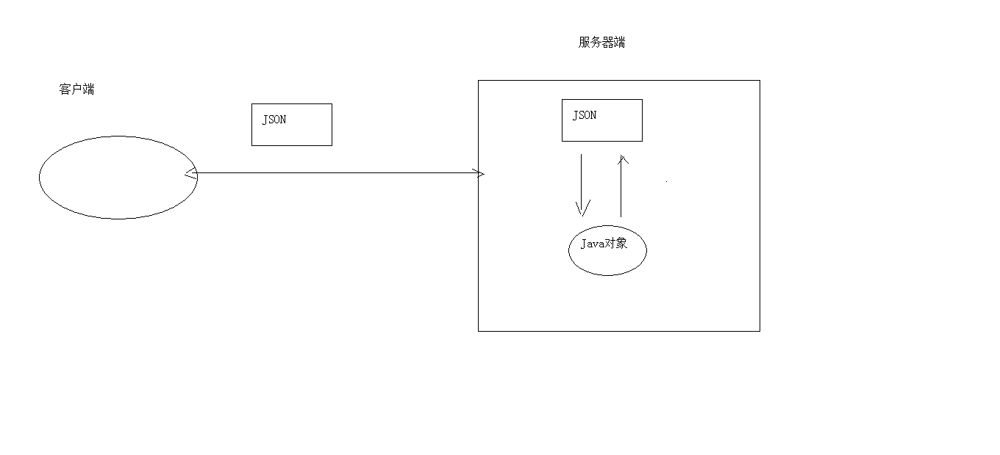

# 七、JQuery

- 7.1 [JQuery基础](#7.1-JQuery基础)
- 7.2 [JQuery](#7.2-JQuery)
- 7.3 [AJAX](#7.3-AJAX)

- 7.4 [JSON](#7.4-JSON)


## 7.1 JQuery基础

- 概念：一个JavaScript框架。简化JS开发
  - jQuery是一个快速、简洁的JavaScript框架，是继Prototype之后又一个优秀的JavaScript代码库（或JavaScript框架）。jQuery设计的宗旨	是“write Less，Do More”，即倡导写更少的代码，做更多的事情。它封装JavaScript常用的功能代码，提供一种简便的JavaScript设计模式，优	化HTML文档操作、事件处理、动画设计和Ajax交互。
  - JavaScript框架：本质上就是一些js文件，封装了js的原生代码而已

### 7.1.1 快速入门

步骤

1. 下载JQuery

   - 目前JQuery有三个大版本：
     1. 1.x：兼容ie678,使用最为广泛的，官方只做BUG维护，功能不再新增。因此一般项目来说，使用1.x版本就可以了，最终版本：1.12.4 (2016年5月20日)
     2. 2.x：不兼容ie678，很少有人使用，官方只做BUG维护，功能不再新增。如果不考虑兼容低版本的浏览器可以使用2.x，最终版本：2.2.4 (2016年5月20日)
     3. 3.x：不兼容ie678，只支持最新的浏览器。除非特殊要求，一般不会使用3.x版本的，很多老的jQuery插件不支持这个版本。目前该版本是官方主要更新维护的版本。最新版本：3.4.1（2019年5月20日）
   - jquery-xxx.js 与 jquery-xxx.min.js区别：
     1. jquery-xxx.js：开发版本。给程序员看的，有良好的缩进和注释。体积大一些
     2. jquery-xxx.min.js：生产版本。程序中使用，没有缩进。体积小一些。程序加载更快

2. 导入JQuery的js文件：导入min.js文件

3. 使用

   ```html
   <script>
       //使用JQuery获取元素对象
       var div1 = $("#div1");
       alert(div1.html());
   </script>
   ```

   

### 7.1.2 JQuery对象和JS对象区别与转换

1. JQuery对象在操作时，更加方便。
2. JQuery对象和js对象方法不通用的。
3. 两者相互转换
   - jq -- > js : jq对象[索引] 或者 jq对象.get(索引)
   - js -- > jq : $(js对象)

```html
<script>
  //1. 通过js方式来获取名称叫div的所有html元素对象
    var divs = document.getElementsByTagName("div");
    alert(divs.length);//可以将其当做数组来使用
    //对divs中所有的div 让其标签体内容变为"aaa"
  for (var i = 0; i < divs.length; i++) {
      //divs[i].innerHTML = "aaa";
      $(divs[i]).html("ccc");
  }

    //2. 通过jq方式来获取名称叫div的所有html元素对象
    var $divs = $("div");

  alert($divs.length);//也可以当做数组使用

  //对divs中所有的div 让其标签体内容变为"bbb"  使用jq方式
    $divs.html("bbb");
   // $divs.innerHTML = "bbb";//无效

  $divs[0].innerHTML = "ddd";
  $divs.get(1).innerHTML = "eee";


    /*
        1. JQuery对象在操作时，更加方便。
        2. JQuery对象和js对象方法不通用的.
        3. 两者相互转换
            * jq -- > js : jq对象[索引] 或者 jq对象.get(索引)
                * js -- > jq : $(js对象)
     */

</script>
```


### 7.1.3 选择器

**选择器：筛选具有相似特征的元素(标签)**

1. 基本操作学习：

   1. 事件绑定

      ```html
      //1.获取b1按钮
      $("#b1").click(function(){
          alert("abc");
      });
      ```

   2. 入口函数

      ```html
      $(function () {
      
      });
      ```

      window.onload  和  $(function)  区别

      - window.onload 只能定义一次,如果定义多次，后边的会将前边的覆盖掉
      - $(function)可以定义多次的。

   3. 样式控制：css方法

      ```html
      // $("#div1").css("background-color","red");
      $("#div1").css("backgroundColor","pink");
      ```

2. 分类

   1. 基本选择器

      1. 标签选择器（元素选择器）

         语法： `$("html标签名")` 获得所有匹配标签名称的元素

      2. id选择器

         语法： `$("#id的属性值")` 获得与指定id属性值匹配的元素

      3. 类选择器

         语法： `$(".class的属性值")` 获得与指定的class属性值匹配的元素

      4. 并集选择器

         语法： `$("选择器1,选择器2....")` 获取多个选择器选中的所有元素

   2. 层次选择器

      1. 后代选择器

         语法： `$("A B ")` 选择A元素内部的所有B元素

      2. 子选择器

         语法： `$("A > B")` 选择A元素内部的所有B子元素

   3. 属性选择器

      1. 属性名称选择器

         语法： `$("A[属性名]")` 包含指定属性的选择器

      2. 属性选择器

         语法： `$("A[属性名='值']")` 包含指定属性等于指定值的选择器

      3. 复合属性选择器

         语法： `$("A[属性名='值'][]...")` 包含多个属性条件的选择器

   4. 过滤选择器

      1. 首元素选择器

         语法： `:first` 获得选择的元素中的第一个元素

      2. 尾元素选择器

         语法： `:last` 获得选择的元素中的最后一个元素

      3. 非元素选择器

         语法： `:not(selector)` 不包括指定内容的元素

      4. 偶数选择器

         语法： `:even` 偶数，从 0 开始计数

      5. 奇数选择器

         语法： `:odd` 奇数，从 0 开始计数

      6. 等于索引选择器

         语法： `:eq(index)` 指定索引元素

      7. 大于索引选择器

         语法： `:gt(index)` 大于指定索引元素

      8. 小于索引选择器

         语法： `:lt(index)` 小于指定索引元素

      9. 标题选择器

         语法： `:header` 获得标题（h1~h6）元素，固定写法

   5. 表单过滤选择器

      1. 可用元素选择器

         语法： `:enabled` 获得可用元素

      2. 不可用元素选择器

         语法： `:disabled` 获得不可用元素

      3. 选中选择器

         语法： `:checked` 获得单选/复选框选中的元素

      4. 选中选择器

         语法： `:selected` 获得下拉框选中的元素

### 7.1.4 DOM操作

1. 内容操作

   1. html()： 获取/设置元素的标签体内容   `<a><font>内容</font></a>`  --> `<font>内容</font>`
   2. text()： 获取/设置元素的标签体纯文本内容   `<a><font>内容</font></a>` --> 内容
   3. val()： 获取/设置元素的value属性值

2. 属性操作

   1. 通用属性操作

      1. attr()： 获取/设置元素的属性
      2. removeAttr()：删除属性
      3. prop()：获取/设置元素的属性
      4. removeProp()：删除属性

      - attr和prop区别？
        1. 如果操作的是元素的固有属性，则建议使用prop
        2. 如果操作的是元素自定义的属性，则建议使用attr

   2. 对class属性操作

      1. addClass()：添加class属性值

      2. removeClass()：删除class属性值

      3. toggleClass()：切换class属性

         toggleClass("one")：

         - 判断如果元素对象上存在class="one"，则将属性值one删除掉。  如果元素对象上不存在class="one"，则添加

      4. css()：

3. CRUD操作

   1. append()：父元素将子元素追加到末尾
      - 对象1.append(对象2)： 将对象2添加到对象1元素内部，并且在末尾
   2. prepend()：父元素将子元素追加到开头
      - 对象1.prepend(对象2)：将对象2添加到对象1元素内部，并且在开头
   3. appendTo()：
      - 对象1.appendTo(对象2)：将对象1添加到对象2内部，并且在末尾
   4. prependTo()：
      - 对象1.prependTo(对象2)：将对象1添加到对象2内部，并且在开头
   5. after()：添加元素到元素后边
      - 对象1.after(对象2)： 将对象2添加到对象1后边。对象1和对象2是兄弟关系
   6. before()：添加元素到元素前边
      - 对象1.before(对象2)： 将对象2添加到对象1前边。对象1和对象2是兄弟关系
   7. insertAfter()
      - 对象1.insertAfter(对象2)：将对象2添加到对象1后边。对象1和对象2是兄弟关系
   8. insertBefore()
      - 对象1.insertBefore(对象2)： 将对象2添加到对象1前边。对象1和对象2是兄弟关系
   9. remove()：移除元素
      - 对象.remove()：将对象删除掉
   10. empty()：清空元素的所有后代元素。
       - 对象.empty()：将对象的后代元素全部清空，但是保留当前对象以及其属性节点

## 7.2 JQuery

### 7.2.1 动画

三种方式显示和隐藏元素

1. 默认显示和隐藏方式

   1. show([speed,[easing],[fn]])

      参数：

      1. speed：动画的速度。三个预定义的值("slow","normal", "fast")或表示动画时长的毫秒数值(如：1000)
      2.  easing：用来指定切换效果，默认是"swing"，可用参数"linear"
         - swing：动画执行时效果是 先慢，中间快，最后又慢
         - linear：动画执行时速度是匀速的
      3. fn：在动画完成时执行的函数，每个元素执行一次。

   2. hide([speed,[easing],[fn]])

   3. toggle([speed],[easing],[fn])

2. 滑动显示和隐藏方式

   1. slideDown([speed],[easing],[fn])
   2. slideUp([speed,[easing],[fn]])
   3. slideToggle([speed],[easing],[fn])

3. 淡入淡出显示和隐藏方式

   1. fadeIn([speed],[easing],[fn])
   2. fadeOut([speed],[easing],[fn])
   3. fadeToggle([speed,[easing],[fn]])

### 7.2.2 遍历

1. js的遍历方式

   - for(初始化值;循环结束条件;步长)

2. jq的遍历方式

   1. jq对象.each(callback)

      1. 语法：

         jquery对象.each(function(index,element){});

         - index：就是元素在集合中的索引
         - element：就是集合中的每一个元素对象
         - this：集合中的每一个元素对象

      2. 回调函数返回值：

         - true：如果当前function返回为false，则结束循环(break)。
         - false：如果当前function返回为true，则结束本次循环，继续下次循环(continue)

   2. $.each(object, [callback])

   3. for..of： jquery 3.0 版本之后提供的方式
      			for(元素对象 of 容器对象)

### 7.2.3 事件绑定

1. jquery标准的绑定方式
   - jq对象.事件方法(回调函数)；
   - 注：如果调用事件方法，不传递回调函数，则会触发浏览器默认行为。
     - 表单对象.submit();//让表单提交
2. on绑定事件/off解除绑定
   - jq对象.on("事件名称",回调函数)
   - jq对象.off("事件名称")
     - 如果off方法不传递任何参数，则将组件上的所有事件全部解绑
3. 事件切换：toggle
   - jq对象.toggle(fn1,fn2...)
     - 当单击jq对象对应的组件后，会执行fn1.第二次点击会执行fn2.....
   - 注意：1.9版本 .toggle() 方法删除,jQuery Migrate（迁移）插件可以恢复此功能。
     - `<script src="../js/jquery-migrate-1.0.0.js" type="text/javascript" charset="utf-8"></script>`

### 7.2.4 案例

1. 广告显示和隐藏

   ```html
   <!DOCTYPE html>
   <html>
   <head>
       <meta charset="UTF-8">
       <title>广告的自动显示与隐藏</title>
       <style>
           #content{width:100%;height:500px;background:#999}
       </style>
   
       <!--引入jquery-->
       <script type="text/javascript" src="../js/jquery-3.3.1.min.js"></script>
       <script>
           /*
           * 需求：
           *   1. 当页面加载完，3秒后。自动显示广告
           *   2. 广告显示5秒后，自动消失。
           * 分析：
           *   1. 使用定时器来完成。setTimeout (执行一次定时器)
           *   2. 分析发现JQuery的显示和隐藏动画效果其实就是控制display
           *   3. 使用show/hide方法来完成广告的显示
           * */
           $(function () {
               setTimeout(adShow,3000);
               setTimeout(adHide,8000);
   
           });
   
           function adShow() {
               $("#ad").show("slow");
           }
           function adHide() {
               $("#ad").hide("slow");
           }
       </script>
   </head>
   <body>
   <!-- 整体的DIV -->
   <div>
       <!-- 广告DIV -->
       <div id="ad" style="display: none;">
           
       </div>
   
       <!-- 下方正文部分 -->
       <div id="content">
           正文部分
       </div>
   </div>
   </body>
   </html>
   ```
   
   
   
2. 抽奖

   ```html
   <!DOCTYPE html>
   <html>
   <head>
       <meta charset="UTF-8">
       <title>jquery案例之抽奖</title>
       <script type="text/javascript" src="../js/jquery-3.3.1.min.js"></script>
   
       <script>
          /*
          * 分析：
          *    1. 给开始按钮绑定单击事件
          *        1.1 定义循环定时器
          *        1.2 切换小相框的src属性
          *            定义数组，存放图片资源路径
          *            生成随机数。数组索引
          *    2. 给结束按钮绑定单击事件
          *        1.1 停止定时器
          *        1.2 给大相框设置src属性
          * */
          var imgs = ["../img/man00.jpg","../img/man01.jpg","../img/man02.jpg",
              "../img/man03.jpg","../img/man04.jpg","../img/man05.jpg","../img/man06.jpg"];
          var startId;//开始定时器的id
          var index;//随机角标
          $(function () {
              //处理按钮是否可以使用
              $("#startID").prop("disabled",false);
              $("#stopID").prop("disabled",true);
   
              //
              $("#startID").click(function () {
                  //定义循环定时器，20毫秒执行一次
                  startId = setInterval(function () {
                      //生成随机角标0-6
                      index = Math.floor(Math.random()*7);//0.000-0.999 * 7 --> 0.000-6.999
   
                      $("#img1ID").prop("src",imgs[index]);
                  },20);
   
                  $("#startID").prop("disabled",true);
                  $("#stopID").prop("disabled",false);
              });
              //
              $("#stopID").click(function () {
                  clearInterval(startId);
                  $("#img2ID").prop("src",imgs[index]).hide();
                  $("#img2ID").show(1000);
   
                  $("#startID").prop("disabled",false);
                  $("#stopID").prop("disabled",true);
              });
          });
       </script>
   </head>
   <body>
   
   <!-- 小像框 -->
   <div style="border-style:dotted;width:160px;height:100px">
       
   </div>
   
   <!-- 大像框 -->
   <div
           style="border-style:double;width:800px;height:500px;position:absolute;left:500px;top:10px">
       
   </div>
   
   <!-- 开始按钮 -->
   <input
           id="startID"
           type="button"
           value="点击开始"
           style="width:150px;height:150px;font-size:22px"
           onclick="imgStart()">
   
   <!-- 停止按钮 -->
   <input
           id="stopID"
           type="button"
           value="点击停止"
           style="width:150px;height:150px;font-size:22px"
           onclick="imgStop()">
   
   
   <script language='javascript' type='text/javascript'>
       //准备一个一维数组，装用户的像片路径
       var imgs = [
           "../img/man00.jpg",
           "../img/man01.jpg",
           "../img/man02.jpg",
           "../img/man03.jpg",
           "../img/man04.jpg",
           "../img/man05.jpg",
           "../img/man06.jpg"
       ];

   </script>
   </body>
   </html>
   ```
   
   

### 7.2.5 插件

插件：增强JQuery的功能

实现方式：

1. $.fn.extend(object) 
   
   - 增强通过Jquery获取的对象的功能  $("#id")
   
   - ```html
     <script type="text/javascript">
             //使用jQuery插件，给jq对象添加2个方法 check()选中所有复选框，uncheck()取消选中所有复选框
     
             //1. 定义JQuery的对象插件
             $.fn.extend({
                 check:function () {
                     this.prop("checked",true);
                 },
                 uncheck:function () {
                     this.prop("checked",false);
                 }
             });
     
             $(function () {
                 $("#btn-check").click(function () {
                     $("input[type='checkbox']").check();
                 });
                 $("#btn-uncheck").click(function () {
                     $("input[type='checkbox']").uncheck();
                 });
             });
     
         </script>
     ```
2. $.extend(object)
   
   - 增强JQeury对象自身的功能  $/jQuery
   
   - ```html
     <script type="text/javascript">
             //对全局方法扩展2个方法，扩展min方法：求2个值的最小值；扩展max方法：求2个值最大值
             $.extend({
                 max:function (a, b) {
                     return a>=b?a:b;
                 },
                 min:function (a, b) {
                     return a<=b?a:b;
                 }
             });
     
             var max = $.max(4,3);
             alert(max);
             var min = $.min(4,3);
             alert(min);
         </script>
     ```

## 7.3 AJAX

概念： ASynchronous JavaScript And XML	异步的JavaScript 和 XML

1. 异步和同步：客户端和服务器端相互通信的基础上

   - 客户端必须等待服务器端的响应。在等待的期间客户端不能做其他操作。
   - 客户端不需要等待服务器端的响应。在服务器处理请求的过程中，客户端可以进行其他的操作。

   

2. Ajax 是一种在无需重新加载整个网页的情况下，能够更新部分网页的技术。

   - 通过在后台与服务器进行少量数据交换，Ajax 可以使网页实现异步更新。这意味着可以在不重新加载整个网页的情况下，对网页的某部分进行更新。
   - 传统的网页（不使用 Ajax）如果需要更新内容，必须重载整个网页页面。
   - 提升用户的体验

### 7.3.1 实现方式

1. 原生的JS实现方式（了解）

2. JQuery实现方式

   1. $.ajax()

      - 语法：`$.ajax({键值对});`

      - ```javascript
         //1.创建核心对象
        var xmlhttp;
        if (window.XMLHttpRequest)
        {// code for IE7+, Firefox, Chrome, Opera, Safari
            xmlhttp=new XMLHttpRequest();
        }
        else
        {// code for IE6, IE5
            xmlhttp=new ActiveXObject("Microsoft.XMLHTTP");
        }
        
        //2. 建立连接
        /*
            参数：
                1. 请求方式：GET、POST
                    * get方式，请求参数在URL后边拼接。send方法为空参
                    * post方式，请求参数在send方法中定义
                2. 请求的URL：
                3. 同步或异步请求：true（异步）或 false（同步）
        
        */
        xmlhttp.open("GET","ajaxServlet?username=tom",true);
        
        //3.发送请求
        xmlhttp.send();
        
        //4.接受并处理来自服务器的响应结果
        //获取方式 ：xmlhttp.responseText
        //什么时候获取？当服务器响应成功后再获取
        
        //当xmlhttp对象的就绪状态改变时，触发事件onreadystatechange。
        xmlhttp.onreadystatechange=function()
        {
            //判断readyState就绪状态是否为4，判断status响应状态码是否为200
            if (xmlhttp.readyState==4 && xmlhttp.status==200)
            {
                //获取服务器的响应结果
                var responseText = xmlhttp.responseText;
                alert(responseText);
            }
        }
        ```

        

   2. $.get()：发送get请求

      - 语法：`$.get(url, [data], [callback], [type])`

      - ```javascript
        $.ajax({
            url:"ajaxServlet1111" , // 请求路径
            type:"POST" , //请求方式
            //data: "username=jack&age=23",//请求参数
            data:{"username":"jack","age":23},
            success:function (data) {
                alert(data);
            },//响应成功后的回调函数
            error:function () {
                alert("出错啦...")
            },//表示如果请求响应出现错误，会执行的回调函数
        
            dataType:"text"//设置接受到的响应数据的格式
        });
        ```

        

      - 参数

        - url：请求路径
        - data：请求参数
        - callback：回调函数
        - type：响应结果的类型

   3. $.post()：发送post请求

      - 语法：`$.post(url, [data], [callback], [type])`


## 7.4 JSON

概念： JavaScript Object Notation		JavaScript对象表示法

```
Person p = new Person();
p.setName("张三");
p.setAge(23);
p.setGender("男");

var p = {"name":"张三","age":23,"gender":"男"};
```

- json现在多用于存储和交换文本信息的语法
- 进行数据的传输
- JSON 比 XML 更小、更快，更易解析。



### 7.4.1 语法

1. 基本规则

   - 数据在名称/值对中：json数据是由键值对构成的
     - 键用引号(单双都行)引起来，也可以不使用引号
     - 值得取值类型：
       1. 数字（整数或浮点数）
       2. 字符串（在双引号中）
       3. 逻辑值（true 或 false）
       4. 数组（在方括号中）	{"persons":[{},{}]}
       5. 对象（在花括号中） {"address":{"province"："陕西"....}}
       6. null
   - 数据由逗号分隔：多个键值对由逗号分隔
   - 花括号保存对象：使用{}定义json 格式
   - 方括号保存数组：[]

2. 获取数据

   1. json对象.键名

   2. json对象["键名"]

   3. 数组对象[索引]

   4. 遍历

      ```javascript
      //1.定义基本格式
      var person = {"name": "张三", age: 23, 'gender': true};
      
      var ps = [{"name": "张三", "age": 23, "gender": true},
                {"name": "李四", "age": 24, "gender": true},
                {"name": "王五", "age": 25, "gender": false}];
      //获取person对象中所有的键和值
      //for in 循环
      /* for(var key in person){
          //这样的方式获取不行。因为相当于  person."name"
          //alert(key + ":" + person.key);
          alert(key+":"+person[key]);
      }*/
      
      //获取ps中的所有值
      for (var i = 0; i < ps.length; i++) {
          var p = ps[i];
          for(var key in p){
              alert(key+":"+p[key]);
          }
      }
      ```

      

3. JSON数据和Java对象的相互转换

   - JSON解析器：
     - 常见的解析器：Jsonlib，Gson，fastjson，jackson

   1. JSON转为Java对象

      1. 导入jackson的相关jar包
      2. 创建Jackson核心对象 ObjectMapper
      3. 调用ObjectMapper的相关方法进行转换
         1. readValue(json字符串数据,Class)

   2. Java对象转换JSON

      使用步骤：

      1. 导入jackson的相关jar包

      2. 创建Jackson核心对象 ObjectMapper

      3. 调用ObjectMapper的相关方法进行转换

         1. 转换方法：

            - writeValue(参数1，obj)

              参数1：

              - File：将obj对象转换为JSON字符串，并保存到指定的文件中
              - Writer：将obj对象转换为JSON字符串，并将json数据填充到字符输出流中
              - OutputStream：将obj对象转换为JSON字符串，并将json数据填充到字节输出流中

            - writeValueAsString(obj)：将对象转为json字符串

         2. 注解：

            1. @JsonIgnore：排除属性。

            2. @JsonFormat：属性值得格式化

               `@JsonFormat(pattern = "yyyy-MM-dd")`

         3. 复杂java对象转换

            1. List：数组
            2. Map：对象格式一致

### 7.4.2 案例

校验用户名是否存在

1. 服务器响应的数据，在客户端使用时，要想当做json数据格式使用。有两种解决方案：

   1. $.get(type):将最后一个参数type指定为"json"

   2. 在服务器端设置MIME类型

      `response.setContentType("application/json;charset=utf-8");`

```java
@WebServlet("/FindUserServlet")
public class FindUserServlet extends HttpServlet {
    protected void doPost(HttpServletRequest request, HttpServletResponse response) throws ServletException, IOException {
        //1.获取用户名
        String username = request.getParameter("username");

        //2.调用service层判断用户名是否存在

        //期望服务器响应回的数据格式：{"userExsit":true,"msg":"此用户名太受欢迎,请更换一个"}
        //                         {"userExsit":false,"msg":"用户名可用"}

        //设置响应的数据格式为json
        response.setContentType("application/json;charset=utf-8");
        Map<String,Object> map = new HashMap<String,Object>();

        if("tom".equals(username)){
            //存在
            map.put("userExsit",true);
            map.put("msg","此用户名太受欢迎,请更换一个");
        }else{
            //不存在
            map.put("userExsit",false);
            map.put("msg","用户名可用");
        }

        //将map转为json，并且传递给客户端
        //将map转为json
        ObjectMapper mapper = new ObjectMapper();
        //并且传递给客户端
        mapper.writeValue(response.getWriter(),map);
    }

    protected void doGet(HttpServletRequest request, HttpServletResponse response) throws ServletException, IOException {
        this.doPost(request, response);
    }
}

```

```javascript
 //在页面加载完成后
        $(function () {
           //给username绑定blur事件
           $("#username").blur(function () {
               //获取username文本输入框的值
               var username = $(this).val();
               //发送ajax请求
               //期望服务器响应回的数据格式：{"userExsit":true,"msg":"此用户名太受欢迎,请更换一个"}
               //                         {"userExsit":false,"msg":"用户名可用"}
               $.get("FindUserServlet",{username:username},function (data) {
                   //判断userExsit键的值是否是true

                   alert(data);
                   var span = $("#s_username");
                   if(data.userExsit){
                       //用户名存在
                       span.css("color","red");
                       span.html(data.msg);
                   }else{
                       //用户名不存在
                       span.css("color","green");
                       span.html(data.msg);
                   }
               });

           }); 
        });
```

