# 九、Maven

- 9.1 [介绍](#9.1-介绍)
- 9.2 [Maven的作用](#9.2-Maven的作用)
- 9.3 [Maven的使用](#9.3-Maven的使用)
- 9.4 [Maven仓库](#9.4-Maven仓库)
- 9.5 [Maven常用命令](#9.5-Maven常用命令)
- 9.6 [idea开发maven项目](#9.6-idea开发maven项目)

## 9.1 介绍

Maven 的正确发音是[ˈmevən]，而不是“马瘟”以及其他什么瘟。Maven 在美国是一个口语化的词语，代表专家、内行的意思。

一个对 Maven 比较正式的定义是这么说的：Maven 是一个项目管理工具，它包含了一个项**目对象模型 (POM：Project Object Model)**，一组标准集合，一个项目生命周期(Project Lifecycle)，一个依赖管理系统(Dependency Management System)，和用来运行定义在生命周期阶段(phase)中插件(plugin)目标(goal)的逻辑。

### 9.1.1 Maven能解决什么问题

可以用更通俗的方式来说明。我们知道，项目开发不仅仅是写写代码而已，期间会伴随着各种必不可少的事情要做，下面列举几个感受一下：

1. 我们需要引用各种 jar 包，尤其是比较大的工程，引用的 jar 包往往有几十个乃至上百个， 每用到一种 jar 包，都需要手动引入工程目录，而且经常遇到各种让人抓狂的 jar 包冲突，版本冲突。
2. 我们辛辛苦苦写好了 Java 文件，可是只懂 0 和 1 的白痴电脑却完全读不懂，需要将它编译成二进制字节码。好歹现在这项工作可以由各种集成开发工具帮我们完成，Eclipse、IDEA 等都可以将代码即时编译。当然，如果你嫌生命漫长，何不铺张，也可以用记事本来敲代码，然后用 javac 命令一个个地去编译，逗电脑玩。
3. 世界上没有不存在 bug 的代码，计算机喜欢 bug 就和人们总是喜欢美女帅哥一样。为了追求美为了减少 bug，因此写完了代码，我们还要写一些单元测试，然后一个个的运行来检验代码质量。
4. 再优雅的代码也是要出来卖的。我们后面还需要把代码与各种配置文件、资源整合到一起，定型打包，如果是 web 项目，还需要将之发布到服务器，供人蹂躏。

试想，如果现在有一种工具，可以把你从上面的繁琐工作中解放出来，能帮你构建工程，管理 jar包，编译代码，还能帮你自动运行单元测试，打包，生成报表，甚至能帮你部署项目，生成 Web 站点，你会心动吗？Maven 就可以解决上面所提到的这些问题。

### 9.1.2 Maven的优势

前面我们通过 Web 阶段项目，要能够将项目运行起来，就必须将该项目所依赖的一些 jar 包添加到工程中，否则项目就不能运行。试想如果具有相同架构的项目有十个，那么我们就需要将这一份 jar 包复制到十个不同的工程中。我们一起来看一个 CRM项目的工程大小。

使用传统 Web 项目构建的 CRM 项目如下：

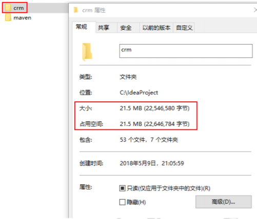

原因主要是因为上面的 WEB 程序要运行，我们必须将项目运行所需的 Jar 包复制到工程目录中，从而导致了工程很大。

同样的项目，如果我们使用 Maven 工程来构建，会发现总体上工程的大小会少很多。如下图:

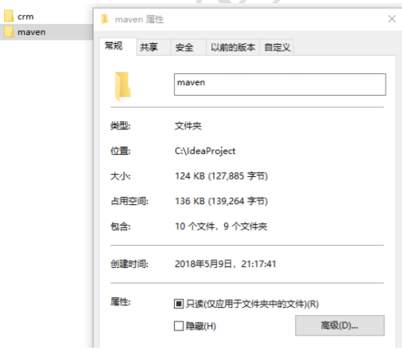

小结：可以初步推断它里面一定没有 jar 包，继续思考，没有 jar 包的项目怎么可能运行呢？

## 9.2 Maven的作用

### 9.2.1 Maven的依赖管理

Maven 的一个核心特性就是依赖管理。当我们涉及到多模块的项目（包含成百个模块或者子项目），管理依赖就变成一项困难的任务。Maven 展示出了它对处理这种情形的高度控制。

传统的 WEB 项目中，我们必须将工程所依赖的 jar 包复制到工程中，导致了工程的变得很大。那么 maven 工程是如何使得工程变得很少呢？

分析如下：

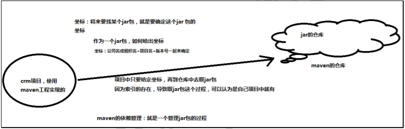

通过分析发现：maven 工程中不直接将 jar 包导入到工程中，而是通过在 pom.xml 文件中添加所需 jar 包的坐标，这样就很好的避免了 jar 直接引入进来，在需要用到 jar 包的时候，只要查找 pom.xml 文件，再通过 pom.xml 文件中的坐标，到一个专门用于”存放 jar 包的仓库”(maven 仓库)中根据坐标从而找到这些 jar 包，再把这些 jar 包拿去运行。

那么问题来了

第一：”存放 jar 包的仓库”长什么样？

第二：通过读取 pom.xml 文件中的坐标，再到仓库中找到 jar 包，会不会很慢？从而导致这种方式不可行！

第一个问题：存放 jar 包的仓库长什么样，这一点我们后期会分析仓库的分类，也会带大家去看我们的本地的仓库长什么样。

第二个问题：通过 pom.xml 文件配置要引入的 jar 包的坐标，再读取坐标并到仓库中加载 jar 包，这样我们就可以直接使用 jar 包了，为了解决这个过程中速度慢的问题，maven 中也有索引的概念，通过建立索引，可以大大提高加载 jar 包的速度，使得我们认为 jar 包基本跟放在本地的工程文件中再读取出来的速度是一样的。这个过程就好比我们查阅字典时，为了能够加快查找到内容，书前面的目录就好比是索引，有了这个目录我们就可以方便找到内容了，一样的在 maven 仓库中有了索引我们就可以认为可以快速找到 jar 包。

### 9.2.2 项目的一键构建

我们的项目，往往都要经历编译、测试、运行、打包、安装 ，部署等一系列过程。

什么是构建？

指的是项目从编译、测试、运行、打包、安装 ，部署整个过程都交给 maven 进行管理，这个过程称为构建。

一键构建

指的是整个构建过程，使用 maven 一个命令可以轻松完成整个工作。

Maven 规范化构建流程如下：

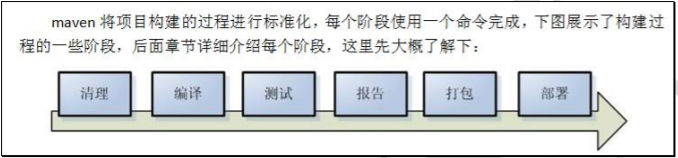

我们一起来看 Hello-Maven 工程的一键运行的过程。通过 tomcat:run 的这个命令，我们发现现在的工程编译，测试，运行都变得非常简单。

## 9.3 Maven的使用

1. 下载

   官网：https://maven.apache.org/

2. 安装

   Maven 下载后，将 Maven 解压到一个没有中文没有空格的路径下。 解压后目录结构如下：

   - bin:存放了 maven 的命令，比如我们前面用到的 mvn tomcat:run
   - boot:存放了一些 maven 本身的引导程序，如类加载器等
   - conf:存放了 maven 的一些配置文件，如 setting.xml 文件
   - lib:存放了 maven 本身运行所需的一些 jar 包

   至此我们的 maven 软件就可以使用了，前提是你的电脑上之前已经安装并配置好了 JDK。

3. 设置环境变量

4. 测试

   mvn -version

## 9.4 Maven仓库

maven 的工作需要从仓库下载一些 jar 包，如下图所示，本地的项目 A、项目 B 等都会通过 maven 软件从远程仓库（可以理解为互联网上的仓库）下载 jar 包并存在本地仓库，本地仓库就是本地文 件夹，当第二次需要此 jar 包时则不再从远程仓库下载，因为本地仓库已经存在了，可以将本地仓库理解为缓存，有了本地仓库就不用每次从远程仓库下载了。

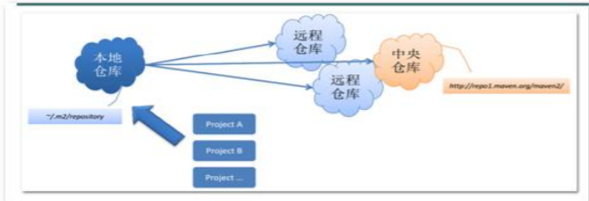

- 本地仓库 ：用来存储从远程仓库或中央仓库下载的插件和 jar 包，项目使用一些插件或 jar 包，优先从本地仓库查找

  默认本地仓库位置在 ${user.dir}/.m2/repository，${user.dir}表示 windows 用户目录。

- 远程仓库：如果本地需要插件或者 jar 包，本地仓库没有，默认去远程仓库下载。

  远程仓库可以在互联网内也可以在局域网内。

- 中央仓库 ：在 maven 软件中内置一个远程仓库地址 http://repo1.maven.org/maven2 ，它是中央仓库，服务于整个互联网，它是由 Maven 团队自己维护，里面存储了非常全的 jar 包，它包含了世界上大部分流行的开源项目构件。

### 9.4.1 本地仓库的配置

在 MAVE_HOME/conf/settings.xml 文件中配置本地仓库位置。

`<localRepository>${user.home}/.m2/repository</localRepository>`

### 9.4.2 全局setting与用户setting

maven 仓库地址、私服等配置信息需要在 setting.xml 文件中配置，分为全局配置和用户配置。

在 maven 安装目录下的有 conf/setting.xml 文件，此 setting.xml 文件用于 maven 的所有 project 项目，它作为 maven 的全局配置。

如需要个性配置则需要在用户配置中设置，用户配置的 setting.xml 文件默认的位置在：${user.dir}/.m2/settings.xml 目录中,${user.dir} 指 windows 中的用户目录。

maven 会先找用户配置，如果找到则以用户配置文件为准，否则使用全局配置文件。

### 9.4.3 Maven工程的认识

#### Maven工程的目录结构

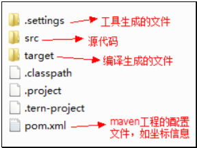

作为一个 maven 工程，它的 src 目录和 pom.xml 是必备的。

进入 src 目录后，我们发现它里面的目录结构如下：

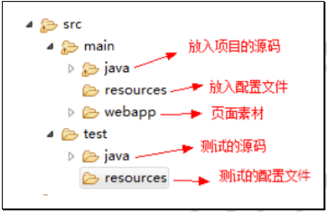

src/main/java —— 存放项目的.java 文件

src/main/resources —— 存放项目资源文件，如 spring, hibernate 配置文件

src/test/java —— 存放所有单元测试.java 文件，如 JUnit 测试类

src/test/resources —— 测试资源文件

target —— 项目输出位置，编译后的 class 文件会输出到此目录

pom.xml——maven 项目核心配置文件

> 注意：如果是普通的 java 项目，那么就没有 webapp 目录。

#### Maven工程的运行

进入 maven 工程目录（当前目录有 pom.xml 文件），运行 tomcat:run 命令。

## 9.5 Maven常用命令

我们可以在 cmd 中通过一系列的 maven 命令来对我们的 maven-helloworld 工程进行编译、测试、运行、打包、安装、部署。

### 9.5.1 命令

1. compile

   compile 是 maven 工程的编译命令，作用是将 src/main/java 下的文件编译为 class 文件输出到 target 目录下。

   - cmd 进入命令状态，执行 mvn compile，提示成功。
   - 查看 target 目录，class 文件已生成，编译完成。

2. test

   test 是 maven 工程的测试命令 mvn test，会执行 src/test/java 下的单元测试类。

   - cmd 执行 mvn test 执行 src/test/java 下单元测试类。

3. clean

   clean 是 maven 工程的清理命令，执行 clean 会删除 target 目录及内容。

4. package

   package 是 maven 工程的打包命令，对于 java 工程执行 package 打成 jar 包，对于 web 工程打成 war 包。

5. install

   install 是 maven 工程的安装命令，执行 install 将 maven 打成 jar 包或 war 包发布到本地仓库。

   从运行结果中，可以看出：

   当后面的命令执行时，前面的操作过程也都会自动执行。

### 9.5.2 Maven指令的生命周期

maven 对项目构建过程分为三套相互独立的生命周期，请注意这里说的是“三套”，而且“相互独立”，这三套生命周期分别是：

Clean Lifecycle 在进行真正的构建之前进行一些清理工作。

Default Lifecycle 构建的核心部分，编译，测试，打包，部署等等。

Site Lifecycle 生成项目报告，站点，发布站点。

### 9.5.3 Maven的概念模型

Maven 包含了一个项目对象模型 (Project Object Model)，一组标准集合，一个项目生命周期(Project Lifecycle)，一个依赖管理系统(Dependency Management System)，和用来运行定义在生命周期阶段(phase)中插件(plugin)目标(goal)的逻辑。

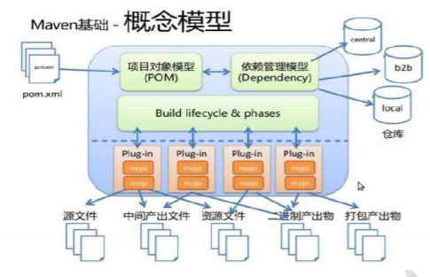

- 项目对象模型 (Project Object Model)

  一个 maven 工程都有一个 pom.xml 文件，通过 pom.xml 文件定义项目的坐标、项目依赖、项目信息、 插件目标等。

- 依赖管理系统(Dependency Management System)

  通过 maven 的依赖管理对项目所依赖的 jar 包进行统一管理。

  比如：项目依赖 junit4.9，通过在 pom.xml 中定义 junit4.9 的依赖即使用 junit4.9，如下所示是 junit4.9的依赖定义：

  ```
  <!-- 依赖关系 -->
      <dependencies>
          <!-- 此项目运行使用 junit，所以此项目依赖 junit -->
          <dependency>
              <!-- junit 的项目名称 -->
              <groupId>junit</groupId>
              <!-- junit 的模块名称 -->
              <artifactId>junit</artifactId>
              <!-- junit 版本 -->
              <version>4.9</version>
              <!-- 依赖范围：单元测试时使用 junit -->
              <scope>test</scope>
          </dependency>
  ```

- 一个项目生命周期(Project Lifecycle)

  使用 maven 完成项目的构建，项目构建包括：清理、编译、测试、部署等过程，maven 将这些 过程规范为一个生命周期，如下所示是生命周期的各各阶段：

  

  maven 通过执行一些简单命令即可实现上边生命周期的各各过程，比如执行 mvn compile 执行编译、执行 mvn clean 执行清理。

-  一组标准集合

  maven 将整个项目管理过程定义一组标准，比如：通过 maven 构建工程有标准的目录结构，有标准的生命周期阶段、依赖管理有标准的坐标定义等。

- 插件(plugin)目标(goal)

  maven 管理项目生命周期过程都是基于插件完成的。

### 9.5.4 pom基本配置

pom.xml 是 Maven 项目的核心配置文件，位于每个工程的根目录，基本配置如下：

`<project>`：文件的根节点

`<modelversion>`： pom.xml 使用的对象模型版本

`<groupId>`：项目名称，一般写项目的域名

`<artifactId>`：模块名称，子项目名或模块名称

`<version>`：产品的版本号

`<packaging>`：打包类型，一般有 jar、war、pom 等

`<name>`：项目的显示名，常用于 Maven 生成的文档。

`<description>`：项目描述，常用于 Maven 生成的文档

`<dependencies>`：项目依赖构件配置，配置项目依赖构件的坐标

`<build>`：项目构建配置，配置编译、运行插件等。

## 9.6 idea开发maven项目

1. 配置

   打开 --> File --> Settings

   Build,Execution,Deployment --> Build Tools --> Maven

   Maven home directory：指定本地maven安装目录

   User settings file：指定settings配置文件路径

   Local repository：自动检测本地仓库的位置

2. 创建maven的web工程

   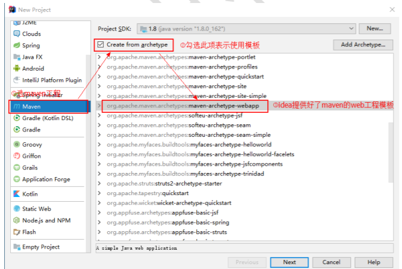

   生成的目录结构可能不完整，需要手动补齐。

3. 在src --> main下创建java文件夹，通过右键java --> Make Directory as --> Sources Root配置资源根路径。

4. 创建一个Servlet对象，但因为缺少项目依赖而无法导包报错。

5. 直接打开项目工程的 pom.xml 文件，再添加坐标

   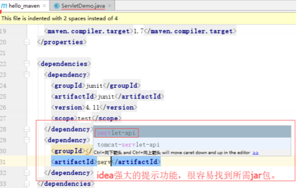

   添加 jar 包的坐标时，还可以指定这个 jar 包将来的作用范围。

   每个 maven 工程都需要定义本工程的坐标，坐标是 maven 对 jar 包的身份定义，比如：入门程序的坐标定义如下：

   ```
   <!--项目名称，定义为组织名+项目名，类似包名-->
   <groupId>maventest</groupId>
   <!-- 模块名称 -->
   <artifactId>hello_maven</artifactId>
   <!-- 当前项目版本号，snapshot 为快照版本即非正式版本，release 为正式发布版本 -->
   <version>0.0.1-SNAPSHOT</version>
   <packaging > ：打包类型
   jar：执行 package 会打成 jar 包
   war：执行 package 会打成 war 包
   pom ：用于 maven 工程的继承，通常父工程设置为 pom
   ```

6. 坐标来源

   http://search.maven.org/

   http://mvnrepository.com/

### 9.6.1 依赖范围

A 依赖 B，需要在 A 的 pom.xml 文件中添加 B 的坐标，添加坐标时需要指定依赖范围，依赖范围包括：

- compile：编译范围，指 A 在编译时依赖 B，此范围为默认依赖范围。编译范围的依赖会用在编译、测试、运行，由于运行时需要所以编译范围的依赖会被打包。
- provided：provided 依赖只有在当 JDK 或者一个容器已提供该依赖之后才使用， provided 依赖在编译和测试时需要，在运行时不需要，比如：servlet api 被 tomcat 容器提供。
- runtime：runtime 依赖在运行和测试系统的时候需要，但在编译的时候不需要。比如：jdbc的驱动包。由于运行时需要所以 runtime 范围的依赖会被打包。
- test：test 范围依赖 在编译和运行时都不需要，它们只有在测试编译和测试运行阶段可用，比如：junit。由于运行时不需要所以 test范围依赖不会被打包。
- system：system 范围依赖与 provided 类似，但是你必须显式的提供一个对于本地系统中 JAR 文件的路径，需要指定 systemPath 磁盘路径，system依赖不推荐使用。

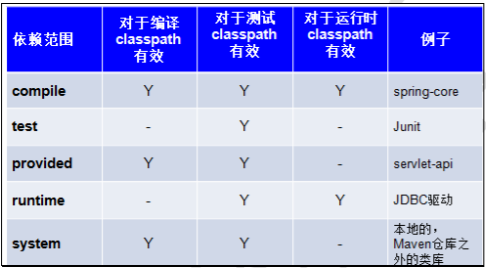

在 maven-web 工程中测试各各 scop。

测试总结：

- 默认引入 的 jar 包 ------- compile 【默认范围 可以不写】（编译、测试、运行 都有效 ）
- servlet-api 、jsp-api ------- provided （编译、测试 有效， 运行时无效 防止和 tomcat 下 jar 冲突）
- jdbc 驱动 jar 包 ---- runtime （测试、运行 有效 ）
- junit ----- test （测试有效）

依赖范围由强到弱的顺序是：compile>provided>runtime>test

### 9.6.2 项目中添加的坐标

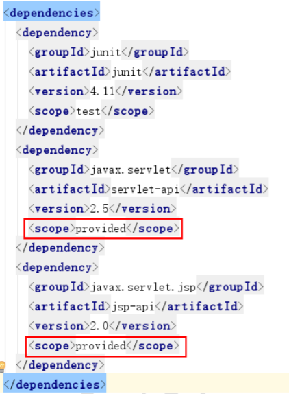

### 9.6.3 设置jdk编译版本

在pom.xml中添加

```xml
<build>
    <plugins>
        <plugin>
            <groupId>org.apache.maven.plugins</groupId>
            <artifactId>maven-compiler-plugin</artifactId>
            <configuration>
                <source>版本</source>
                <target>版本</target>
                <encoding>UTF-8</encoding>
            </configuration>
        </plugin>
    </plugins>
</build>
```

### 9.6.4 添加tomcat7插件

在pom文件中添加

```xml
<plugin>
    <groupId>org.apache.tomcat.maven</groupId>
    <artifactId>tomcat7-maven-plugin</artifactId>
    <version>2.2</version>
    <configuration>
        <port>8080</port>
        <path>/</path>
    </configuration>
</plugin>
```

此时点击 idea 最右侧 Maven Projects，就可以看到我们新添加的 tomcat7 插件

双击 tomcat7插件下 tomcat7:run 命令直接运行项目

或在Execute Maven Goal中手动执行命令