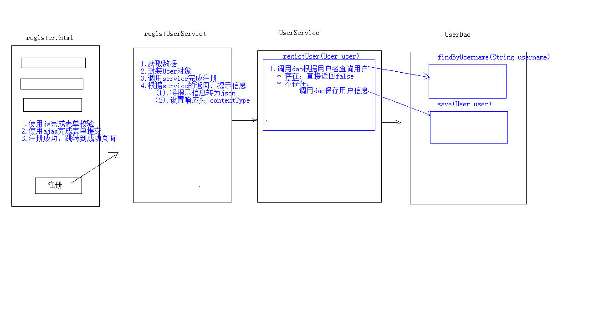
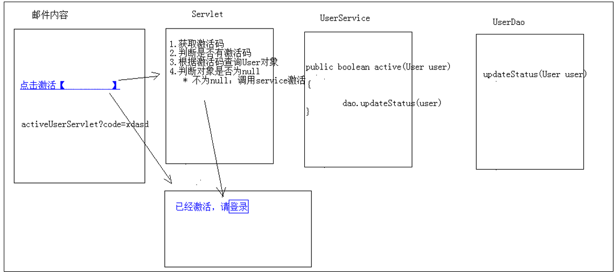
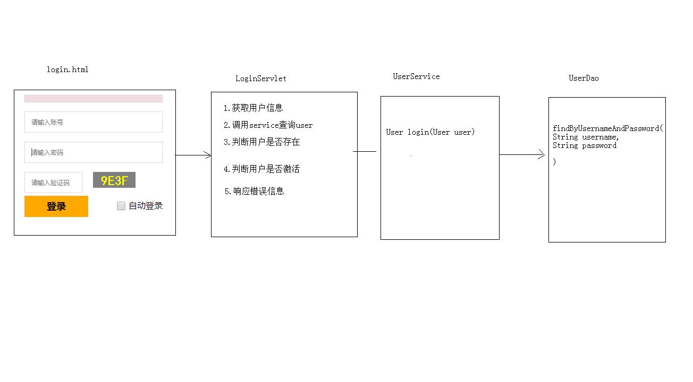
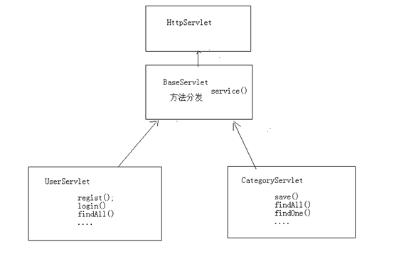

# 十、 综合案例

## 10.1 准备

### 10.1.1 技术选型

- Web层
  1. Servlet：前端控制器
  2. html：视图
  3. Filter：过滤器
  4. BeanUtils：数据封装
  5. Jackson：json序列化工具
- Service层
  1. Javamail：java发送邮件工具
  2. Redis：nosql内存数据库
  3. Jedis：java的redis客户端
- Dao层
  1. Mysql：数据库
  2. Druid：数据库连接池
  3. JDBCTemplate：jdbc的工具

### 10.1.2 数据库

-- 创建数据库

CREATE DATABASE travel;

-- 使用数据库

USE travel;

--创建表

`travel.sql`

##   10.2 功能

### 10.2.1 注册

#### 分析

#### 前端

表单校验--提升用户体验，并减轻服务器压力。

异步（ajax）提交表单

在此使用异步提交表单是为了获取服务器响应的数据。因为我们前台使用的是html作为视图层，不能够直接从servlet相关的域对象获取值，只能通过ajax获取响应数据

register.html

#### 后端

RegistUserServlet

### 10.2.2 邮件激活

邮件激活：需在MailUtils中设置自己的邮箱账号和密码(授权码)

邮件工具类：MailUtils，调用其中sendMail方法可以完成邮件发送

#### 分析

ActiveUserServlet

### 10.2.3 登录

#### 分析

login.html

LoginServlet

header.html

FindUserServlet（持续登录）

### 10.2.4 退出

什么叫做登录了？session中有user对象。

实现步骤：

1. 访问servlet，将session销毁

2. 跳转到登录页面

ExitServlet

## 10.2 优化

减少Servlet的数量，现在是一个功能一个Servlet，将其优化为一个模块一个Servlet，相当于在数据库中一张表对应一个Servlet，在Servlet中提供不同的方法，完成用户的请求。

编写BaseServlet

将之前的Servlet实现的功能，抽取到UserServlet中的不同方法中实现，并且将UserService创建抽取到成员变量位置。

## 10.3

其余参考[笔记](../references/10travel/travel笔记.docx)，初始资源也在该文件目录下。

